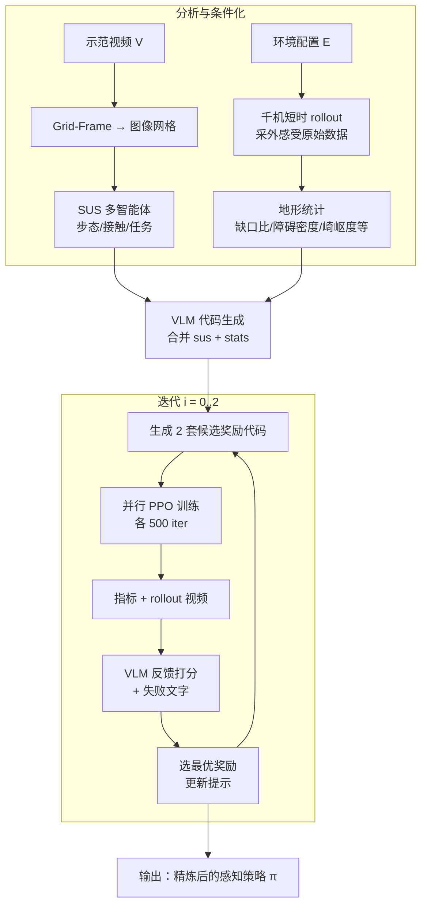

# E-SDS（Environment-aware See it, Do it, Sorted）

**E-SDS** 面向 **人形感知行走** 的 **奖励函数仍难自动且感知型 RL 仍难手调** 这一交叉痛点：在 **VLM 从单段示范视频合成 Python 奖励** 的 **SDS** 路线基础上，把 **环境统计** 直接写进 **代码生成条件**，让合成奖励倾向使用 **机载外感受**（高度栅格 + LiDAR），再用 **小规模候选并行训练 + VLM 基于 rollout 的反馈** 做 **少轮闭环精炼**（arXiv:2512.16446，UCL）。

## 一句话定义

**让「写奖励的人」也看见地形统计：用千机短时采样得到缺口/障碍/崎岖度等数字，和视频里拆出来的步态目标一起喂给 VLM，生成能读高度图和 LiDAR 的奖励，再自动训和筛 PPO 策略。**

## 为什么重要

- **对准结构矛盾：** 纯 VLM 自动奖励在复杂地形上容易训出 **「有传感器但不会用」** 或 **盲走** 的策略；手工感知奖励 **调参成本高** 且难迁移。E-SDS 把 **环境摘要前置到奖励生成**，是较清晰的 **自动化 + 外感受** 拼接点。
- **有可操作的系统切片：** 论文给出 **POMDP + RNN 策略**、**792 维观测（含 27×21 扫描 + 144 LiDAR）**、**3000 并行 PPO**、**每轮 2 个候选奖励 × 500 iter × 3 轮精炼** 等量纲，便于和现有 Isaac Lab 人形 RL 管线对照。
- **与楼梯/离散地形文献形成对照：** 同类楼梯能力在仓库中另有 **FastStair** 等 **规划–奖励显式引导** 路线；E-SDS 代表 **语言模型侧生成奖励** 分支（见 [FastStair](./paper-faststair-humanoid-stair-ascent.md)）。

## 核心结构

| 模块 | 作用 |
|------|------|
| **视频侧（继承 SDS）** | **Grid-Frame Prompting** 保留时序；**SUS** 多智能体抽取接触序列、步态与任务目标。 |
| **环境分析智能体（新增）** | 在目标仿真里布 **1000** 台机器人短时 rollout，聚合 **缺口比、障碍密度、崎岖度** 等 **标量地形统计**，拼入代码生成提示。 |
| **奖励代码生成** | VLM（论文写作 **GPT-5**）输出 **可执行 Python 奖励**，显式鼓励读 **高度扫描 + LiDAR**。 |
| **闭环精炼** | 每轮 **2** 个候选奖励 → 各训 **500** iter **PPO**（**3000** 并行）→ 记录指标与视频 → **Feedback Agent** 打分 → 最优代码 + **文字化失败模式** 进入下一轮；共 **3** 轮；论文报 **~99 min/地形**。 |

### 流程总览

## 常见误区或局限

- **误区：「有 LiDAR 就一定能下楼梯」。** 论文在 **楼梯** 上强调：与 E-SDS 同感知配置的 **手工 13 项基线** 仍可能在梯顶 **不动**；**Foundation-Only（奖励不经环境分析、策略盲感知）** 会 **高摔率**。说明关键在 **奖励结构是否把感知写进可优化目标**，而非仅堆传感器。
- **局限（论文讨论）：** **每地形一套策略**、评估 **仅在仿真**、首轮 **prompt 仍人工**；走向混合地形与 **sim2real** 仍是开放工程问题。

## 关联页面

- [Locomotion（运动任务）](../tasks/locomotion.md) — 地形行走任务总览与 RL 论文入口
- [Reinforcement Learning](../methods/reinforcement-learning.md) — PPO 与奖励设计语境
- [Terrain Adaptation](../concepts/terrain-adaptation.md) — 高程/外感受与步态适应
- [Sim2Real](../concepts/sim2real.md) — 真机迁移与域差（本文明确列为后续）
- [FastStair（论文实体）](./paper-faststair-humanoid-stair-ascent.md) — 另一类人形楼梯 RL：**规划式落脚点引导**
- [Isaac Gym / Isaac Lab](./isaac-gym-isaac-lab.md) — 训练框架参照

## 参考来源

- [E-SDS 论文摘录（arXiv:2512.16446）](../../sources/papers/e_sds_arxiv_2512_16446.md)
- [SDS 四足论文摘录（arXiv:2410.11571）](../../sources/papers/sds_quadruped_arxiv_2410_11571.md)
- [RPL-CS-UCL/SDS 官方仓库索引](../../sources/repos/rpl_cs_ucl_sds.md)

## 推荐继续阅读

- E-SDS 论文 HTML（公式与图表）：<https://arxiv.org/html/2512.16446v1>
- SDS 项目页与材料：<https://rpl-cs-ucl.github.io/SDSweb/>
- SDS arXiv 摘要页：<https://arxiv.org/abs/2410.11571>
