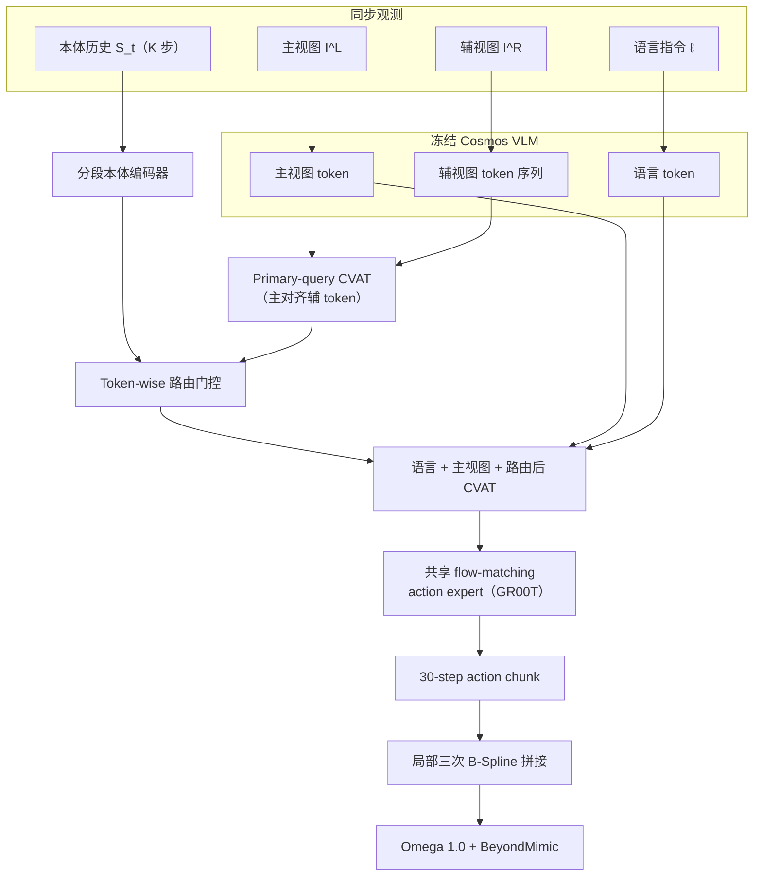

# EATR-Stereo

**EATR-Stereo**（*Embodiment-Aware Token Routing of Paired Stereo Evidence for Humanoid Vision-Language-Action Control*，[arXiv:2608.17453](https://arxiv.org/abs/2608.17453)）由哈尔滨工业大学与荣耀团队提出：在 **冻结预训练 VLM** 的前提下，保留主视图 token 通路，用 **primary-query cross-view attention** 构造 **primary-aligned Cross-View Auxiliary Tokens（CVATs）**，并以 **分段本体路由** 按机器人构型历史 **逐 token** 门控辅视图证据，再与语言、主视图上下文一并送入共享 **flow-matching action expert**。在 **33-DoF HONOR Omega 1.0**（BeyondMimic 全身控制）上，>100 s 的 search–approach–grasp–place–return 任务报告 **60.0% 全流程成功** 与 **100.0% 抓取成功**。

## 一句话定义

**人形头载双目 VLA 不应替换预训练主视图 token，而应在旁路构造 primary-aligned 辅视图 token，并用分段本体状态决定何时采纳双目证据。**

## 英文缩写速查

| 缩写 | 英文全称 | 简要说明 |
|------|----------|----------|
| EATR-Stereo | Embodiment-Aware Token Routing (Stereo) | 本文：paired stereo + 本体感知 token 路由框架 |
| VLA | Vision-Language-Action | 视觉–语言–动作统一策略 |
| VLM | Vision-Language Model | 预训练视觉–语言骨干（本文冻结 Cosmos VLM） |
| CVAT | Cross-View Auxiliary Token | 主视图 query 辅视图序列得到的对齐辅 token |
| WBC | Whole-Body Control | 全身控制；本文用 BeyondMimic 驱动 Omega 1.0 |
| OOD | Out-of-Distribution | 演示未覆盖瓶位上的泛化评测 |

## 核心信息

| 项 | 内容 |
|----|------|
| **机构** | 哈尔滨工业大学（HIT）；荣耀（Honor） |
| **平台** | HONOR Omega 1.0，33-DoF；头载同步双目 240×320；37-D 本体（33 关节 + 基座四元数） |
| **骨干** | GR00T1.7 + 冻结 Cosmos VLM；6 帧状态历史；30-step action chunk，10 Hz，RTX 4090 |
| **数据** | 1000 分段任务演示；60k step，global batch 512，16×NVIDIA H20 |
| **开源** | **截至 2026-08-23 arXiv 未列项目页/代码/权重** |

## 为什么重要

- **补齐「双目 + 人形 VLA」接口层空白**：StereoPolicy 等会 **替换** 原 monocular token 结构；EATR-Stereo 强调 **保留主视图预训练语义**，辅视图走独立 CVAT 支路。
- **本体构型门控辅视图**：人形头载相机随步态、腰臂运动持续变化；扁平拼接 proprio 不足以解释 **何时** 需要辅视图——分段路由在严重不对称遮挡下把恢复率从 30%（纯 CVAT）提到 **80%**。
- **训练开销可控**：相对默认双图 GR00T，阶段成功率 57.5%→**80.0%**，训练时长仅 +5.8%；与需微调 4 层 VLM 的 Estimated-Depth VLA 同阶段性能但训练成本约 **1/4**。
- **与荣耀/哈工大人形感知线衔接**：同团队 [Now You See That](./paper-now-you-see-that-humanoid-vision-locomotion.md) 关注深度 locomotion；本文把 **paired stereo + VLA** 推到长程 loco-manipulation。

## 流程总览

## 核心原理

### Primary-aligned CVAT 双流

- 主视图 token **不被融合替换**；每个主视图 token 对同步辅视图 token 序列做 cross-attention，得到与主视图 **空间对齐** 的 CVAT。
- 相对 **Main-XAttn**（直接改主 token）：全流程成功率 25%→55%（+30 pp），说明 **保留预训练主通路** 对冻结 VLM 设置至关重要。

### Body-segmented proprioceptive routing

- 37-D 状态按身体段编码（非扁平向量拼接到 action head），结合主–辅视觉关系，对 CVAT **逐 token** 产生路由权重。
- 相对 **CVAT-Flat**：全流程 55%→60%，抓取 90%→100%，阶段 72.5%→80%；相对 **Stereo-Route**（StereoPolicy 式融合）：全流程 40%→60%。

### 部署侧（非学习模块）

- **异步 chunk 缓冲** + **局部三次 B-Spline** 在 chunk 边界平滑轨迹。
- **外部 VLM** 慢环做子任务完成检测与指令切换；不参与低层 stereo routing 学习。

## 评测与结果

### 真机主对比（20 trial/方法）

| 方法 | 全流程 ↑ | 抓取 ↑ | 阶段 ↑ | ID 阶段 ↑ | OOD 阶段 ↑ |
|------|----------|--------|--------|-----------|------------|
| GR00T1.7-Mono | 35.0% | 55.0% | 45.0% | 55.0% | 35.0% |
| GR00T-Wide | 20.0% | 45.0% | 32.5% | 40.0% | 25.0% |
| GR00T（双图拼接） | 35.0% | 80.0% | 57.5% | 75.0% | 40.0% |
| StereoPolicy 适配 | 45.0% | 85.0% | 65.0% | 80.0% | 50.0% |
| **EATR-Stereo** | **60.0%** | **100.0%** | **80.0%** | **90.0%** | **70.0%** |

### 严重不对称遮挡恢复（10 trial，90 s 超时）

| 方法 | 恢复成功率 ↑ | 平均恢复时间 ↓（成功 trial） |
|------|--------------|------------------------------|
| CVAT（无状态路由） | 30% | >55.0 s |
| CVAT-Flat | 60% | 41.7 s |
| **EATR-Stereo** | **80%** | **22.4 s** |

### RoboCasa365 仿真（18 任务，仅左右 agent 双目，3600 rollout）

| 方法 | 聚合成功率 |
|------|------------|
| **EATR-Stereo** | **43.33%** |
| CVAT | 39.44% |
| StereoPolicy | 38.06% |
| QwenPI0.5 | 36.11% |
| GR00T1.7 | 35.56% |

### 训练成本 vs 阶段成功率

| 方法 | VLM 适配 | 训练时长 | 阶段成功率 |
|------|----------|----------|------------|
| GR00T | 冻结 | 10.35 h | 57.5% |
| **EATR-Stereo** | 冻结 | 10.95 h | **80.0%** |
| Estimated-Depth VLA | 微调 4 层 | 41.80 h | 80.0% |

## 与其他工作对比

| 维度 | EATR-Stereo | StereoPolicy（arXiv:2605.09989） | 默认双图 GR00T | SpatialVLA 类深度增强 |
|------|-------------|-----------------------------------|----------------|------------------------|
| 主视图 token | **保留** | VLA 变体 **替换** 为融合 stereo 表示 | 双图 token 拼接 | 单目深度反投影 3D |
| 双目关系 | primary-aligned CVAT + 路由 | cross-view attention 融合 | 无显式对应 | 每 RGB 独立深度 |
| 本体门控 | **分段 + token-wise 路由** | 未强调 | 常规 proprio 注入 | 未强调人形分段 |
| 人形头载长程 | **33-DoF Omega >100 s** | 以操作/仿真为主 | 同场对照基线 | 论文多静态/臂载相机 |
| VLM | **冻结** | 依骨干设定 | 冻结 | 常需适配 VLM 层 |

## 结论

**在冻结 VLM 的人形 VLA 上，双目证据应走「主视图保留 + 可路由辅流」，而不是替换主 token 或无条件拼接第二路图像。**

- 主视图 token 保留 + CVAT 辅流是最大单点增益之一（Main-XAttn→CVAT +30 pp 全流程）。
- 分段本体路由决定「何时看辅视图」，严重遮挡恢复 80% vs 纯 CVAT 30%。
- 真机长程：全流程 60%、抓取 100%，OOD 阶段仍 70%。
- 训练成本接近默认 GR00T，却达到与显式深度微调相当的阶段成功率。
- 部署需配合 chunk B-Spline 与外部 VLM 子任务切换，但 stereo routing 模块可插拔。
- **截至入库日无公开代码**；复现需自建 GR00T1.7 + Omega 栈。

## 源码运行时序图

**不适用** — 截至 **2026-08-23**，arXiv 与公开检索均未发现官方项目页、训练/推理仓库或权重；无法对齐 README 入口绘制运行时序。动作骨干可对照 [GR00T N1](./paper-hrl-stack-34-gr00t_n1.md) / [Isaac GR00T](./isaac-gr00t.md)，但 **EATR-Stereo 路由模块无公开实现**。

## 与其他页面的关系

- [vla](../methods/vla.md) — VLA 视觉接口与双目融合选型
- [manipulation](../tasks/manipulation.md) / [loco-manipulation](../tasks/loco-manipulation.md) — 长程抓取–放置–返回任务设定
- [visual-representation-for-policy](../concepts/visual-representation-for-policy.md) — 策略侧视觉表征设计
- [GR00T N1](./paper-hrl-stack-34-gr00t_n1.md) — 实验骨干与双系统 flow action expert
- [Now You See That](./paper-now-you-see-that-humanoid-vision-locomotion.md) — 同机构人形深度感知/locomotion 线
- [BeyondMimic](../methods/beyondmimic.md) — Omega 1.0 全身控制底座

## 参考来源

- [eatr_stereo_arxiv_2608_17453](../../sources/papers/eatr_stereo_arxiv_2608_17453.md)

## 推荐继续阅读

- [arXiv:2608.17453](https://arxiv.org/abs/2608.17453)
- [StereoPolicy（arXiv:2605.09989）](https://arxiv.org/abs/2605.09989) — 立体 cross-attention 融合对照
- [GR00T N1 论文实体](./paper-hrl-stack-34-gr00t_n1.md)
- [Query：机器人视觉感知栈选型闭环](../queries/robot-perception-stack-selection-loop.md)
