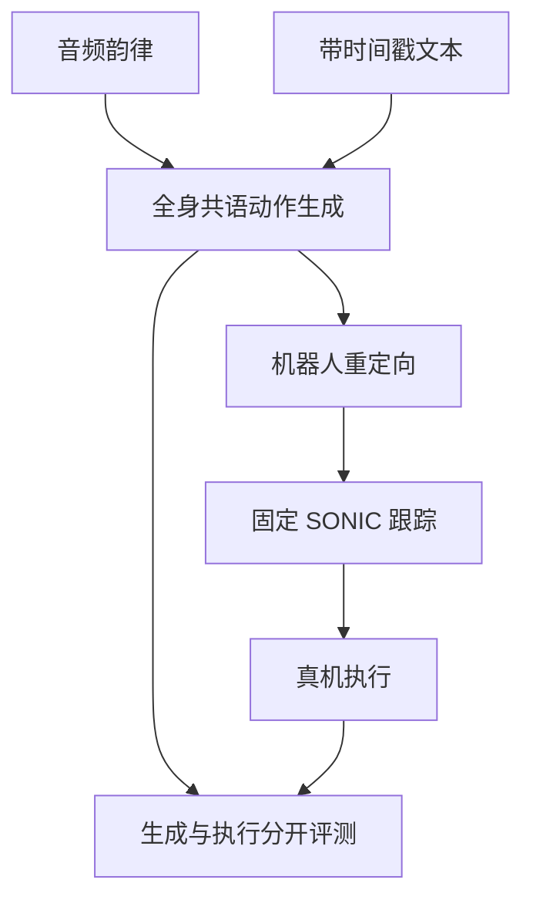

# ECHO-G：Embodied Co-speech Humanoid mOtion Generation

## 一句话定义

**ECHO-G** 依据说话的声音节奏与文本语义生成与语音同步的 G1 全身手势，交给已有运动跟踪器执行。

## 英文缩写速查

| 缩写 | 英文全称 | 简要说明 |
|------|----------|----------|
| ECHO-G | Embodied Co-speech Humanoid mOtion Generation | 语音到人形全身动作生成 |
| GMR | General Motion Retargeting | 人体动作到机器人参考的对照方法 |
| SONIC | Supersizing Motion Tracking for Natural Humanoid Whole-Body Control | 执行生成动作的固定跟踪器 |

## 为什么重要

语音驱动动作既要语义自然，也要与停顿、重音对齐；静态姿势库不足以表达长句中变化的全身节奏。

## 流程总览

以下按本页已归纳的机制与资料绘制，表示模块或阅读路径关系。

## 方法

数据来自 BEAT2 语音片段，经过重定向、接触与连续性筛选；模型结合音频韵律和定时文本生成可变长度动作，同一句可采样多种手势。生成参考与低层 SONIC 跟踪是两环，生成器本身不直接输出电机力矩。

## 实验与评测

文章所引留出说话人测试手势距离 2.278，对照 EMAGE+GMR 为 4.976；45 人盲评 3.49/5。真机 G1 演示支持可跟踪性，但感知质量与大规模真机任务成功率不是同一指标。

## 与其他工作对比

相较 [SONIC](../methods/sonic-motion-tracking.md) 的跟踪控制，ECHO-G 解决上游“该说话时做什么动作”；二者串联而非替代。

## 结论

**共语动作应分别验收语音同步、语义自然和机器人可执行性；离线手势距离低并不自动保证真机稳定。**

1. 保留音频和文本时间轴，不能只用整句语义。
2. 参考动作先过接触与连续性筛选。
3. 生成器与跟踪器的失败应分开定位。

## 工程实践

记录音频时间戳、动作参考帧率、重定向偏差和跟踪器跌倒率；项目页 <https://echo-g-project.github.io/> 本次无法打开核验 Code 区，**源码状态待核实**。

## 局限与风险

项目页访问受限，不能声称已有可运行官方代码；盲评与渲染指标不能代表未知场景下的接触安全。

## 源码运行时序图

**不适用**：官方可运行实现未获核实。

## 关联页面

- [SONIC 跟踪](../methods/sonic-motion-tracking.md)
- [人形运动](../tasks/humanoid-locomotion.md)

## 参考来源

- [Day 1 文章逐篇索引](../../sources/blogs/humanoid_motion_intelligence_day1_data_retargeting_2026_10_02.md)
- [项目页核查](../../sources/sites/echo-g-project.md)
- [arXiv:2609.39575](https://arxiv.org/abs/2609.39575)

## 推荐继续阅读

- [ECHO-G 项目页](https://echo-g-project.github.io/)
