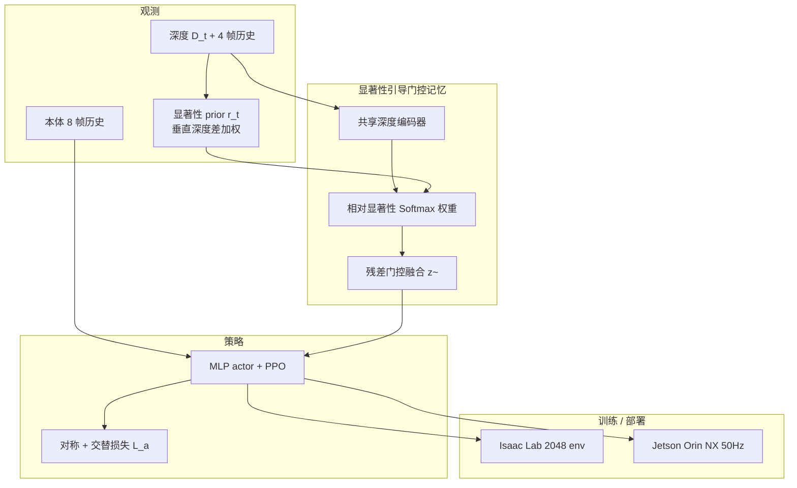

# Echo in the Steps（arXiv:2609.28960）

**Echo in the Steps**（*Learning Perceptive Humanoid Parkour with Gated Memory*，清华大学，[arXiv:2609.28960](https://arxiv.org/abs/2609.28960)，[项目页](https://echo-in-the-steps.github.io/)，**CoRL 2026**）提出 **端到端感知跑酷 RL**：在 **离散平台、稀疏踏点、窄支撑** 地形上，仅用 **机载深度** 与本体，通过 **显著性引导的门控记忆** 保留「已离开视野仍有关」的地形线索，并用 **交替损失** 避免对称正则塌缩为 **同步双足跳**。

## 一句话定义

**脚下踏点常只在过去几帧的深度里出现过——用显著性挑帧、门控写记忆，再用交替损失逼出左右交替落脚，而不是一起蹦。**

## 英文缩写速查

| 缩写 | 英文全称 | 简要说明 |
|------|----------|----------|
| SR | Success Rate | 到达终点且未触地/摔倒的 trial 比例 |
| FA | Foothold Accuracy | 平台间步态中脚踩进目标支撑区的比例 |
| PPO | Proximal Policy Optimization | 非对称 actor-critic 训练算法 |
| AMP | Adversarial Motion Prior | 奖励中的对抗运动先验项 |
| G1 | Unitree G1 Humanoid | 29-DoF 仿真与真机平台 |
| Sim2Real | Simulation to Real | Isaac Lab 训练 → Jetson 部署 |

## 为什么重要

- **稀疏踏点 ≠ 普通感知 locomotion：** 结构化楼梯/坡道已有大量工作；**20 cm 桩、窄梁、不连续 box** 需要 **精确落脚 + 部分可观** — 单帧深度不够。
- **记忆要有选择：** 论文消融显示 **均匀堆历史深度** SR 仅 **52%**；**显著性 prior + 门控** 拉到 **98.27%** — 说明「全历史」与「门控瓶颈」差一个量级。
- **对称性会害人：** 纯 mirror loss 易 **同步 hopping**；**交替损失** 把 double-support 从 **0.806→0.308**，训练更快、落脚更准。
- **与 PHP 互补：** [PHP](./paper-hrl-stack-22-perceptive_humanoid_parkour.md) 用 motion matching **合成长程技能链**；Echo 专注 **单课地形上的深度时序与步态正则** — 都走 G1 机载深度，但数据与决策结构不同。

## 核心信息

| 项 | 内容 |
|----|------|
| **作者** | Ming-Ju Lee、Zizhuo Wang（共一）；Shaoting Zhu、Haozhe Lou；Hang Zhao、Yiming Li（通讯） |
| **机构** | 清华大学（Tsinghua University） |
| **平台** | Unitree G1（29-DoF）；真机 **Nvidia Jetson Orin NX** |
| **感知** | Intel RealSense **D435i**；深度 crop **32×18**；策略 **50 Hz** |
| **训练** | Isaac Sim / Isaac Lab；**2048** 并行智能体；RTX 4090 |
| **开源** | **待发布** — [项目页](https://echo-in-the-steps.github.io/) Code 为 **Coming soon**（2026-09-30） |

## 流程总览

## 核心原理

1. **任务：** 离散平台序列 \(P=\{p_{\mathrm{start}},\ldots,p_{\mathrm{end}}\}\)；奖励含 **速度跟踪**、边缘惩罚、**AMP** 自然性、安全项；PPO **非对称 critic**（特权速度等）。
2. **显著性 prior：** 强调 **靠近机器人、垂直深度不连续** 区域（ imminent foothold）；标量 \(r_t\) 汇总整帧，无需手工障碍规则。
3. **门控记忆：** 用 **相对显著性** 对历史 latent 加权，**sigmoid 门控残差** 注入当前 latent — 保留互补几何、抑制相邻帧冗余。
4. **交替损失：** 高速时惩罚左右腿动作 **同相**（cos>0），与 mirror consistency 并用 — 鼓励 **交替支撑** 而非双足同步跳。
5. **课程：** \(20\times 10\) 网格，几何难度沿行递增（间距、高度、支撑尺寸、朝向）。

## 源码运行时序图

**不适用** — 截至 **2026-09-30** 项目页 Code 为 **Coming soon**，无官方仓库入口。

## 工程实践

| 检查项 | 建议 |
|--------|------|
| 历史长度 | 深度 **4 帧** + 本体 **8 帧** — 改长度需重训 |
| 深度预处理 | 真机：**480×270→64×36→32×18** 中心下方 crop |
| 对照基线 | 仿真对比 **Hiking in the Wild** 同设定 — 报告 **+16.7 pt** 平均 SR |
| 局限 | **交错左右桩** 可能交叉步；**窄 FOV** 急转时下一踏点不可见 — 论文 §7 |
| 代码跟进 | 发布后核对 `hoi-retarget` 式 CLI 与 Isaac Lab 版本 pin |

## 实验与评测读法

- **仿真（5000 trials/实验×3 seeds）：** 五类地形 Boxes/Stakes/Beams/Wedges/Trapezoids；平均 SR **92.7%**，FA **83.6%**。
- **vs Hiking：** 平均 SR **+16.7 pt**，FA **+7.8 pt** — 不连续稀疏支撑优势最大。
- **消融：** 门控+显著性 **98.27%** vs 无门控显著性 **88.14%** vs 均匀平均 **52.12%**。
- **真机：** 每地形 **10 trials**（项目页 long-horizon 视频）；Fig.7 报告各类 SR（见 PDF）。

## 与其他工作对比

| 维度 | Echo in the Steps | PHP | Hiking in the Wild | Extreme Parkour |
|------|-------------------|-----|------------------|-----------------|
| 平台 | **人形 G1** | 人形 G1 | 人形（同设定对比） | 四足 |
| 感知 | 深度 + **门控记忆** | 深度 + 技能蒸馏 | 深度历史策略 | 单目深度两阶段 |
| 参考/数据 | RL + AMP | Motion matching 长程 | RL | RL 蒸馏 |
| 核心难点 | **稀疏踏点记忆** | 技能链组合 | 通用感知跑酷 | 极限动态 |

## 结论

**Echo in the Steps 证明：人形稀疏踏点跑酷的关键瓶颈是「记住刚看过的支撑几何」和「别练成双足同步跳」。**

1. **显著性 prior + 门控记忆** 是 SR 从 ~52% 到 ~98% 的主因 — 优于 naive 时序堆叠或纯 learnable weight。
2. **交替损失** 是对称正则的必要补丁 — double-support 降 **50 pt** 量级，SR/FA 同步升。
3. **相对 Hiking +16.7 pt** — 在 **discontinuous sparse foothold** 设定下，contact-centric 时序比 generic depth history 更贴题。
4. **真机 Jetson + D435i** — 与仿真同观测栈，Repeated-Trial 视频支撑 sim2real 叙事。
5. **代码待发布** — 复现前以 PDF + 项目页为准；关注 Isaac Lab 与 G1 资产版本。

## 局限与风险

- **Footstep planning 缺失：** 交错桩布局可能选错支撑腿 → 交叉步（论文 Limitation）。
- **FOV：** 急转时下一踏点可能不在 ego 深度内 — 需更广角或主动感知（未来工作）。
- **与 VLA 无关：** 纯 RL visuomotor，勿与语言条件 locomotion 混读。

## 关联页面

- [楼梯与障碍感知 locomotion](../tasks/stair-obstacle-perceptive-locomotion.md)
- [Locomotion](../tasks/locomotion.md)
- [PHP 感知跑酷](./paper-hrl-stack-22-perceptive_humanoid_parkour.md)
- [Unitree G1](./unitree-g1.md)
- [12 篇具身研究地图](../overview/embodied-research-12-papers-technology-map.md)

## 参考来源

- [echo-in-the-steps_arxiv_2609_28960.md](../../sources/papers/echo-in-the-steps_arxiv_2609_28960.md)
- [echo-in-the-steps-github-io.md](../../sources/sites/echo-in-the-steps-github-io.md)
- [arXiv:2609.28960](https://arxiv.org/abs/2609.28960)

## 推荐继续阅读

- [项目页](https://echo-in-the-steps.github.io/)
- [PDF](https://arxiv.org/pdf/2609.28960)
