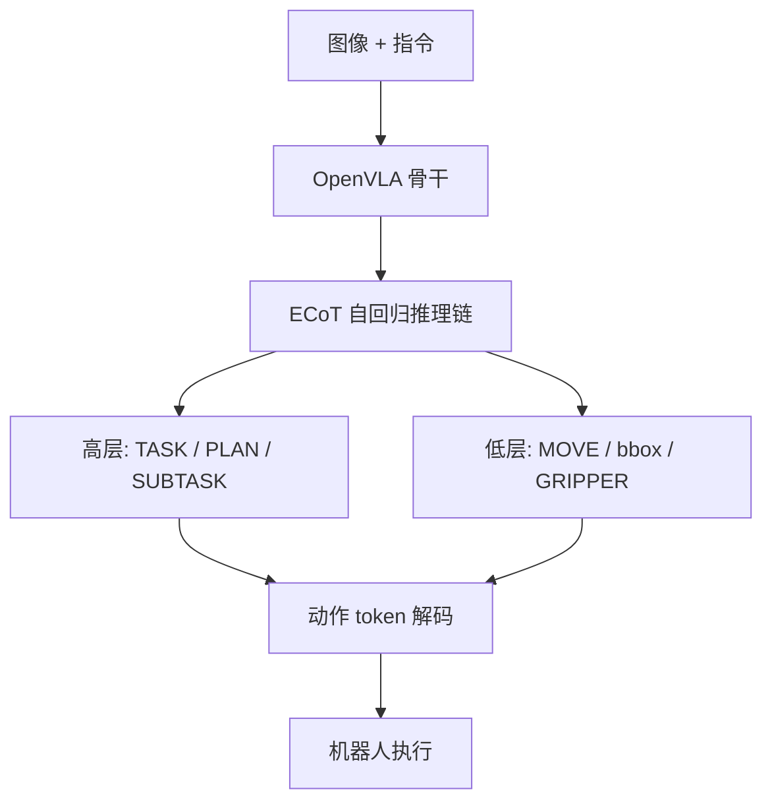
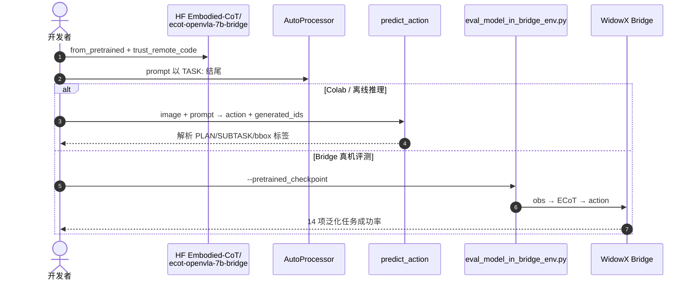

# ECoT：具身思维链推理（Embodied Chain-of-Thought）

**ECoT**（*Robotic Control via Embodied Chain-of-Thought Reasoning*，[arXiv:2407.08693](https://arxiv.org/abs/2407.08693)，**CoRL 2024**）由 **加州大学伯克利分校（UC Berkeley）**、**斯坦福大学（Stanford）** 与 **华沙大学（University of Warsaw）** 等提出：正式定义 **Embodied Chain-of-Thought**——让 VLA 在预测动作前，自回归生成多层次、**视觉与状态接地** 的文本推理链。[项目页](https://embodied-cot.github.io/) · [代码](https://github.com/MichalZawalski/embodied-CoT) · [HF](https://huggingface.co/Embodied-CoT)

## 一句话定义

**把 CoT 从纯语义子任务推进到具身接地推理：先写清 plan、子任务、运动与 bbox/夹爪位姿，再出动作——这是 ECoT 领域的基础框架与训练范式。**

## 英文缩写速查

| 缩写 | 英文全称 | 简要说明 |
|------|----------|----------|
| ECoT | Embodied Chain-of-Thought | 动作前的多层次具身推理链 |
| VLA | Vision-Language-Action | 视觉–语言–动作策略 |
| CoT | Chain-of-Thought | 通用链式推理；ECoT 为其具身扩展 |
| CoRL | Conference on Robot Learning | 发表 venue（2024） |
| HF | Hugging Face | `Embodied-CoT` 权重托管 |

## 为什么重要

- **领域奠基**：首次系统提出 **具身思维链** 训练目标、合成数据管线与 OpenVLA 上的规模化验证，后续 Fast ECoT、ERVLA 等均以此为对照坐标。
- **接地推理**：不止 plan/subtask 语义，还强制 **MOVE、VISIBLE OBJECTS、GRIPPER POSITION** 等低层视觉–状态特征，避免「只会说不会做」。
- **可解释 + 可纠错**：推理链可读；人类可用自然语言 hint/correction，经 LLM 格式化后条件化策略，修复失败轨迹。
- **开源可复现**：`embodied-CoT` 仓库 + HF 双检查点 + Colab；TensorRT-LLM 路径可大幅降延迟。

## 核心信息

| 项 | 内容 |
|----|------|
| **机构** | 加州大学伯克利分校（UC Berkeley）；斯坦福大学（Stanford）；华沙大学（University of Warsaw） |
| **骨干** | [OpenVLA](./paper-openvla.md)（Prismatic VLM → 动作 token） |
| **训练数据** | Bridge V2 演示 + **合成 ECoT 标注**（多基础模型特征抽取管线） |
| **推理结构** | 高层 TASK / PLAN / SUBTASK + 低层 MOVE / bbox / gripper |
| **开源** | **已开源**：[MichalZawalski/embodied-CoT](https://github.com/MichalZawalski/embodied-CoT)；HF `ecot-openvla-7b-bridge`、`ecot-openvla-7b-oxe` |

## 核心原理

### ECoT 推理链

策略接收图像与语言指令，**自回归生成完整 ECoT 文本**，再解码机器人动作。粉色模块为具身推理步（项目页示意）：语义层引导「想清楚」，感知层引导「看清楚」。

### 合成数据管线

多个基础模型子模块从演示中提取 plan、子任务、运动描述、bbox、夹爪位姿等，装配为统一文本链——使大规模机器人数据集无需人工逐条标注推理。

### 流程总览

## 源码运行时序图

节点对齐 [`sources/repos/embodied-cot.md`](../../sources/repos/embodied-cot.md) 与 README。

- **最短路径**：HF `ecot-openvla-7b-bridge` + Colab notebook 或 `predict_action(..., max_new_tokens=1024)`。
- **训练复现**：`vla-scripts/train.py --vla.type prism-dinosiglip-224px+mx-bridge`（需 Bridge ECoT 标注数据）。

## 工程实践

| 项 | 建议 |
|----|------|
| Prompt 契约 | 指令嵌入 `What action should the robot take to {instruction}?` 且 assistant 以 `TASK:` 开头 |
| 显存 | bf16 ~16 GB；4-bit bitsandbytes ~5 GB |
| 解析 | 用仓库 `get_cot_tags_list()` / `split_reasoning` 拆模块 |
| 延迟 | 原生自回归 ECoT 慢 → 见 [Fast ECoT](./paper-fast-ecot.md) 或 TensorRT-LLM |
| 对照 | 与 OpenVLA 同数据预算对比；勿与 WAM 联合去噪混淆 |

## 实验与评测

| 设定 | 数字（论文 / 项目页） |
|------|----------------------|
| 任务 | **14** 项真机泛化（新物体 / 指令 / 空间关系） |
| 试验量 | 每策略 **300+** trials |
| 主增益 | OpenVLA **绝对成功率 +28%**（无额外机器人数据） |
| 基线 | Octo、OpenVLA、RT-2-X |
| 交互 | 自然语言纠错可挽救原先失败任务 |
| 迁移 | 未见本体上仍可生成 embodiment-specific 特征（如 gripper 位姿） |

## 结论

**ECoT 证明：VLA 的泛化瓶颈不只在骨干规模，还在动作前是否强制具身接地推理——+28% 来自结构化思维链，而非多收机器人数据。**

1. **奠基贡献是范式，不是单点技巧** — 合成 ECoT 管线 + 多层次标签空间成为后续工作的默认接口。
2. **高层语义不够，低层接地必需** — bbox / gripper / move 与 plan 同等重要。
3. **可解释性有工程价值** — 失败可读、可语言纠错，不只论文图表。
4. **延迟是下一关** — 完整自回归 ECoT 阻塞实时环；加速见 [Fast ECoT](./paper-fast-ecot.md)。
5. **复现走 HF bridge 检查点** — 不必从零训 OpenVLA 再叠 ECoT。

## 与其他工作对比

| 对照 | 差异读法 |
|------|----------|
| 朴素 CoT / CoT-VLA | 多仅语义子任务；ECoT 强制视觉–状态接地特征 |
| [OpenVLA](./paper-openvla.md) | 同骨干；ECoT 是推理增强训练目标，+28% 增益 |
| [Fast ECoT](./paper-fast-ecot.md) | 不改 ECoT 训练，纯推理时复用/并行/异步加速 |
| [R³ Robotic Reasoner](./paper-r3-robotic-reasoner.md) | 后续工作显示结构化 ECoT 状态未必总优于自由形式推理——读任务设定 |

## 局限与风险

- **推理延迟**：逐步自回归生成完整链，实时部署需 Fast ECoT 或 TensorRT 等加速。
- **数据依赖合成管线**：质量受子模块基础模型与 Bridge 域分布约束。
- **许可**：基于 Llama-2 的 HF 权重受社区许可限制。
- **评测域**：主表为 Bridge  WidowX 真机泛化；仿真需自行适配。

## 关联页面

- [VLA](../methods/vla.md) — 语言条件策略主线
- [OpenVLA](./paper-openvla.md) — ECoT 骨干与基线
- [Fast ECoT](./paper-fast-ecot.md) — 推理加速后继
- [Octo](./paper-octo.md) — 同期开源通用策略基线
- [RT-2](./paper-rt-2.md) — 闭源大 VLA 对照

## 参考来源

- [ecot_arxiv_2407_08693](../../sources/papers/ecot_arxiv_2407_08693.md)
- [embodied-cot 仓库](../../sources/repos/embodied-cot.md)
- [embodied-cot 项目页](../../sources/sites/embodied-cot.md)

## 推荐继续阅读

- [arXiv:2407.08693](https://arxiv.org/abs/2407.08693)
- [项目页](https://embodied-cot.github.io/)
- [GitHub](https://github.com/MichalZawalski/embodied-CoT)
- [HF Embodied-CoT](https://huggingface.co/Embodied-CoT)
