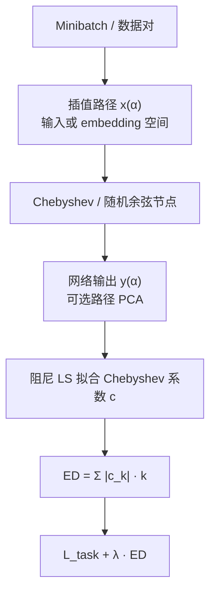
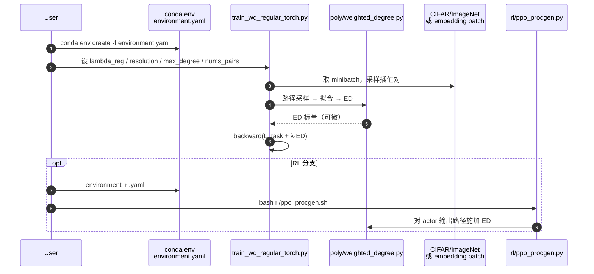

# Effective Degree：多项式代理量化简洁性

**Effective Degree（ED）** 出自论文 *Quantifying and Optimizing Simplicity via Polynomial Representations*（[arXiv:2605.29823](https://arxiv.org/abs/2605.29823)，**ICML 2026**；章天任* / 李向欣* / 肖明昊* / 陈冠宇 / 陈峰 · **清华大学**）：用数据相关插值路径上的正交多项式代理，把神经网络的函数复杂度压成可比较、可微的「有效度数」，既当泛化代理，也当训练正则。代码：<https://github.com/xinzaixinzai/Effective-Degree>。

## 一句话定义

**在数据流形附近抽样插值路径，把网络输出拟合成低维正交多项式；系数加权度数（Effective Degree）越小，函数越「简单」——可预测泛化间隙，也可直接加进损失做函数空间正则。**

## 英文缩写速查

| 缩写 | 英文全称 | 简要说明 |
|------|----------|----------|
| ED | Effective Degree | 多项式系数加权度数；本文简洁性度量与正则核心 |
| SAM | Sharpness-Aware Minimization | 参数空间锐度代理与优化；本文主对照之一 |
| ASAM | Adaptive Sharpness-Aware Minimization | 尺度自适应锐度；对比基线 |
| PCA | Principal Component Analysis | 路径内可选输出压缩后再拟合多项式 |
| PPO | Proximal Policy Optimization | Procgen 实验中对 actor 施加 ED 惩罚 |

## 为什么重要

- **填补「简洁性」工程缺口：** 直觉上的 simplicity bias 长期缺一个跨架构、可算、可优化的标量；ED 直接在**函数空间**定义，对重参数化更稳。
- **比 sharpness 更贴 gap：** CIFAR ResNet/ViT 与 CLIP ImageNet 微调上，ED 与 generalization gap 的相关更强；CLIP+mixup 设定下 sharpness 甚至可出现负相关。
- **机器人侧可读点：** Procgen 上对 **PPO actor** 加 ED 提升未见 level 泛化——提示函数空间简洁正则可迁到策略网络，而不只是分类。

## 核心信息

| 项 | 内容 |
|----|------|
| **机构** | 清华大学（Tsinghua） |
| **作者** | Tianren Zhang*、Xiangxin Li*、Minghao Xiao*、Guanyu Chen、Feng Chen（* equal） |
| **会议** | ICML 2026 |
| **度量** | \(\mathrm{ED}(P)=\sum_k \|c_k\|\,k\)（及归一化版）；多路径期望 |
| **训练目标** | \(\mathcal{L}_{\mathrm{task}}+\lambda\,\widehat{\mathrm{ED}}\)；分类常用 label-anchored |
| **开源** | **已开源** — [xinzaixinzai/Effective-Degree](https://github.com/xinzaixinzai/Effective-Degree) |

## 核心原理

### 路径化多项式代理

高维多元多项式基爆炸 → 在数据对 \((\mathbf{x}_1,\mathbf{x}_2)\) 上构造

\[
\mathbf{x}(\alpha)=\alpha\mathbf{x}_1+(1-\alpha)\mathbf{x}_2,\quad g(\alpha)=f(\mathbf{x}(\alpha))
\]

用 Chebyshev（或 Legendre）基拟合一元 \(P(\alpha)\)；随机余弦采样稳住节点。Thm 3.1：对真多项式，随机路径几乎必然保持代数度数序。

### 有效度数 vs 代数度数

裸度数对微小高阶系数过敏；ED 用 \(|c_k|\) 加权，对拟合噪声更 Lipschitz。高维输出可先做**路径内 PCA** 再拟合。

### 可微正则

阻尼法方程 \((\mathbf{T}^\top\mathbf{T}+\epsilon I)\mathbf{c}=\mathbf{T}^\top\mathbf{y}\) 经线性求解反传；分类时把路径两端输出换成标签（label-anchored），缓解与 CE「早期陡变」的冲突。文本在 **embedding 空间**插值。

### 流程总览

## 源码运行时序图

官方仓入口对齐 [`sources/repos/effective-degree.md`](../../sources/repos/effective-degree.md)：主正则训练走 `train_wd_regular_torch.py`；相关/评测走 `poly/`；RL 走 `rl/ppo_procgen.py`。

复现相关实验可先 `corr_resnet.sh` / `corr_vit_tiny.sh` 建模型池，再 `cd poly && bash eval_abd.sh`；CLIP / GLUE / ImageNet scratch 见 README 对应子目录脚本。

## 工程实践

| 项 | 做法 |
|----|------|
| 效率默认 | \(r=4\)，\(d_{\max}=3\)，\(n_p=\mathrm{batch}/2\)；主要扫 \(\lambda\) |
| 分类 | 开 `--label`（label-anchored）；可选 `--random_alpha`、`--pca k` |
| 文本 | 勿在 token id 上线性插值；在 embedding 空间建路径 |
| RL | 对 **actor** 加 ED（Procgen PPO）；环境用 `environment_rl.yaml` |
| 读相关 | 先看 ED vs gap 散点，再比 sharpness / \(L_2\)；recipe（如 mixup）分层报相关 |
| 失败模式 | 更简单但伪相关特征易学时，压 ED 可能伤鲁棒目标（附录 H） |

## 实验与评测

**度量相关：** CIFAR ResNet18 / ViT-Tiny 上 ED 与 generalization gap 线性相关最强；CLIP ImageNet FT（mixup）上 ED 正相关、sharpness 可负相关。Grokking（\(\mathbb{Z}_{97}\) 模除）中 ED 在验证损失骤降附近见峰后回落，sharpness/范数信号更模糊。

**正则增益（摘录）：**

| 设定 | 基线 → +ED |
|------|------------|
| CIFAR-10 ViT-Tiny Top-1 | 87.80 → **90.82** |
| ImageNet ViT-S/16（original / strong） | 71.37→**72.76** / 74.42→**75.01** |
| CLIP ViT-B/32 ID / Avg OOD | 76.20→**77.14** / 44.04→**45.31** |
| CLIP ViT-B/16 ID / Avg OOD | 81.35→**82.19** / 53.69→**55.29** |
| GLUE RTE Acc | 70.28 → **71.12** |
| Procgen（未见 level） | 四环境曲线整体抬升（Fig. 6） |

消融：数据相关路径优于随机噪声图；Chebyshev≈Legendre；余弦采样比均匀采样稳；PCA 非增益主因。

## 结论

**要把「学得更简单」从口号变成旋钮，用数据路径上的多项式有效度数比参数空间 sharpness 更贴泛化间隙，并且可以直接反传进训练；分类记得 label-anchored，离散模态改在表示空间插值。**

1. **选型：** 需要跨架构可比的函数复杂度标量，或 sharpness 相关失灵时，优先试 ED。
2. **训练：** 默认小 \(r/d_{\max}\)，只调 \(\lambda\)；分类开 LA，文本走 embedding 路径。
3. **读表：** 同时看 ID 与 OOD（CLIP 五偏移）；CIFAR 上相对 SAM/ASAM 的 +3pt 是主卖点。
4. **RL：** Procgen 证明可挂 PPO actor；迁到机器人策略前先确认观测是否连续可插值。
5. **边界：** 简单≠正确——伪相关简单解会让 ED 正则帮倒忙；大模型开销需另做效率估计。
6. **复现：** 官方仓齐全；ImageNet soups 相关实验需外挂权重。

## 与其他工作对比

| 维度 | ED（本文） | SAM / ASAM | Weight decay / \(L_2\) | Jacobian / 平滑正则 |
|------|------------|------------|------------------------|---------------------|
| 定义空间 | 函数（路径多项式） | 参数邻域锐度 | 参数范数 | 输出对输入敏感度 |
| 重参数化 | 相对稳健 | 已知敏感 | 敏感 | 中等 |
| 可作训练目标 | 是（可微拟合） | 是（min-max） | 是 | 是 |
| 跨模态 | 图像 / 文本 / RL | 主视觉 | 通用 | 多见视觉 |
| 代码 | 已开源 | 多实现 | 标配 | 多实现 |

## 局限与风险

- 路径代理是否保留「真」函数复杂度，理论仅对多项式度数序给出保证。
- 失败模式：更易学的简单特征与鲁棒特征冲突时，压 ED 可能有害。
- 正则引入额外前向（插值点），大规模训练有墙钟开销。
- Procgen≠真机机器人；连续控制 / 高维本体感觉插值语义需另验证。
- 仓库未声明许可证，商用前需自行确认。

## 关联页面

- [深度学习基础](../concepts/deep-learning-foundations.md) — 泛化与正则坐标
- [强化学习](../methods/reinforcement-learning.md) — Procgen / 策略泛化背景
- [PPO](../methods/ppo.md) — 本文 RL 实验底座
- [AdamW](../methods/adamw.md) — 分类实验常用优化器族
- [Deep Learning Optimizers 对比](../comparisons/deep-learning-optimizers.md) — 优化器与正则并存选型
- [Transformer](../concepts/transformer.md) — ViT / BERT 实验架构

## 参考来源

- [sources/papers/effective_degree_arxiv_2605_29823.md](../../sources/papers/effective_degree_arxiv_2605_29823.md) — 本次 ingest 归档
- [sources/repos/effective-degree.md](../../sources/repos/effective-degree.md) — 官方代码与入口
- [arXiv:2605.29823](https://arxiv.org/abs/2605.29823) — 论文（ICML 2026）
- [GitHub: Effective-Degree](https://github.com/xinzaixinzai/Effective-Degree) — 官方实现

## 推荐继续阅读

- Foret et al., *Sharpness-Aware Minimization* (ICLR 2021)
- Kwon et al., *ASAM* (arXiv:2102.11600)
- Cobbe et al., *Procgen* (ICML 2020) — RL 泛化基准
- Power et al., *Grokking* (2022) — ED 跟踪相变的实验设定
