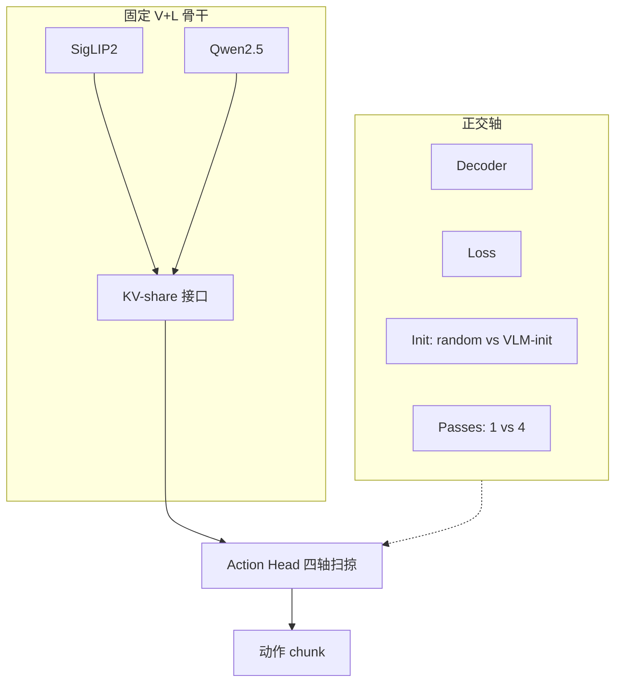
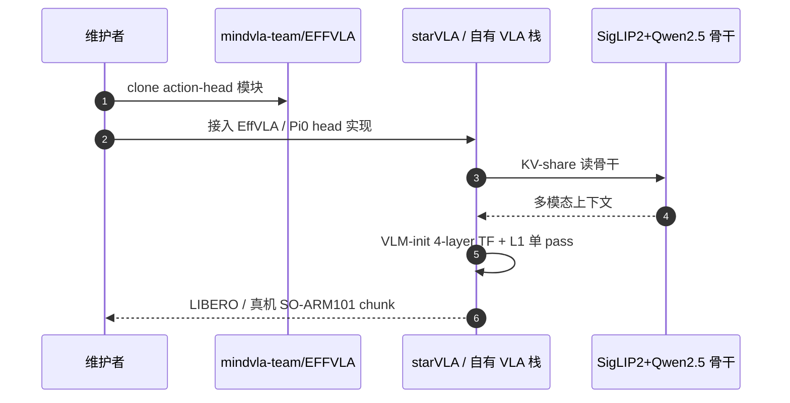

# EffVLA：什么决定高效 VLA 的 action head

**EffVLA**（*What Makes an Efficient VLA? Navigating Action-Head Design, Scaling, and Latency*，[项目页](https://mindvla-team.github.io/EFFVLA/)，[代码](https://github.com/mindvla-team/EFFVLA)）由 **中科院自动化所 / 国科大 / 理想汽车 / 北邮 / UCL / 爱丁堡** 等联合开展：在 **固定骨干**（SigLIP2-So400m + Qwen2.5）与 **固定管线**（DROID → LIBERO / LIBERO-Plus）下，对 action head 的 **decoder / loss / init / inference passes** 与 **V/L/A 模块尺度** 做 **延迟配对** 的 factorial 设计空间研究。

## 一句话定义

**VLA 效率的第一杠杆是把 action head 与语言骨干对齐（VLM-init），而不是先堆 flow matching 或多 pass 解码。**

## 英文缩写速查

| 缩写 | 英文全称 | 简要说明 |
|------|----------|----------|
| EffVLA | Efficient VLA | 本文提出的紧凑 VLA 配方 |
| VLA | Vision-Language-Action | 视觉-语言-动作策略 |
| VLM | Vision-Language Model | 本文从 Qwen2.5 末层拷贝初始化 head |
| KV-share | Key-Value sharing | head 读骨干的共享 KV 接口 |
| LIBERO-Plus | LIBERO perturbation suite | 七轴零样本扰动评测 |

## 为什么重要

- 用户指定 ingest 的核心论文；纳入 [十篇盘点](../../sources/blogs/wechat_embodied_station_9_papers_resources_effvla_2026-09-15.md) 的 **VLA 设计空间** 支线。
- 在 **测得 on-device 延迟** 下重排 OFT / π₀ / FAST 等常见 head 选择。
- **部分开源** action-head 建模代码，可接入 starVLA 类框架。

## 核心信息

| 项 | 内容 |
|----|------|
| **机构** | 中科院自动化所；国科大；长三角 AI Lab；理想汽车；北邮；UCL；爱丁堡 |
| **骨干** | SigLIP2-So400m + Qwen2.5-3B |
| **Headline 配方** | 4 层 TF block head，**VLM-init**，单 pass **L1** |
| **规模** | ~**3.75B** 总参（head ~0.35B）；chunk 延迟 **39.2 ms**（RTX 5090, bf16, bs=1） |
| **开源** | **部分开源**：`mindvla-team/EFFVLA`（action-head 模块）；arXiv 截至入库日待挂 |

## 流程总览

## 三大发现（项目页）

1. **对齐优先**：从语言骨干拷贝末层初始化 head → **+7.1** LIBERO-Plus 点、**零延迟成本**；对齐后 flow matching **−4.4**，额外 pass 落入噪声。
2. **容量回报在对齐之后**：对齐 head 每 +1 ms 约 **+4** 成功率点；未对齐仅约 **+1.3**。
3. ** modest 规模膝**：任一模块超过 `l` 配置准确率平台、延迟仍升；~3.75B 接近 π 系常用尺度。

## 源码运行时序图

## 实验与评测

- **LIBERO 标准四 suite**：EffVLA **98.2%** 平均，与 ABot-M0 等顶行同 band（96–99%）。
- **LIBERO-Plus 七扰动轴**：**六轴列最佳**；camera **+7.9** vs ABot-M0；Init **+37.9** vs OpenVLA-OFT；仅 sensor noise 落后（与 MLP head 消融一致）。
- **真机 SO-ARM101**：配方不变，五语言分拣任务 **40/50**（多物体指令成功率递减）。

## 结论

**EffVLA 把 VLA 效率问题收成「先对齐 head，再 modest 扩容量，别在未对齐时买 flow/多 pass」。**

1. **VLM-init 是单轴最大杠杆** — 且在每个模块尺度都成立。
2. **表达力技巧是补偿项** — flow / 多 pass / 更重 decoder 只在 random init 时划算。
3. **对齐可测量** — CKA 0.76 vs 0.24；指令注意力质量差异可复现。
4. **~3.75B 是实测膝** — 再大主要加延迟。
5. **开源边界** — 代码聚焦 action-head；全栈训练权重需跟进 arXiv/官方发布。

## 工程实践

| 项 | 建议 |
|----|------|
| 何时引用 | VLA head 设计、延迟配对 ablation、LIBERO-Plus 鲁棒性 |
| 复现 | 先接 `EFFVLA` 模块 + 自有 DROID→LIBERO 管线；核对 VLM-init 拷贝层 |
| 开源 | **部分开源**（action-head）；全权重 **待 arXiv** |

## 局限与风险

- 因果性：对齐仅通过初始化操纵；permuted-layer 对照列为 future work。
- SimplerEnv 样本量小（~96 trials/模型），标准误约 7 点。
- 真机仅 feasibility，未在同一硬件上对比全部 substrate。

## 关联页面

- [VLA](../methods/vla.md)
- [π₀](../methods/π0-policy.md)
- [MINERVA](./paper-minerva-libero.md)
- [十篇资源技术地图](../overview/embodied-resources-10-papers-technology-map.md)

## 参考来源

- [EffVLA 论文/项目摘录](../../sources/papers/effvla_2026.md)
- [EffVLA 项目页归档](../../sources/sites/effvla-mindvla-github-io.md)
- [EFFVLA 仓库归档](../../sources/repos/mindvla-effvla.md)
- [具身智能小站 2026-09-15 盘点](../../sources/blogs/wechat_embodied_station_9_papers_resources_effvla_2026-09-15.md)

## 推荐继续阅读

- 项目页：<https://mindvla-team.github.io/EFFVLA/>
- 代码：<https://github.com/mindvla-team/EFFVLA>
