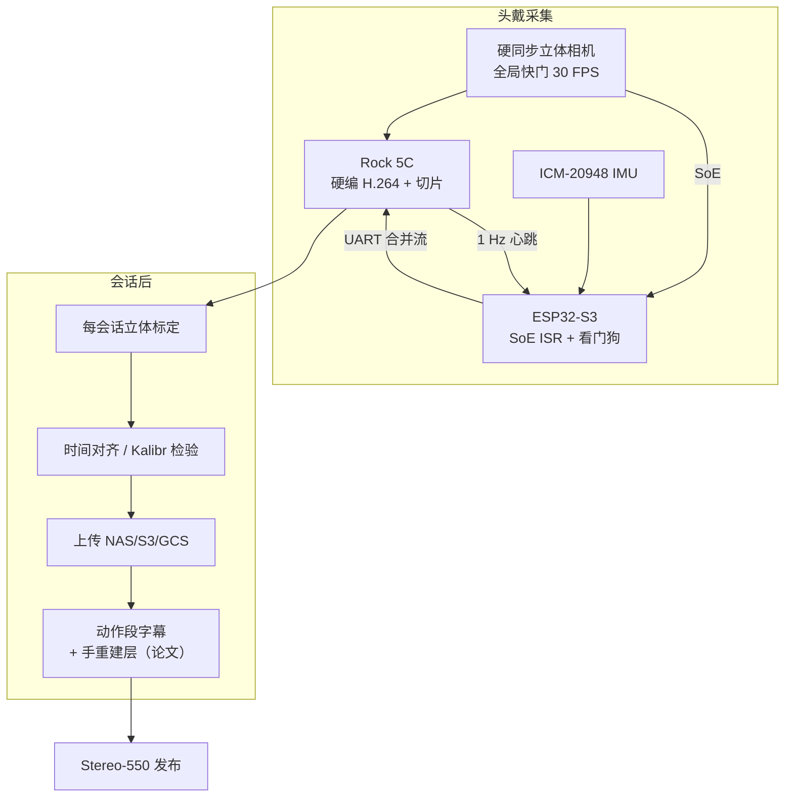

# Ego-OSCAR / Stereo-550（开源硬件第一人称立体惯性采集）

**Ego-OSCAR**（*Egocentric Open source Stereo CAptuRe System*，[arXiv:2608.08285](https://arxiv.org/abs/2608.08285)，[3D 页](https://www.fpvlabs.ai/ego-oscar/cap)，[HF Stereo-550](https://huggingface.co/datasets/fpvlabs/stereo-550)）由 **第一人称视觉实验室（FPV Labs）** 提出：用仅 COTS + 3D 打印、BoM **~USD 200** 的头戴装置，提供 **硬件同步全局快门立体 RGB + 6 轴 IMU + 嵌入式硬编码 + MCU 看门狗**，并把分布式贡献者网络采到的 **~550 h/相机** 标定立体语料（**Stereo-550** / Ego-OSCAR-550h）连同稠密自由格式动作字幕一并发布。

## 一句话定义

**把「可众包复制的硬同步立体惯性头戴」做成 egocentric 采数基底，用百美元级 BoM 和看门狗可靠部署，去填补消费级单目与闭源 Aria 级眼镜之间的空档——而不是再发一套只能消费、不能续采的私有硬件语料。**

## 英文缩写速查

| 缩写 | 英文全称 | 简要说明 |
|------|----------|----------|
| Ego-OSCAR | Egocentric Open source Stereo CAptuRe | 本文开源硬件采集系统 |
| Stereo-550 | Stereo 550-hour corpus | HF 发布名；论文亦称 Ego-OSCAR-550h |
| IMU | Inertial Measurement Unit | 6 轴惯性（加速度计+陀螺） |
| VIO / VINS | Visual-Inertial Odometry / Navigation System | 立体惯性里程计；文中用 VINS-Fusion 做收敛率探测 |
| VLA | Vision-Language-Action | 目标下游；本文不做策略增益实验 |
| SoE | Start of Exposure | 相机曝光起始硬信号，用于跨时钟域同步 |
| WiLoR | Wild Localization and Reconstruction（手） | 论文用其做全库 3D 手重建标注层 |

## 为什么重要

- **采数瓶颈在「可复制基底」：** [Ego4D](./paper-ego4d.md) 等大规模语料多绑定消费相机或闭源研究眼镜；第三方无法按同一传感器规格扩采。Ego-OSCAR 把「开源硬件 + 开源管线」本身当作贡献。
- **硬同步立体对度量几何：** 全局快门 + 左右硬同步 + 每会话标定，直接服务立体深度与（离线）视觉惯性融合；相对 GoPro/手机 rolling-shutter 单目更贴近「需要相机位姿条件」的 VLA 叙事。
- **众包可靠性工程：** ESP32 看门狗（>2 s 无心跳亮错）把「挂死仍以为在录」变成可见失败；报告 **96%** 可用会话率，这是部署证据，不是策略 SoTA。
- **与 UMI 族正交：** [UMI](../tasks/teleoperation.md) / [HiFi-UMI](./paper-hifi-umi.md) / [HandUMI](./handumi.md) 解决 **手持操作接口与 EE 轨迹**；Ego-OSCAR 是 **观测向头戴**，不记录机器人状态或夹爪轨迹——适合人视频预训练底物，不替代 teleop 示范。

## 核心信息

| 项 | 内容 |
|----|------|
| **机构** | 第一人称视觉实验室（FPV Labs） |
| **BoM** | **~USD 200** / 台（论文 Table 1） |
| **传感** | 硬同步全局快门立体 1280×720@30，FOV 126°，基线 **42 mm**；ICM-20948 6 轴 IMU（论文 120 Hz） |
| **计算** | Radxa Rock 5C（RK3588 硬编）；Xiao ESP32-S3（同步/UX/看门狗） |
| **语料** | **≈550 h/相机**，1,462 sessions，209,315 动作段；IMU 86.9% 会话 |
| **开源（截至 2026-08-12）** | **部分开源** — HF **Stereo-550**（gated + 定制许可）+ Hardware Spec PDF + 3D 页；**采集软件/CAD GitHub 未列** |

## 核心原理

### 方法栈

| 模块 | 机制 |
|------|------|
| 立体相机 | 单 ASIC 硬同步双全局快门 → 单 UVC 端点；SoE 引出到 MCU |
| 可穿戴主机 | RK3588 MPP：MJPEG 硬解 + H.264 硬编；5 min 切片防掉电丢整段 |
| 时钟桥 | ESP32 ISR 记 SoE 单调时戳并读 IMU；离线对齐；第 60 次 ISR LED 闪光锚定帧号 |
| 看门狗 | Radxa 1 Hz UART 心跳；丢失 >2 s → 错误态，阻止「空录」 |
| 标定与发布 | **每会话** 棋盘标定（非整机出厂内参）；附 `calibration.json`；姿态估计离线做 |

### 流程总览

## 源码运行时序图

**不适用（官方无可运行采集/训练入口）。** 截至 **2026-08-12**：可公开获取的是 [Stereo-550](https://huggingface.co/datasets/fpvlabs/stereo-550)（gated）、[Hardware Spec PDF](https://drive.google.com/file/d/1ZMgKqFdM65cAtcaI2s7SHr3Z-DljlHbe/view) 与 [3D 页](https://www.fpvlabs.ai/ego-oscar/cap)；`fpv-labs` org 公开仓为手机向 Stera，**无** Ego-OSCAR 录制 daemon / 固件 / CAD 的可辨识 GitHub。若后续开放采集仓，应补 `sources/repos/` 并画「SoE→MCU→SBC 编码→离线标定同步」的 `sequenceDiagram`。

## 工程实践

| 项 | 建议 / 论文设定 |
|----|----------------|
| 选型读法 | 需要 **可自建船队续采** 的标定立体 ego → 看 Ego-OSCAR；只需最大日常多样性 → 仍以 [Ego4D](./paper-ego4d.md) 等为主 |
| 数据入口 | 申请 HF `fpvlabs/stereo-550`；遵守 FPV Labs 定制许可（非 CC） |
| 会话格式 | 左右 MP4 + `action_labels.json` + `calibration.json` + 可选 IMU CSV |
| 深度工作区 | 文中称室内典型 **0.5–4 m** 可靠；基线 42 mm 勿当远距测距 |
| IMU 预期 | 消费级；适合重力对齐 / 粗 VIO 先验；长时纯惯导需换更高端 I2C 器件 |
| 质控 | 现场看门狗 + 批次可解码校验 + 选手可见筛选；坏标定/无同步轨迹不带 caveat 硬塞 |
| 与策略管线 | **论文未证明** 本数据训策略优于既有语料；接 [VLA](../methods/vla.md) / [EgoScale](../methods/egoscale.md) 前自备对齐与评测 |
| 手标注 | 论文称 WiLoR 全库层、检出率 94%（覆盖率）；HF README 目录**未列**手 JSON——下载后核对 |

## 实验与评测

- **传感器（Tier 1）：** 重投影 <0.03 px；整流后平均极线误差 0.4 px；视觉–惯性残差约 **700 µs**（Kalibr）。
- **效用（Tier 2）：** SGBM / RAFT-Stereo 全视场可用；VINS-Fusion **12/20** 短序列收敛（**非** ATE/RPE）；WiLoR 手检出 **94%**（覆盖，非精度）。
- **部署（Tier 3）：** 6 个月、25 人、13 设备、40+ 室内环境；**96%** 端到端可用会话；主故障：高温长录热关、SD I/O、相机线缆应力——均由看门狗/校验暴露。
- **语料定位（Table 2）：** 小时数与佩戴人数不及 Ego4D / Ego-Exo4D；差异在 **可开放复制的硬同步 RGB 立体 + 每会话标定 + 稠密开放词表字幕**。

## 结论

**Ego-OSCAR 的真贡献是「百美元级可众包立体惯性头戴 + 部署可靠性」，Stereo-550 是该基底的规模验证；不要把它读成又一个策略 SoTA 或 Aria 替代品。**

1. **主工程读数** — BoM ~USD 200、硬同步全局快门立体 + SoE–IMU 桥接 + 看门狗，直接服务「能扩采」而非「单机最高保真」。
2. **部署证据** — 96% 可用会话、550 h/相机、25 贡献者，证明消费级栈可在分布式网络跑通。
3. **标注密度** — 209,315 自由格式段、~100% 时间线覆盖，比多数叙述型语料更利于时序/世界模型式监督。
4. **策略价值未证** — 作者明确不做本数据 vs 既有语料的策略对照；选型勿跳步。
5. **开源边界** — 数据 gated + 定制许可；硬件 PDF/3D 已公开；**采集仓截至入库日未列**，复现设备需跟进 Drive 规格与后续 GitHub。

## 与其他工作对比

| 对照 | 差异读法 |
|------|----------|
| [Ego4D](./paper-ego4d.md) | 规模与地理多样性锚点；多为单目/不可复制硬件。Ego-OSCAR 小但 **可续采** |
| Project Aria / Ego-Exo4D / Nymeria | 研究级传感与访问项目；闭源不可自由仿制。本文用保真换可及性 |
| MobileEgo Anywhere / Stera（同机构） | 手机零硬件门槛；无硬同步立体。Ego-OSCAR 多花 ~USD 200 买同步与标定 |
| [HiFi-UMI](./paper-hifi-umi.md) / [HandUMI](./handumi.md) | 手持操作示范 + EE/夹爪通道；Ego-OSCAR **观测-only** 头戴 |
| [EgoHumanoid](https://arxiv.org/abs/2602.10106) | 证明 ego 人数据可转人形策略；本文提供正交的采数硬件问题 |

## 局限与风险

- **无策略实验：** 传感器与部署验证 ≠ 预训练增益。
- **无位姿 GT：** 12/20 只是 VO 收敛率；勿推断轨迹精度。
- **分布窄：** 印度室内、厨房向为主、25 贡献者 / 13 设备。
- **访问摩擦：** Stereo-550 gated + 定制许可；规划存储与合规成本。
- **开源不完整：** 论文「全部开源」与公开 GitHub 现状不完全对齐——以项目页/HF **实际链接** 为准。
- **HF vs 论文标注层：** 手重建是否随 Stereo-550 完整交付需下载核实。

## 关联页面

- [Ego 分类 01：数据采集](../overview/ego-category-01-data-collection.md) — 「人类作分布式采集者」总图
- [Ego4D](./paper-ego4d.md) — 大规模日常 ego 基准（对照规模/硬件可及性）
- [EgoVerse](./paper-egoverse.md) — 联盟式 ego 活数据与接入协议
- [HiFi-UMI](./paper-hifi-umi.md) — 高保真头戴+双手 UMI（操作示范轴）
- [HandUMI](./handumi.md) — 开源手持示教硬件对照
- [Teleoperation](../tasks/teleoperation.md) — 采集范式谱系（观测基底 vs teleop/UMI）
- [VLA](../methods/vla.md) / [EgoScale](../methods/egoscale.md) — 人视频预训练下游读法
- [WiLoR](../methods/wilor.md) — 论文手重建所用检测/重建前端
- [HumanNet Table 1 语料对照](../comparisons/humannet-table1-human-video-corpora.md) — 人类视频选型框架

## 参考来源

- [ego_oscar_arxiv_2608_08285.md](../../sources/papers/ego_oscar_arxiv_2608_08285.md) — 论文摘录与开源核查
- [fpvlabs-ego-oscar.md](../../sources/sites/fpvlabs-ego-oscar.md) — 3D / 项目页归档
- [stereo-550.md](../../sources/datasets/stereo-550.md) — HF 数据集归档
- [arXiv:2608.08285](https://arxiv.org/abs/2608.08285) — 原文（Submitted 2026-08-08）

## 推荐继续阅读

- [arXiv PDF](https://arxiv.org/pdf/2608.08285) — 硬件 BoM、同步细节与 Table 2
- [Stereo-550 on Hugging Face](https://huggingface.co/datasets/fpvlabs/stereo-550) — 申请与目录格式
- [Stereo Cap 3D](https://www.fpvlabs.ai/ego-oscar/cap) — 可穿戴形态
- [MobileEgo Anywhere（arXiv:2605.05945）](https://arxiv.org/abs/2605.05945) — 同机构手机采集互补点
- [EgoHumanoid（arXiv:2602.10106）](https://arxiv.org/abs/2602.10106) — egocentric→人形策略迁移先例
