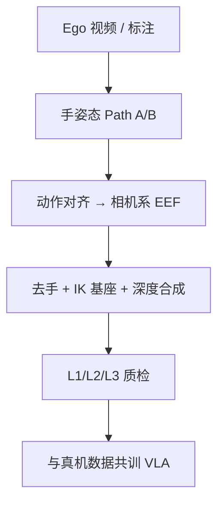

# Ego2Robot：第一人称人视频规模化合成机器人数据

**Ego2Robot**（*Scalable Robot Data Synthesis from Egocentric Human Data*；[arXiv:2608.02580](https://arxiv.org/abs/2608.02580)，[项目页](https://www-ye.github.io/ego2robot_blog/)）由 **中国人民大学 AIM3 / 阿里通义千问 / 上海科技大学 / 北京通用人工智能研究院** 等提出：把大规模第一人称操作视频对齐成 **可给 VLA 预训练的机器人格式数据**。

## 一句话定义

**用动作重定向、去手后渲染机械臂、再做三级质检，把人的第一人称操作变成 15 种本体上的相机系相对 EEF 轨迹——用来补机器人遥操作覆盖不到的场景与任务多样性。**

## 英文缩写速查

| 缩写 | 英文全称 | 简要说明 |
|------|----------|----------|
| EEF | End-Effector | 末端；本文输出相机系相对位移 |
| VLA | Vision-Language-Action | 下游预训练对象 |
| IK | Inverse Kinematics | 为每条轨迹搜可解的基座位姿 |
| OOD | Out-of-Distribution | 解耦扰动下的泛化 |
| TCP | Tool Center Point | 由拇指与虚拟指尖中点定义 |

## 为什么重要

- Open X / DROID / AgibotWorld 仍受硬件与遥操作成本限制；人视频天然场景多、任务杂。
- 小规模 retarget-and-render 已证明能训单任务策略；本文问的是 **能否当 VLA 预训练资产**。
- 把 RoboTwin 2.0 的捆绑 OOD 拆成视觉 / 布局 / 本体 / 语义，才能看清合成数据到底补哪一轴。

## 核心信息

| 项 | 内容 |
|----|------|
| **规模** | 约 1,940 h 人视频 → **18,561 h** 合成机器人数据；共训真机约 6,565 h |
| **形态** | 15 种：Panda、UR5e、ARX-L5、xArm7、Aloha-Agilex 等 |
| **源** | ANT / EgoDex / ViTRA / EgoVerse |
| **开源** | **仅项目页**；仓 `www-Ye/ego2robot_blog` 是静态站（截至 2026-08-15） |

## 核心原理

### 方法栈

Path A 吃已标注手姿态；Path B 用 [WiLoR](../methods/wilor.md) + DynHaMR。共享三段：手关键点→夹爪 TCP/开合/姿态并平滑；SAM 3 + ProPainter 去臂后做基座网格搜索与深度合成；L1/L2/L3 质检。动作用 **相机系相对 EEF**，避开未知外参。训练时按源降采样，把人手速度拉近遥操作。

### 流程总览

## 工程实践

| 项 | 建议 |
|----|------|
| 源码运行时序图 | **不适用**（管线与 18,561 h 数据未发布） |
| 混合比 | 项目页默认 **1:1** 合成:真机；本体对齐可试 3:1 |
| 动作空间 | 跨相机、跨形态时优先相机系相对 EEF，不要强行世界系 |
| 真机补数据 | 现场拍几分钟 ego-play，再走同一管线混进 few-shot 微调 |
| Franka | 大运动学缺口上零样本仍弱（<7%），不要指望合成数据单独打穿 |

## 实验与评测

固定 Qwen3.5-4B + DiT、同等 19.2M 帧预算。Ego2R+Robot **1:1**：Clean 62.2→**68.1**，Visual **67.3**，Task **54.1**。**3:1** 在 Embody（28.2）与 EBench（51.7，+12.1）更好。未见物体 29.3→40.0。仅 ego 预训练：生视频 28.1 → 15 形态管线 33.5 → 再加生视频 37.3。ARX ACone 五任务、每任务 20 条遥操作：Mix + Ego2R Play 全最高。

## 与其他工作对比

相对 [EgoScale](../methods/egoscale.md)：EgoScale 在人视频上预训练再 mid-train 对齐；Ego2Robot 先把人视频 **渲染成机器人像素+动作** 再共训。相对 RoviAug / Mirage：那些补的是机–机外观，这里跨的是人–机。相对 [RoboEdit](./paper-roboedit.md)：RoboEdit 输出 **full robot interaction video + 3D hand states**（RoboEdit-14M），Ego2Robot 输出 **相机系相对 EEF 轨迹** 供 VLA 预训练。相对 [RoboTwin](./robotwin.md)：本文扩展其评测轴，不是替代数据生成器。

## 结论

**人视频要变成 VLA 预训练资产，关键是对齐动作、外观和速度，而不是把原始 ego 像素直接扔进共训。**

1. **1:1 共训是默认甜点** — Clean 与多数 OOD 轴一起涨。
2. **视觉与语义收益最大** — 场景多样 + 多形态上色解释 background/lighting/color 与未见物体。
3. **本体迁移部分有效** — ARX/UR5 有增益，Franka 仍近乎失败。
4. **生视频不是废物** — 管线后仍可当第 16 种「形态」混入。
5. **真机 few-shot 用现场 ego-play** — 比只靠离线合成更贴部署场景。
6. **数据未开源** — 读者目前只能复用协议思想，不能复现 18k h。

## 局限与风险

- 夹爪假设（平行爪 TCP）覆盖不了多指灵巧接触。
- 质检 L3 依赖 VLM，可能系统性漏过细交互错误。
- 合成臂外观与真实灯光/材质仍有域差；Franka 数字说明形态鸿沟不会被渲染抹平。

## 关联页面

- [VLA](../methods/vla.md)
- [EgoScale](../methods/egoscale.md) — 人视频规模化的另一条对齐路径
- [WiLoR](../methods/wilor.md) — Path B 手估计
- [RoboTwin 2.0](./robotwin.md) — 解耦评测宿主
- [EgoVerse](./paper-egoverse.md) — 954 h 源之一
- [GSR / ParaVLA](./paper-gsr-paravla.md) — 指令改写轴与本文 Task/Lang 扰动互补
- [EmbodiedVAE](./paper-embodiedvae.md) — 表征侧紧凑可控，对照数据侧规模化
- [RoboEdit](./paper-roboedit.md) — 人类视频编辑为 robot video + 3D hand states（RoboEdit-14M）

## 参考来源

- [Ego2Robot 论文摘录](../../sources/papers/ego2robot_arxiv_2608_02580.md)
- [Ego2Robot 项目页归档](../../sources/sites/ego2robot-blog.md)
- [具身智能小站 9 篇盘点](../../sources/blogs/wechat_embodied_station_ego2robot_mango_grasp_2026-08-11.md)
- [arXiv:2608.02580](https://arxiv.org/abs/2608.02580)

## 推荐继续阅读

- [Ego2Robot 项目页](https://www-ye.github.io/ego2robot_blog/)
- Yuan et al., [Qwen-RobotManip](https://arxiv.org/abs/2606.17846) — 文内称使用本合成数据
