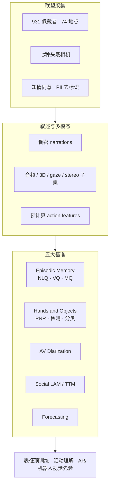
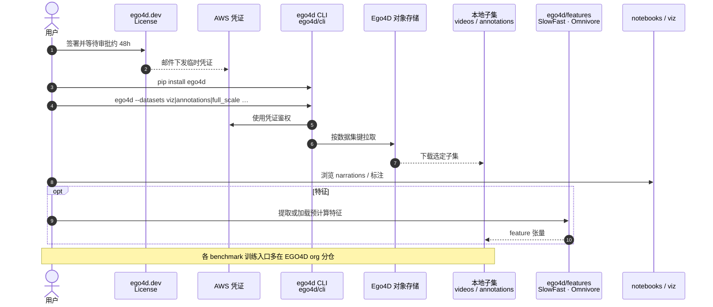

# Ego4D（全球第一人称日常视频 · 数据集与基准套件）

**Ego4D**（*Around the World in 3,000 Hours of Egocentric Video*，[项目页](https://ego4d-data.org/)，[arXiv:2110.07058](https://arxiv.org/abs/2110.07058)，CVPR 2022）由 **元宇宙人工智能（Meta AI / FAIR）** 与多国大学联盟共建：把公开 egocentric 视频规模提升约一个数量级，并定义覆盖 **过去–现在–未来** 的五条第一人称感知基准。

## 一句话定义

**约 3,670 小时、跨 74 地点/9 国的无剧本为主第一人称日常视频语料，配套叙述与多模态子集，以及 Episodic Memory / Hands–Objects / AV Diarization / Social / Forecasting 五大基准；是后续 Ego-Exo4D、R3M、各类 VLA 人视频预训练常引用的 egocentric 基础设施，但对机器人策略属于 Indirect 监督。**

## 英文缩写速查

| 缩写 | 英文全称 | 简要说明 |
|------|----------|----------|
| Ego / Ego4D | Egocentric / Egocentric 4D Perception | 第一人称；4D = 3D 空间 + 时间 |
| NLQ / VQ / MQ | Natural Language / Visual / Moments Query | Episodic Memory 三类查询 |
| PNR | Point of No Return | 物体状态变化开始的关键帧 |
| HOI | Hand–Object Interaction | 手–物交互；Hands & Objects 基准 |
| AVD | Audio-Visual Diarization | 音视说话人定位、分段与转写 |
| LAM / TTM | Looking / Talking to Me | Social 基准：是否看我 / 是否对我说话 |
| CLI | Command-Line Interface | `ego4d` 下载与子集选择工具 |

## 为什么重要

- **把 egocentric 从「厨房小集」推到全球日常：** 相对 EPIC-Kitchens 等厨房向集合，Ego4D 覆盖家务、职场、户外、休闲与社交，佩戴者人口统计更广，长片段（典型 raw clip 约数分钟级）保留活动完整弧线。
- **问题定义与数据同发：** 五大 benchmark 把「能查过去、懂当下交互、预期未来」写成可训练/可评测任务，并附数百万级标注与叙述。
- **具身与 AR 的视觉先验底座：** 后续 R3M、GR00T 数据金字塔、HumanNet 对照表、RekaDaily / EgoVerse 等均以 Ego4D 为规模或任务参照；选型时要分清它是 **活动理解 / 表征预训练** 语料，不是原生机器人轨迹。
- **工程可落地：** 官方文档 + MIT CLI + 预计算特征 + 可视化，降低「3k+ 小时」的入门摩擦（仍需 license 与 TB 级存储规划）。

## 核心信息

| 项 | 内容 |
|----|------|
| **机构** | 元宇宙人工智能（Meta AI / FAIR）；德州大学奥斯汀分校（UT Austin）；卡内基梅隆大学（CMU）；佐治亚理工学院（Georgia Tech）；加州大学伯克利分校（UC Berkeley）；麻省理工学院（MIT）；新加坡国立大学（NUS）；宾夕法尼亚大学（UPenn）等联盟（完整名单见论文/项目页） |
| **规模** | **3,670** 小时 RGB；约 **931** 佩戴者；**74** 地点、**9** 国 |
| **模态** | RGB 为主；子集含音频、Matterport 3D、gaze、stereo、多机同步、IMU；全量稠密叙述（约 **3.85M** 句） |
| **许可证 / 访问** | 数据：**Ego4D license**（签署后 AWS 凭证，约 48h；凭证约 14 天可续）；代码：**MIT** |
| **适配形态** | 视频理解 / 多模态 / 表征预训练；**无** 原生机器人 DOF 或手部 3D 轨迹字段 |
| **重定向就绪度** | **低（Indirect）**：需重建、伪动作或仅作视觉–语言层（见 [HumanNet Table 1](../comparisons/humannet-table1-human-video-corpora.md)） |
| **开源** | 工具仓 **已开源**；数据 **受控开放**；各挑战基线见 [EGO4D org](https://github.com/EGO4D/) |

### 数据集速查

| 维度 | 内容 |
|------|------|
| **规模** | ~3,670 h 视频；叙述覆盖全量；单 benchmark 标注约数十至上千小时量级（以官方 docs 为准） |
| **模态** | Ego RGB +（子集）音频 / 3D / gaze / stereo / multi-cam；预计算 SlowFast 等特征 |
| **许可证** | 数据需 Ego4D 协议；代码 MIT |
| **重定向就绪度** | **Indirect**：适合表征与活动理解；接策略需额外对齐 |

## 核心结构与方法

| 模块 | 作用 |
|------|------|
| **联盟采集** | 14 团队分布式招募；长佩戴、多数无剧本；场景对齐日常生活时间使用调查 |
| **多设备** | 七种头戴相机，降低设备偏置；标准评测常用 30 fps 规范化版本 |
| **Narrations** | pause-and-talk 双标注；驱动 taxonomy、切片与弱对齐语言研究 |
| **Episodic Memory** | NLQ / VQ / MQ：在长历史中定位「答案可见」的时空窗口 |
| **Hands & Objects** | 状态变化的时间（PNR）、空间（物体框）、语义（是否/何种变化） |
| **AVD + Social** | 对话中的谁在说、对谁说、是否在看佩戴者 |
| **Forecasting** | 手/位移轨迹与短/长程动作预期 |

### 流程总览

## 源码运行时序图

对齐官方仓库 [facebookresearch/Ego4D](https://github.com/facebookresearch/Ego4D)：`pip install ego4d` → CLI 子集下载 →（可选）特征 API / notebook。**完整五大基准训练基线不在本仓集中**，见 [EGO4D org](https://github.com/EGO4D/)。

复现路径：先签 license → `pip install ego4d` → 按 [Start Here](https://ego4d-data.org/docs/start-here/) 选子集（优先 `viz` / 单 benchmark，避免直接拉满数 TB）→ notebook 熟悉 JSON 标注 → 再接对应挑战基线仓。

## 工程实践

| 项 | 要点 |
|----|------|
| **开源边界** | **代码 MIT 已开源**；**数据受控开放**（license + AWS）；凭证约 **14 天** 过期可续 |
| **下载入口** | `ego4d --output_directory=... --datasets ...`；亦支持 `python -m ego4d.cli.cli` |
| **体积规划** | Full primary 视频约 **~7 TB** 量级；Entire dataset **30+ TB**（文档表）；务必子集化 |
| **特征捷径** | 官方提供预计算 action features；仓内亦有提取 API |
| **可视化** | [visualize.ego4d-data.org](https://visualize.ego4d-data.org/)（需 license）+ 本地 `notebooks/` / `viz/` |
| **下游读法** | 金字塔 **人 Ego 视频层**、视频–语言预训练、HOI/预测研究；**不要**当作 [EgoVerse](./paper-egoverse.md) / EgoDex 一类带手关键点的可执行示教替代品 |
| **源码运行时序图** | 见上节（CLI 拉数为主；训练基线分仓） |

## 实验与评测

论文以联盟基线跑通五条挑战（细节与数字见 arXiv 附录）；选型时抓住任务定义即可：

| 基准 | 主问题 | 典型指标族（论文） |
|------|--------|-------------------|
| Episodic Memory | 查询过去经验在何处可见 | NLQ：tIoU 上 top-k recall；MQ：mAP / recall；VQ：时空定位 + 及时性 |
| Hands & Objects | 物体如何因交互改变状态 | PNR 绝对时间误差；检测 AP；状态分类准确率 |
| AV Diarization | 谁在何时说了什么 | MOT、speaker error、DER、WER |
| Social | 谁在看我 / 对我说话 | mAP、Top-1 |
| Forecasting | 下一步去哪、做什么 | 轨迹与动作预期指标（见附录） |

## 结论

**Ego4D 的真影响是「把第一人称日常视频做成可共享的基础设施 + 可竞赛的问题集」：规模与地理多样性打开表征与活动理解上限，但对机器人策略仍是 Indirect 层——要用它，先想清楚桥接（重建、伪动作、仅视觉先验），而不是指望开箱关节标签。**

1. **规模与多样性是主贡献** — 3k+ 小时、跨洲地点与非厨房场景，仍是 egocentric 对照表的锚点。
2. **五大基准定义过去/现在/未来** — 记忆查询、状态变化、对话、社交注意、预测，覆盖 AR/具身感知主诉。
3. **叙述是隐藏资产** — 数百万句时间对齐描述，服务弱监督语言–视频与数据切片。
4. **工程上必须子集化** — license 延迟 + TB 级体积；用 CLI 按 benchmark/模态拉取，配合预计算特征。
5. **具身选型读法** — Table 1 **Indirect**；需要手轨迹/可执行示教时转向 EgoDex、EgoScale、[EgoVerse](./paper-egoverse.md) 等 Direct 档。
6. **生态后续** — Ego-Exo4D（同工具仓公告）、Goal-Step 等标注更新以官网 docs changelog 为准。

## 与其他工作对比

| 工作 | 关系 |
|------|------|
| EPIC-KITCHENS | 厨房细粒度动作金标准；Ego4D 场景更广、小时数更大 |
| [EgoVerse](./paper-egoverse.md) | 操纵向手/头位姿 + 人–机共训评测；相对 Ego4D 更「Direct」 |
| [EgoScale](../methods/egoscale.md) | 万小时灵巧操作 ego + VLA 缩放；任务边界不同于通用活动理解 |
| [RekaDaily-10k](./rekadaily-10k-dataset.md) | 家务 ego、Apache 2.0 ungated；强调开放许可与家用分布 |
| [HumanNet](./humannet.md) | 百万小时人中心互联网语料；Table 1 将 Ego4D 列为 Ego / Indirect |
| Ego-Exo4D | 同生态后续：同步 ego+exo 多视点技能活动（见官方仓公告） |
| R3M 等 | 用 Ego4D 人类视频做操作表征预训练的经典下游（见 [视觉表征与策略](../concepts/visual-representation-for-policy.md)） |

## 局限与风险

- **不是可执行动作数据：** 无机器人关节、无统一手部 3D 轨迹字段；接 IL/VLA 需额外桥接。
- **访问与体积门槛：** license 审批、凭证过期、数 TB 下载；小团队应只拉单挑战子集。
- **分布偏置：** 城市场景/大学城、疫情居家活动偏多、电池寿命导致更偏「活跃时段」；叙述标注者地区用语可能有偏。
- **基线分散：** 主仓是下载与工具；刷榜需跟 EGO4D org 各挑战仓，避免误以为 `facebookresearch/Ego4D` 含全部训练脚本。
- **隐私残余：** 去标识不完美；社交子集在同意下保留人脸——下游再训仍需合规审查。

## 关联页面

- [Ego 分类 01：数据采集](../overview/ego-category-01-data-collection.md)
- [HumanNet Table 1：人类视频语料对照](../comparisons/humannet-table1-human-video-corpora.md)
- [EgoVerse](./paper-egoverse.md)
- [RekaDaily-10k](./rekadaily-10k-dataset.md)
- [EgoWorld-100W](./egoworld-100w.md)
- [HumanNet](./humannet.md)
- [EgoScale](../methods/egoscale.md)
- [视觉表征与策略](../concepts/visual-representation-for-policy.md)
- [具身规模法则](../concepts/embodied-scaling-laws.md)
- [Manipulation](../tasks/manipulation.md)
- [具身大模型评测基准选型闭环](../queries/embodied-eval-benchmark-selection-loop.md) — Ego4D 五大挑战可归入视频理解 / 交互预测类基准层，与策略成功率评测互补

## 参考来源

- [Ego4D 论文摘录（arXiv:2110.07058）](../../sources/papers/ego4d_arxiv_2110_07058.md)
- [Ego4D 项目页归档](../../sources/sites/ego4d-data-org.md)
- [Ego4D 官方仓库归档](../../sources/repos/ego4d.md)

## 推荐继续阅读

- [Ego4D 项目页](https://ego4d-data.org/)
- [Start Here 文档](https://ego4d-data.org/docs/start-here/)
- [arXiv:2110.07058](https://arxiv.org/abs/2110.07058)
- [facebookresearch/Ego4D](https://github.com/facebookresearch/Ego4D)
- [EGO4D GitHub 组织（挑战基线）](https://github.com/EGO4D/)
- [Ego-Exo4D 项目页](https://ego-exo4d-data.org/) — 同生态多视点后续
