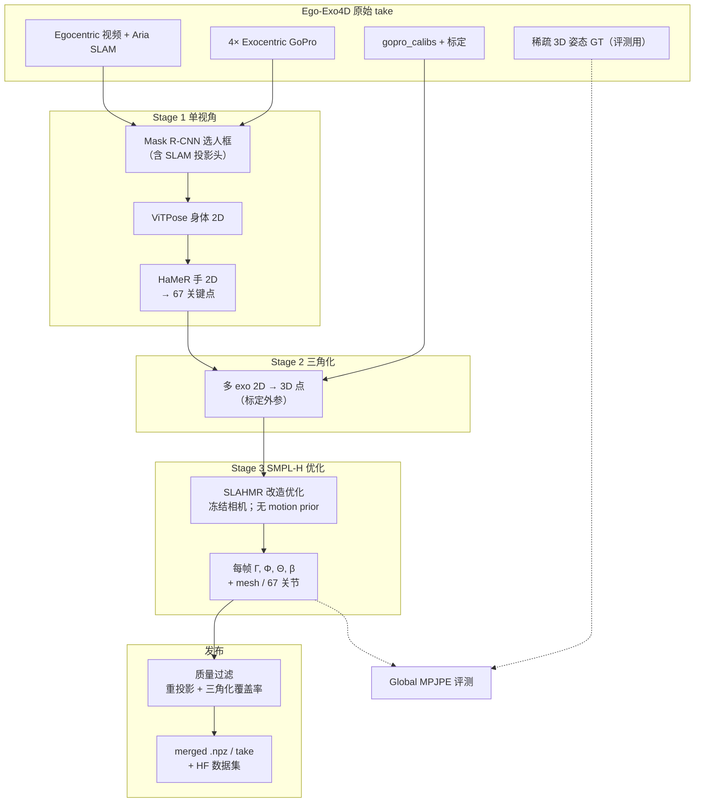
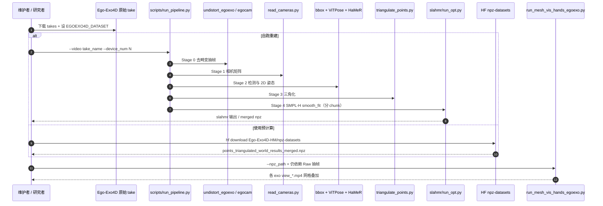

# Ego-Exo4D-HM

**Ego-Exo4D Human Meshes Dataset: 4D Human Motion Reconstruction for Ego-Exo Captures**（Maddukuri & Pavlakos, UT Austin）回答一个具身数据里的中间问题：Ego-Exo4D 已有大量 **同步 ego + 多 exo** 技能视频，但原始包只带 **稀疏** 3D 人体姿态；要把「人眼前画面」和 **稠密、带手、度量世界系** 的身体运动对齐，需要一条可复现的重建管线。作者改造 **SLAHMR**，批量产出 **Ego-Exo4D-HM** 并开源代码与 Hugging Face 预计算结果。

## 一句话定义

Ego-Exo4D-HM 给 Ego-Exo4D 录像补了一份「动作说明书」：在同步标定多视角上重建 **SMPL-H 4D mesh/关节**（2,649 段、104.59 小时运动），让人类第一/第三视角视频与三维身体+手部运动一一对应，供模仿学习、重定向与世界模型复用——**不等于**机器人看了就能直接学会任务。

## 英文缩写速查

| 缩写 | 英文全称 | 简要说明 |
|------|----------|----------|
| HM | Human Meshes | 本数据集：SMPL-H 网格与参数化运动序列 |
| SMPL-H | SMPL with Hands | 带 MANO 手的参数化人体模型（本工作输出表示） |
| Ego-Exo | Egocentric + Exocentric | 佩戴者第一视角 + 固定/可穿戴外视角 |
| MPJPE | Mean Per-Joint Position Error | 关节位置平均误差；本文用 **global**（无对齐） |
| SLAHMR | Simultaneous Localisation and Human Mesh Recovery | Ye et al. CVPR 2023 基线；本管线在其上适配 Ego-Exo4D 标定 |
| HaMeR | Hand Mesh Recovery | Pavlakos et al. 手部 mesh/关键点估计模块 |

## 为什么重要

- **补齐 Ego-Exo4D 的「可学习 3D 层」**：原始语料适合视频理解与稀疏姿态评测；HM 层把 **全身+手** 的 4D 运动变成可直接喂给重定向、轨迹监督或 cross-view 对齐的中间产物（见 [具身数据金字塔](./paper-data-pyramid-embodied-manipulation.md) 的 Ego/Exo 层）。
- **多视角 + 标定 → 比单目 wild 更可控**：冻结 Ego-Exo4D 相机内外参与 Aria SLAM 头位置，wearer 检测与三角化在 **度量世界系** 下进行，利于与机器人工作空间或后续 [Human-as-Humanoid](./paper-human-as-humanoid.md) 式 IK 链对接。
- **开源可跳过自算**：HF **`Ego-Exo4D-HM/npz-datasets`**（2649 takes、~48GB）+ MIT 代码，降低重复跑 SLAHMR 的工程成本。
- **机器人语境要冷静**：论文 cite 人形 WBC、人视频策略、动作条件世界模型等方向，但 **本页贡献是数据与重建管线**，未报告「机器人照着视频学」的端到端策略实验——「能学多少」取决于重定向、动作空间对齐与任务定义（见 [motion-retargeting](../concepts/motion-retargeting.md)、[VLA](../methods/vla.md)）。

## 流程总览

## 源码运行时序图

生产入口与项目页 [Pipeline 文档](https://abhiram824.github.io/egoexo4d_human_meshes/pipeline.html) 对齐：`scripts/run_pipeline.py` 串联去畸变、相机、2D 姿态、三角化与 SLAHMR 优化；也可只消费 HF 预计算 npz 做渲染。

## 核心机制

### 1）问题设定：从「有视频」到「有 4D mesh」

- **输入：** Ego-Exo4D 单 take 的 ego + 多 exo 同步帧、GoPro/Aria 标定与（可选）官方 sparse 3D GT。
- **输出：** 时间序列 SMPL-H 参数 \((\Gamma_t, \Phi_t, \Theta_t, \beta)\) 与 67 3D 关节、可渲染 mesh；**相机参数固定**为数据集标定值，运动在 **Ego-Exo4D 度量世界系**。

### 2）Wearer 选择与 2D 证据

- 多 exo 帧常有路人；用 **Aria SLAM 头位置** 投影到各 exo 图，选包含该点的检测框作为 camera wearer。
- **ViTPose + HaMeR** 提供身体与手 2D 关键点，共 67 点，作为三角化与优化的 2D 项。

### 3）三角化 + SMPL-H 优化

- 多视角 2D 在标定下三角化为 3D 点，提供全局几何约束。
- 优化阶段沿用 SLAHMR 框架但 **去掉 motion prior**（三角化已约束轨迹）；shape \(\beta\) **每 take 一个**常量。

### 4）质量过滤与规模

| 指标 | 数值 |
|------|------|
| 初始处理视频 | ~3,200 |
| 剔除 takes | 551（17.1%） |
| **保留 takes** | **2,649** |
| **重建运动时长** | **104.59 h** |
| 对应多视角视频 | **522.96 h**（≈523 h，项目页概览） |

剔除条件：**>10%** 重投影样本 **>50 px**；或 **<50%** 关键点成功三角化。

## 数据集速查

| 字段 | 说明 |
|------|------|
| **命名** | Ego-Exo4D-HM |
| **上游** | [Ego-Exo4D](https://ego-exo4d-data.org/)（须单独申请/下载） |
| **HF 发布** | `Ego-Exo4D-HM/npz-datasets`，每 take `.../points_triangulated_world_results_merged.npz` |
| **npz 内容** | 优化 SMPL-H 参数、逐帧相机内外参、3D 关节与各视角 2D 重投影 |
| **活动** | 项目页概览：8 类活动（bike、cooking 等；pipeline 对 take 名启发式启用 Aria） |

## 实验与评测

对 Ego-Exo4D 官方 **3D 身体/手关键点 GT**，在 **global MPJPE**（无 Sim(3) 对齐）下：

| 部位 | Global MPJPE | 有 GT 的 takes |
|------|----------------|----------------|
| 身体 | **56.21 mm** | 845 |
| 手 | **51.59 mm** | 190 |

读法：厘米级世界系误差对 **可视化、粗重定向、跨视角对齐** 通常可用；对 **毫米级灵巧操作、力控接触** 仍可能不足，且过滤掉的 17% takes 说明管线并非处处可靠。

## 与其他工作对比

| 工作 | 设定 | 输出 | 机器人相关读法 |
|------|------|------|----------------|
| **Ego-Exo4D-HM** | 已发布 Ego-Exo4D take；离线批处理 | SMPL-H 4D + npz | **Indirect→Semi**：3D 说明书，需重定向/IK 才接策略 |
| [Ego-Exo4D 原始](https://ego-exo4d-data.org/) | 同步 ego+exo 视频 + 稀疏 3D GT | RGB + 稀疏姿态 | 视频理解 / 稀疏评测；HM 为其稠密扩展 |
| [Human-as-Humanoid](./paper-human-as-humanoid.md) | 同步 ego-exo + PrimeU | **60-DoF 机器人 action chunks** | 直接 VLA 监督；几何链比 HM 长 |
| [EgoExoMoCap](./paper-egoexomocap.md) | 在线多 HMD 互观测 | 实时 SMPL 序列 | 采集拓扑不同；非 Ego-Exo4D 批量重建 |

## 工程实践

| 项 | 建议 |
|----|------|
| **最快路径** | 下载 Ego-Exo4D + `hf download` npz → `run_mesh_vis_hands_egoexo.py` 质检叠加 |
| **自跑管线** | Ubuntu 22.04、CUDA devel、`git clone --recursive`、先 `export EGOEXO4D_DATASET` |
| **批处理** | `jobs.jsonl` + 多 GPU `filelock` 拉取；`--resume_stage` 或 sentinel 自动续跑 |
| **机器人下游** | 将 SMPL-H 轨迹经 [motion-retargeting](../concepts/motion-retargeting.md) 到目标人形/操作空间；ego 视频作观测、HM 作 **伪标签** 时需单独验证 Sim2Real 与 embodiment gap |
| **源码** | [sources/repos/egoexo4d-human-meshes.md](../../sources/repos/egoexo4d-human-meshes.md) |

## 局限与风险

- **绑定 Ego-Exo4D 生态**：不是「任意手机视频即插即用」；无原始 take 与标定则无法复现或渲染。
- **重建 ≠ 任务标签**：缺少物体 affordance、接触力、机器人关节角；接到策略仍需 IK/重定向与任务定义（对比 [Human-as-Humanoid](./paper-human-as-humanoid.md) 的 PrimeU 标签链）。
- **质量过滤仍留误差**：~5–6 cm global MPJPE 与 17% 丢弃率意味着长序列、严重遮挡或非常规姿态需人工筛 take。
- **计算与依赖重**：detectron2、HaMeR、SLAHMR 子模块与 CUDA 扩展；与轻量 ego-only 方法（如 [EgoExoMoCap](./paper-egoexomocap.md) 的在线 HMD 设定）场景不同。
- **机器人收益未证**：论文动机讨论人形与 VLA，但 **无** 在本数据集上训练/deploy 机器人策略的结果——「拍下人做事的视频机器人就能照着学吗？」→ **有了更对齐的 3D 说明书，但学会多少还要后续实验。**

## 结论

**Ego-Exo4D-HM 的价值是把 Ego-Exo4D 从「多视角活动视频库」推进到「带 SMPL-H 4D 监督的可复用层」，开源管线与 HF npz 降低重复重建成本，但机器人能否「照着学」仍取决于重定向、动作空间与任务评测，而非数据集单独成立。**

- 优先把 HM 当作 **Ego/Exo 层的 3D 中间表示**，与 [Ego4D](./paper-ego4d.md) 视频预训练、Human-as-Humanoid 式 **executable labels** 区分使用。
- 下游实验应报告 **take 筛选、MPJPE 分位、重定向误差** 而不仅是「用了 Ego-Exo4D」。
- 需要 **手–物精确接触** 时，51 mm 量级手部 global 误差可能不够，应结合物体 pose、力传感或真机遥操作数据。
- 工程上优先 **HF npz + 可视化** 做 take 质检，再决定是否自跑 pipeline 改模块。
- 与 [EgoExoMoCap](./paper-egoexomocap.md) 互补：后者偏 **在线分布式 HMD 动捕**；HM 偏 **已发布 Ego-Exo4D 批量离线重建**。
- 引用规模时用 **104.59 h 运动 / 2649 takes**，多视角 **~523 h 视频** 勿与运动时长混为一谈。

## 关联页面

- [Ego4D](./paper-ego4d.md) — 上游 egocentric 语料生态
- [Human-as-Humanoid](./paper-human-as-humanoid.md) — ego-exo 视频 → 人形可执行标签的下游范式
- [具身数据金字塔](./paper-data-pyramid-embodied-manipulation.md) — Ego/Exo 层在数据配方中的位置
- [Paper Notebooks · Human Motion](../overview/paper-notebook-category-14-human-motion.md) — 人体动作专题索引
- [EgoExoMoCap](./paper-egoexomocap.md) — 分布式 ego-exo **在线** 动捕（对比设定）

## 参考来源

- [egoexo4d_hm_arxiv_2609_30187.md](../../sources/papers/egoexo4d_hm_arxiv_2609_30187.md) — 论文策展摘录
- [egoexo4d-hm-abhiram824.md](../../sources/sites/egoexo4d-hm-abhiram824.md) — 项目页与开源核查
- [egoexo4d-human-meshes.md](../../sources/repos/egoexo4d-human-meshes.md) — 官方代码仓与 HF 数据

## 推荐继续阅读

- 项目文档：<https://abhiram824.github.io/egoexo4d_human_meshes/>
- Ego-Exo4D 官方：<https://docs.ego-exo4d-data.org/>
- arXiv PDF：<https://arxiv.org/pdf/2609.30187>
- Hugging Face 数据集：<https://huggingface.co/datasets/Ego-Exo4D-HM/npz-datasets>
