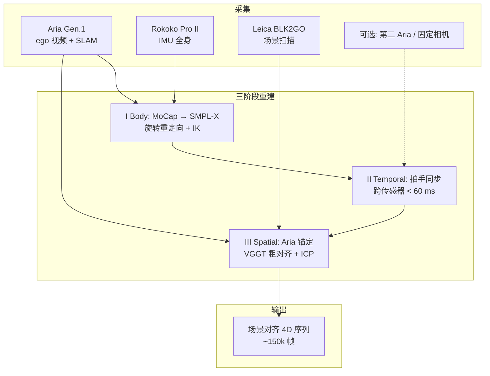

# EgoHTR：第一视角粗糙地形人–场景 4D 演示

**EgoHTR**（*EgoHTR: Egocentric 4D Demonstrations of Human Terrain Traversal*，arXiv:[2607.13472](https://arxiv.org/abs/2607.13472)，[项目页](https://egohtr.github.io)）由 **ETH Zürich** 联合 **Stanford、UC Berkeley、TU Munich** 提出：用可穿戴 egocentric 传感 + 便携 3D 扫描，在无结构粗糙地形上重建 **场景对齐** 的 4D 人体运动，填补「mimic 需要场景上下文、现有数据集偏平地/室内」的缺口，并在 Unitree G1 上验证感知 locomotion。

## 一句话定义

**面向 rough-terrain 的 egocentric 多传感器人–场景 4D 数据集与重建管线：厘米级场景对齐参考运动，服务 HMR 基准与人形感知穿越策略。**

## 英文缩写速查

| 缩写 | 英文全称 | 简要说明 |
|------|----------|----------|
| EgoHTR | Egocentric Human-Terrain Reconstruction | 本文数据集与重建管线总称 |
| HPS | Human Pose and Shape | 人体姿态与体型估计；本文作重建精度基准 |
| SMPL-X | Skinned Multi-Person Linear Model eXpressive | 参数化人体模型；输出姿态/形状序列 |
| MPJPE | Mean Per Joint Position Error | 关节位置平均误差（局部精度） |
| RTE | Root Translation Error | 根平移误差；衡量全局漂移 |
| PPO | Proximal Policy Optimization | G1 感知 mimic 策略训练算法 |
| SLAM | Simultaneous Localization and Mapping | Aria 提供闭环轨迹以锚定身体 |
| G1 | Unitree G1 Humanoid | 下游感知 locomotion 真机平台 |

## 核心信息

| 字段 | 内容 |
|------|------|
| **机构** | 苏黎世联邦理工（ETH Zürich）；斯坦福大学（Stanford）；加州大学伯克利分校（UC Berkeley）；慕尼黑工业大学（TU Munich） |
| **arXiv** | [2607.13472](https://arxiv.org/abs/2607.13472)（约 2026-07-15 预印本） |
| **规模** | **7** 场景 / **8** 被试 / **55** 序列 / **1.37 h** / ~**150k** 帧 @ 30 fps |
| **传感** | Aria Gen.1 + Rokoko Pro II + Leica BLK2GO（可选第二 Aria / 固定相机） |
| **下游** | HMR / 4D human-scene 基准；Unitree G1 感知全身跟踪 |
| **开源（截至 2026-07-21）** | **宣称将开源 / 待发布**：项目页 Dataset / Code 均为 *coming soon*；无公开下载或可运行仓 |

## 为什么重要

- **补 rough-terrain 人–场景数据缺口：** AMASS 等缺场景；PROX/RICH 偏室内；SLOPER4D 等偏结构化城市场景。EgoHTR 显式覆盖废墟、踏石、窄道、parkour 等高动态接触地形。
- **精度门槛有实证：** 根位置噪声消融表明 foothold-critical 任务约需 **≤5 cm** 级参考精度；>10 cm 训练崩溃——论证「单目重建不够、可穿戴+扫描有必要」。
- **采集管线可扩展：** 商用传感器组合、弃硬线 PPS，面向社区续采，而非一次性实验室 mocap。
- **与重定向栈衔接清晰：** Human2Robot 侧显式依赖 [OmniRetarget](./paper-hrl-stack-03-omniretarget.md)、[GMR](../methods/motion-retargeting-gmr.md)、CoACD。

## 数据集速查

| 维度 | EgoHTR |
|------|--------|
| **主体** | 人体（SMPL-X）+ **稠密场景 mesh/点云** |
| **表示** | 参数化身体 + ego/exo 视频/SLAM + 场景几何 + 可选 mocap GT |
| **任务侧重** | **粗糙地形穿越**、场景感知 mimic、4D 重建评测 |
| **预重定向** | 否（人体参考）；G1 侧另走 OmniRetarget/GMR 管线 |
| **许可 / 获取** | 以项目页为准；**截至入库日尚未开放下载** |
| **选型提示** | 要 **场景对齐 + rough terrain** 人演示 → 优先跟进 EgoHTR；要最大人体分布仍选 [AMASS](./amass.md)；要已重定向 G1 locomotion 选 PHUMA |

## 核心原理

### 采集与重建

1. **Body：** 22 主关节 MoCap 映射到 SMPL-X；手/脸固定；形状 β 序列内恒定。
2. **Temporal：** 开场拍手对齐音频/IMU；序列 ≤5 min 控漂移。
3. **Spatial：** 头–眼镜静态平移把身体放入 Aria 世界系；再 ICP 配准到扫描场景世界系。

### 感知 locomotion 下游

- 按 clip 训独立专家（PPO）；观测含 yaw 对齐 **地形高度扫描**。
- 除姿态/末端跟踪奖励外，加 **时间脚接触奖励**，避免稀疏地形上「脚悬空却距离很小」的退化解。
- 参考精度：高斯噪声注入显示 **σ≈0.05 m** 可容忍，**>0.1 m** 不可训——与单目全局误差量级对照。

## 评测要点

| 维度 | 结果（论文报告） |
|------|------------------|
| **局部 HPS** | MPJPE **73.2 mm**；PA-MPJPE **54.3 mm**（mocap GT 子集） |
| **相对人–场景基线** | 较 SLOPER4D 局部误差略低，且动作/地形更难（parkour、翻、粗糙地形） |
| **全局** | 报告 W-MPJPE / WA-MPJPE / RTE（强调全局漂移可见） |
| **mimic 消融** | 脚接触奖励在 stepping stones 上提高成功率并加速收敛 |
| **参考噪声** | 根平移噪声 **>0.1 m** 使训练崩溃；约 **0.05 m** 仍可训 |
| **真机** | Unitree G1 上 beam / box-up 等原子技能部署演示 |

## 结论

**Rough-terrain 人形 mimic 需要厘米级场景对齐的人–地形 4D 参考；单目全局误差常超 foothold 容忍窗，可穿戴+扫描管线有必要。**

1. **数据定位** — **55** 序列 / **1.37 h** / ~**150k** 帧，覆盖废墟/踏石/窄道/parkour；补 AMASS 无场景、PROX/RICH 偏室内的缺口。
2. **精度门槛** — 根平移噪声约 **≤0.05 m** 可训，**>0.1 m** 崩溃；对应 foothold-critical 约 **≤5 cm** 参考需求。
3. **重建三阶段** — MoCap→SMPL-X、拍手同步（<60 ms）、Aria 锚定 + ICP 到 BLK2GO 场景。
4. **局部 HPS** — mocap GT 子集 MPJPE **73.2 mm**、PA-MPJPE **54.3 mm**；动作/地形难于 SLOPER4D 类城市场景。
5. **下游 mimic** — 高度图条件 PPO + 时间脚接触奖励，避免稀疏地形「脚悬空却距离很小」；G1 有 beam/box-up 等演示。
6. **开源按待发布管** — Dataset/Code 项目页 *coming soon*；规模适合基准/fine-tune，不宜单独撑 foundation 预训练。

## 对比定位

| 对照 | EgoHTR 差异 |
|------|-------------|
| [AMASS](./amass.md) | AMASS 规模大但 **无场景**；EgoHTR 小但 **场景对齐 + rough terrain** |
| SLOPER4D / PROX / RICH | 偏城市场景或室内；EgoHTR 强调 **废墟/踏石/高动态** 与 egocentric 主传感 |
| 单目人–场景重建（VisualMimic / MeshMimic 等） | 全局误差常超 foothold 容忍窗；EgoHTR 用 Aria SLAM + 扫描锚定厘米级 |
| [RPL](./paper-rpl-robust-humanoid-perceptive-locomotion.md) | RPL 侧重点是 **深度策略栈**；EgoHTR 是 **人演示数据与重建管线** |
| [OmniRetarget](./paper-hrl-stack-03-omniretarget.md) | OmniRetarget 是 Human2Robot **重定向上游**；EgoHTR 消费其能力生成 G1 参考 |

## 源码运行时序图

**不适用**（截至 2026-07-21）：[项目页](https://egohtr.github.io) Dataset / Code 均标 *coming soon*；GitHub org 仅有站点仓 [`egohtr/egohtr.github.io`](https://github.com/egohtr/egohtr.github.io)，无可辨识的训练/重建入口，无法绘制可复现运行时序。开放后应在 `sources/repos/` 补档并补本图。

## 工程实践

| 项 | 建议 |
|----|------|
| **选型** | 需要 **人–地形耦合参考**（踏石/梁/废墟）时纳入候选；勿与纯人体 AMASS 混为一谈 |
| **精度预期** | 局部 MPJPE ~73 mm / PA-MPJPE ~54 mm（mocap GT 子集）；关注全局 W-/WA-MPJPE 与 RTE |
| **上机路径** | 等数据放出 → OmniRetarget/GMR 重定向到 G1 → 加接触奖励的 mimic PPO → 高度图条件策略 |
| **开源跟进** | 定期复查项目页按钮是否变为有效 URL；勿假设「论文写 open-source」即可复现 |
| **源码运行时序图** | **不适用**（原因见上节） |

## 局限与风险

- **规模：** 1.37 h 适合基准与 fine-tune，不足以单独撑大规模 foundation 预训练。
- **场景假设：** 静态环境、无关节物体；手部跟踪未并入身体模型；无事后联合人–场景优化。
- **硬件失败模式：** 无特征环境、高加速机动可能击穿定位。
- **开放风险：** **数据与代码尚未公开**；选型与复现计划须按「待发布」管理，避免阻塞工程排期。

## 关联页面

- [人形参考运动与操作数据集选型](../comparisons/humanoid-reference-motion-datasets.md) — 与 AMASS / PHUMA 等对照的 rough-terrain 缺口
- [AMASS](./amass.md) — 大规模无场景人体 MoCap 元库对照
- [Locomotion](../tasks/locomotion.md) — 感知穿越下游任务
- [Terrain Adaptation](../concepts/terrain-adaptation.md) — 地形适应概念层
- [Motion Retargeting](../concepts/motion-retargeting.md) / [GMR](../methods/motion-retargeting-gmr.md) — 人体→机器人映射
- [OmniRetarget](./paper-hrl-stack-03-omniretarget.md) — 项目页声明的场景感知重定向上游
- [RPL](./paper-rpl-robust-humanoid-perceptive-locomotion.md) — 挑战地形感知 locomotion 对照
- [Motion Data Quality](../concepts/motion-data-quality.md) — 接触/全局精度质量轴
- [Unitree G1](./unitree-g1.md) — 真机部署平台

## 参考来源

- [EgoHTR 论文摘录](../../sources/papers/egohtr_arxiv_2607_13472.md)
- [EgoHTR 项目页归档](../../sources/sites/egohtr-github-io.md)
- Brandes et al., *EgoHTR: Egocentric 4D Demonstrations of Human Terrain Traversal* — <https://arxiv.org/abs/2607.13472>
- 项目页：<https://egohtr.github.io>

## 推荐继续阅读

- 项目页方法与数据集浏览器：<https://egohtr.github.io>
- OmniRetarget（交互保留重定向）：<https://arxiv.org/abs/2509.26633>
- RPL（鲁棒人形感知 locomotion）：<https://arxiv.org/abs/2602.03002>
