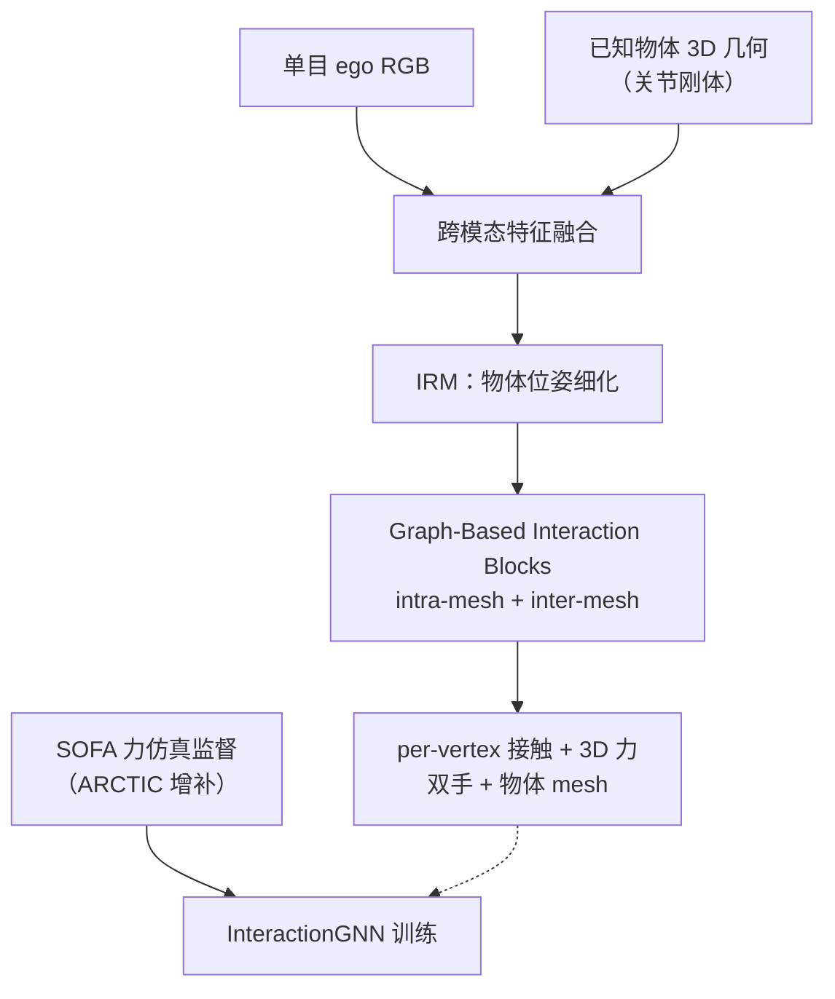
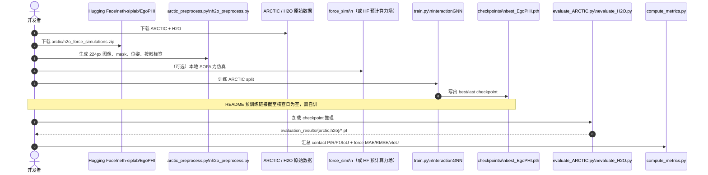

# EgoPHI：从 ego 视觉估计 3D 手–物接触与力

**EgoPHI**（*Estimating 3D Hand-Object Contact and Force from Egocentric Vision*，[arXiv:2608.13014](https://arxiv.org/abs/2608.13014)，[项目页](https://siplab.org/projects/EgoPHI)，**苏黎世联邦理工（ETH Zürich）SIPLAB**）提出首个从 **单目 egocentric RGB** 与 **已知物体 3D 几何** 联合估计 **双手与关节刚体物体 mesh 上稠密 per-vertex 接触与 3D 力分布** 的视觉模型。为弥补可扩展力真值缺失，作者用 **SOFA 物理仿真** 为 ARCTIC 生成力监督，并在 **H2O** 上做跨数据集泛化与 **自研透光真机物体** 上验证 sim-to-real。

## 一句话定义

**用 Graph-Based Interaction Blocks 在共享相机坐标系内对齐双手与物体 mesh，先 IRM 细化物体位姿，再预测 mesh 顶点级 3D 接触与力——把 ego HOI 从「接触定位」推进到「物理施力推理」。**

## 英文缩写速查

| 缩写 | 英文全称 | 简要说明 |
|------|----------|----------|
| EgoPHI | Egocentric Physical Hand Interaction | 本文方法：ego 视觉下的 3D 接触+力估计 |
| HOI | Hand–Object Interaction | 手–物交互理解 |
| IRM | Iterative Refinement Module | 迭代细化物体 3D 位姿以应对手部遮挡 |
| MANO | Skinned Multi-Person Linear Model | 手部参数化 mesh；评测使用 HAMER 等手部估计 |
| MAE | Mean Absolute Error | 力估计平均绝对误差（牛顿） |
| vIoU | Volumetric IoU | 3D 力/接触体积重叠指标 |
| SOFA | Simulation Open Framework Architecture | 用于生成 per-vertex 力监督的物理仿真框架 |

## 核心信息

| 字段 | 内容 |
|------|------|
| **机构** | 苏黎世联邦理工（ETH Zürich）；Sensing, Interaction & Perception Lab（SIPLAB） |
| **作者** | Andela Ilic, Rachel Schuchert, Yijing Jiang, Christian Holz |
| **出处** | ECCV 2026 |
| **arXiv** | [2608.13014](https://arxiv.org/abs/2608.13014) |
| **训练数据** | ARCTIC（物理仿真力标注） |
| **评测** | ARCTIC val（s05，域内）；H2O s4_ego（OOD）；真机 cube/cylinder（8 参与者） |
| **开源（截至 2026-09-13）** | **部分开源**：训练/评测/仿真/预处理 + HF 力标注与真机数据 **已发布**；README **预训练权重链接为空** |

## 为什么重要

- **超越接触定位：** 相同接触区域可对应不同施力方式（稳定抓握 vs 轻触 vs 按压）；力分布是 **物理交互理解** 的下一层信号，对机器人从人类示范学习、具身场景理解与辅助设备都有潜在价值。
- **3D mesh 级而非 2D 热图：** 相对 PressureVision 等图像空间方法，直接在 **双手+物体 mesh** 上预测力，可与物体几何、关节物体运动学对齐。
- **可扩展监督管线：** SOFA 仿真把现有 HOI 数据集升格为 **per-vertex 力标注**，缓解「力真值难采集」瓶颈。
- **sim-to-real 证据：** 仅用仿真力训练，在自研透光 instrumented 物体上仍恢复主要接触区与合理力幅（cube RMSE **1.54 N**，cylinder **3.24 N**）。

## 方法栈（核心结构）

| 阶段 | 模块 | 作用 |
|------|------|------|
| **1** | 视觉 + 几何特征提取 | ego RGB 与物体 mesh 跨模态融合 |
| **2** | **IRM** 物体位姿估计 | 在双手遮挡下细化物体 6D/关节位姿 |
| **3** | **Graph-Based Interaction Blocks** | 编码 mesh 内结构 + 手–物/手–手 inter-mesh 关系 |
| **输出** | per-vertex contact + 3D force | 双手与物体所有 mesh 顶点 |

### 流程总览

## 源码运行时序图

官方实现 [eth-siplab/EgoPHI](https://github.com/eth-siplab/EgoPHI)（归档见 [sources/repos/egophi.md](../../sources/repos/egophi.md)）提供完整训练/评测链路：

- **最短评测路径：** 预处理完成 → `evaluate_ARCTIC.py` + `EGOPHI_EVAL_MAX_SAMPLES` smoke → `compute_metrics.py`。
- **依赖：** `HACO_RELEASE`（共享 loss 工具）、HAMER 手部顶点（ARCTIC eval）、conda `environment.yml`。

## 工程实践

| 项 | 建议 |
|----|------|
| **数据** | 必下 ARCTIC + HF 力仿真 zip；H2O 仅评测也需预处理 |
| **训练** | `config.py` 用环境变量覆盖路径；先跑 `arctic_preprocess.py --help` 确认 stages |
| **权重** | README checkpoint 链接 **空** — 计划复现需预算 `train.py` 或关注官方更新 |
| **基线对照** | 2D：PressureVision；3D mesh：HACO（14 数据集预训练，非公平同训练集对比） |
| **真机数据** | HF `egophi_dataset.zip` 用于 sim-to-real 分析 |
| **开源状态** | **部分开源**（代码+数据齐全；预训练权重待补） |

## 评测与指标（摘要）

> 数字以 [项目页](https://siplab.org/projects/EgoPHI) / 论文为准。

### ARCTIC s05（域内，EgoPHI 仅 ARCTIC 训练）

| 模型 | 手部力 MAE [N] | 物体力 MAE [N] | 手部接触 F1 | 物体接触 F1 |
|------|----------------|----------------|-------------|-------------|
| HACO | 6.62 | — | .196 | — |
| EgoPHI w/o IRM | 4.80 | 5.01 | .057 | .038 |
| **EgoPHI** | **4.03** | **4.42** | **.190** | **.060** |

### H2O s4_ego（OOD）

| 模型 | 手部力 MAE [N] | 物体力 MAE [N] |
|------|----------------|----------------|
| HACO | 6.37 | — |
| **EgoPHI** | 5.16 | **3.88** |

### 真机 sim-to-real（仿真力监督 only）

| 物体 | 接触 F1 | 力 RMSE [N] |
|------|---------|-------------|
| cube | .151 | 1.54 |
| cylinder | .121 | 3.24 |

**2D 对比（投影手力）：** EgoPHI F1 **.271** vs PressureVision **.128**（ARCTIC）；OOD H2O F1 **.053** vs **.005**。

## 结论

**EgoPHI 把 ego 手–物理解从「哪里接触」推进到「施加多少 3D 力」，关键不只是多了一个力头，而是用 IRM + 图交互块把手–物几何关系对齐后再预测物理量。**

- 最硬的证据是 **mesh 级 3D 力 MAE 优于 HACO/PressureVision**，且在 **H2O OOD** 与 **真机透光物体** 上仍保留空间一致的接触区与合理力幅——说明仿真力监督可部分迁移到真实交互。
- **IRM 与 3D 对齐是主增益来源**：去掉 IRM 后 ARCTIC 接触 F1 从 .190 跌至 .057，印证「先对齐物体位姿再估计力」的必要性。
- 适用边界：**测试时需要物体几何**（非纯 image-only）；关节刚体设定；预训练权重链接截至入库日 **未提供**，工程落地需自训或等待官方 checkpoint。
- 对机器人读法：可作为 **人类示范的物理层标注器**（接触+力），与 [InterPrior](./paper-interprior.md) 等 **全身 HOI 控制**、[WiLoR](../methods/wilor.md) 等 **手部 mesh 重建** 形成「感知 → 物理推理 → 策略」链条的上游模块。
- 开放问题：未知物体几何、动态非刚体、与触觉传感器融合与实时 onboard 推理。

## 常见误区或局限

- **误区：** 把 2D 力热图论文分数与 EgoPHI 3D mesh 指标直接横比——协议与投影方式不同。
- **误区：** 以为克隆仓库即可零样本推理——需 ARCTIC 预处理、HF 力场与（目前缺失的）官方 checkpoint。
- **局限：** 输入含 **已知物体 mesh/几何**；真机评测仅两种简单几何体、8 人规模。
- **局限：** HACO 使用更多预训练数据，表格对照需注意 **训练集范围** 差异。

## 与其他工作对比

| 对照对象 | EgoPHI 的差异 |
|----------|----------------|
| **PressureVision** | 2D 图像空间手力；EgoPHI 在 **3D mesh** 上预测双手+物体力 |
| **HACO** | 3D mesh 接触/重建路线；EgoPHI 增加 **力分布** 与 **SOFA 仿真监督** |
| **WiLoR / HAMER** | 手部 mesh 重建；EgoPHI 在其之上做 **手–物相对位姿与力** |
| **InterPrior** | 仿真全身 HOI **控制**；EgoPHI 是 ego **感知侧** 接触/力估计 |
| **EgoExoMoCap** | 同 SIPLAB ego 人体动捕线；EgoPHI 聚焦 **手–物物理交互** 而非全身轨迹 |

## 关联页面

- [Awesome Egocentric Vision](./awesome-egocentric-vision.md) — ego 视觉论文策展入口
- [接触丰富操作](../concepts/contact-rich-manipulation.md) — 力/接触在操作中的角色
- [模仿学习](../methods/imitation-learning.md) — 人类示范物理标注语境
- [Manipulation](../tasks/manipulation.md) / [双臂操作](../tasks/bimanual-manipulation.md)
- [WiLoR](../methods/wilor.md) — 手部 mesh 重建相关基线生态
- [EgoExoMoCap](./paper-egoexomocap.md) — 同实验室 ego 感知项目

## 推荐继续阅读

- 论文 PDF：[arXiv:2608.13014](https://arxiv.org/pdf/2608.13014)
- 项目页：[siplab.org/projects/EgoPHI](https://siplab.org/projects/EgoPHI)
- 代码：[github.com/eth-siplab/EgoPHI](https://github.com/eth-siplab/EgoPHI)
- 数据：[Hugging Face eth-siplab/EgoPHI](https://huggingface.co/datasets/eth-siplab/EgoPHI)
- ARCTIC 数据集：[github.com/zc-alexfan/arctic](https://github.com/zc-alexfan/arctic)

## 参考来源

- [EgoPHI 论文摘录](../../sources/papers/egophi_arxiv_2608_13014.md)
- [EgoPHI 项目页归档](../../sources/sites/egophi-siplab.md)
- [EgoPHI 仓库归档](../../sources/repos/egophi.md)
