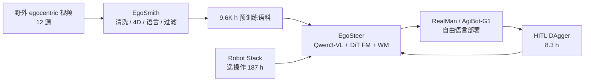
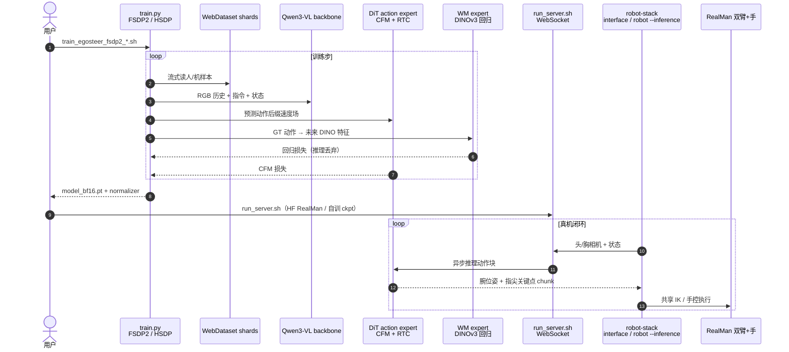

# EgoSteer：从 Egocentric 视频到可操控双灵巧手全栈

**EgoSteer**（*A Full-Stack System Towards Steerable Dexterous Manipulation from Egocentric Videos*，[arXiv:2607.09701](https://arxiv.org/abs/2607.09701)，[项目页](https://egosteer.github.io/)）由 **北京大学人工智能研究院**、**PKU–PsiBot Joint Lab** 与 **宾夕法尼亚大学** 提出：把 **野外 egocentric 人视频策展**、**统一遥操作 / HITL 纠偏栈** 与 **世界模型增强的 flow-VLA** 合成一条可开源复现的全栈，面向 **自由语言可操控（steerable）双灵巧手操作**。

## 一句话定义

**用 EgoSmith 把嘈杂 egocentric 视频洗成 9.6K 小时语言–动作对齐语料，再经统一 Robot Stack 做真机后训练与 DAgger，训出带训练期世界专家与 RTC 的 flow-VLA，使双灵巧手能跟随自由指令并 few-shot 迁到长程任务。**

## 英文缩写速查

| 缩写 | 英文全称 | 简要说明 |
|------|----------|----------|
| VLA | Vision-Language-Action | 视觉–语言–动作统一策略；本文用 Qwen3-VL + DiT 动作专家 |
| WM | World Model | 训练期预测动作诱导未来 DINOv3 特征的专家头 |
| RTC | Real-Time Chunking | 训练期动作前缀条件，部署时掩盖异步推理停顿 |
| CFM | Conditional Flow Matching | 动作块流匹配损失 |
| DAgger | Dataset Aggregation | 策略失败态由人接管纠偏并回灌 |
| HITL | Human-in-the-Loop | 脚踏相对运动映射的在线干预 |

## 核心信息

| 项 | 内容 |
|----|------|
| **机构** | 北京大学（PKU）；灵巧智能（PsiBot）联合实验室；宾夕法尼亚大学（UPenn） |
| **骨干** | Qwen3-VL-2B + DiT flow-matching 动作专家（约 **3B** 发布权重） |
| **人侧预训练** | EgoSmith 策展 **9.6K h**（12 源；2.09M episodes） |
| **机侧后训练** | **187 h / 193 任务** 遥操作 + **3 轮 DAgger（8.3 h）** |
| **开源** | 三仓 Apache-2.0 + HF Base/RealMan；**全量处理后数据集待发**（截至 2026-07-23） |

## 为什么重要

- **把「可操控」落到双灵巧手：** 相对多数自由语言 VLA 仍偏夹爪，本文在杂乱桌面 **40+** 任务上报告约 **75%** 平均成功率，并展示失败恢复、细粒度灵巧与组合/未见泛化。
- **全栈而非单点模型：** 数据吞吐（相对 HaWoR **~9×**）、相对运动 HITL、训练基建（8×A800 **~44.5% MFU**）与部署 RTC 被当作 **共依赖组件** 一并开源。
- **人视频先验的 few-shot 证据：** 折盒 / 开蛋糕盒等长程任务上，**120–200** 条目标具身演示可达 **75+%**，同数据 DP / IMLE / scratch 为 **0%**——与 [EgoScale](../methods/egoscale.md) 的规模叙事互补，更强调 **策展质量 + DAgger 天花板**。

## 核心原理

### 三模块分工

| 模块 | 角色 |
|------|------|
| **EgoSmith** | 预过滤 → HaWoR+DPVO+Any4D 度量 4D → 五级语言标注 → 多层后过滤 → WebDataset |
| **Unified Robot Stack** | SynGlove + Vive 遥操作；同一 FK/IK 节点服务推理；脚踏相对映射 HITL（handover >85%） |
| **EgoSteer** | 相机系相对腕 SE(3)+指尖关键点动作块；CFM；训练-only DINOv3 WM expert；训练期 RTC |

### 流程总览

### 源码运行时序图

对齐 [`egosteer/egosteer`](https://github.com/egosteer/egosteer) README：`train.py` 训练与 `run_server.sh` 服务；真机侧见 [`egosteer/robot-stack`](https://github.com/egosteer/robot-stack)。

复现路径：装训练/推理环境 → 下 HF `EgoSteer-3B-Base` 或 `…-RealMan` →（可选）EgoSmith 自建数据 → `compute_norm_stats.sh` → 训练或直接 `run_server.sh` + robot-stack `interface`。

## 工程实践

| 项 | 要点 |
|----|------|
| **开源边界** | **代码+权重+示例数据已开源**；**9.6K h / 187 h 处理后全量数据待 HF 发布**（入库日核实） |
| **权重选型** | 自有数据微调用 **Base**；RealMan 开箱部署用 **RealMan** |
| **动作空间** | 双腕相对 SE(3) + 双手指尖关键点（统一人–机格式） |
| **部署** | 策略 WebSocket 服务 + robot-stack ROS 2 客户端；训练期 RTC 消除执行停顿 |
| **基建** | WebDataset 流式 I/O、`torch.compile`、FlexAttention；多节点需共享路径与 pdsh SSH |

## 实验要点（摘要级）

> 数字以 [arXiv:2607.09701](https://arxiv.org/abs/2607.09701) 为准。

| 设定 | 要点 |
|------|------|
| **40 任务自由语言** | 总体约 **75%**；compositional **65%**；unseen **62%** |
| **DAgger** | 难任务 FT **22.5% → 62.5%**（仅 **8.3 h** 纠偏） |
| **基线（同机数据后训练）** | EgoSteer **74%** vs π₀.₅ **22%** / Being-H0.5 **39%** |
| **组件消融** | 去 WM / 去 RTC / 用噪声人数据均显著掉点 |
| **Few-shot 长程** | RealMan 折盒 **75%**；AgiBot-G1 开盒 **83%**；无预训练基线 **0%** |

## 结论

**可操控双灵巧手自由语言操作是全栈问题：EgoSmith 策展人视频 + 统一 HITL/DAgger 栈 + 世界模型增强 flow-VLA，缺一环都会掉点。**

1. **人侧规模靠策展** — EgoSmith 洗出 **9.6K h** 语言–动作对齐语料（相对 HaWoR 吞吐约 **~9×**）。
2. **机侧后训练+纠偏** — **187 h / 193** 任务遥操作 + **3** 轮 DAgger（**8.3 h**）；难任务 FT 约 **22.5%→62.5%**。
3. **40+ 自由语言任务** — 总体约 **75%**；compositional **65%**、unseen **62%**；同机数据下显著高于 π₀.₅ / Being-H0.5。
4. **Few-shot 长程靠人先验** — 折盒/开盒 **120–200** 条可达 **75+%**，同数据 DP/IMLE/scratch 为 **0%**。
5. **训练期组件别省** — 去 WM / 去 RTC / 用噪声人数据均显著掉点；RTC 掩盖异步推理停顿。
6. **开源边界** — 代码+权重+示例已发；全量处理后 9.6K h/187 h 数据待发；缺触觉，高灵巧受 DoF 差距限制。

## 与其他工作对比

| 对照对象 | EgoSteer 的差异 |
|----------|-----------------|
| **[EgoScale](../methods/egoscale.md)** | 同属大规模 egocentric 预训练 VLA；EgoScale 强调 **log-linear 缩放 + 视点对齐 mid-training**；EgoSteer 强调 **策展吞吐（EgoSmith）+ 统一 HITL 栈 + 训练-only DINOv3 WM**，并已开源全栈 |
| **[EgoWAM](./paper-egowam-egocentric-human-wam-co-training.md)** | EgoWAM 用可替换世界目标做 **人–机共训**；EgoSteer 把世界专家作 **辅助表征整形**（推理丢弃），主路径仍是显式腕–指动作监督 |
| **π₀.₅ / Being-H0.5** | 论文在同机数据设定下报告显著更高的指令跟随与执行精度；归因于统一动作表示、分辨率与部署优化 |
| **[T-Rex](./paper-trex-tactile-reactive-dexterous-manipulation.md)** | 同人视频预训练叙事；T-Rex 补 **触觉 mid-training**；EgoSteer 明确缺触觉为局限 |

## 局限与风险

- **误区：** 以为 HF 已有全量 9.6K h 数据——截至入库日 **datasets 仍空**，仅示例包与模型权重可下。
- **误区：** 忽略 RTC / 相对动作约定——消融显示无训练期 RTC 会在接触丰富任务上因抖动失败。
- **局限：** 机器人 DoF 与人手差距限制高灵巧迁移；全栈无触觉；未见任务仍依赖更大预训练覆盖。
- **开源边界：** **部分开源**（代码+权重已发；处理后全量数据待齐）。

## 关联页面

- [VLA（Vision-Language-Action）](../methods/vla.md) — 人视频预训练与 flow-VLA 路线索引。
- [EgoScale](../methods/egoscale.md) — 同族人视频规模预训练对照。
- [EgoWAM](./paper-egowam-egocentric-human-wam-co-training.md) — WAM 世界目标与人–机共训对照。
- [DAgger](../methods/dagger.md) — HITL 纠偏理论与工程闭环。
- [Teleoperation](../tasks/teleoperation.md) — 手套 / Vive 遥操作采集背景。
- [Manipulation](../tasks/manipulation.md) — 灵巧操作任务总览。
- [VLA 开源复现景观](../overview/vla-open-source-repro-landscape-2025.md) — 开源栈选型入口。

## 参考来源

- [EgoSteer 论文摘录（arXiv:2607.09701）](../../sources/papers/egosteer_arxiv_2607_09701.md)
- [EgoSteer 项目页归档](../../sources/sites/egosteer-github-io.md)
- [egosteer/egosteer 仓库归档](../../sources/repos/egosteer.md)
- [egosteer/egosmith 仓库归档](../../sources/repos/egosmith.md)
- [egosteer/robot-stack 仓库归档](../../sources/repos/egosteer-robot-stack.md)

## 推荐继续阅读

- 论文 PDF：<https://arxiv.org/pdf/2607.09701>
- 官方项目页：<https://egosteer.github.io/>
- 策略仓：<https://github.com/egosteer/egosteer>
- EgoSmith：<https://github.com/egosteer/egosmith>
- Robot Stack：<https://github.com/egosteer/robot-stack>
- HF 权重：<https://huggingface.co/EgoSteer/EgoSteer-3B-Base>
