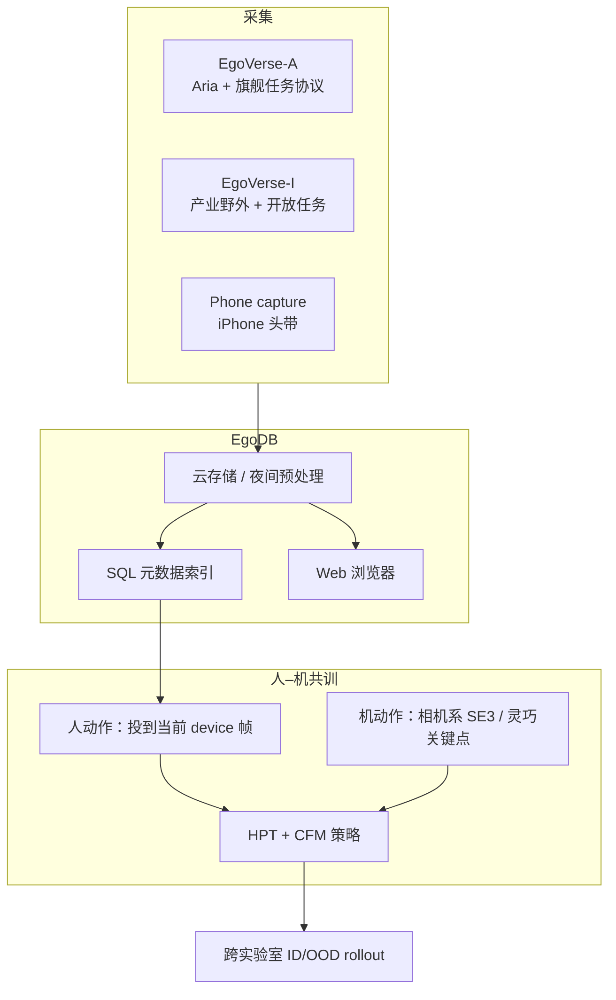
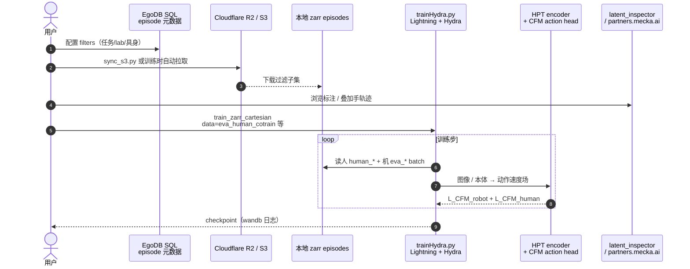

# EgoVerse（Egocentric 人类数据集 · 联盟级人→机迁移）

**EgoVerse**（*An Egocentric Human Dataset for Robot Learning from Around the World*，[项目页](https://egoverse.ai/)，[arXiv:2604.07607](https://arxiv.org/abs/2604.07607)）由 **佐治亚理工学院（Georgia Tech）** RL² 等学术实验室与 Meta / Mecka / Scale 等产业伙伴共建：把 egocentric 人类示教做成 **可持续摄入的活数据集**，并用 **跨实验室、跨具身** 协议回答「人数据何时真正帮到机器人」。

## 一句话定义

**用联盟式采集 + EgoDB 统一接入，持续扩大带手/头位姿与语言标注的第一人称人示教；并在多机器人上证明：人–机协同训练能涨分，但有效缩放依赖域对齐人数据锚定，场景多样性在有限预算下比堆同场景密度更关键。**

## 英文缩写速查

| 缩写 | 英文全称 | 简要说明 |
|------|----------|----------|
| Ego | Egocentric | 第一人称头戴/眼镜视角采集 |
| EgoDB | EgoVerse Database | 云端摄入、统一格式与 SQL 元数据接入系统 |
| BC | Behavior Cloning | 本文主线：人–机联合行为克隆 / CFM 共训 |
| CFM | Conditional Flow Matching | 动作头训练目标；人机分批求和 |
| HPT | Heterogeneous Pretrained Transformer | 具身 stem + 共享 Transformer 的跨具身骨干 |
| OOD | Out-of-Distribution | 未见物体/场景的分布外评测 |
| ID | In-Domain | 与机器人训练布局匹配的域内评测 |
| MPS | Machine Perception Services | Aria 侧跟踪与 egomotion 服务（学术采集） |

## 为什么重要

- **把「采一版就停」改成活数据生态：** EgoVerse-A 保证跨实验室可复现协议，EgoVerse-I 用产业野外吞吐补任务与场景长尾；相对 Ego4D 等通用活动集，明确服务 **可执行操纵向** 标注（手关键点、相机位姿、子任务语言）。
- **首次在标准化跨实验室设定下复现人–机共训增益：** 最高约 **+30%** ID/OOD；结论不只绑在单一硬件上（ARX5 双臂变体 + Unitree G1 灵巧手）。
- **给缩放预算可操作判据：** 「加更多野外人小时」**不等于**自动变好——需要 **域对齐人数据** 作锚；有限预算下优先扩 **场景** 往往优于同场景堆密度。
- **下游生态已接上：** [EgoWAM](./paper-egowam-egocentric-human-wam-co-training.md) 把 EgoVerse 野外人数据用作 WAM 共训的第三源；HumanNet Table 1 将其标为 **Direct** 档 egocentric 示教语料。

## 核心信息

| 项 | 内容 |
|----|------|
| **机构** | 佐治亚理工学院（Georgia Tech）；斯坦福大学（Stanford）；加州大学圣地亚哥分校（UC San Diego）；苏黎世联邦理工学院（ETH Zürich）；麻省理工学院（MIT）；Meta Reality Labs Research；Mecka AI；Scale AI |
| **规模（当前释放）** | **1,362 h**、**~80k** episodes、**1,965** tasks、**240** scenes、**2,087** demonstrators |
| **模态** | egocentric RGB + 双手 21 关键点 + 6-DoF 头/相机位姿 +（I 侧）稠密语言；可选深度 |
| **许可证 / 访问** | 代码 **MIT**；数据经浏览器 / SQL + R2 **受控开放**（需云凭证，非匿名全量镜像） |
| **适配形态** | 双臂平行爪（ARX5）与人形灵巧手（Unitree G1 + Inspire）共训评测；人侧统一 `human_*` embodiment |
| **重定向就绪度** | **手关键点级直接监督**（相机系 21 keypoints / EE 投影），**非**全身骨架→机器人关节的完整 motion retargeting 管线；共训靠分位数归一化与共享 ego stem |
| **双轨** | **EgoVerse-A**（Aria、标准旗舰任务、受控多样性）+ **EgoVerse-I**（产业野外、开放任务、稠密语言） |
| **开源** | 代码 **MIT 已开源**；数据受控同步（见工程实践） |

## 核心结构与方法

| 模块 | 作用 |
|------|------|
| **采集硬件** | 学术：**Project Aria**；产业：定制头戴/双目鱼眼；社区：**iPhone 头带** 轻量管线 |
| **帧级信号** | ego RGB + 双手 **21** 关键点 + **6-DoF** 头/相机位姿 |
| **Flagship Tasks（A）** | object-in-container、cup-on-saucer、bag-grocery、fold-clothes、scoop-granular、sort-utensils |
| **EgoDB** | S3 系存储 → 统一训练格式 → SQL 索引 → Web 浏览 → 本地过滤同步 |
| **策略骨干** | 共享 ego ResNet stem + 腕相机/本体专用 stem → Transformer → **flow matching** 动作解码 |
| **共训损失** | \(\mathcal{L}=\mathcal{L}_{\mathrm{CFM}}^{\mathrm{robot}}+\mathcal{L}_{\mathrm{CFM}}^{\mathrm{human}}\)；分位数归一化对齐特征 |

### 流程总览

### 源码运行时序图

对齐官方仓库 [GaTech-RL2/EgoVerse](https://github.com/GaTech-RL2/EgoVerse)：`egomimic/trainHydra.py` + `training.md` 中的 BC / 人–机共训配置。

复现路径：按 README 装 `uv`/`conda` 环境并配置云访问 →（可选）`sync_s3.py --filters …` → `cd egomimic && python trainHydra.py --config-name=train_zarr_cartesian`；共训改 `data=eva_human_cotrain model=hpt_cotrain_flow_shared_head`。**旧本地缓存若仍含 `aria_*`/`scale_*` embodiment 字符串需整库重下**（见仓库 changelog）。

## 工程实践

| 项 | 要点 |
|----|------|
| **开源边界** | **代码已开源（MIT）**；**数据受控开放**（浏览器 + SQL 过滤 + R2）；非无凭证全量镜像 |
| **训练入口** | `egomimic/trainHydra.py`；配置见 `hydra_configs/` 与 `training.md` |
| **数据约定** | `zarr.json` **强制** camera intrinsics；人具身统一 `human_*` |
| **可视化** | Web：`partners.mecka.ai/egoverse`；本地：`latent_inspector.py` |
| **贡献数据** | `CONTRIBUTING_DATA.md` + `embodiment_tutorial.ipynb` |
| **源码运行时序图** | 见上节（对齐官方训练/拉数路径） |

## 实验与评测

| 轴 | 报告口径（以论文为准） |
|----|------------------------|
| **机器人** | Robot A/B：双 ARX5（安装与动作维不同）；Robot C：Unitree G1 + Inspire 手 |
| **任务** | 四项代表旗舰（含单臂 / 双臂精细 / 长程装袋） |
| **协议** | 每方法 **20 ID + 20 OOD** rollout；子任务分项 → 归一化总分 |
| **共训主结果** | 加入 EgoVerse-A 后 ID/OOD 最高约 **+30%**；跨实验室大体一致 |
| **缩放消融** | 仅多样 EV 或仅域对齐人数据不足；**对齐锚定 + 多样 EV** 才出现正向缩放 |
| **多样性** | 演示者↑ → 未见演示者更好；场景↑ → 未见场景更好（有限预算下更关键） |
| **对照生态** | DINOv3 UMAP：EgoVerse-I 相对单实验室机器人数据显著扩视觉覆盖 |

## 结论

**EgoVerse 的真贡献是「可扩展的人数据基础设施 + 可复现的迁移判据」，而不是单点刷榜：共训能涨分，但缩放必须先有域对齐锚，场景多样性在紧预算下优先于同场景堆量。**

1. **活数据集双轨** — A 保协议复现，I 保野外规模与语言密度；统一手/头位姿接口服务策略学习。
2. **跨实验室共训增益可复现** — 最高约 **+30%**；个别具身若机器人演示策略偏离人示教，可能不涨甚至掉点。
3. **对齐是缩放开关** — 少量域对齐人数据锚定后，多样 EgoVerse 人数据才转化为正向缩放。
4. **多样性预算** — 演示者多样性抗「未见人」；场景多样性抗「未见环境」，有限小时更应扩场景。
5. **工程可读** — MIT 代码 + EgoDB/SQL/R2 管线已开；数据访问需云配置，留意 embodiment 折叠后的强制重下。
6. **选型对照** — 相对 [EgoScale](../methods/egoscale.md)（VLA 人视频预训练缩放）与 [HumanNet](./humannet.md)（百万小时互联网人视频），EgoVerse 更强调 **操纵向标注 + 联盟协议评测 + 人–机共训判据**。

## 与其他工作对比

| 工作 | 关系 |
|------|------|
| [EgoScale](../methods/egoscale.md) | 同为 Direct 档 egocentric；EgoScale 主线是 **万小时 VLA 预训练 + mid-training**，EgoVerse 主线是 **联盟数据集 + 共训缩放科学** |
| [HumanNet](./humannet.md) | 互联网级人中心语料；Table 1 将 EgoVerse 列为 **Direct** 示教行 |
| [EgoWAM](./paper-egowam-egocentric-human-wam-co-training.md) | 同实验室后续：固定骨干下换世界目标；**野外人数据来自 EgoVerse** |
| Ego4D / Ego-Exo4D | 通用活动理解；EgoVerse 强调 **机器人可执行操纵** 与迁移评测 |
| Open X-Embodiment / DROID | 机器人侧规模化；EgoVerse 主张用人数据补机器人采集瓶颈 |

## 局限与风险

- **算法覆盖面：** 论文主线是 BC/CFM **共训**，pretrain–finetune 等路线留给后续（如 EgoWAM）。
- **多样性消融指标：** 场景/演示者实验大量用 **离线 Avg-MSE**，外推到真机泛化需更多 rollout。
- **具身敏感：** 当机器人演示策略被迫偏离人示教时，共训可能无效甚至有害。
- **访问门槛：** 数据非「点一下就下完」；需云凭证与 SQL 过滤；changelog 要求旧缓存重下。
- **误区：** 把 EgoVerse 小时数与 EgoScale/HumanNet 小时数直接横比「谁更大谁更好」——标注密度、任务边界与评测协议不同。

## 关联页面

- [EgoWAM](./paper-egowam-egocentric-human-wam-co-training.md)
- [EgoScale](../methods/egoscale.md)
- [HumanNet](./humannet.md)
- [HumanNet Table 1：人类视频语料对照](../comparisons/humannet-table1-human-video-corpora.md)
- [Imitation Learning](../methods/imitation-learning.md)
- [Manipulation](../tasks/manipulation.md)
- [具身规模法则](../concepts/embodied-scaling-laws.md)
- [World Action Models](../concepts/world-action-models.md)
- [Ego 分类 01：数据采集](../overview/ego-category-01-data-collection.md)
- [Ego 分类 02：人→机器人](../overview/ego-category-02-human-to-robot.md)

## 参考来源

- [EgoVerse 论文摘录（arXiv:2604.07607）](../../sources/papers/egoverse_arxiv_2604_07607.md)
- [EgoVerse 项目页归档](../../sources/sites/egoverse-ai.md)
- [EgoVerse 官方仓库归档](../../sources/repos/egoverse.md)

## 推荐继续阅读

- [EgoVerse 项目页](https://egoverse.ai/)
- [arXiv:2604.07607](https://arxiv.org/abs/2604.07607)
- [GaTech-RL2/EgoVerse](https://github.com/GaTech-RL2/EgoVerse)
- [数据集浏览器](https://partners.mecka.ai/egoverse)
- [EgoWAM 项目页](https://gatech-rl2.github.io/egowam.github.io/) — 同生态后续 WAM 共训
