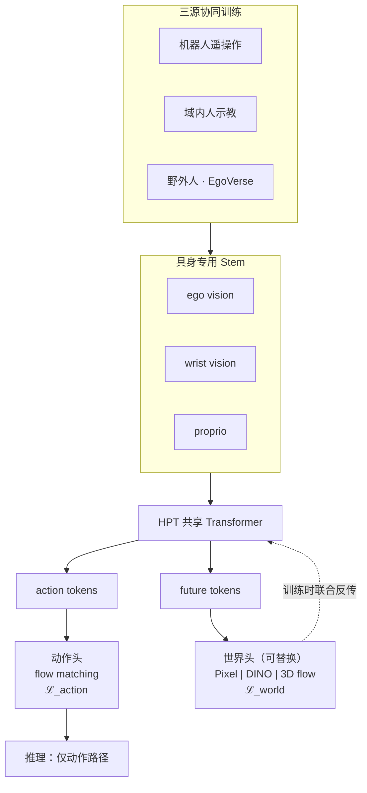

# EgoWAM（野外 Egocentric 人数据 · World Action Model 协同训练）

**EgoWAM**（*World Action Models Beyond Pixels with In-the-Wild Egocentric Human Data*，[项目页](https://gatech-rl2.github.io/egowam.github.io/)，佐治亚理工学院 **RL²** · Danfei Xu 组）提出：自我中心 **野外人数据** 虽丰富，但朴素 **BC 人–机协同训练** 常因 **具身差距** 反而 **损害** 性能；在 **固定策略骨干与数据配方** 下，仅改变 **世界预测分支的目标表征**，可系统检验 **WAM 动力学监督** 是否把人数据变成 **可扩展正监督**。

## 一句话定义

**用可替换的世界预测头（Pixel / DINO / 3D flow）在 HPT 上做人–机协同训练，让「场景将如何变」的监督筛掉不可迁移的人体态与头动，从而把野外 egocentric 人数据变成机器人策略的增益而非噪声。**

## 英文缩写速查

| 缩写 | 英文全称 | 简要说明 |
|------|----------|----------|
| WAM | World Action Model | 联合未来状态/观测预测与动作生成的具身策略 |
| BC | Behavior Cloning | 仅监督动作的模仿学习；本文主要负面对照 |
| HPT | Heterogeneous Pretrained Transformer | 具身专用 stem + 共享 trunk 的异构预训练 Transformer |
| OOD | Out-of-Distribution | 未见物体或场景的分布外泛化评测 |
| RAE | Reconstruction Autoencoder | DINO 世界头的重建式表征空间（项目页用语） |
| Ego | Egocentric | 第一人称视角采集的人或机器人观测 |

## 为什么重要

- **直面「人数据很多，但 BC 不一定更好」：** 可迁移的 **物体/场景/任务语义** 与不可迁移的 **人体形态、头动、行为风格** 在 BC 里纠缠；论文用 **受控消融**（只换世界目标）把 **表征选择** 从「堆更多小时」里 **单独拎出来** 讨论。
- **世界表征是下一根关键轴：** **Pixel** 迁移弱；**DINO** 驱动 **OOD 物体/场景**（最高约 **4×** 相对 BC）；**3D motion flow** 带来 **20–30%** **域内** 增益——说明 WAM 的价值不只在于「有没有世界头」，而在于 **预测什么空间的动力学**。
- **misalignment 鲁棒性有真机数字：** **故意未对齐** 人数据时，**BC** 可跌至 **robot-only 以下**（例：**40% → 20%**），**3D-Flow WAM** 仍 **75%**；对齐数据上 **3D Flow** 达 **85%** 且稳定——支持「**动力学共训** 抵抗错误动作监督、**对齐人数据** 作缩放飞轮」的判断。
- **与 VLA 人视频路线互补对照：** [EgoScale](../methods/egoscale.md) 走 **显式腕–手动作预训练 + 对齐 mid-training**；EgoWAM 走 **Joint WAM + 可替换世界目标**，不依赖把人动作直接当机器人监督，而靠 **未来状态预测** 对齐跨具身表征（UMAP 显示人机嵌入由分簇变为共享）。

## 核心结构与方法

| 模块 | 作用 |
|------|------|
| **Ego / Wrist / Proprio stem** | 具身专用编码，汇入共享 trunk |
| **共享 Transformer trunk** | 产出 **obs / action / future** 三类 token |
| **动作头（固定）** | **Conditional flow matching**；读 action tokens；推理唯一执行路径 |
| **世界头（可替换）** | 读 future tokens；在 **Pixel VAE / DINO RAE / 3D flow** 空间重建未来观测；训练时与动作头 **联合反传**，推理 **关闭** |
| **三源数据混合（固定配方）** | 机器人遥操作 + **域内人**（同场景物体、视点/行为不匹配）+ **野外人**（[EgoVerse](./paper-egoverse.md)） |

### 流程总览

### 有效世界目标的三个判据（论文假设）

1. **抽象外观** — 弱化像素级人体/纹理差异  
2. **跨具身一致的物理效应** — 保留物体与接触如何变化  
3. **分离 ego-motion 与环境变化** — 减少头部运动带来的虚假监督  

## 实验要点（索引级）

| 轴 | 报告口径（以项目页为准） |
|----|--------------------------|
| **平台** | **三项真实双臂** 操作任务（项目页 Data Gallery / Robot Demos） |
| **训练方案** | **Robot Only**、**+ In-Domain Human**、**+ EgoVerse（野外）** |
| **对照方法** | **BC**、**Pixel**、**Pixel-PT**、**DINO**、**3D Flow** |
| **主结论** | WAM 协同训练随野外人数据 **扩展优于 BC**；**DINO** **OOD** 最高约 **4×**；**3D flow** 域内 **+20–30%** |
| **对齐消融** | 未对齐人数据：**BC 20% < robot-only 40%**；**3D Flow 75%**；对齐：**3D Flow 85%** |
| **表征** | UMAP：**BC** 人机分簇 → **WAM（3D Flow）** 共享嵌入空间 |
| **数据生态** | 野外人数据来自 **[EgoVerse](./paper-egoverse.md)**（见 [HumanNet 对比表](../comparisons/humannet-table1-human-video-corpora.md) 中的 EgoVerse 行） |

## 结论

**野外 egocentric 人数据能否变增益，取决于世界预测目标空间（Pixel / DINO / 3D flow），而不是「加更多人视频 + BC」本身。**

1. **BC 人–机共训可负迁移** — 故意未对齐人数据时，BC 可跌至 **20%**（低于 robot-only **40%**）；同设定下 **3D-Flow WAM 仍 75%**，对齐数据上达 **85%**。
2. **世界表征分工明确** — **DINO** 驱动 OOD 物体/场景（最高约 **4×** 相对 BC）；**3D motion flow** 带来域内约 **+20–30%**；**Pixel** 在本设定下迁移弱。
3. **受控消融只换世界头** — 固定 HPT 骨干、动作头（flow matching）与三源数据配方；推理时世界头关闭，只走动作路径。
4. **有效世界目标三判据** — 抽象外观、跨具身一致的物理效应、分离 ego-motion 与环境变化；UMAP 显示 WAM（3D Flow）使人机嵌入由分簇变为共享。
5. **选型对照** — 相对 [EgoScale](../methods/egoscale.md) 的显式腕–手动作预训练，EgoWAM 靠未来状态预测对齐跨具身表征；截至 ingest arXiv/代码尚未公开，任务规模为三项双臂真机。

## 常见误区或局限

- **误区：** 认为「加更多人视频 + BC」必然提升；论文显示 **misaligned** 人数据可让 BC **差于纯机器人数据**，而 **WAM** 仍可利用 **对齐** 与部分 **未对齐** 数据。
- **误区：** 把任意 **video prediction loss** 等同于有效 WAM；关键是 **世界目标空间**——**Pixel** 在本设定下 **迁移弱**。
- **局限：** 截至 ingest **arXiv / 代码尚未公开**；任务规模为 **三项双臂真机**；与 **人形全身 loco-manip**（如 [MotionWAM](./paper-motionwam-humanoid-loco-manipulation-wam.md)）形态不同；**HPT** 细节以项目页为准；野外数据底座见已入库的 [EgoVerse](./paper-egoverse.md)。

## 与其他页面的关系

- [World Action Models（WAM）](../concepts/world-action-models.md) — Joint 族中 **人数据协同训练 + 世界目标消融** 的桌面/双臂实例
- [Imitation Learning](../methods/imitation-learning.md) — BC 与人数据缩放的基线语境与 **负迁移** 讨论
- [EgoScale](../methods/egoscale.md) — **VLA + 显式人动作标签** 的人视频缩放对照
- [EgoSteer](./paper-egosteer.md) — 训练-only DINOv3 世界专家 + 显式腕–指动作；对照「世界头作主监督」vs「世界头作表征整形」
- [Manipulation](../tasks/manipulation.md) — 双臂操作与人数据驱动策略任务族
- [MotionWAM](./paper-motionwam-humanoid-loco-manipulation-wam.md) — 同 WAM 范式、不同形态（人形实时 loco-manip）
- [DiT4DiT](./paper-dit4dit-video-action-model.md) — 双 DiT flow-matching WAM；EgoWAM 强调 **人–机共训与世界表征轴**
- [WAM-TTT](./paper-wam-ttt-human-video-test-time-steering.md) — **部署期** 人视频 TTT 记忆 steering；与 EgoWAM **训练期共训** 互补

## 关联页面

- [World Action Models（WAM）](../concepts/world-action-models.md)
- [Imitation Learning](../methods/imitation-learning.md)
- [Manipulation](../tasks/manipulation.md)
- [EgoScale](../methods/egoscale.md)
- [EgoSteer](./paper-egosteer.md)
- [HumanNet 人视频语料对比](../comparisons/humannet-table1-human-video-corpora.md)
- [EgoVerse](./paper-egoverse.md)

## 参考来源

- [EgoWAM 项目页摘录](../../sources/papers/egowam.md)
- [EgoSteer 论文摘录（对照）](../../sources/papers/egosteer_arxiv_2607_09701.md)
- [EgoVerse 论文摘录](../../sources/papers/egoverse_arxiv_2604_07607.md)

## 推荐继续阅读

- [EgoWAM 项目页](https://gatech-rl2.github.io/egowam.github.io/)
- [EgoVerse 论文实体](./paper-egoverse.md)
- [EgoVerse 项目页](https://egoverse.ai/)
- [World Action Models 概念页](../concepts/world-action-models.md)
- [EgoScale 方法页](../methods/egoscale.md) — VLA 人视频缩放对照
