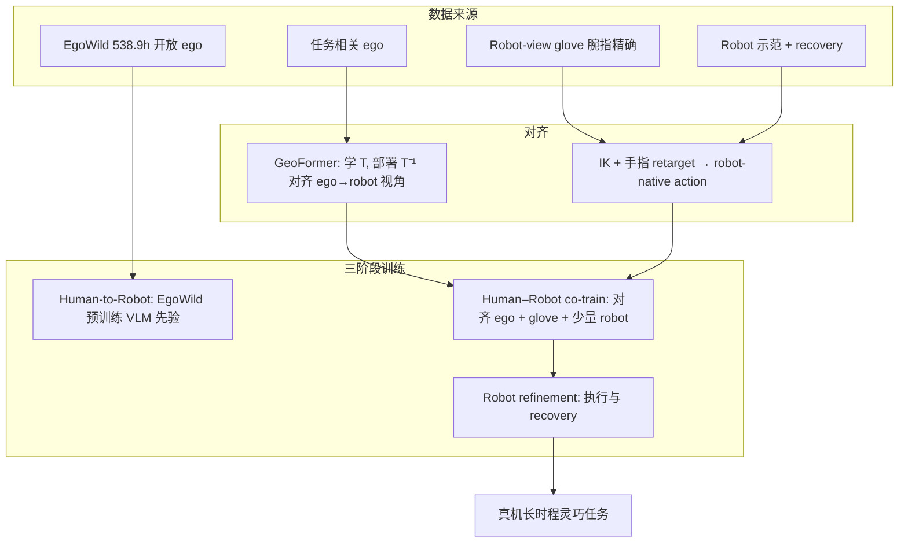

# EgoWild2Dex（arXiv:2609.23755）

**EgoWild2Dex**（*Learning Dexterous Robotic Manipulation from In-the-Wild Human Experience*，[arXiv:2609.23755](https://arxiv.org/abs/2609.23755)，[项目页](https://mmlab.hk/egowild2dex/)）由 **香港大学** 与 **Kinetix AI** 等提出：从 **未脚本化、野外第一视角** 人类行为中学习，经 **GeoFormer** 对齐动态 ego 与固定 robot 相机，再用 **渐进人–机训练** 把 broad human prior 压进 **双手灵巧 VLA**（flow-matching 动作头）。

## 一句话定义

**用 538.9 小时野外 ego 建先验，用轻量单应 warp 对齐视角，用 <1 小时/任务的 robot 示范完成长时程多指灵巧真机闭环。**

## 英文缩写速查

| 缩写 | 英文全称 | 简要说明 |
|------|----------|----------|
| VLA | Vision-Language-Action | 视觉–语言–动作策略；本文共享 VLM + action expert |
| FM | Flow Matching | 各训练阶段统一的动作生成目标 |
| IK | Inverse Kinematics | 将腕部位姿映射为臂关节命令 |
| EgoWild | In-the-wild egocentric dataset | 本文 538.9 h 野外双手数据集 |
| GeoFormer | Geometric Transformer | 学习 ego↔robot 单应 warp 的轻量网络 |
| OOD | Out-of-Distribution | 未见物体零样本评测 |

## 为什么重要

- **数据从 staged → in-the-wild：** 家庭、工厂、药店等 **原生 clutter** 与 **15.93°/s** 量级头动，逼模型学可迁移的操作模式而非桌面捷径。
- **灵巧 DoF 而非夹爪：** 面向 **多指协调** 的长时程（开箱、热胶、制冰），补 gripper-VLA 常见空白。
- **样本效率：** 每任务 **<1 h** robot 轨迹仍达 **96.7%** 平均成功率，强调 **对齐配方** 而非无限堆 robot teleop。
- **与 EgoDex 等互补：** [EgoDex](./paper-notebook-egodex-learning-dexterous-manipulation-from-larg.md) 偏大规模桌面 Vision Pro 轨迹；EgoWild2Dex 强调 **野外 + 真机闭环 + 视角/embodiment 双对齐**。

## 核心信息

| 项 | 内容 |
|----|------|
| **机构** | 香港大学（Ping Luo*）；Kinetix AI；Kunyang Lin† project lead |
| **arXiv** | [2609.23755](https://arxiv.org/abs/2609.23755) |
| **项目页** | <https://mmlab.hk/egowild2dex/> |
| **开源** | **待发布** — 论文：data / models / code will be released；项目页无 GitHub（2026-09-27 核查） |

### 流程总览

## 方法要点

### GeoFormer

- 无配对 ego/robot 图像，级联预测 **8 维单应残差**；训练时 warp robot 内容合成进 ego 帧（对抗 critic + 尺度/重叠正则）。
- 策略训练阶段 **冻结 GeoFormer**，对 ego 帧用 **\(T^{-1}\)** 得到接近 robot 固定相机的观测；相对 3D 投影+inpaint **约 21.9×** 更快。

### 渐进人–机训练

| 阶段 | 数据 | 作用 |
|------|------|------|
| 1 Human-to-Robot | 全量 EgoWild | 广域视觉–操作先验 |
| 2 Co-training | 任务 ego（GeoFormer 对齐）+ glove + 少量 robot |  grounding 到目标 workflow |
| 3 Robot refinement | Robot + recovery | 接触动力学与失败恢复 |

Stage 2/3 数据时长约为 Stage 1 的 **1.6% / 0.1%**（论文 Fig.1 口径）。

### EgoWild 数据集

- **538.9 h**，179,049 episodes，125,961 唯一任务描述，1,282 物体类。
- 2048×1536 第一视角视频 + 双手轨迹 + 原子/片段/技能级语言；校准追踪后指尖中位误差 **0.66 cm**。

## 评测

| 任务 | 要点 | 报告结果（论文/项目页） |
|------|------|-------------------------|
| Open-Box | 刀、割胶带、开四盖、取未知物 | 长时程子技能链 + 物体泛化 + 抗扰/自恢复 |
| Glue-Figure | 热胶枪、出胶、摆件 | 工具姿态 + 精细接触 |
| Ice-Water | 铲冰、杯对齐、出水 | 双物体协调 |
| **汇总** | 每任务 **<1 h** robot 示范 | 平均成功率 **96.7%** |
| 零样本物体 | 未见物体 | 平均 **33.3%** 物体级成功率 |
| 跨本体 | Tianji Marvin Pro 等 | 项目页 Cross-Embodiment 视频 |

## 结论

**野外 ego 可以当灵巧机器人主监督，但必须把「乱动的头载视角」和「人手 motion」同时翻译成 robot 相机 + robot-native 高 DoF 动作。**

- 先 **GeoFormer** 再共训，比让单一策略硬吃 ego/robot 混帧更省算力（21.9× vs project+inpaint）。
- **EgoWild 开放段 + 任务段 + glove + 极少量 robot** 的分阶段配方，比一步端到端更稳地收敛长时程灵巧链。
- **Flow-matching VLA** 作为统一骨架，使三阶段仅换数据与 schedule，而非换架构。
- 物体零样本 **33.3%** 说明泛化仍难，需与更多 robot recovery 或 on-policy 数据结合。
- 数据/代码 **待发布** 前，复现应跟踪 [项目页](https://mmlab.hk/egowild2dex/) 与 arXiv 更新。

## 源码运行时序图

**不适用**（截至 2026-09-27：官方未发布代码仓库；论文写明 data/models/code will be released）。

## 与其他工作对比

| 工作 | 相对 EgoWild2Dex |
|------|------------------|
| [EgoDex](./paper-notebook-egodex-learning-dexterous-manipulation-from-larg.md) | 829 h **桌面** Vision Pro 轨迹 + 手预测基准；**无** GeoFormer/真机长时程闭环配方 |
| [EgoVerse](../entities/paper-egoverse.md) | 联盟 **1,362 h** ego + 多实验室 **BC/CFM 共训**；强调共训缩放，非野外 clutter + 灵巧 VLA |
| [EgoWAM](../entities/paper-egowam-egocentric-human-wam-co-training.md) | **WAM 动力学** 分支缓解 misalignment；EgoWild2Dex 用 **GeoFormer + glove + 渐进 robot** |
| Gripper VLA / 遥操作 IL | 常见 **平行夹爪** 动作空间；本文 **高 DoF 手–臂** + flow-matching |

## 局限与风险

- **待发布资产：** 无 GitHub/HF 链时无法复现 GeoFormer 与 EgoWild 下载。
- **硬件绑定：** 真机结果为特定 **双手灵巧 + 固定 robot 相机** 工位；跨 [Marvin Pro](https://mmlab.hk/egowild2dex/) 需验证 retarget 与相机外参。
- **Glove 通道依赖：** co-training 仍要 **robot 视角 glove** 数据，非纯 ego→robot 零样本。
- **Wild 标注成本：** 125k 任务描述与追踪校准背后仍有大量采集与后处理工程。

## 关联页面

- [VLA](../methods/vla.md)
- [Motion Retargeting](../concepts/motion-retargeting.md)
- [流匹配与具身策略](../concepts/flow-matching-embodied-policy.md)
- [EgoDex](./paper-notebook-egodex-learning-dexterous-manipulation-from-larg.md)
- [双臂操作](../tasks/bimanual-manipulation.md)
- [跨本体迁移策略](../queries/cross-embodiment-transfer-strategy.md)

## 参考来源

- [egowild2dex_arxiv_2609_23755.md](../../sources/papers/egowild2dex_arxiv_2609_23755.md)
- [mmlab-egowild2dex.md](../../sources/sites/mmlab-egowild2dex.md)

## 推荐继续阅读

- arXiv：<https://arxiv.org/abs/2609.23755>
- 项目页：<https://mmlab.hk/egowild2dex/>
