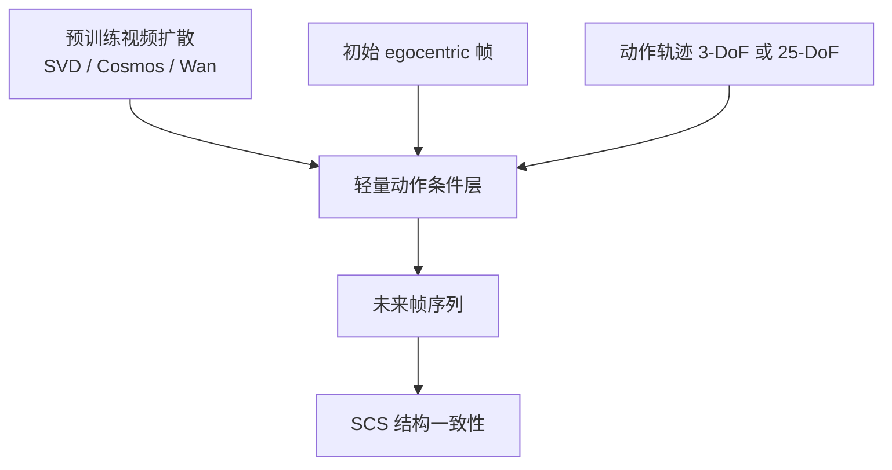
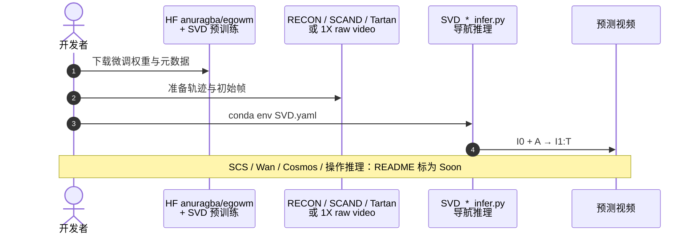

# EgoWM（Egocentric World Model from Internet Priors）

**EgoWM**（*Walk through Paintings: Egocentric World Models from Internet Priors*，ECCV 2026，[arXiv:2601.15284](https://arxiv.org/abs/2601.15284)）提出：不必从零训练机器人世界模型，而是给 **任意预训练视频扩散模型** 注入轻量动作条件层，把它变成可跟随电机命令的 egocentric 未来预测器。

## 一句话定义

**用互联网视频先验 + 轻量动作条件，把「看起来合理的未来」变成「随动作正确变化的未来」，并跨 3-DoF 移动到 25-DoF 人形关节空间。**

## 英文缩写速查

| 缩写 | 英文全称 | 简要说明 |
|------|----------|----------|
| EgoWM | Egocentric World Model | 本文方法名 |
| SCS | Structural Consistency Score | 与外观解耦的结构一致性指标 |
| SVD | Stable Video Diffusion | 已公开推理脚本的骨干之一 |
| DoF | Degrees of Freedom | 动作空间维度（3 / 25） |
| NWM | Navigation World Models | 主要对照基线族 |
| RGB | Red-Green-Blue | egocentric 视频观测 |

## 为什么重要

- **动作忠实度是视频 WM 的硬门槛：** 末端差几厘米可能对应抓空；只靠视觉先验容易生成「好看但不跟动作」的未来。
- **架构无关的改装路线：** 同一套 conditioning 叙事覆盖 SVD / Cosmos / Wan 等骨干，降低「每个骨干重训一套 WM」的成本。
- **在五路径图中属 ⑤：** 当前实验关注忠实度、结构一致性与跨环境泛化；**控制策略尚未用这些预测直接更新动作**（见[五路径](../overview/wam-motion-control-five-paths.md)）。

## 核心信息

| 项 | 内容 |
|----|------|
| **作者机构标签** | 卡内基梅隆大学（CMU）；伊利诺伊大学厄巴纳-香槟分校（UIUC）等（以 arXiv 作者单位为准） |
| **输入 → 输出** | 初始帧 \(I_0\) + 动作轨迹 \(A_{1:T}\) → 未来帧 \(I_{1:T}\) |
| **具身** | 3-DoF 移动；25-DoF 人形关节角（含 1X 验证集叙事） |
| **开源** | **部分开源**：[`miccooper9/egowm`](https://github.com/miccooper9/egowm) + HF `anuragba/egowm`；SVD **导航**推理已发布 |

## 核心原理

### 机制

1. **复用视频先验** — 冻结/微调大规模视频扩散，保留场景与外观泛化。  
2. **轻量动作条件** — 注入电机命令，使生成轨迹跟随动作而非文本糊弄。  
3. **跨动作空间缩放** — 从低维基座位姿到高维关节角驱动的 egocentric 动力学。  
4. **SCS 评测** — 衡量稳定场景元素是否随给定动作一致演化，减少「只看像素像不像」的偏差。

### 流程总览

## 源码运行时序图

官方仓当前以 **SVD 导航推理** 为主（训练与操作推理按 README 仍在补充）：

## 工程实践

| 步骤 | 要点 |
|------|------|
| 环境 | README：`conda env create -f SVD.yaml` |
| 权重 | 基座 SVD-XT + `anuragba/egowm` 动作微调 checkpoint |
| 3-DoF | RECON 等导航数据；与 NWM 对照 |
| 25-DoF | 1X 相关数据管线；关节角条件更难 |
| 调试指标 | 动作跟随、SCS、跨环境/绘画零样本观感 |

## 实验与评测

- 相对 Navigation World Models 等，**SCS 最高约 +80%**，推理延迟可低至约 **6×**（项目页/摘要口径）。  
- 定性：绘画场景零样本导航、作者自采真机图泛化、RECON 与 1X 验证集多骨干对比。  
- **尚未**报告「用 EgoWM 在线改写控制指令」的闭环增益——定位仍是预测器。

## 结论

**EgoWM 证明：互联网视频模型可以被「动作化」成 egocentric 世界模型，关键验收是结构随动作变，而不是画面好看。**

- 先看 **SCS / 动作忠实度**，再谈能不能进控制环。  
- 轻量 conditioning 比从零训更适合换骨干。  
- 25-DoF 关节条件显著难于 3-DoF 基座。  
- 开源按 README 分批；部署前核对导航 vs 操作脚本是否已到。  
- 与 [1XWM](./paper-1xwm-redwood-world-model.md) 互补：一个偏忠实预测，一个偏成功价值评测。

## 局限与风险

- 控制策略尚未闭环使用预测。  
- 部分脚本未齐，复现成本随骨干变化。  
- 画面连贯仍可能掩盖动作不忠实——必须用 SCS 类指标。

## 与其他工作对比

| 工作 | 相对 EgoWM |
|------|------------|
| [1XWM](./paper-1xwm-redwood-world-model.md) | 同为动作条件视频；1XWM 加成功价值头做评测 |
| [UniT](./paper-unit-unified-physical-language.md) | UniT 学共享动作语言；EgoWM 学像素未来 |
| NWM 等导航 WM | EgoWM 强调互联网先验改装与 SCS |

## 关联页面

- [WAM×运动控制五路径](../overview/wam-motion-control-five-paths.md)
- [Generative World Models](../methods/generative-world-models.md)
- [1XWM](./paper-1xwm-redwood-world-model.md)
- [Video-as-Simulation](../concepts/video-as-simulation.md)

## 参考来源

- [egowm_arxiv_2601_15284.md](../../sources/papers/egowm_arxiv_2601_15284.md)
- [egowm-github-io.md](../../sources/sites/egowm-github-io.md)
- [miccooper9_egowm.md](../../sources/repos/miccooper9_egowm.md)
- [wechat_embodied_ai_lab_wam_motion_control_five_paths.md](../../sources/blogs/wechat_embodied_ai_lab_wam_motion_control_five_paths.md)

## 推荐继续阅读

- [项目页](https://egowm.github.io/)
- [arXiv:2601.15284](https://arxiv.org/abs/2601.15284)
- [GitHub miccooper9/egowm](https://github.com/miccooper9/egowm)
