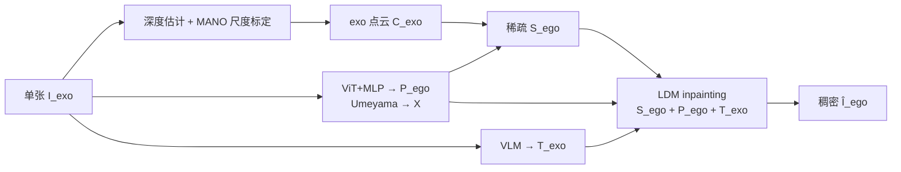
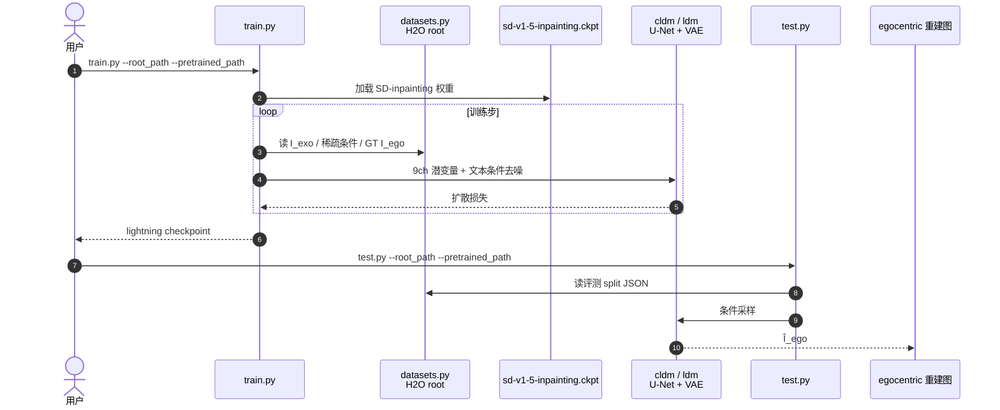

# EgoWorld（exo→ego 视图翻译）

**EgoWorld**（*Translating Exocentric View to Egocentric View using Rich Exocentric Observations*，[arXiv:2506.17896](https://arxiv.org/abs/2506.17896)，[项目页](https://redorangeyellowy.github.io/EgoWorld/)，[代码](https://github.com/redorangeyellowy/EgoWorld)）由 **LG Electronics AI Lab**、**KAIST** 与 **牛津大学 VGG** 提出，ICLR 2026：从**单张**第三人称图重建第一人称手物交互视图。

> **同名消歧：** 本文是 **exo→ego 生成方法**；[EgoWorld-100W](./egoworld-100w.md) 是 StellarNex 的 **百万级自中心操作数据集**，二者无关。

## 一句话定义

**用深度点云重投影得到的稀疏 egocentric RGB、ViT 回归的 3D 第一人称手姿，以及 VLM 文本，条件化潜扩散 inpainting，从单张第三人称图生成语义一致的第一人称图像。**

## 英文缩写速查

| 缩写 | 英文全称 | 简要说明 |
|------|----------|----------|
| LDM | Latent Diffusion Model | 潜空间扩散；本文 \(\Phi_{ego}\) 重建骨干 |
| VLM | Vision-Language Model | 从 exo 图抽取场景/交互文本 \(T_{exo}\) |
| CFG | Classifier-Free Guidance | 采样时强化文本条件 |
| PA-MPJPE | Procrustes-Aligned Mean Per Joint Position Error | 对齐后手关节误差，评测手姿保真 |
| MANO | hand Model with Articulated and Non-rigid defOrmations | exo 侧 3D 手姿/网格，用于深度尺度标定 |
| HOI | Hand-Object Interaction | 第一人称细粒度手物交互，本文生成目标 |

## 核心信息

| 项 | 内容 |
|----|------|
| **机构** | 乐金电子（LG Electronics）；韩国科学技术院（KAIST）；牛津大学（University of Oxford）VGG |
| **设定** | 单张 \(I_{exo}\) → \(\hat{I}_{ego}\)；**不**要求推理时相对相机位姿或初始 ego 帧 |
| **两阶段** | \(\Phi_{exo}\) 观测抽取 → \(\Phi_{ego}\) 条件扩散重建 |
| **评测** | H2O / TACO / Assembly101 / Ego-Exo4D；未见物体·动作·场景·主体 |
| **开源** | **已开源**（MIT）：`train.py` / `test.py` + H2O 与 SD-inpainting / H2O ckpt 下载 |

## 为什么重要

- **放宽 exo→ego 部署假设：** 相对依赖多视角、已知相对位姿或初始 ego 帧的路线，单张第三人称输入更贴近教学视频 / 野外手机素材。
- **几何 + 语义分工清晰：** 稀疏点云投影给局部可观测结构；手姿约束手构型；文本补未见物体与场景语义——消融显示二者缺一都会掉点。
- **可复现入口已齐：** 官方仓对齐 Stable Diffusion inpainting 微调路径，便于对照 CFLD 等基线做工程验证。

## 流程总览

## 核心原理

### \(\Phi_{exo}\)：富观测抽取

1. **深度与尺度：** off-the-shelf 深度图用 MANO 手部深度中位数比 \(s^*\) 做度量标定，结合估计内参得到点云 \(C_{exo}\)。
2. **手姿与变换：** 自研 ViT+MLP 从 \(I_{exo}\) 回归 \(P_{ego}\)；与 exo 手姿经 Umeyama 得 \(X\)，将点云投到 ego 相机得稀疏 RGB \(S_{ego}\)。
3. **文本：** VLM 按提示描述场景与手物交互，得到 \(T_{exo}\)。

### \(\Phi_{ego}\)：条件潜扩散重建

- VAE 编码 \(S_{ego}\)（4ch）与投影手姿图（经通道压缩为 1ch），与噪声潜变量 \(z_t\)（4ch）拼接为 **9 通道** U-Net 输入。
- CLIP 编码 \(T_{exo}\) 作 cross-attention；训练 \(\|\epsilon-\epsilon_\theta\|^2\)；采样用 CFG。
- 消融：pose+text 同开最优；错文本会改外观语义但稀疏几何仍锚定布局。

## 源码运行时序图

对齐 [`redorangeyellowy/EgoWorld`](https://github.com/redorangeyellowy/EgoWorld) README：`train.py` / `test.py`，配置 `models/inpainting.yaml`，数据经 `datasets.py`。

复现路径：`pip install -r requirements.txt` → 下载 H2O 预处理包与 SD-inpainting ckpt → `train.py` 或直接下载 H2O 预训练 ckpt 跑 `test.py`。深度/exo 手姿/VLM 仍按论文用 off-the-shelf 组件准备条件。

## 工程实践

| 项 | 要点 |
|----|------|
| **开源边界** | **已开源**代码+README 入口+公开 ckpt/数据 Drive 链接（入库日核实） |
| **训练入口** | `train.py`；依赖 `models/inpainting.yaml` 与 `cldm/` |
| **评测入口** | `test.py`；H2O action inpainting split 见 `data/h2o_action/inpainting/` |
| **硬件参考** | 论文附录：手姿估计器单卡 RTX 4090；batch 64 / 100 epoch |
| **部署读法** | 适合「第三人称示教/监控帧 → 第一人称可视化」；**不是**直接输出机器人动作 |

## 实验与评测

> 数字以 [arXiv:2506.17896](https://arxiv.org/abs/2506.17896) / 项目页表为准。

| 设定 | 要点 |
|------|------|
| **H2O unseen objects** | EgoWorld FID **41.3** vs CFLD **59.6**；PSNR **31.2**；PA-MPJPE **7.32** |
| **H2O 四类 unseen** | 相对 pix2pixHD / pixelNeRF / CFLD **全面领先** 六项指标 |
| **TACO / Assembly101 / Ego-Exo4D** | 未见动作设定同向优于 CFLD 等 |
| **消融** | pose+text 最优；去文本伤害未见物体语义；LDM > MAE/MAT |
| **野外** | 手机第三人称样例交互对齐更好、更少训练集外观偏置 |

## 结论

**单张 exo→ego 的关键不是更强纯 2D 生成，而是先把可观测几何与手姿投到 ego 帧，再用文本补语义，让扩散做条件补全。**

1. **设定价值** — 去掉相对位姿 / 初始 ego 帧假设，贴近真实第三人称素材。
2. **条件分工** — 稀疏点云锚定结构，手姿约束局部，文本救未见物体/场景。
3. **指标读法** — 同时看 FID/LPIPS（外观）与 PA-MPJPE（手姿）和 CLIPScore（语义），单看生成质量不够。
4. **工程入口** — 官方 MIT 仓以 SD-inpainting 微调为主路径；条件抽取链仍依赖外部深度/手姿/VLM。
5. **边界** — 细手指、重遮挡、错描述会传播；静态单帧，无时序一致性保证。
6. **同名陷阱** — 勿与 [EgoWorld-100W](./egoworld-100w.md) 数据集混淆。

## 与其他工作对比

| 对照 | EgoWorld 的差异 |
|------|-----------------|
| **Exo2Ego** | 强依赖 2D hand layout；本文改用 3D 点云投影 + 多模态条件 |
| **4Diff** | 需要相对相机位姿等 3D-aware 假设；本文推理仅单张 exo |
| **CFLD** | 同属条件生成基线；本文在四基准未见设定上全面更高 |
| **[EgoWorld-100W](./egoworld-100w.md)** | **同名异物**：数据规模产品 vs 本页视图翻译方法 |
| **[EgoScale](../methods/egoscale.md) / [EgoSteer](./paper-egosteer.md)** | 人视频→策略；本页停在 **视觉域 exo→ego**，不输出动作 |

## 局限与风险

- **误区：** 以为仓库端到端含深度/VLM——当前开源核心是 **扩散重建阶段**。
- **局限：** 深度与 3D 手姿误差、遮挡、罕见物体、歧义姿态仍会失败；无视频时序。
- **社会风险：** 跨视角重建可能被滥用于隐私侵犯；需同意式采集与偏差治理（论文自述）。
- **开源边界：** 代码+权重 **已开源**；完整 \(\Phi_{exo}\) 工具链需自行组装 off-the-shelf 模型。

## 关联页面

- [EgoWorld-100W](./egoworld-100w.md) — **同名消歧**：百万级自中心数据集。
- [EgoScale](../methods/egoscale.md) — egocentric 人视频规模预训练对照。
- [EgoSteer](./paper-egosteer.md) — egocentric 全栈策略对照。
- [EgoMimic](./paper-ego-03-egomimic.md) — 第一视角人数据进 IL。
- [Manipulation](../tasks/manipulation.md) — 手物交互任务总览。
- [Ego 数据采集分类](../overview/ego-category-01-data-collection.md) — 自中心数据生态入口。

## 参考来源

- [EgoWorld 论文摘录（arXiv:2506.17896）](../../sources/papers/egoworld_arxiv_2506_17896.md)
- [EgoWorld 项目页归档](../../sources/sites/egoworld-github-io.md)
- [redorangeyellowy/EgoWorld 仓库归档](../../sources/repos/egoworld.md)

## 推荐继续阅读

- 论文 PDF：<https://arxiv.org/pdf/2506.17896>
- 项目页：<https://redorangeyellowy.github.io/EgoWorld/>
- 代码：<https://github.com/redorangeyellowy/EgoWorld>
- OpenReview：<https://openreview.net/forum?id=wcTuZG9P2o>
