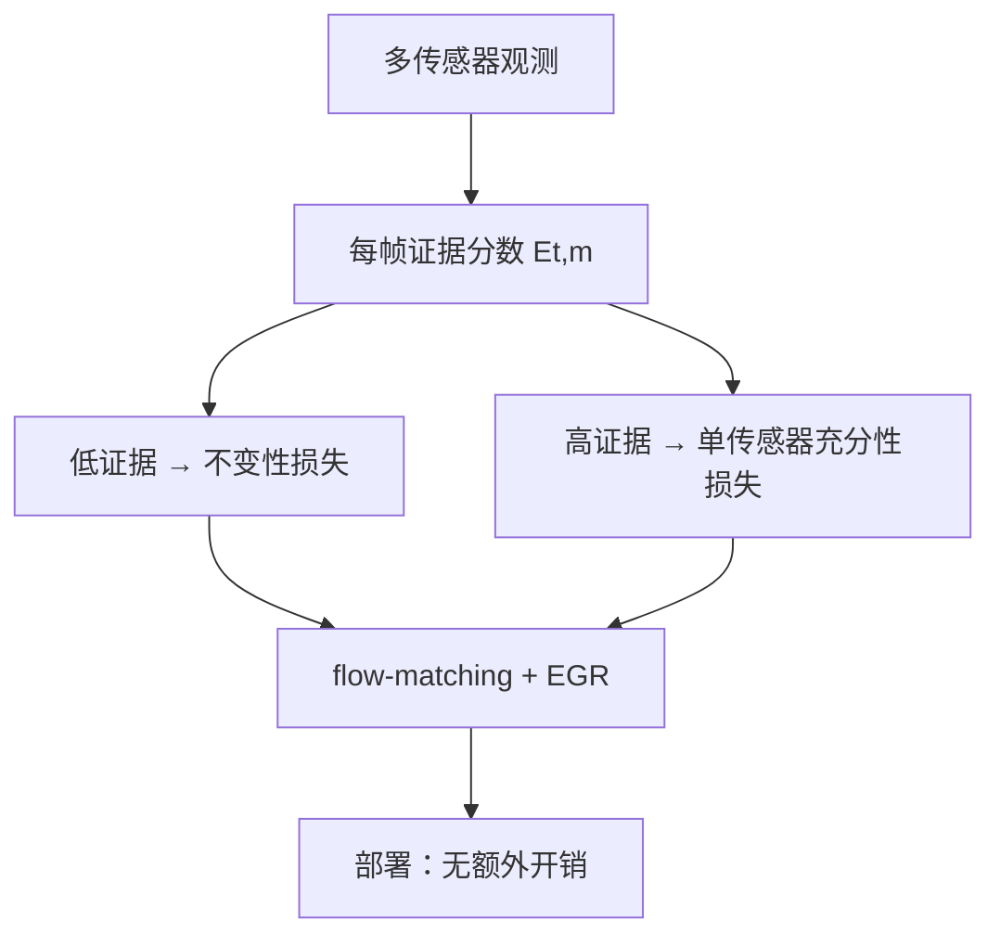

# EGR：面向鲁棒 VLA 的证据门控正则

**EGR**（*Evidence-Gated Regularization*；*Sensing Which Modality Matters*，[arXiv:2609.03142](https://arxiv.org/abs/2609.03142)，[项目页](https://yy-gx.github.io/EGR/)）由 **UNC Chapel Hill** 与 **MERL** 提出：针对 VLA **模态纠缠**（无关传感器受扰即失效 / 单传感器充分时无法回退），用 **任务结构导出的每帧每传感器证据分数** 门控两类训练一致性目标——**低证据不变性** 与 **高证据单传感器充分性**——**不增加推理开销**。

## 一句话定义

**多模态策略的关键不是全部相信，而是知道此刻该相信哪个传感器。**

## 英文缩写速查

| 缩写 | 英文全称 | 简要说明 |
|------|----------|----------|
| EGR | Evidence-Gated Regularization | 本文训练目标 |
| VLA | Vision-Language-Action | 被增强的策略族（π₀.₅ + LoRA） |
| SR | Success Rate | rollout 任务成功率 |
| ModDrop | Modality Dropout | 随机模态丢弃基线 |
| BEHAVIOR-1K | BEHAVIOR-1K Benchmark | 仿真长视野技能套件 |

## 为什么重要

- 纳入 [九篇资源汇总](../../sources/blogs/wechat_embodied_station_9_papers_resources_2026-09-06.md) 的「VLA 鲁棒性」支线。
- 双臂真机 RealDistractor：**30%→85%**；视触 SingleUseful：**40%→90%**。
- 发布 **47 技能** 模态纠缠基准（11 NAV + 36 MAN）。

## 核心信息

| 项 | 内容 |
|----|------|
| **机构** | 北卡罗来纳大学教堂山分校（UNC）；三菱电机研究实验室（MERL） |
| **骨干** | π₀.₅ warm-start + **LoRA** 微调 |
| **平台** | 双臂 Kinova ×3 RGB；MELFA ASSISTA + GelSight ×2 |
| **开源** | 仓 [YY-GX/EGR](https://github.com/YY-GX/EGR) 存在；README **Coming soon** |

### 流程总览

## 实验与评测

| 设置 | vanilla π₀.₅ → EGR |
|------|---------------------|
| 仿真 MAN Full | 12.5% → **16.4%** |
| 仿真 MAN UsefulOnly | 2.8% → **6.1%** |
| 双臂 RealDistractor | 30% → **85%** |
| 视触 SingleUseful | 40% → **90%** |

## 结论

**用任务证据门控训练期一致性，可在零推理成本下显著缓解模态纠缠。**

1. **两种失败模式可形式化** — nuisance sensitivity vs single-modality insufficiency。
2. **ModDrop 不够** — 随机丢弃不等于状态依赖选择。
3. **真机 distractor 增益最大** — 物理 OOD 物体场景相对提升 **+183%**（双臂）。
4. **代码待发布** — 仓占位，训练/基准套件 Coming soon。

## 源码运行时序图

**不适用** — [YY-GX/EGR](https://github.com/YY-GX/EGR) README 写明代码与 BEHAVIOR 基准 **Coming soon**（截至 **2026-09-06**）。

## 局限与风险

- **证据需先验可写** — 任务结构要能定义 focal/interaction 对象或接触事件。
- **仅验证 image-like 传感器** — 深度/力/音频未测。
- **基准与证据共享可见几何假设** — 外推到其他传感模态需谨慎。

## 与其他工作对比

| 对照 | 差异读法 |
|------|----------|
| ModDrop | 均匀随机丢模态，不区分帧级相关性 |
| TacVLA 门控 | 单模态专用；EGR 模态无关正则 |
| [HINT](./paper-hint-robot-manipulation.md) | 长视野意图；EGR 解决传感纠缠 |

## 关联页面

- [VLA](../methods/vla.md)
- [Manipulation](../tasks/manipulation.md)
- [具身资源与可靠性 9 篇地图](../overview/embodied-resources-reliability-9-papers-technology-map.md)

## 参考来源

- [egr_arxiv_2609_03142.md](../../sources/papers/egr_arxiv_2609_03142.md)
- [egr 项目页](../../sources/sites/egr.md)
- [egr 仓库](../../sources/repos/egr.md)
- [具身智能小站 2026-09-06 九篇盘点](../../sources/blogs/wechat_embodied_station_9_papers_resources_2026-09-06.md)

## 推荐继续阅读

- [EGR 项目页](https://yy-gx.github.io/EGR/)
- [arXiv:2609.03142](https://arxiv.org/abs/2609.03142)
