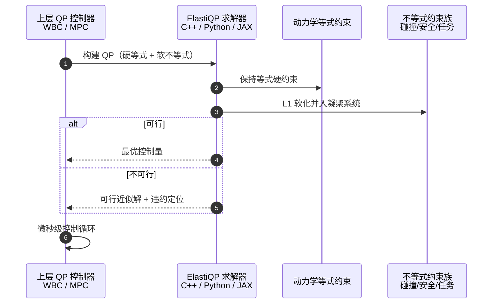

# ElastiQP（arXiv:2609.19080）

**ElastiQP**（*ElastiQP: An Always-Feasible QP Solver for Constrained Robot Control*，[arXiv:2609.19080](https://arxiv.org/abs/2609.19080)，[代码](https://github.com/StanfordASL/elastiqp)）来自 [具身智能小站 11 篇盘点](../../sources/blogs/wechat_embodied_station_11_papers_constraint_control_2026-09-20.md)（2026-09-20）。

## 一句话定义

**不等式约束带精确 L1 软化并折进凝聚 QP，等式动力学保持硬约束；不可行时违约集中到冲突不等式，微秒级控制循环仍返回控制量。**

## 英文缩写速查

| 缩写 | 英文全称 | 简要说明 |
|------|----------|----------|
| QP | Quadratic Programming | 二次规划 |
| WBC | Whole-Body Control | 全身控制 |
| L1 | L1 Penalty | 不等式软约束惩罚 |
| ASL | Autonomous Systems Lab | Stanford 自主系统实验室 |

## 为什么重要

- 真实系统常同时遇到碰撞、安全、动力学与任务约束；传统 QP 不可行即停摆，外层启发式降级难解释。
- 开源结论：**已开源**（步骤 2.5，2026-09-20）。
- 与 [11 篇技术地图](../overview/constraint-control-11-papers-technology-map.md) 中同类工作可横向对照。

## 核心机制

| 项 | 内容 |
|----|------|
| **arXiv** | [2609.19080](https://arxiv.org/abs/2609.19080) |
| **开源** | **已开源** |
| **要点** | 每个不等式约束精确 L1 惩罚；等式硬约束；消元把松弛变量折进凝聚系统；违约位置与幅度可解释。 |
| **文内指标** | 机器人控制基准微秒级求解；不可行时违约限制在冲突不等式；速度最高比最佳替代快 40×（作者报告）。 |

## 源码运行时序图

节点对齐 [`sources/repos/elastiqp.md`](../../sources/repos/elastiqp.md) 与 [StanfordASL/elastiqp](https://github.com/StanfordASL/elastiqp)。

- **最短路径：** 克隆仓库 → 用 C++ 头文件或 Python/JAX 绑定替换现有 QP 后端 → 对照不可行场景违约分布。

## 实验与评测

- 机器人控制基准微秒级求解；不可行时违约限制在冲突不等式；速度最高比最佳替代快 40×（作者报告）。
- **读法：** 索引级摘要；逐项对照与 baseline 以原文 PDF 为准。

## 与其他工作对比

- 横向索引见 [11 篇技术地图](../overview/constraint-control-11-papers-technology-map.md)；与同 arXiv 节点不重复造页。

## 结论

**ElastiQP 把「始终可返回控制量」作为 QP 求解器第一设计目标，适合现有 QP 控制器替换求解器做对照。**

1. 开源边界：**已开源** — 以项目页实际链接为准（入库日 2026-09-20）。
2. 核心机制：每个不等式约束精确 L1 惩罚；等式硬约束；消元把松弛变量折进凝聚系统；违约位置与幅度可解释。…
3. 部署前核对任务协议与硬件条件，勿直接横比公众号摘录数字。

## 关联页面

- [whole-body-control](../concepts/whole-body-control.md)
- [trajectory-optimization](../methods/trajectory-optimization.md)
- [locomotion](../tasks/locomotion.md)
- [paper-wave-go](./paper-wave-go.md)

## 参考来源

- [elastiqp_arxiv_2609_19080.md](../../sources/papers/elastiqp_arxiv_2609_19080.md)
- [wechat_embodied_station_11_papers_constraint_control_2026-09-20.md](../../sources/blogs/wechat_embodied_station_11_papers_constraint_control_2026-09-20.md)
- [arXiv:2609.19080](https://arxiv.org/abs/2609.19080)

## 推荐继续阅读

- [arXiv PDF](https://arxiv.org/pdf/2609.19080)
- [官方代码](https://github.com/StanfordASL/elastiqp)

