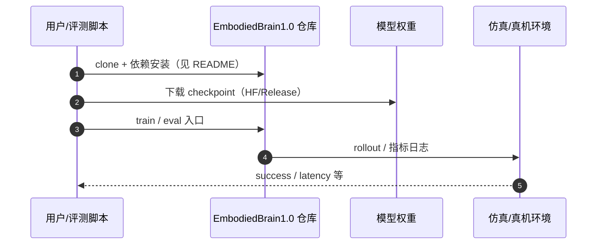

# EmbodiedBrain（arXiv:2510.20578）

**EmbodiedBrain**（*EmbodiedBrain: Expanding Performance Boundaries of Task Planning for Embodied Intelligence*，[arXiv:2510.20578](https://arxiv.org/abs/2510.20578)，[项目页](https://zterobot.github.io/EmbodiedBrain.github.io/)，[代码](https://github.com/ZTERobot/EmbodiedBrain1.0)）来自 [机器人研发工程师 · 前沿算法盘点](../../sources/blogs/wechat_robot_engineer_embodied_frontier_algorithms_2026-09-23.md)。

## 一句话定义

**7B/32B 具身规划 VLM：agent-aligned 数据结构 + 大规模 SFT + Step-GRPO（Guided Precursors）+ GRM 奖励；开源 VLM-PlanSim-99 仿真基准。**

## 英文缩写速查

| 缩写 | 英文全称 | 简要说明 |
|------|----------|----------|
| EmbodiedBrain | EmbodiedBrain | 中兴 NebulaBrain 具身规划 VLM |
| Step-GRPO | Step-Augmented Group Relative Policy Optimization | 长时序 RL 微调 |
| GRM | Generative Reward Model | 生成式奖励模型 |
| VLM | Vision-Language Model | 视觉–语言多模态模型 |

## 为什么重要

- 通用 LLM/VLM 与物理 agent 需求错位；离线规划榜难反映长时序失败恢复。
- 开源结论：**已开源**（步骤 2.5，2026-09-23）。
- 与 [具身前沿算法技术地图](../overview/embodied-frontier-algorithms-technology-map.md) 同路线条目可横向对照。

## 核心机制

| 项 | 内容 |
|----|------|
| **arXiv** | [2510.20578](https://arxiv.org/abs/2510.20578) |
| **开源** | **已开源** |
| **要点** | Step-GRPO 把前序步骤作 Guided Precursors；三部分评测（General / Planning / E2E Sim）；VLM-PlanSim-99（AI2-THOR）。 |
| **文内指标** | 多基准 SOTA（以原文为准）；HF EmbodiedBrain-7B 权重已发布。 |

## 源码运行时序图

图下说明：复现以 [`sources/repos/embodiedbrain.md`](../../sources/repos/embodiedbrain.md) 与官方 README 为准。

## 实验与评测

- 多基准 SOTA（以原文为准）；HF EmbodiedBrain-7B 权重已发布。
- **读法：** 索引级摘要；逐项 baseline 以原文 PDF 为准。

## 与其他工作对比

| 维度 | EmbodiedBrain（本文） | [OpenEAI-VLA](./paper-openeai-vla.md) | 通用 MLLM 直接当规划器 |
|------|------------------------|----------------------------------------|-------------------------|
| 定位 | **具身任务规划 VLM**（7B/32B） | 端到端 VLA | 无具身对齐的通用模型 |
| 训练配方 | agent-aligned 数据结构 + 大规模 SFT + **Step-GRPO**（前序步骤作 Guided Precursors）+ GRM 奖励 | VLA 预训练/微调 | 仅提示工程 |
| 评测面 | 三部分：General / Planning / **E2E Sim**（VLM-PlanSim-99，AI2-THOR） | 操作任务成功率 | 通用基准 |
| 输出 | 任务计划（需下游执行器落到动作） | 直接动作 | 文本计划 |

- **「多基准 SOTA」要看是哪一层：** 本文的强项在 [评测闭环](../queries/embodied-eval-benchmark-selection-loop.md) 的 **① 认知/规划层**；VLM-PlanSim-99 已经往 ③ 靠了一步（端到端仿真），但仍不是真机成功率，**不可直接与 VLA 的操作成功率横比**。
- **Step-GRPO 的适用前提：** 把前序步骤当 Guided Precursors，依赖任务本身 **有清晰的步骤结构**；长程、步骤边界模糊的任务上该信号会变弱。
- **逐项数值：** 各基准分数与 baseline **以 [原文 PDF](https://arxiv.org/abs/2510.20578) 为准**；本页为索引级摘要。

## 结论

**EmbodiedBrain 代表「规划专用 VLM + 真实仿真评测」路线；与 OpenVLA 等低层策略互补而非替代。**

1. 开源边界：**已开源** — 以项目页/仓库实际链接为准（入库日 2026-09-23）。
2. 核心机制：Step-GRPO 把前序步骤作 Guided Precursors；三部分评测（General / Planning / E2E Sim）；VLM-PlanSim-99（AI2-THOR）。…
3. 部署前核对硬件栈与评测协议，勿直接横比公众号摘录数字。

## 关联页面

- [manipulation](../tasks/manipulation.md)
- [vla](../methods/vla.md)
- [paper-openeai-vla](./paper-openeai-vla.md)
- [embodied-frontier-algorithms-technology-map](../overview/embodied-frontier-algorithms-technology-map.md)

## 参考来源

- [embodiedbrain_arxiv_2510_20578.md](../../sources/papers/embodiedbrain_arxiv_2510_20578.md)
- [wechat_robot_engineer_embodied_frontier_algorithms_2026-09-23.md](../../sources/blogs/wechat_robot_engineer_embodied_frontier_algorithms_2026-09-23.md)
- [arXiv:2510.20578](https://arxiv.org/abs/2510.20578)

## 推荐继续阅读

- [arXiv PDF](https://arxiv.org/pdf/2510.20578)
- [项目页](https://zterobot.github.io/EmbodiedBrain.github.io/)
- [代码](https://github.com/ZTERobot/EmbodiedBrain1.0)

