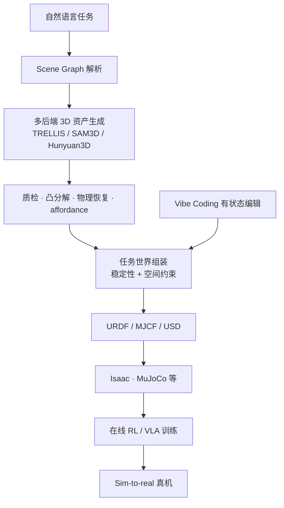

# EmbodiedGen V2（Simulation-Ready 3D World Engine · arXiv:2607.07459）

**EmbodiedGen V2**（*\calmfont EmbodiedGen V2: An Agentic, Simulation-Ready 3D World Engine for Embodied AI*，[arXiv:2607.07459](https://arxiv.org/abs/2607.07459)，Horizon Robotics + WuwenAI，[项目页](https://horizonrobotics.github.io/EmbodiedGen/)）从 **可看 3D 场景** 推进到 **可执行 sim-ready 环境**：统一表征耦合 **metric 几何、物理有效性、交互可供性、任务语义与跨模拟器接口**（URDF / MJCF / USD），支持 **操纵 / 导航 / 移动操作** 的 **在线 RL 与 sim-to-real**。

## 一句话定义

**世界模型补「环境层」：从任务描述生成带碰撞体、物理属性与模拟器 API 的三维世界，直连策略训练与评测闭环。**

## 英文缩写速查

| 缩写 | 英文全称 | 简要说明 |
|------|----------|----------|
| RL | Reinforcement Learning | 生成环境上 **在线强化学习** VLA |
| Sim | Simulation | Isaac / MuJoCo 等 **跨模拟器部署** |
| WM | World Model | 本文偏 **环境生成引擎** 而非单帧视频 WM |
| MJCF | MuJoCo XML Format | 导出格式之一 |
| USD | Universal Scene Description | Omniverse 等管线 |
| Scene Graph | — | NL 任务 → **结构化场景图** 再生成 |
| Vibe Coding | — | **有状态 NL 编辑** 持久世界 |

## 为什么重要

- **补齐策展三层之「环境层」：** [RynnWorld-4D](./paper-rynnworld-4d-rgb-depth-flow.md) / [MECo-WAM](./paper-meco-wam-4d-geometry-cotraining.md) 偏 **像素–几何预测**；EmbodiedGen V2 提供 **可碰撞、可交互、可 RL 的完整场景**。
- **83.3% 任务驱动世界免人工修改即可下游仿真：** 降低 **digital twin 手工成本**——与 [GigaWorld-1](./paper-gigaworld-1-policy-evaluation.md)「减真机评测」形成 **数据–环境–评估** 三角。
- **在线 RL + sim-to-real 实证：** 生成环境 RL 仿真 SR **9.7% → 79.8%**；迁移真机 **21.7% → 75.0%**——非仅 **视觉质量** 指标。
- **V1→V2 跃迁：** 多房间拓扑、**实例级可编辑** 家具、**可变形体** 部署、**Vibe Coding** 有状态编辑，克服 V1 全景单 mesh **相机平移受限**。

## 核心结构与方法

| 能力 | 方法要点 |
|------|----------|
| **统一 sim-ready 表征** | 几何 + 物理 + affordance + 任务语义 + **模拟器 portability** 同一数据结构 |
| **Model-agnostic 资产管线** | 插件 **TRELLIS / SAM3D / Hunyuan3D** → 质检、mesh repair、**凸分解**、纹理烘焙、**物理参数恢复** |
| **Affordance autolabeling** | 部件级 **交互语义 + 物理验证抓取**；发布 **4K+ 跨格式资产库** |
| **Task-driven world** | 开放 NL → **Scene Graph** → 空间约束 + **物理稳定性求解** → executable world |
| **Large-scale scenes** | 多房间 / whole-house：**房间拓扑、可通行开口、可寻址家具** |
| **Stateful Vibe Coding** | Agent–skill harness：**NL → 有界、物理 validated 编辑** 持久世界状态 |
| **Deformable extension** | 可变形物体 sim 部署（相对 V1 刚性为主） |

### 任务 → sim-ready 世界生成流

### 资产与任务世界质量指标

| 指标 | 数值（论文） |
|------|-------------|
| 资产人工接受率 | **96.5%** |
| 碰撞成功率 | **98.6%** |
| 任务世界免改可用率 | **83.3%** |
| RL 仿真成功率提升 | **9.7% → 79.8%** |
| 真机成功率提升 | **21.7% → 75.0%** |

## 实验要点（索引级）

| 轴 | 报告口径（以论文为准） |
|----|------------------------|
| **资产管线** | 96.5% 接受率 · 98.6% 碰撞成功 |
| **Task-driven worlds** | **83.3%** 无需人工修改即可仿真 |
| **Online RL（生成环境）** | **9.7% → 79.8%** 仿真 SR |
| **Sim-to-real** | **21.7% → 75.0%** 真机 SR |
| **场景类型** | 操作 / 导航 / 移动操作 / **多房间大场景** |
| **开源** | [GitHub](https://github.com/HorizonRobotics/EmbodiedGen) · [文档](https://horizonrobotics.github.io/EmbodiedGen/docs/) · [数据集](https://huggingface.co/datasets/HorizonRobotics/EmbodiedGenData) |

## 工程实践

| 入口 | 用途 |
|------|------|
| **安装** | `git clone` → `git checkout v2.0.0` → `conda` + `bash install.sh basic`（可选 `affordance` / `room` / `scene3d` profile） |
| **`img3d-cli` / `text3d-cli`** | 图/文 → sim-ready URDF + mesh + 3DGS；`--image3d_model` 切换 SAM3D / TRELLIS / Hunyuan3D |
| **`texture-cli`** | 已有 mesh 重纹理（中英文 prompt） |
| **`affordance-cli`** | 部件级 affordance + 仿真验证 6-DoF 抓取 |
| **`room-cli` / `scene3d-cli`** | 多房间可编辑房屋；3DGS 背景场景 |
| **`layout-cli` + `sim-cli`** | NL 任务 → `layout.json` → SAPIEN 渲染/仿真 |
| **`/embodiedgen:*`** | Claude Code 插件：Vibe Coding 有状态编辑（`gen_assets` / `gen_layout` / `vibe3d` 等） |
| **`parallel_sim.py`** | 从 layout 启动并行 `gym` 环境做在线 RL |
| **`eval_collision_success.py`** | ManiSkill + SAPIEN 抓取/碰撞成功率评测 |

**跨模拟器导出：** 生成 URDF 可直接用于 SAPIEN / Isaac Gym / PyBullet；经 `MeshtoMJCFConverter` / `MeshtoUSDConverter` 转 MuJoCo / Genesis / Isaac Sim。

**公开资产库 [EmbodiedGenData](https://huggingface.co/datasets/HorizonRobotics/EmbodiedGenData)：** `dataset_index.csv` 索引约 **4.1K** 条资产（URDF / MJCF / mesh / affordance / 预览视频），总体量 **~346 GB**；可用 [Gallery Explorer](https://huggingface.co/spaces/HorizonRobotics/EmbodiedGen-Gallery-Explorer) 浏览。多数管线需配置 `embodied_gen/utils/gpt_config.yaml`。

**在线 demo（HF Spaces）：** Image-to-3D、Text-to-3D、Texture-Gen 等，索引见[文档 Services](https://horizonrobotics.github.io/EmbodiedGen/docs/)。

## 与其他工作对比

| 工作 | 关系 |
|------|------|
| **[GigaWorld-1](./paper-gigaworld-1-policy-evaluation.md)** | **视频 WM 策略评估**；EmbodiedGen **3D 可执行环境** |
| **EmbodiedGen V1** | 内容工具包 → V2 **world engine + 多房间 + Vibe Coding** |
| **经典 sim digital twin** | 人工建模贵；EmbodiedGen **生成 + 物理验证** |
| **[Deform360](./paper-deform360-deformable-visuotactile-dataset.md)** | **真实可变形数据**；EmbodiedGen **合成可变形 sim 资产** |
| **2D video WM（Cosmos 等）** | 预测 **未来画面**；EmbodiedGen 产出 **可 RL 的 3D 状态** |

## 常见误区或局限

- **误区：** 等于 **纯 mesh 生成**；关键是 **sim-ready 表征**（碰撞、物理、affordance、API）。
- **误区：** 83.3% 表示 **任意 NL 都行**；仍受 **生成后端失败、物理求解** 约束。
- **局限：** 生成分布与 **真机视觉域** 仍有 gap；**接触丰富失败模式** 未必覆盖；跨模拟器 **数值差异** 需额外校准；与 **WM 动作忠实 rollout** 评估 **正交**。

## 与其他页面的关系

- [wm-action-consequence-category-03-geometry-4d](../overview/wm-action-consequence-category-03-geometry-4d.md) — 环境层支柱
- [wm-action-consequence-category-04-eval-posttrain](../overview/wm-action-consequence-category-04-eval-posttrain.md) — 环境扩展与评测成本
- [动作后果技术地图](../overview/robot-world-models-action-consequence-technology-map.md) — 三层信息索引
- [GigaWorld-1](./paper-gigaworld-1-policy-evaluation.md) — WM 评估基础设施
- [Generative World Models](../methods/generative-world-models.md) — 生成式世界建模总语境

## 推荐继续阅读

- [EmbodiedGen V2 论文（arXiv:2607.07459）](https://arxiv.org/abs/2607.07459)
- [EmbodiedGen 项目页](https://horizonrobotics.github.io/EmbodiedGen/)
- [EmbodiedGen 文档](https://horizonrobotics.github.io/EmbodiedGen/docs/)
- [GitHub 仓库](https://github.com/HorizonRobotics/EmbodiedGen)
- [EmbodiedGenData 数据集](https://huggingface.co/datasets/HorizonRobotics/EmbodiedGenData)
- [GigaWorld-1 论文实体](./paper-gigaworld-1-policy-evaluation.md)

## 参考来源

- [EmbodiedGen 官方仓库](../../sources/repos/embodiedgen.md)
- [EmbodiedGenData 数据集](../../sources/datasets/embodiedgen-data.md)
- [具身智能研究室 · 世界模型动作后果专题导读（2026-07）](../../sources/blogs/wechat_embodied_ai_lab_robot_world_models_action_consequence_2026.md)
- [EmbodiedGen V2 论文（arXiv:2607.07459）](https://arxiv.org/abs/2607.07459)
