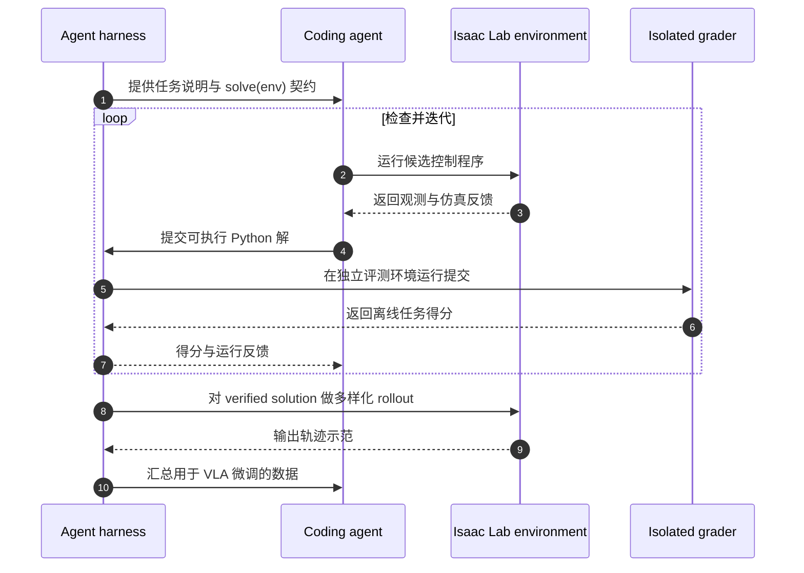

# EmbodiedSWE（arXiv:2609.27308）

**EmbodiedSWE**（*Coding Agents for Long-Horizon Dexterous Robotics*，[项目页](https://embodiedswe.github.io/)，[GitHub](https://github.com/EmbodiedSWE/EmbodiedSWE)，[arXiv:2609.27308](https://arxiv.org/abs/2609.27308)）把 coding agent 当成机器人任务求解器和数据教师：先在仿真里写出经验证的程序，再把解扩展为训练通用策略的数据。

## 一句话定义

**EmbodiedSWE 将「coding agent 解任务」和「将解扩成策略示范」放进同一仿真闭环。**

## 英文缩写速查

| 缩写 | 英文全称 | 简要说明 |
|------|----------|----------|
| SWE | Software Engineering | 此处指 agent 通过编写、运行和修订程序完成机器人任务 |
| VLA | Vision-Language-Action | 用视觉与语言条件预测机器人动作的策略模型 |
| USD | Universal Scene Description | Isaac 仿真场景与机器人资产使用的场景描述格式 |
| IK | Inverse Kinematics | agent 可调用的通用机器人控制工具之一 |
| RL | Reinforcement Learning | 论文也探索用验证结果改进 coding agent |

## 为什么重要

长时程灵巧操作既难靠人工遥操作规模化采集，也难仅用短任务 benchmark 评估。EmbodiedSWE 让 agent 直接在物理仿真里检查状态、写控制程序、运行并基于反馈修订；可验证成功解又能被扩展成多样示范，从而连接 **coding agent → 仿真验证 → VLA 训练数据**。

## 方法栈与流程总览

系统包含三个彼此衔接的层次：

1. **EmbodiedSWE-Bench（solver benchmark）**：论文列出 28 个长时程、接触丰富任务，覆盖装配、打包/整理、谜题、可变形物体或液体、切割和移动操作；任务时长可达约半小时。论文评测配置包含 Franka、xArm7、Kinova Gen3、双臂 Franka 与 Unitree G1。
2. **Coding-agent harness（solver）**：agent 获得通用仿真状态与工具，根据自然语言目标提交 `solve(env)` Python 程序。环境运行与最终评分隔离；grader 在独立新环境里离线检查物理任务进度，减少直接写仿真状态等取巧空间。
3. **EmbodiedSWE-Gen（teacher pipeline）**：从一个 verified solution 出发，分层改变场景、策略、阶段、动力学及视觉条件，得到更多机器人轨迹，供 VLA 模型监督微调。项目页当前展示的基座是 SmolVLA。

## 源码运行时序图

运行入口见仓库 README 的 `eval/scripts/run_agent.py`、`eval/scripts/run_grade.py` 和 `robobench/scripts/fetch_assets`。最后一步 VLA 训练在论文数据流程中进行；上图概括模块间数据方向，并不表示同一个 agent 进程负责全部训练。

## 实验与评测

- **任务规模：** 28 个基准任务、6 类套件；论文中覆盖 5 种机器人 embodiment，最长任务约 30 分钟。
- **Agent solver：** 项目页报告 GPT-6 Astra 标准 harness 平均成功率为 82%，GPT-5.6 Terra 为 11%；其余 frontier coding models 的成功率介于两者之间。成本和交互时长不可忽略，单次解题可能要多轮运行与修订。
- **VLA 数据缩放：** 项目页显示 SmolVLA 在每任务示范数从 10 增至 400 时，平均成功率从 14% 增至 66%。同量训练数据下，agent 辅助多样化在留出任务变体上的平均分高于 script-only domain randomization。
- **Sim-to-real：** 论文报告仅用 500 条 agent 生成仿真示范微调的 VLA，完成真实机器人四阶段灯具拆解任务。它是迁移可行性证据，不足以推出普遍的长时程实机能力。

项目页当前称 benchmark 有 17 种 embodiment 配置；论文评测正文说的是 5 种机器人类型。复现实验和横向比较时要区分更新中的仓库规模与论文报告的固定实验配置。

## 与其他工作对比

| 方向 | agent 的产物 | 主要检验问题 |
|------|--------------|--------------|
| [Agentic Coding Agent](./paper-agentic-coding-manipulation.md) | UR3e 的任务代码与可复用 procedure | 本地 coding agent 能否用已文档化程序泛化到小型桌面任务 |
| [ASPIRE](../methods/aspire.md) | 从失败 trace 更新的程序技能 | 技能能否跨任务累积，减少重复调试 |
| [ENPIRE](../methods/enpire.md) | 真机策略改进实验 | 如何把 reset、执行、验证、策略更新组成真实机器人闭环 |
| **EmbodiedSWE** | 仿真 benchmark 的长时程任务程序，以及扩增后的 VLA 示范 | 一个已验证解能否变成多样化训练数据，并有限迁移到实机 |

## 工程实践与局限

- **从可验证任务开始：** `solve(env)` 把任务求解和通用控制工具接起来，离线 hidden grader 用独立仿真副本评分。搭建相似系统时应分开 agent workspace、运行容器与 grader。
- **依赖大型仿真栈：** 官方安装依赖 Linux、NVIDIA GPU、CUDA 12.x 驱动、Isaac Sim 5.1 与 Isaac Lab 2.3.2；首次下载的仿真资产较大。
- **许可不能只看仓库根目录：** 代码和作者制作资产是 Apache-2.0；Hugging Face 数据集中包含第三方模型，部分上游许可为 CC BY-NC 或 CC BY-NC-SA。商用前逐项核对 [数据集卡](https://huggingface.co/datasets/EmbodiedSWE/robobench-assets)。
- **验证器决定可信度：** 仿真状态可读能提高 agent 迭代效率，但也必须靠独立 grader 与隔离环境抑制评分器利用；基准覆盖面不能替代真实场景测试。
- **目前证据有限：** 论文的真机结果集中在四阶段灯具拆解一项任务；VLA 成功率与 coding agent 求解率是不同指标，不能混为一个总成功率。

## 结论

**EmbodiedSWE 最有价值的连接是将可执行的 agent 解变成可扩展的 VLA 示范；其基准成绩与单任务 sim-to-real 结果仍需结合成本、独立 grader 和任务范围解读。**

1. **先把任务做成可运行、可验证程序。** coding agent 的主对象是 `solve(env)`，不是直接输出低层关节动作。
2. **把 agent 当数据教师。** 可验证解通过场景、策略、阶段、动力学和视觉扰动变成更多训练轨迹。
3. **增加示范数量有帮助，但需读留出集。** 项目页报告 SmolVLA 成功率随数据量增加而提升；多样化对 held-out 变体另有收益。
4. **隔离评分链路是 benchmark 设计的关键。** 独立容器和离线 grader 用于减少直接修改仿真状态等评分作弊。
5. **实机结论保持克制。** 500 条示范完成灯具拆解是具体的可行性结果，不能外推为开放域长时程泛化已解决。
6. **许可边界跟随资产来源。** Apache-2.0 数据集里仍有上游 NC 素材，商业使用前须核查清单。

## 关联页面

- [Agentic Coding Agent](./paper-agentic-coding-manipulation.md) — 机器人 coding agent 的相邻论文。
- [ASPIRE](../methods/aspire.md) — 从失败记录中积累程序技能。
- [ENPIRE](../methods/enpire.md) — 真机策略改进闭环。
- [Manipulation](../tasks/manipulation.md) — 灵巧操作任务与方法。
- [Data Flywheel](../concepts/data-flywheel.md) — 从验证结果积累可复用数据。
- [VLA](../methods/vla.md) — 生成示范用于微调的策略类型。

## 参考来源

- [EmbodiedSWE arXiv 论文](../../sources/papers/embodiedswe_arxiv_2609_27308.md)
- [EmbodiedSWE 仓库归档](../../sources/repos/embodiedswe.md)
- [EmbodiedSWE 项目页归档](../../sources/sites/embodiedswe-github-io.md)
- [Hugging Face 仿真资产数据集](https://huggingface.co/datasets/EmbodiedSWE/robobench-assets)

## 推荐继续阅读

- [项目页](https://embodiedswe.github.io/)
- [代码仓库](https://github.com/EmbodiedSWE/EmbodiedSWE)
- [arXiv 论文 PDF](https://arxiv.org/pdf/2609.27308)
