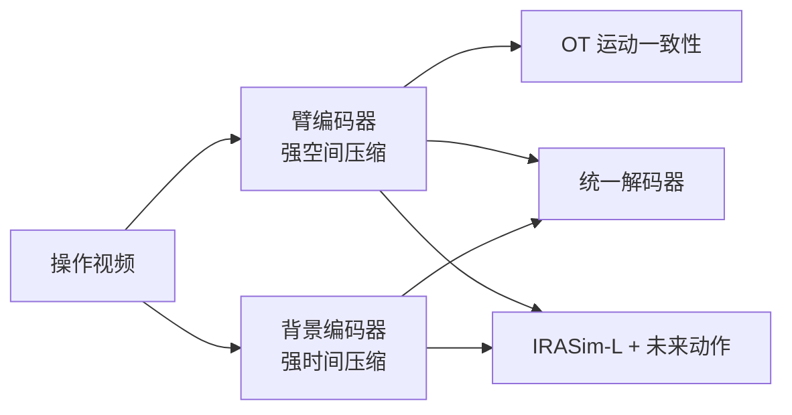

# EmbodiedVAE：为操作世界模型解耦的视频 VAE

**EmbodiedVAE**（*Disentangled Video VAE for Efficient and Controllable Embodied Manipulation*；[arXiv:2608.02990](https://arxiv.org/abs/2608.02990)，[代码占位](https://github.com/Mutual-Luo/EmbodiedVAE)）由 **北航 / 中关村人工智能研究院 / 中科大 / 国大 / 中科院自动化所 / 微软亚洲研究院** 提出：给操作世界模型一套 **紧凑且可把动作打进臂潜空间** 的 video VAE。

## 一句话定义

**用双编码器把机械臂运动和背景拆开，再以非对称压缩与最优传输一致性保住臂的时序，让下游 LDM 在高压缩率下仍能按未来动作生成物理上对得上的视频。**

## 英文缩写速查

| 缩写 | 英文全称 | 简要说明 |
|------|----------|----------|
| VAE | Variational Autoencoder | 把视频压进潜空间再重建 |
| LDM | Latent Diffusion Model | 在 VAE 潜空间里做扩散的世界模型骨干 |
| OT | Optimal Transport | 本文用来约束臂潜空间跨帧对应 |
| PSNR | Peak Signal-to-Noise Ratio | 重建/生成保真；文内约 +2 dB |
| IRASim | IRASim world model | 本文固定的 461M DiT 下游骨干 |

## 为什么重要

- 操作世界模型要的是 **给定未来臂动作，下一帧交互对不对**，不是风景片好看。
- 2D 图像 VAE 潜空间太大；通用 video VAE 一压时间就丢掉细臂运动——Wan-VAE 常「看起来真、动错了」。
- 解耦后动作可以只打进臂 latent，背景噪声不再稀释控制。

## 核心信息

| 项 | 内容 |
|----|------|
| **机构** | 北京航空航天大学（BUAA）；中关村人工智能研究院（ZGCA）；中国科学技术大学（USTC）；新加坡国立大学（NUS）；中国科学院自动化研究所（CASIA）；微软亚洲研究院（Microsoft） |
| **压缩** | 臂 \(4\times(16\times16)\)，背景 \(8\times(8\times8)\)，通道 4；总压缩约 0.39% |
| **开源** | **Coming Soon**（截至 2026-08-15 仅 README） |

## 核心原理

### 方法栈

训练两阶段：先分别训臂/背景 VAE（训练期用臂 mask），再冻编码器、训统一解码器。推理 **不再需要 mask**。臂潜空间加熵正则 OT 损失，最小化跨帧传输代价。接到 IRASim-L 时两路 token 共享 DiT，每 2 block 交叉注意。

### 流程总览

## 工程实践

| 项 | 建议 |
|----|------|
| 源码运行时序图 | **不适用**（仓 Coming Soon） |
| 何时用 | 要训动作条件视频世界模型，且痛点是「控不住臂」而不是「画面不够锐」 |
| 接入 | 保持下游 DiT 参数共享，只换 VAE；动作注入走臂 latent |
| 训练 mask | 只在解耦阶段用；部署编码器吃整帧 |

## 实验与评测

- 重建：Agibot-2025 PSNR **31.67**，压缩率约为次优 CMD 的 1/20 仍更高保真。
- 动作条件生成（固定 IRASim-L）：相对 Wan-VAE 约 **+2.02 PSNR**，并超过无时间压缩的 SDXL 图像 VAE。
- OT 消融在 manipulation 下游收益大于纯重建。

## 与其他工作对比

相对 Wan-VAE / Cog-VAE / VidTwin：同样做时空压缩，但显式留出 **可注入动作的臂空间**。相对 SDXL 图像 VAE：更紧凑，且文内生成指标不落下风。它是世界模型的 **tokenizer**，不是完整 WAM。

## 结论

**操作世界模型控得住，往往先取决于 VAE 怎么切潜空间，而不是再堆一个更大的 DiT。**

1. **臂和背景不要挤在同一套时间压缩里** — 臂要空间细节，背景吃时间冗余。
2. **动作打进臂 latent** — 避免环境纹理稀释控制。
3. **OT 约束的是运动对应，不是更锐的纹理。**
4. **约 +2 dB 是可控生成，不是风景片 PSNR。**
5. **复现等正式 release** — 入库时无可运行脚本。

## 局限与风险

- 代码未发布，非对称压缩与 OT 超参无法复核。
- 解耦依赖训练期臂 mask 质量；遮挡严重时臂编码器可能漏运动。
- 下游实验绑在 IRASim-L，换骨干要重测交叉注意间隔。

## 关联页面

- [世界动作模型](../concepts/world-action-models.md) — 本页是其视觉 tokenizer 一层
- [生成式世界模型](../methods/generative-world-models.md)
- [Ego2Robot](./paper-ego2robot.md) — 数据侧规模化，与表征侧解耦互补
- [VLA](../methods/vla.md) — 下游策略仍可能吃世界模型滚动

## 参考来源

- [EmbodiedVAE 论文摘录](../../sources/papers/embodiedvae_arxiv_2608_02990.md)
- [EmbodiedVAE 仓库归档](../../sources/repos/embodiedvae.md)
- [具身智能小站 9 篇盘点](../../sources/blogs/wechat_embodied_station_ego2robot_mango_grasp_2026-08-11.md)
- [arXiv:2608.02990](https://arxiv.org/abs/2608.02990)

## 推荐继续阅读

- [IRASim](https://arxiv.org/abs/2406.14540) — 本文固定的操作世界模型骨干
- [仓库占位](https://github.com/Mutual-Luo/EmbodiedVAE)
