# Emergent Transfer（跨配置遗留数据何时开始有用）

**Emergent Transfer**（*When Does Legacy Data Start to Help? Emergent Transfer in Cross-Configuration Robot Learning*，[arXiv:2607.25593](https://arxiv.org/abs/2607.25593)；Tao Wang / Hudson Hou / Yingdong Hu 等 · **华中科技大学 / 千寻智能（Spirit AI）/ 北京大学 / 上海交通大学 / 哈尔滨工业大学 / 清华大学**）在同一轮式人形的两代硬件上，系统回答：**相机与夹爪更换后，旧配置示教从何时起开始帮助新配置**。

## 一句话定义

**遗留示教不是「越多越好」：新配置必须先靠自身数据越过任务依赖的迁移阈值 τ(T)，之后跨代共训才会涌现大幅收益，接近饱和后边际再回落。**

## 英文缩写速查

| 缩写 | 英文全称 | 简要说明 |
|------|----------|----------|
| ET | Emergent Transfer | 本文现象：越过阈值后遗留数据突然变有用 |
| τ(T) | Transfer Threshold | 任务 T 上期望 ΔSR&gt;0 的最小 standalone 成功率 |
| ΔSR | Co-training Gain | SR_co-train − SR_single |
| VLA | Vision-Language-Action | 本文骨干 π₀.₅ 所属策略族 |
| BC | Behavior Cloning | 微调监督目标 |
| H(T) | Task Complexity | H≈L log(1/ε)，用于估 τ̂(T) |

## 为什么重要

- **硬件迭代日常问题：** 传感器 / 末端升级后旧 teleop 数据是否还能用，是产线与实验室都绕不开的成本题；Open X-Embodiment 等跨机器人共训**不回答**「从哪一刻起旧数据开始有用」。
- **反直觉工程读法：** 低能力区硬混 legacy **零收益**（花插入 10%→10%）；略抬高新机基线后同一批 legacy 可带来 **+63.4pp**（23.3%→86.7%）。
- **可执行预算规则：** phase-aware 采集先把新机推过 τ(T)，再引入 legacy——浇水 held-out 上把新机采集从 8h 收到约 1.5h 即进入高收益区。
- **与「换整机」迁移正交：** 本文形态与臂运动学不变，差异在观测与夹爪执行；补齐 [跨具身迁移 hub](../overview/hub-cross-embodiment.md) 中 **同形态跨配置** 轴。

## 核心信息

| 项 | 内容 |
|----|------|
| 机构 | 华中科技大学、千寻智能（Spirit AI）、北京大学、上海交通大学、哈尔滨工业大学、清华大学 |
| 平台 | 轮式人形（26 DoF；桌面实验关底座→22 DoF）；Gen-1→Gen-2：相机 + 夹爪 |
| Gen-1→Gen-2 | 三路 640×480 / 87° 单目 → 1920×1536 / 120° 鱼眼；位置控平行夹爪 → 力/位混合 + 腕力传感 |
| 策略 | 预训练 **π₀.₅** + 全参 BC 微调；60-step action chunk；无代际标签；共训等概率采样两代数据 |
| 任务 | 笔/花抓取与插入；held-out：移动双臂浇水 |
| 评测 | 端到端成功率；每条件 n=60；Fisher 精确检验 |
| 开源 | **确认未开源**（截至 2026-08-02；项目入口即为 arXiv） |

## 核心原理（方法）

### 方法栈

| 层级 | 选择 |
|------|------|
| 骨干 | π₀.₅（SigLIP + Gemma-2B + flow-matching action head） |
| 监督 | Behavior Cloning；AdamW，4e4 steps，16×A800 |
| 观测 | 多视角 RGB + 本体感觉 + 语言指令 |
| 动作 | 归一化臂动作 + 夹爪目标开度；代际差异由底层控制器消化 |
| 对照 | Single（仅一代） vs Co-train（两代等概率混训） |

### 三相模型

| Phase | 新机 baseline | 典型 ΔSR | 机制读法 |
|-------|---------------|----------|----------|
| **I** | &lt;~15–20% | ≈0 | Representation vacuum：阶段结构未形成，legacy 梯度不对齐 |
| **II** | ~20–75% | +15～+63pp | Synergistic bloom：同阶段监督对齐，且仍有残差不确定性可吃 |
| **III** | &gt;~75% | +0～+15pp | Diminishing saturation：可改进空间变小 |

### 理论要点

1. **阶段可解码性 ρ** 作为序参量；假设其与 standalone SR 单调耦合。
2. **Definition：τ(T)** = 使期望 ΔSR&gt;0 的最小 SR。
3. **Theorem 1：** SR&lt;τ 时期望 〈g_legacy, g_target〉≤0；越过后对齐转正。
4. **Theorem 2（倒 U）：** 期望增益 ≈ [κ(1−SR)−δ(SR)] · 1[SR&gt;τ]，饱和区配置冲突项 δ 可抬高。

### 流程总览

```mermaid
flowchart TD
  A[估任务复杂度 H = L log 1/ε] --> B[估迁移阈值 τ̂]
  B --> C[用新机数据训 standalone 策略]
  C --> D{SR₂ ≥ τ̂ ?}
  D -->|否 Phase I| E[继续采集新机示教]
  E --> C
  D -->|是 Phase II/III| F[等概率混入 legacy 共训]
  F --> G{接近饱和?}
  G -->|否| H[高增益区: 优先吃 legacy]
  G -->|是| I[低边际: 少混或停采]
```

## 源码运行时序图

**不适用。** 截至 2026-08-02：arXiv 页即为项目入口，全文未提供官方训练/推理代码、数据集或独立项目页。骨干权重可参考公开 [openpi / π₀.₅](./paper-pi05-open-world-vla.md)，但本文双代 teleop 与微调配方未发布。

## 工程实践（含开源状态）

| 项 | 内容 |
|----|------|
| 开源状态 | **确认未开源**（核查日 2026-08-02） |
| 源码运行时序图 | **不适用**（无可运行官方入口） |
| Phase-aware 规则 | ① 估 H(T)→τ̂(T)；② 测 SR₂；③ SR₂&lt;τ̂ 则继续采新机，否则共训 legacy |
| 采样比 | 主实验 **等概率** 混两代，而非按小时数加权（避免被更大 legacy 淹没） |
| 数据质量 | 高质量新机批可更快越过阈值，但**不能绕过**阈值本身 |
| 调试指标 | standalone SR（相位判据）；ΔSR；Fisher p；Wilson 95% CI |
| 训练尺度 | 16×A800 80GB；lr warmup 2k→1e-4，cosine→1e-5 |

**实操口诀：** 硬件升级后先问「新机是否已越过 τ(T)」，再问「legacy 是否兼容」——顺序反了会在 Phase I 白烧旧数据。

## 实验与评测

### Phase I：阈值下无效

Early Gen-2 花插入（4.31h）standalone **10%**，混入 17.1h Gen-1 legacy 后仍 **10%**（Table 2）。同次共训却可抬升 Gen-1 花插入 50%→78.3%——相位是**双向、任务-配置对**属性，而非「源→目标」单向故事。

### Phase II：高增益

质量精炼 Gen-2 后：花插入 **23.3%→86.7%**（+63.4pp，p≈1.8×10⁻¹²）；笔插入 **71.7%→98.3%**（+26.6pp）。

### Phase III：饱和衰减

笔插入 Gen-2 合批到 standalone **85%** 后，共训仅到 **93.3%**（+8.3pp）；抓取类近天花板任务增益落入噪声（含不显著负值，作者不判为有害迁移）。

### Held-out：移动双臂浇水

| 新机预算 | 相位 | Pick kettle Δ | Water plant Δ |
|----------|------|---------------|---------------|
| 0.5 h | I | 0 | 0 |
| 1.5 h | II | +40.0pp | +38.3pp |
| 8 h | III | −1.7（n.s.） | +3.3（n.s.） |

## 结论

**一句话总判：跨配置复用遗留示教的关键闸门是任务依赖阈值 τ(T)——先把新机推过阈值，再混旧数据；盲目「多混 legacy」在低能力区无效，在高能力区边际很小。**

1. **相位优先于小时数** — 同任务下 4.3h（Phase I）零收益、15.6h 精炼批（Phase II）+63pp，说明要看 standalone SR 落在哪一相。
2. **预算花在过阈值** — phase-aware 规则把浇水新机采集从 8h 收到 ~1.5h 即可吃到 legacy 的主要红利。
3. **等概率共训是细节** — 避免按数据量加权让大 legacy 淹没刚成形的新机表征。
4. **倒 U 可预期** — 梯度对齐解释「何时开始有用」，残差不确定性解释「为何饱和后变弱」。
5. **外推谨慎** — 单平台、单 VLA 骨干、有限操纵任务；τ≈α+βH 是带初证的预测式，不是普适 scaling law。

## 与其他工作对比

| 对照 | 差异读法 |
|------|----------|
| [Open X-Embodiment](../concepts/open-x-embodiment.md) / RT-X / Octo | 跨机器人、跨数据集规模化共训；**不刻画**硬件迭代后「从哪一能力点起旧数据有用」 |
| [跨具身策略迁移选型](../queries/cross-embodiment-transfer-strategy.md)（Any2Any / 重训 / 多具身） | 主战场是**换骨架/换机体**的 WBT；本文是**同形态换相机+夹爪**的 VLA 示教复用 |
| RoboNet / BridgeData | 证明先验机器人数据可降目标域成本；本文补「有用性随目标 standalone 性能三相变化」 |
| [π0.5](./paper-pi05-open-world-vla.md) | 提供微调骨干；本文贡献在数据复用相位，不在新架构 |

## 局限与风险

- **适用边界：** 两代共享臂运动学与任务语义；观测与夹爪接口变化。跨整机形态 / 动作空间重定义未必同相位。
- **外推风险：** 单平台 + 单 π₀.₅ 骨干；τ(T) 与 H(T) 关系需更多机体与模型族验证。
- **复现风险：** **未开源**数据与训练配方；只能借公开 π₀.₅ 做方法对照，不能直接复现数字。
- **误区：** 把 Phase I 的零收益当成「legacy 永远没用」，或把 Phase II 的大增益外推到已饱和任务。

## 关联页面

- [跨具身迁移（知识链汇总）](../overview/hub-cross-embodiment.md)
- [跨具身策略迁移选型指南](../queries/cross-embodiment-transfer-strategy.md)
- [人形训练数据管线](../queries/humanoid-training-data-pipeline.md)
- [π0.5](./paper-pi05-open-world-vla.md)
- [VLA](../methods/vla.md)
- [Behavior Cloning](../methods/behavior-cloning.md)
- [Open X-Embodiment](../concepts/open-x-embodiment.md)

## 参考来源

- [When Does Legacy Data Start to Help?（来源归档）](../../sources/papers/emergent_transfer_cross_config_arxiv_2607_25593.md)
- [arXiv:2607.25593](https://arxiv.org/abs/2607.25593)

## 推荐继续阅读

- [arXiv PDF](https://arxiv.org/pdf/2607.25593.pdf) — 全文与 Appendix C 证明细节
- [π0.5: A Vision-Language-Action Model with Open-World Generalization](https://arxiv.org/abs/2504.16054) — 本文微调骨干
- [Open X-Embodiment](https://robotics-transformer-x.github.io/) — 跨机器人共训对照叙事
