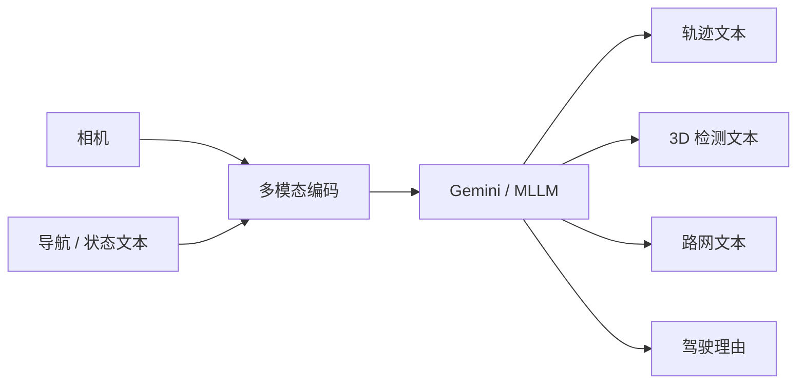

# EMMA（Waymo）（EMMA: End-to-End Multimodal Model for Autonomous Driving · arXiv:2410.23262）

**EMMA（Waymo）**（*EMMA: End-to-End Multimodal Model for Autonomous Driving*，[2410.23262](https://arxiv.org/abs/2410.23262)，TMLR）由 **韦莫（Waymo）** 提出，收录于深蓝AI《端到端自动驾驶：十大前沿算法盘点》**一切皆语言** 线索代表作。

> **命名注意：** 勿与具身 Ego 专题的 [EMMA（ego-moma）](./paper-ego-04-emma.md)（arXiv:2509.04443）混淆。

## 一句话定义

在 Gemini 多模态大模型上，把导航/状态等非传感器输入与轨迹/检测/路网输出统一成自然语言，实现真正的多任务统一空间。

## 英文缩写速查

| 缩写 | 英文全称 | 简要说明 |
|------|----------|----------|
| EMMA | End-to-End Multimodal Model for Autonomous Driving | Waymo 多模态端到端驾驶模型 |
| MLLM | Multimodal Large Language Model | 多模态大语言模型 |
| WOMD | Waymo Open Motion Dataset | Waymo 运动数据集 |
| CoT | Chain-of-Thought | 可解释驾驶理由/推理 |
| TMLR | Transactions on Machine Learning Research | 发表 venue |

## 为什么重要

- 相对「外挂 VLM」的 DriveVLM，EMMA 在表示层把任务空间语言化，榨取预训练世界知识。
- 同一模型换 Prompt 即可联合运动规划、3D 检测与道路图构建，并出现多任务互相增益。
- 可输出驾驶理由，缓解纯数值 E2E 黑盒问题。

## 核心信息

| 字段 | 内容 |
|------|------|
| **机构** | 韦莫（Waymo） |
| **arXiv** | [2410.23262](https://arxiv.org/abs/2410.23262) |
| Venue | TMLR |
| **演进线索** | 一切皆语言 |
| **开源** | **未开源** — Waymo 研究博客与论文未提供可运行官方代码/权重；依赖内部数据与 Gemini。 |
| **指标索引** | nuScenes 与 Waymo Open 上具竞争力；内部大规模数据的 EMMA+ / EFM+（w/ CoT）在 WOMD 等设定下相对 MotionLM/Wayformer 有显著提升（以论文表为准）。 |

## 核心原理

### 统一语言接口

- **输入**：相机传感器 + 导航指令、自车状态等全部文本化。
- **输出**：规划轨迹、3D 目标、路网元素等亦表示为自然语言/结构化文本。
- **骨干**：Gemini 多模态大模型；亦验证迁移到开源 MLLM（如 PaLI-X）的可行性（论文中的 EMMA†）。

### 流程总览

## 源码运行时序图

**不适用** — Waymo 研究博客与论文未提供可运行官方代码/权重；依赖内部数据与 Gemini。。

## 实验与评测

| 维度 | 记录 |
|------|------|
| 公开集 | nuScenes、Waymo Open / WOMD |
| 变体 | EMMA / EMMA+ / EFM+（w/ CoT）/ EMMA†(PaLI) |
| 报告点 | 多任务互相增益；内部大数据显著抬升（论文表） |
| 对照 | MotionLM、Wayformer 等 |

## 与相邻路线对比

| 路线 | 相对 EMMA | 取舍 |
|------|-----------|------|
| [DriveVLM](./paper-drivevlm.md) | 外挂式 CoT | 更易接传统栈 |
| [Senna](./paper-senna.md) | 语言只做高层决策 | 开源可复现 |
| Ego [EMMA](./paper-ego-04-emma.md) | **同名不同域** | 操作数据共训，非驾驶 |

## 工程实践

| 维度 | 记录 |
|------|------|
| 典型评测 | nuScenes / NAVSIM / Bench2Drive / Waymo Open（依论文） |
| 开源状态 | **未开源** — Waymo 研究博客与论文未提供可运行官方代码/权重；依赖内部数据与 Gemini。 |
| 复现入口 | https://waymo.com/blog/2024/10/introducing-emma/ |
| 工程关注点 | 延迟、帧间一致性、可解释中间量表征、与模块化栈的接口 |

## 局限与风险

- 与具身操作域同名工作 [paper-ego-04-emma](./paper-ego-04-emma.md) 无关，勿混淆。
- 闭源 + 专有数据，外部无法完整复现。
- 语言化坐标仍受分词/数值精度与延迟制约。

## 关联页面

- [e2e-autonomous-driving-top10-algorithms](../overview/e2e-autonomous-driving-top10-algorithms.md) — 十大盘点父节点
- [自动驾驶核心算法盘点专辑](../overview/autonomous-driving-core-algorithms-series.md) — 模块化栈姊妹篇
- [生成式世界模型](../methods/generative-world-models.md)
- [S²-VLA](./paper-s-squared-vla.md) — 驾驶 VLA / NAVSIM 对照
- [M⁴World](./paper-m4world.md) — 驾驶世界模型后继
- [VLA](../methods/vla.md)

## 参考来源

- [深蓝AI：端到端自动驾驶十大前沿算法盘点](../../sources/blogs/wechat_shenlan_ai_ad_e2e_top10.md)
- [e2e_ad_emma_waymo_e2e.md](../../sources/papers/e2e_ad_emma_waymo_e2e.md) — 论文 source
- arXiv: [2410.23262](https://arxiv.org/abs/2410.23262)
- [sites/waymo-emma-blog.md](../../sources/sites/waymo-emma-blog.md)

## 推荐继续阅读

- 论文 PDF：<https://arxiv.org/pdf/2410.23262.pdf>
- 项目页/博客：<https://waymo.com/blog/2024/10/introducing-emma/>
