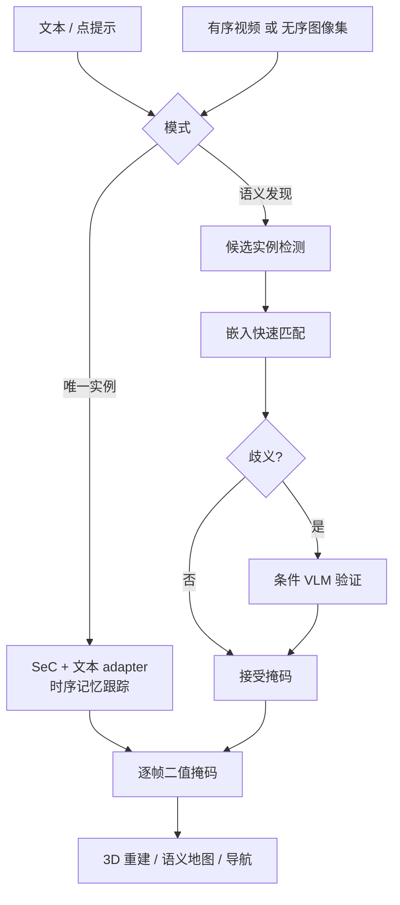
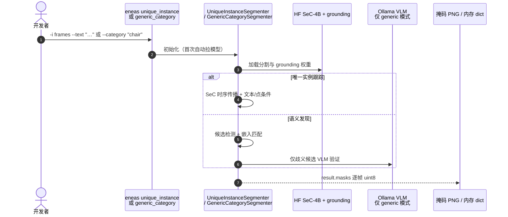

# ENEAS：文本提示实例跟踪与语义发现

**ENEAS**（*Embedding-guided Neural Ensemble for Adaptive Segmentation*，[arXiv:2609.03756](https://arxiv.org/abs/2609.03756)）由 **SperidLabs** 发布：一种可通过 **自然语言提示** 同时做 **唯一实例跟踪** 与 **开放概念语义发现** 的统一分割方法，面向视频、无序图像库与 **3D 重建** 管线中「单个误检即污染资产」的场景。[项目页](https://speridlabs.com/research/eneas) · [代码](https://github.com/speridlabs/eneas) · [HF Demo](https://huggingface.co/spaces/speridlabs/eneas)

## 一句话定义

**用文本点名一个实例就跟到底，或用文本点名一个概念就找全所有真实例——并能把雕像、画作和反射从「长得像」里剔出去。**

## 英文缩写速查

| 缩写 | 英文全称 | 简要说明 |
|------|----------|----------|
| ENEAS | Embedding-guided Neural Ensemble for Adaptive Segmentation | 本文方法全名 |
| SeC | Segment Concept（架构族） | 几何鲁棒分割骨干；ENEAS 扩展其文本适配 |
| VLM | Vision-Language Model | 语义发现歧义候选的条件精修 |
| SA-Co | Segment Anything with Concepts | SAM 3 配套概念分割基准族 |
| VEval | Video Evaluation | 项目页采用的 SA-Co 视频评测子集 |
| HOTA | Higher Order Tracking Accuracy | 跟踪综合指标 |

## 为什么重要

- **补齐 SAM 3 类模型的三类失效**：离屏仍报存在（时序幻觉）、极端近景只分局部纹理（空间碎片化）、雕像/画作/反射被当真实物体（本体误分）。
- **一条方法两种用法**：同一套栈既可 **跟唯一实例**（有序视频），也可 **发现语义类别全部实例**（可无序帧集）。
- **为 3D 重建设计**：重建管线里一个 distractor 掩码即可腐蚀整段资产；验证层强调 **本体真实性** 而非纯视觉相似。
- **开源可部署**：`speridlabs/eneas` CLI + Python API；模型 HF 自动下载。

## 核心信息

| 项 | 内容 |
|----|------|
| **机构** | SperidLabs |
| **输入** | 文本提示 + 有序视频帧 **或** 无序图像集合；亦支持点提示（唯一实例） |
| **模式 A** | **Instance Tracking** — 单实例跨帧跟踪、离屏回归、抗近景碎片化 |
| **模式 B** | **Semantic Discovery** — 开放概念下发现全部实例，排除 doppelganger |
| **开源** | **已开源** Apache 2.0：[github.com/speridlabs/eneas](https://github.com/speridlabs/eneas) |

## 核心原理

### Instance Tracking（唯一实例）

在几何鲁棒 **SeC** 架构上增加 **文本提示 adapter**，利用其时序记忆：目标离开视野时不幻觉仍在线，重新入画时识别为 **同一 ID**；极端缩放下保持 **完整物体** 而非局部纹理。

### Semantic Discovery（语义发现）

对文本命名的概念，在每帧发现 **全部匹配实例**。**语义验证层**：先用高速视觉嵌入匹配，仅对歧义候选调用 **VLM 精修**，过滤雕像/画作/反射等本体错误，同时控制延迟。

### 流程总览

## 源码运行时序图

节点对齐 [`sources/repos/eneas.md`](../../sources/repos/eneas.md)。

- **最快路径**：`eneas unique_instance -i ./frames --text "the person in red" -o ./out`。
- **语义发现**：需本机 [Ollama](https://ollama.com)；`eneas generic_category -i ./frames -c "chair"`。

## 工程实践

| 项 | 建议 |
|----|------|
| 与 SAM 3 分工 | 要「找全某概念所有椅子」→ 对比 SAM 3 PCS；要 **离屏重识别 + 本体过滤** → 优先 ENEAS |
| 输入形态 | 支持 **无序图像库**；适合多视角离线重建，不限于单条视频 |
| 点 vs 文本 | 唯一实例可 `-p x,y` 零样本点选；文本适合开放描述（如 `woman in the painting`） |
| Generic 依赖 | `generic_category` 需 Ollama；边缘设备先评估 VLM 延迟 |
| 阈值 | `--accept-threshold` / `--reject-threshold` 调精度–召回 |
| 算力 | `-s long-small` 降显存；`--offload-frames-to-gpu` 换速度 |

## 实验与评测

项目页在 **SA-Co/VEval** 子集上用 **SAM 3 官方评测器** 报告（最佳值加粗）：

| 任务 | 指标 | ENEAS | SAM 3 |
|------|------|-------|-------|
| Instance Tracking | HOTA (%) | **26.70** | 26.51 |
| Instance Tracking | AssA (%) | **90.77** | 90.18 |
| Instance Tracking | TETA (%) | **17.86** | 16.65 |
| Semantic Discovery | HOTA (%) | **9.23** | 9.19 |
| Semantic Discovery | AssA (%) | **14.28** | 13.85 |
| Semantic Discovery | TETA (%) | **9.53** | 9.10 |

> LocA 略低于 SAM 3 的行说明：ENEAS 更偏 **关联/本体正确性（AssA、TETA）**，定位精度并非唯一优化目标。

## 结论

**ENEAS 把文本可提示分割从「看起来像」推进到「是不是真实例」——对 3D 重建与长程跟踪，本体判别与时序记忆比单帧掩码 IoU 更关键。**

1. **离屏与回归是硬指标** — 目标离开画面应报缺席，再入画应接回同一实例，而非 SAM 3 式时序幻觉。
2. **doppelganger 过滤是核心卖点** — 雕像、画作、反射必须被语义层剔除，否则下游重建全毁。
3. **双模式共用验证哲学** — 跟踪靠 SeC 记忆；发现靠嵌入 + 条件 VLM，避免每候选都跑大模型。
4. **数值上略超 SAM 3** — HOTA/AssA/TETA 小幅领先，但差距不大；选型看失败模式而非单表冠军。
5. **部署读 README** — unique 模式可纯 GPU；generic 模式要规划 Ollama 运维。

## 与其他工作对比

| 对照 | 差异读法 |
|------|----------|
| [SAM 3](./paper-sam3.md) | 概念穷尽 PCS + 官方 SA-Co 强基线；ENEAS 强调离屏、本体与 doppelganger |
| [SAM 2](./paper-sam2.md) | 视频 masklet 跟踪；无开放文本概念发现与语义验证层 |
| Grounding DINO + SAM | 检测框 + 分割两阶段；ENEAS 统一跟踪/发现并内置验证 |
| [BLIP-2](./paper-blip2.md) | 图文相关性评分；ENEAS 把 VLM 限流在歧义候选上 |

## 局限与风险

- **绝对 HOTA 仍不高** — 开放概念视频跟踪本身困难；勿把 26.7% 误读为「已解决」。
- **Generic 模式依赖 Ollama** — 无本地 VLM 时只能走 unique instance 路径。
- **非 3D 原生输出** — 仍输出 2D 掩码；提升 3D 需外部多视图融合。
- **机构未入注册表** — SperidLabs 暂不在 `schema/institutions.json`；正文机构表已写明。

## 关联页面

- [SAM 3](./paper-sam3.md) — 主要对照与 SA-Co 评测语境
- [零样本目标导航](../tasks/zero-shot-object-navigation.md) — 开放词汇实例提案前端
- [视觉–语言特征融合](../concepts/vision-language-feature-fusion.md) — 嵌入 vs VLM 分工
- [2D→3D 语义提升 Gap](../concepts/2d-to-3d-semantic-lifting-gap.md) — 掩码进建图链路
- [GO2 三维语义建图 SAM 流水线](../queries/go2-3d-semantic-mapping-sam-pipeline.md) — 可替换/对照的 2D 分割前端
- [机器人视觉感知栈选型闭环](../queries/robot-perception-stack-selection-loop.md) — 本页落在其 ② 2D 检测/分割选型层的「开放词汇 + 本体验证」分支：ENEAS 补的正是该层「SAM 掩码强 ≠ 有类别语义」误判的下一步——掩码对了也未必是真实例

## 参考来源

- [eneas_arxiv_2609_03756](../../sources/papers/eneas_arxiv_2609_03756.md)
- [eneas 仓库](../../sources/repos/eneas.md)
- [SperidLabs 项目页](../../sources/sites/speridlabs-eneas.md)

## 推荐继续阅读

- [arXiv:2609.03756](https://arxiv.org/abs/2609.03756)
- [项目页](https://speridlabs.com/research/eneas)
- [GitHub](https://github.com/speridlabs/eneas)
- [HF Space Demo](https://huggingface.co/spaces/speridlabs/eneas)
