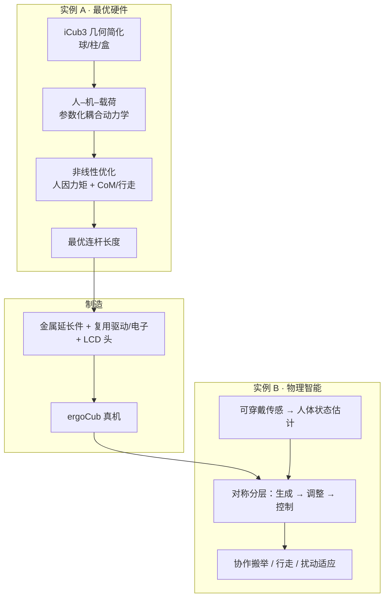
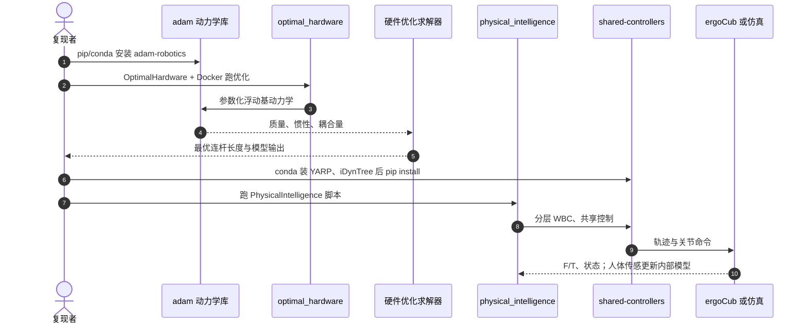

# ergoCub：面向人因的共享具身智能人形

**ergoCub**（*Towards shared embodied intelligence in humanoid robots through optimization, development and testing of the human-aware ergoCub robot*，[DOI:10.1038/s42256-026-01272-2](https://doi.org/10.1038/s42256-026-01272-2)，[*Nature Machine Intelligence* 2026](https://www.nature.com/articles/s42256-026-01272-2)，[项目页](https://ergocub.eu/)）由 **IIT**（AMI / HSP / iCub Tech）与 **INAIL** 等提出：把 **shared intelligence**（对伙伴的内部表征与协调）与 **embodied cognition**（形态–物理智能共设计）合成 **shared embodied intelligence**，在人–机耦合动力学上同时优化 **硬件** 与 **控制**，并落地协作搬举与行走真机。

## 一句话定义

**以人体生物力学指标与行走性能为目标，在可微人–机模型上联合优化人形连杆几何与分层物理智能参数，制造并验证 ergoCub。**

## 英文缩写速查

| 缩写 | 英文全称 | 简要说明 |
|------|----------|----------|
| ergoCub | ergonomics + iCub lineage | 自 iCub3 演化、面向人因协作的人形平台 |
| SEI | Shared Embodied Intelligence | 本文提出的共享具身智能架构总称 |
| WBC | Whole-Body Control | 轨迹生成→调整→QP/逆动力学执行的分层物理智能 |
| CoM | Center of Mass | 硬件优化中抬高 CoM 以增大带宽、改善行走 |
| L5–S1 | Lumbar vertebra 5 – Sacrum 1 | 搬举时腰骶关节力矩，人因主指标之一 |
| F/T | Force/Torque | 机载力/力矩传感，用于扰动估计与协作 |
| ADMM | Alternating Direction Method of Multipliers | 相关工作中四足硬件 codesign 所用方法族（本文对照） |

## 核心信息

| 字段 | 内容 |
|------|------|
| **机构** | 意大利技术研究院（Istituto Italiano di Tecnologia）；意大利国家工伤保险研究所（INAIL）；生成仿生学（GenerativeBionics）；曼彻斯特大学（University of Manchester） |
| **DOI / 刊** | [10.1038/s42256-026-01272-2](https://doi.org/10.1038/s42256-026-01272-2) / *Nat Mach Intell*（2026-07-13 VoR） |
| **平台** | **ergoCub**（约 **150 cm**；论文制造质量约 **56.70 kg**；项目页写 55.7 kg）；起点 **iCub3** |
| **任务** | 协作搬举（空 / 1 / 2 kg）+ 行走（含扰动与额定载荷约 6 kg） |
| **开源（截至 2026-07-21）** | **已开源**：论文复现仓 + [adam](https://github.com/ami-iit/adam) + [shared-controllers](https://github.com/gbionics/shared-controllers)；非整机 CAD/BOM |

## 为什么重要

- **把人写进硬件目标：** 多数人形 codesign 优化机器人能耗/地形鲁棒性；本文在设计阶段显式嵌入 **人体刚体 + 分层运动策略**，用 L5–S1 等指标塑造连杆比例。
- **硬件与物理智能两阶段闭环：** 先优化可制造连杆长度，再在固定硬件上调控制参数——给出「从优化输出到金属延长件真机」的可复述路径。
- **经典分层 WBC 的人因扩展：** 轨迹生成 / 调整 / 控制对称建模人与机器人，便于在 [WBC](../concepts/whole-body-control.md) 栈上谈伙伴感知，而非另起端到端学习范式。
- **可复现入口清晰：** adam（可微动力学）与 shared-controllers（WBC 库）独立可装，论文仓只承载窄域脚本与数据。

## 方法栈（核心结构）

| 模块 | 角色 |
|------|------|
| **参数化浮动基动力学** | 连杆长度/密度 → 质量、惯性、CoM；保证力学一致性 |
| **人体模型** | 多刚体 + 中枢（全身轨迹）/ 外周（关节反射）分层抽象 |
| **人–机–载荷耦合** | 接触力交互；硬件参数进入耦合方程 |
| **实例 A：硬件优化** | 静态多构型搬举人因 + 抬高 CoM 的行走目标；iCub3 初值与高度约束 |
| **实例 B：物理智能** | 优化增益/权重；在线 IK + MAP 力矩估计更新人体状态；LCD 反馈应力 |
| **行走栈** | 50 Hz 轨迹生成/调整（模板/质心模型）+ 500 Hz QP 瞬时控制 |

### 流程总览

## 源码运行时序图

官方复现以 [paper_sartore_2025_ergocub_nature_machine_intelligence](https://github.com/ami-iit/paper_sartore_2025_ergocub_nature_machine_intelligence) 为入口，底层动力学走 [adam](https://github.com/ami-iit/adam)，物理智能/WBC 走 [shared-controllers](https://github.com/gbionics/shared-controllers)（论文中的 `ami-iit/shared-controllers` 链至该仓）。

- **硬件支路：** 论文仓 + adam（可含 Docker）即可复述优化；不要求真机。
- **物理智能支路：** 依赖 YARP / iCub 模型生态；真机闭环另需可穿戴估计管线与机载计算（文中约 2.4 GHz i7 躯干机）。

## 工程实践

| 项 | 建议 |
|----|------|
| **选型** | 要 **人因导向硬件 codesign** 或 **iCub 系协作** → 读本页 + 跑 `optimal_hardware`；要 **学习型全身策略** → 对照 [WBC vs RL](../comparisons/wbc-vs-rl.md) |
| **动力学库** | 优化/可微优先 [adam](../../sources/repos/ami-iit-adam.md)；已有 Pinocchio 栈可对照接口而非混用假设 |
| **控制栈** | shared-controllers 钉 Python 3.10 系（README：`< 3.11`）、conda-forge YARP/iDynTree；仿真可选 Gazebo YARP 插件 |
| **人因指标** | 用 L5–S1 等 **客观力矩** 做验收；勿直接等同主观舒适分 |
| **开源状态** | 详见 [论文仓归档](../../sources/repos/paper-sartore-2025-ergocub-nmi.md)：脚本与库 **已开源**；整机图纸 **不在** 该仓 |

## 实验要点（摘要级）

> 数字以 Nature 正文为准。

| 设定 | 结果要点 |
|------|----------|
| **跟手高度误差** | 三载荷平均误差约 **0.0084 m**（最大误差均值约 0.0339 m） |
| **L5–S1 峰值（有/无机器人）** | 空载约 **43.95→24.88 Nm**；1 kg **50.66→25.77**；2 kg **44.88→31.82** |
| **步态 vs iCub3** | 最大步长 **0.35 vs 0.28 m**；最小步周期 **0.5 vs 0.8 s** |
| **扰动行走** | 持续载荷与约 60–100 N 量级臂部冲击下可调步防摔 |
| **接受度** | 850 人问卷中优于 Baxter、R1（Supplementary） |

## 常见误区或局限

- **误区：** 以为优化输出几何 = 出厂尺寸——制造有 LCD 头、延长件与密度假设误差；腿/躯干可较优化解短约 1 cm，质量显著轻于简化密度预测。
- **误区：** 把「已开源」理解成可 3D 打印整机——公开的是 **优化/控制软件与数据**，不是完整机械 BOM。
- **局限：** 硬件阶段以 **静态构型** 为主；动态人因与预测性协作仍弱（讨论中建议加短时域人体预报）。
- **局限：** 生物力学指标 ≠ 主观疲劳；长期临床/产线人体工程学验证不在本文范围。
- **局限：** 非线性优化依赖 **iCub3 初值**；换家族硬件需重新处理可制造约束与局部极小。

## 与其他工作对比

| 对照对象 | ergoCub / SEI 的差异 |
|----------|----------------------|
| **经典人形 cascade WBC** | 同样分层轨迹栈，但把 **人体模型** 嵌进硬件目标与在线物理智能 |
| **四足/少连杆 codesign（ADMM/RL/GA）** | 本文面向 **全身人形** 与 **物理 HRI**，而非仅地形/能耗 |
| **iCub3 Avatar / 遥操作线** | 同族平台；本页强调 **自主协作人因**，Avatar 计划页偏沉浸遥操作（见 [iCub3 计划实体](./paper-notebook-icub3-avatar-system-enabling-remote-fully-immers.md)） |
| **开源 DIY 人形（Berkeley / Roboto 等）** | 那些侧重低成本整机 BOM；ergoCub 侧重 **机构级人因 codesign + IIT 生态软件**（见 [开源硬件对比](./open-source-humanoid-hardware.md)） |

## 关联页面

- [Whole-Body Control](../concepts/whole-body-control.md) — 分层 QP/轨迹控制母概念。
- [Locomotion](../tasks/locomotion.md) — 行走任务与步态指标语境。
- [Sim2Real](../concepts/sim2real.md) — 优化模型与制造实现的缺口讨论。
- [Humanoid Robot](./humanoid-robot.md) — 人形平台总览。
- [iCub3 Avatar System（计划实体）](./paper-notebook-icub3-avatar-system-enabling-remote-fully-immers.md) — 同族 iCub3 遥操作条目。
- [开源人形硬件方案对比](./open-source-humanoid-hardware.md) — 硬件选型对照。
- [WBC vs RL](../comparisons/wbc-vs-rl.md) — 模型控制 vs 学习策略选型。

## 推荐继续阅读

- 论文：[*Nat Mach Intell* 正文](https://www.nature.com/articles/s42256-026-01272-2)（[DOI](https://doi.org/10.1038/s42256-026-01272-2)）
- 项目页：[ergocub.eu](https://ergocub.eu/)
- AMI 专题：[ergoCub for Physical HRI](https://ami.iit.it/en/human-robot-collaboration)
- 代码：[论文复现仓](https://github.com/ami-iit/paper_sartore_2025_ergocub_nature_machine_intelligence)、[adam](https://github.com/ami-iit/adam)、[shared-controllers](https://github.com/gbionics/shared-controllers)
- Zenodo 镜像：<https://doi.org/10.5281/zenodo.17011716>

## 参考来源

- [ergoCub Shared Embodied Intelligence 论文摘录](../../sources/papers/ergocub_shared_embodied_intelligence_nmi_s42256_026_01272_2.md)
- [ergoCub 项目页归档](../../sources/sites/ergocub-eu.md)
- [论文复现仓归档](../../sources/repos/paper-sartore-2025-ergocub-nmi.md)
- [adam 仓库归档](../../sources/repos/ami-iit-adam.md)
- [shared-controllers 仓库归档](../../sources/repos/gbionics-shared-controllers.md)
