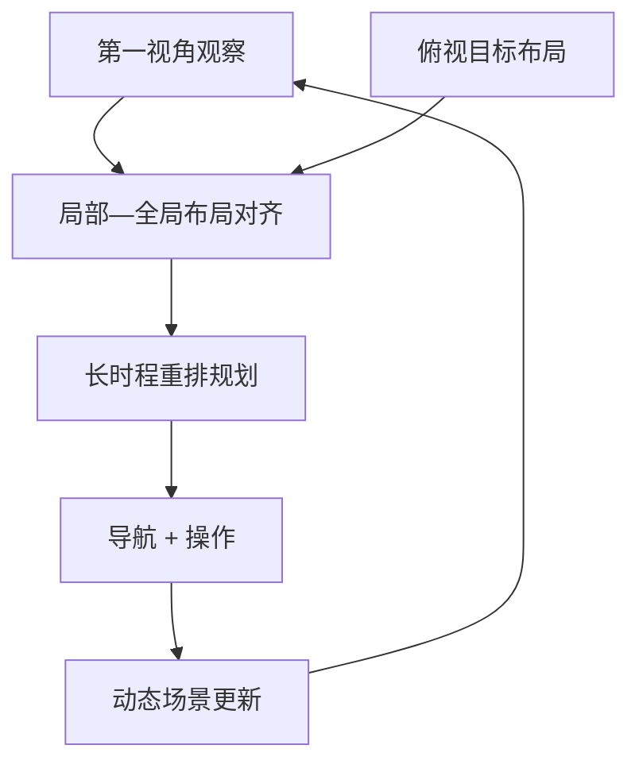

# ESRP：具身场景家具重排规划

**ESRP**（*Embodied Scene Rearrangement Planning*，[arXiv:2608.27371](https://arxiv.org/abs/2608.27371)，IEEE RA-L，[项目页](https://pie-lab.cn/ESRP/)）由 **北京理工大学（BIT）** 提出：agent 在 **无全局状态** 条件下，仅凭 **第一视角观察** 与 **俯视目标布局图**，将三维室内家具重排至目标构型。

## 一句话定义

**场景重排的难点是持续维护局部观察与全局目标布局的对应，而非识别单件家具。**

## 英文缩写速查

| 缩写 | 英文全称 | 简要说明 |
|------|----------|----------|
| ESRP | Embodied Scene Rearrangement Planning | 本文任务名 |
| TAMP | Task and Motion Planning | 分层任务—运动规划基线 |
| IL | Imitation Learning | 模仿学习基线 |
| RL | Reinforcement Learning | 强化学习基线 |

## 为什么重要

- 纳入 [2026-08-31 九篇盘点](../../sources/blogs/wechat_embodied_station_clap_9_papers_open_source_2026-08-31.md) 的「长时程规划」支线。
- 相对桌面重排与二维全局布局任务，引入 **三维遮挡、相互依赖与动态场景演化**。
- ESRP-Bench 规模：**5400+ 场景对、8200+ 物体**（OmniGibson + 3D-FRONT）。

## 核心信息

| 项 | 内容 |
|----|------|
| **机构** | 北京理工大学（BIT） |
| **基准** | ESRP-Bench（三级指标 + 难度分级） |
| **基线** | 分层 TAMP、VLM、IL、RL 四类 |
| **开源** | **未开源** 训练仓；项目页提供任务/基准说明 |

### 流程总览

## 评测

- 实验显示现有方法 **难以高效完成** 重排，凸显局部可观测下的长时程对齐难题。
- 数据出处：[ingest 摘录](../../sources/papers/esrp_arxiv_2608_27371.md)。

## 结论

**ESRP 把「看不见全局」的三维家具重排推成具身长时程规划的前沿考题。**

- 仅 egocentric + 俯视目标，禁止全局状态
- 物体遮挡与相互依赖制造物理死锁风险
- 大规模 ESRP-Bench 与四类基线便于横向对比
- 当前 VLM / IL / RL 均未高效解决
- 复现时区分项目页说明与可下载代码（截至入库日无公开仓）

## 源码运行时序图

源码运行时序图 | **不适用**（截至 2026-08-31 项目页未提供可运行训练/评测仓库）。

## 局限与风险

- **无代码：** 复现依赖后续发布或自行按论文重建 OmniGibson 环境。
- **任务难度：** 家具尺度 + 导航—操作耦合，sim-to-real 成本高。
- **观测受限：** 俯视目标图与 egocentric 对齐本身易累积误差。

## 关联页面

- [Manipulation](../tasks/manipulation.md)
- [VLA](../methods/vla.md)
- [CLAP / 跨本体 9 篇技术地图](../overview/clap-cross-embodiment-vla-wm-9-papers-technology-map.md)

## 参考来源

- [esrp_arxiv_2608_27371](../../sources/papers/esrp_arxiv_2608_27371.md)
- [pie-lab-esrp](../../sources/sites/pie-lab-esrp.md)
- [wechat_embodied_station_clap_9_papers_open_source_2026-08-31](../../sources/blogs/wechat_embodied_station_clap_9_papers_open_source_2026-08-31.md)

## 推荐继续阅读

- [arXiv:2608.27371](https://arxiv.org/abs/2608.27371)
- [ESRP 项目页](https://pie-lab.cn/ESRP/)
