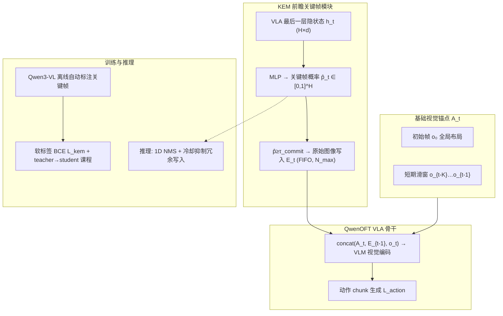

# EventVLA（Event-Driven Visual Evidence Memory for Long-Horizon VLA）

**EventVLA**（arXiv:[2606.20092](https://arxiv.org/abs/2606.20092)，[项目页](https://ganlin-yang.github.io/EventVLA.github.io/)，[代码](https://github.com/InternRobotics/EventVLA)，USTC / 上海 AI Lab / SJTU / HKU / 清华 / 北大 / 华为等）提出面向 **非马尔可夫长程操作** 的 **稀疏视觉证据记忆** 端到端框架：用 **基础视觉锚点**（初始帧 + 短期历史滑窗）覆盖布局持久任务，并以 **Keyframe Evidence Memory（KEM）** 从 VLA 动作 chunk 隐状态 **前瞻预测** 未来关键帧概率，将 **原始关键图像** 写入有界 FIFO 缓冲；训练依赖 **Qwen3-VL 离线自动标注** 与软标签 BCE，推理以 **NMS + 冷却** 保持稀疏写入。同步发布 **RoboTwin-MeM** 基准（8 任务、中间关键帧数 $n\in[1,5]$）。在 **17 项仿真记忆任务 + 4 项真机双臂任务** 上，相对 SOTA 记忆增强 VLA 平均成功率约 **+40%**。

## 一句话定义

用 **规则锚点 + 学习式前瞻 KEM** 只保留稀疏、任务相关的 **原始关键帧图像**，在 **QwenOFT** 骨干上端到端联合训练动作与关键帧预测，解决遮挡与瞬态证据消失下的长程 VLA 记忆瓶颈。

## 英文缩写速查

| 缩写 | 英文全称 | 简要说明 |
|------|----------|----------|
| EventVLA | Event-Driven Visual Evidence Memory VLA | 本文事件驱动视觉证据记忆 VLA 框架 |
| KEM | Keyframe Evidence Memory | 前瞻式关键帧证据记忆模块 |
| VLA | Vision-Language-Action | 视觉-语言-动作多模态策略 |
| VA | Visual Anchors | 基础视觉锚点（初始帧 + 短期滑窗） |
| NMS | Non-Maximum Suppression | 一维非极大值抑制，推理时离散化关键帧写入 |
| FIFO | First-In First-Out | 事件缓冲满容量时的先进先出驱逐策略 |
| BCE | Binary Cross-Entropy | KEM 关键帧概率头的 chunk-wise 监督损失 |

## 为什么重要

- **直击非马尔可夫操作：** 遮挡、揭盖、计数、演示复现等任务中，关键视觉证据 **短暂出现后即不可见**；纯当前观测 VLA 与固定历史窗口均失效。
- **稀疏证据 vs 稠密缓冲：** 相对 MemoryVLA 等盲目堆帧，EventVLA 只保留 **初始布局 + 短期运动 + 少量事件关键帧**，在 RoboTwin-MeM 上从 **18.0%（仅锚点）跃升至 75.2%（+KEM）**。
- **端到端、无在线 VLM 分解：** KEM 为与动作头并行的轻量预测头，共享 transformer 隐状态，避免双系统延迟与规划误差传播。
- **基准与代码一并开源：** **RoboTwin-MeM** 显式参数化中间记忆需求 $n$，填补 RMBench 等可被静态锚点「取巧」解决的评测空白；实现基于 **StarVLA / QwenOFT**。

## 流程总览

## 核心机制与实验结果（归纳）

### 1）问题形式化与视觉锚点

| 组件 | 定义 | 作用 |
|------|------|------|
| **策略** | $a_t=\pi(o_t,M_{t-1},l)$ | 显式条件于稀疏记忆缓冲 |
| **记忆** | $M_t=A_t\cup E_t$ | 锚点 + 事件关键帧 |
| **锚点** | $A_t=\{o_0\}\cup\{o_{t-K},\dots,o_{t-1}\}$ | 不变场景布局 + 局部运动线索 |

RMBench 上 **仅 VA** 即 **67.8%**；去掉 $o_0$ 或短期历史分别 **33.7%** / **23.8%**，证明锚点对「布局型记忆」任务不可或缺。

### 2）KEM：前瞻式关键帧写入

- **输入：** 动作 chunk 长度 $H$ 上的共享隐状态 $h_t$（已融合当前视觉与动作查询 token）。
- **输出：** $\hat{\mathbf{p}}_t=[\hat{p}_t^1,\dots,\hat{p}_t^H]$，每维为对应未来步成为关键帧的概率。
- **写入：** 超阈值 $\tau_{\text{commit}}$ 的步将 **原始 RGB 帧** 入 $E_t$；$N_{\max}$ 容量 **FIFO** 驱逐最旧事件帧。
- **读取：** 锚点、事件缓冲与当前帧 **时序拼接** 后送入 VLM encoder，由自注意力跨帧关联。

**设计要点：** chunk-wise 预测使策略能在整个 upcoming horizon 上规划「记忆日程」，捕捉在 chunk 中部短暂出现又消失的证据（纯逐步分类会漏检）。

### 3）训练与推理细节

| 字段 | 内容 |
|------|------|
| **骨干** | **QwenOFT**（StarVLA 开源栈）；动作 chunk **H=50** |
| **KEM 监督** | **Qwen3-VL** 自动 pipeline 从演示提取 GT 关键帧；**时序平滑软标签** + $L_{\text{kem}}$ |
| **联合损失** | $L=L_{\text{action}}+\lambda L_{\text{kem}}$ |
| **课程** | 记忆构建从 GT 逐步过渡到模型自主预测 |
| **推理稀疏化** | **1D NMS** + 时间冷却，防止缓冲被冗余帧淹没 |

### 4）RoboTwin-MeM 基准

| 维度 | 内容 |
|------|------|
| **平台** | [RoboTwin 2.0](./robotwin.md) + SAPIEN；统一数据合成与评测管线 |
| **任务数** | 8 项非马尔可夫双臂任务 |
| **难度参数** | $n$ = 须保留的**中间事件关键帧数**（1–5） |
| **步长** | 平均 **430–1544** 步/episode |
| **诊断能力** | 瞬态识别、事件计数、in-context 路径复现 |

代表任务：Pick the Unhidden Block（$n=3$）、Cover Blocks Hard（$n=4$）、Press Button Keyframe（$n\in[2,5]$）、Reproduce Route（$n=4$）。

### 5）主要实验结果

**RMBench（VA only）：**

| 方法 | 平均成功率 |
|------|------------|
| $\pi_{0.5}$ | 10.4% |
| MemoryVLA (QwenOFT) | 41.7% |
| Mem-0 | 42.0% |
| **EventVLA (VA only)** | **67.8%** |

**RoboTwin-MeM：**

| 配置 | 平均成功率 |
|------|------------|
| $\pi_{0.5}$ | 7.8% |
| MemoryVLA (QwenOFT) | 10.8% |
| EventVLA (VA only) | 18.0% |
| **EventVLA (VA+KEM)** | **75.2%** |
| 隐式潜记忆 bank | 24.9% |

**RoboTwin 2.0 标准任务：** Easy **83.8%** / Hard **81.6%**（QwenOFT **80.0%** / **78.0%**）——记忆机制未损害马尔可夫闭环控制。

**真机 ARX ACONE 双臂（20 trials/任务）：**

| 任务 | EventVLA | $\pi_{0.5}$ | $\pi_{MEM}$ |
|------|----------|-------------|-------------|
| Find Block Easy | **90%** | 10% | 50% |
| Find Block Hard | **60%** | 0% | 35% |
| Pick-X-Times | **90%** | 5% | 30% |
| Pick in Order | **75%** | 0% | 40% |

**关键消融（RoboTwin-MeM）：** 去掉 NMS → **53.4%**；$N_{\max}=2$ → **32.0%**；chunk=15 → **13.6%**（前瞻窗口过短无法主动排程）。

## 常见误区或局限

- **不是 KEMO 的简单复刻：** [KEMO](./paper-kemo-event-driven-keyframe-memory-vla.md) 用 **运动学减速峰 + DINOv2** 规则选帧 + **cross-attention 融合** 进 π₀.₅；EventVLA 用 **学习式前瞻预测 + 原始图像拼接** 进 QwenOFT，监督来自 **VLM 自动标注**。
- **锚点 alone 不够：** 在 RoboTwin-MeM 上仅 **18%**；中间瞬态证据必须靠 KEM 动态捕获。
- **隐式记忆 bank 会崩：** 用潜表示替代原始帧拼接时成功率 **24.9%**，说明 **保留原始关键帧细节** 对本任务族至关重要。
- **FIFO 容量边界：** 论文承认 **>10 min**、高密度事件场景可能因缓冲饱和丢失早期证据；未来需分层或压缩记忆。
- **骨干绑定 QwenOFT：** 与 π 系、OpenVLA 系记忆模块 **不可直接互换**；跨骨干需重训 KEM 与标注管线。

## 与其他页面的关系

- 任务语境：[Manipulation](../tasks/manipulation.md)、[Bimanual Manipulation](../tasks/bimanual-manipulation.md) — 长程双臂与记忆依赖操作。
- 方法谱系：[VLA](../methods/vla.md) — 记忆增强 VLA 子路线；[StarVLA](../methods/star-vla.md) — QwenOFT 实现栈。
- 相邻记忆工作：[KEMO](./paper-kemo-event-driven-keyframe-memory-vla.md) — 运动学事件选帧 + π₀.₅ 门控融合对照。
- 仿真平台：[RoboTwin 2.0](./robotwin.md) — RoboTwin-MeM 底层数据与评测环境。
- 动作接口：[Action Chunking](../methods/action-chunking.md) — $H=50$ chunk 与 KEM 前瞻窗口对齐。

## 参考来源

- [eventvla_arxiv_2606_20092.md](../../sources/papers/eventvla_arxiv_2606_20092.md)

## 推荐继续阅读

- Yang et al., *EventVLA: Event-Driven Visual Evidence Memory for Long-Horizon Vision-Language-Action Policies* — <https://arxiv.org/abs/2606.20092>
- [EventVLA 项目页](https://ganlin-yang.github.io/EventVLA.github.io/) — 任务视频、RoboTwin-MeM 示意与引用
- [InternRobotics/EventVLA](https://github.com/InternRobotics/EventVLA) — 代码、模型与 RoboTwin-MeM 数据
- Chen et al., *RMBench: Memory-Dependent Robotic Manipulation Benchmark* — <https://arxiv.org/abs/2603.01229>（对比评测套件）
- Shi et al., *MemoryVLA: Perceptual-Cognitive Memory in Vision-Language-Action Models* — <https://arxiv.org/abs/2508.19236>（稠密记忆缓冲对照）
