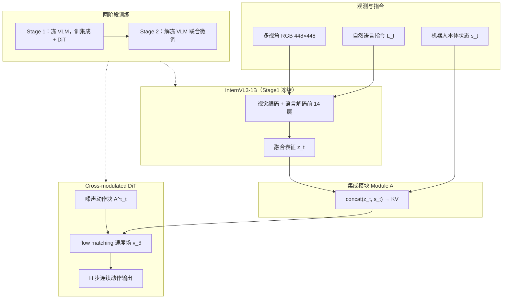

# Evo-1：轻量 VLA 与语义对齐保持

**Evo-1**（*Lightweight Vision-Language-Action Model with Preserved Semantic Alignment*，arXiv:[2511.04555](https://arxiv.org/abs/2511.04555)，**CVPR 2026**，Efficient CVPR Badge）由上海交通大学 MINT-SJTU 团队等提出：在仅 **0.77B** 参数下，用 **原生多模态 InternVL3-1B 骨干**、**cross-modulated DiT flow-matching 动作专家** 与 **跨注意力集成模块**，配合 **两阶段训练**（先冻 VLM 对齐动作头，再全量微调）**保持视觉–语言语义空间**，实现 **无需大规模机器人数据预训练** 的强仿真与真机表现，并 **官方集成 [LeRobot](./lerobot.md)** 支持 SO100/SO101 一条命令部署。

## 一句话定义

**用亚十亿 InternVL 骨干 + 纯 cross-attention DiT 动作头，分两阶段把「看懂指令」与「输出连续动作块」对齐，避免端到端微调把 VLM 语义训坏，从而在消费级 GPU 上做到高频推理与跨扰动泛化。**

## 英文缩写速查

| 缩写 | 英文全称 | 简要说明 |
|------|----------|----------|
| Evo-1 | Evo-1 VLA | 本文轻量视觉–语言–动作模型简称 |
| VLA | Vision-Language-Action | 视觉、语言与动作统一的多模态策略 |
| VLM | Vision-Language Model | 预训练视觉–语言骨干；本文用 InternVL3-1B |
| DiT | Diffusion Transformer | 扩散式 Transformer 动作解码器 |
| FM | Flow Matching | 流匹配生成范式，学习动作速度场 |
| BC | Behavior Cloning | 监督模仿；本文主训练范式 |
| CVPR | Conference on Computer Vision and Pattern Recognition | 计算机视觉顶会，本文录用 venue |

## 为什么重要

- **效率–性能新平衡点：** **0.77B** 无机器人预训练即在 **Meta-World 80.6%**、**LIBERO 94.8%**、**RoboTwin 37.8%** 超越更大模型（SmolVLA 2.25B、π₀ 3.5B 等），真机四任务平均 **78%**。
- **部署友好：** RTX 4090d 上 **2.3 GB 显存 / 16.4 Hz**，显著优于 OpenVLA 7B（15.1 GB / 7.9 Hz），适合 **实时交互式操作**。
- **语义保持训练可复现：** 两阶段范式 + 注意力可视化表明 **InternVL 语义聚焦不被机器人微调破坏**；相对 OpenVLA/Prismatic 的语义漂移，给出 **轻量 VLA 泛化** 的具体训练配方。
- **LeRobot 生态落地：** 数据 **LeRobot v2.1**、训练脚本与 **2026-07 并入官方 LeRobot 主仓**，降低「论文模型 → SO100/SO101 真机」摩擦。

## 方法栈（核心结构）

| 模块 | 角色 |
|------|------|
| **InternVL3-1B 骨干** | InternViT-300M + Qwen2.5-0.5B；448×448 + pixel-unshuffle；**保留语言分支前 14 层** 服务 visuomotor |
| **Cross-modulated DiT 动作专家** | **纯 cross-attention** DiT；**flow matching** 预测连续 **H 步 action chunk** |
| **集成模块（Module A）** | VLM 第 14 层 **zt** 与本体 **st 拼接** → DiT key-value；噪声动作作 query |
| **Stage 1** | **冻结 VLM**；只训集成模块 + 动作专家（`--finetune_action_head`） |
| **Stage 2** | **解冻 VLM** 全量微调（`--finetune_vlm`）；保持语义同时深化任务适配 |

### 流程总览

## 实验要点（摘要级）

> 数字以 [arXiv:2511.04555](https://arxiv.org/abs/2511.04555) 与 [官方 README](https://github.com/MINT-SJTU/Evo-1) 为准。

| 设定 | 要点 |
|------|------|
| **Meta-World** | 50 演示/任务；四难度平均 **80.6%**（前 SOTA SmolVLA 68.2%） |
| **LIBERO** | 40 任务四子集平均 **94.8%**；long **92.3%** |
| **RoboTwin** | 双臂 Aloha-AgileX 四任务；平均 **37.8%**（超 π₀ 30.9%） |
| **真机 xArm6** | 四任务各 100 演示训练、20 次评测；平均 **78%** |
| **泛化扰动** | 未见物体/背景/位姿/高度变化下显著优于 SmolVLA（基线 95% vs 75%） |
| **规模与预训练** | **0.77B**；**无 OXE/DROID 类机器人预训练** |

## 部署与 LeRobot 集成

- **仿真：** `Evo1_server.py` WebSocket 服务 + Meta-World / LIBERO 客户端脚本。
- **自定义本体：** 构造 `image` / `image_mask` / `state` / `action_mask` / `prompt` 观测字典（图像需 448×448），参考 `Evo1_client_xarm6.py`。
- **LeRobot SO100/SO101：** 官方主仓已内置；`lerobot-record --robot.type=so100_follower --policy.path=<checkpoint> ...`；权重 `MINT-SJTU/Evo1_SO100`。
- **训练：** 数据转 **LeRobot v2.1** → DeepSpeed `accelerate launch` 两阶段 `train.py`；FlashAttention 安装对稳定性影响大。

## 常见误区或局限

- **误区：** 把「轻量」等同于「牺牲 LIBERO 长程」——Evo-1 在 **long 子集 92.3%** 仍具竞争力。
- **误区：** 认为两阶段只是工程技巧——论文用 **注意力图对比** 证明其直接关联 **语义保持与泛化**。
- **局限：** 当前公开叙事以 **单臂/双臂桌面操作** 为主；向 **人形全身 loco-manip** 扩展需独立验证。
- **局限：** RoboTwin **50 任务全量结果** 与评测脚本仍待官方发布（README To-Do）。

## 与其他工作对比

| 对照对象 | Evo-1 的差异 |
|----------|-------------|
| **SmolVLA / TinyVLA** | 同为亚十亿轻量 VLA；Evo-1 强调 **语义保持两阶段训练** 与 **纯 cross-attention DiT**，复杂任务成功率更高 |
| **π₀ / OpenVLA** | 参数量与显存远小；**无机器人预训练** 仍可在多基准匹配或超越 |
| **MINT** | 同 MINT-SJTU 生态；MINT 解耦 **频域意图–执行 token**，Evo-1 解耦 **训练阶段上的感知 vs 控制** |
| **Green-VLA / Qwen-VLA** | 后者走 **多阶段大规模预训练通才**；Evo-1 走 **小模型 + 语义保持微调** 的部署优先路线 |

## 关联页面

- [VLA（Vision-Language-Action）](../methods/vla.md) — 轻量 flow-VLA 与工程瓶颈语境。
- [LeRobot (Hugging Face)](./lerobot.md) — Evo-1 **官方内置策略** 与 SO100/SO101 部署路径。
- [MINT](./paper-mint-vla.md) — 同机构不同 VLA 泛化路线（频域意图分词）。
- [Diffusion Policy](../methods/diffusion-policy.md) — 连续动作扩散/流匹配策略族。
- [Action Chunking](../methods/action-chunking.md) — H 步动作块输出与异步部署。
- [Manipulation](../tasks/manipulation.md) — Meta-World / LIBERO / 真机操作评测背景。

## 参考来源

- [Evo-1 论文摘录（CVPR 2026 / arXiv:2511.04555）](../../sources/papers/evo1_arxiv_2511_04555.md)
- [MINT-SJTU/Evo-1 仓库归档](../../sources/repos/mint_sjtu_evo1.md)

## 推荐继续阅读

- 论文 PDF：<https://arxiv.org/pdf/2511.04555>
- 项目主页：<https://mint-sjtu.github.io/Evo-1.io/>
- 官方代码：<https://github.com/MINT-SJTU/Evo-1>
- Hugging Face 权重：<https://huggingface.co/MINT-SJTU/Evo1_LIBERO>
- LeRobot 官方集成公告（仓库 News）：<https://github.com/huggingface/lerobot>
