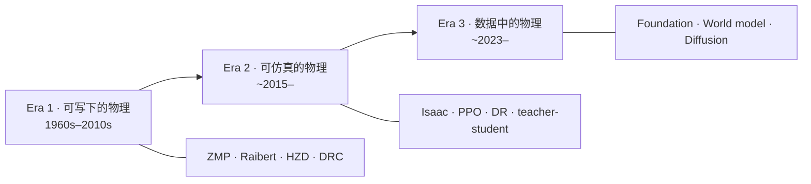

# Evolution of Humanoid Locomotion Control（Science Robotics 2026 Review）

**Evolution of Humanoid Locomotion Control**（Yan Gu* / Guanya Shi* / Fan Shi* 等；Aaron D. Ames†、Hao Su†、Koushil Sreenath†；**Science Robotics** Vol. 11 Issue 117，[DOI:10.1126/scirobotics.aed3973](https://doi.org/10.1126/scirobotics.aed3973)，2026）是 Purdue TRACE Lab 牵头的人形 **locomotion 控制综述**：从六十年代至今，按 **可写下的物理 → 可大规模仿真的物理 → 从数据学习的物理** 三时代梳理方法，并主张行业正收敛向 **physics-guided generative intelligence**（优化 + 学习 + 预测推理）。

## 一句话定义

**用三时代 + System1/2 双层统一视图，把 ZMP/HZD/MPC、Isaac+PPO 与 foundation/world model 生成控制串成一条「物理从未被替换，只是搬进仿真器、reward 与实时接口」的演进叙事，并给出安全、可及性与 human-level 能力的开放议程。**

## 英文缩写速查

| 缩写 | 英文全称 | 简要说明 |
|------|----------|----------|
| HZD | Hybrid Zero Dynamics | 混合零动力学；经典双足步态稳定框架 |
| ZMP | Zero Moment Point | 零力矩点；预览控制与支撑多边形 |
| MPC | Model Predictive Control | 模型预测控制；whole-body / perceptive locomotion |
| LIP | Linear Inverted Pendulum | 线性倒立摆；3D-LIPM 等降阶模型 |
| DR | Domain Randomization | 域随机化；Sim2Real 核心手段 |
| WBC | Whole-Body Control | 全身控制；与 MPC/QP 栈衔接 |

## 核心信息

| 项 | 内容 |
|----|------|
| **机构** | 普渡大学（Purdue）TRACE Lab；加州理工学院（Caltech）；加州大学圣地亚哥分校（UCSD）；加州大学伯克利分校（UC Berkeley）等 |
| **类型** | Science Robotics **Review / Survey**（~280 参考文献） |
| **论文** | <https://www.science.org/doi/10.1126/scirobotics.aed3973> |
| **PubMed** | <https://pubmed.ncbi.nlm.nih.gov/42616832/> |
| **Companion** | <https://github.com/purdue-tracelab/Humanoid-Locomotion-Survey>（PDF + Fig.1–5 + 分 section 阅读列表） |
| **阅读伴侣** | <https://thejerrycheng.github.io/locomotion.html>（共同作者个人页；**非官方**） |
| **开源** | **Companion 已开源**；**无可运行控制/训练代码**（综述） |

## 为什么重要

- **人形控制「总综述」锚点：** 相对 [Legged robots advances & challenges](./paper-legged-robots-advances-challenges.md) 的 **硬件–自主–伦理五柱**，本篇 **聚焦 locomotion 控制范式史** 与 **方法族地图**，适合作为 [人形 RL 身体系统栈](../overview/humanoid-rl-motion-control-body-system-stack.md) 的 **SciRobotics 正式入口**。
- **三时代框架可教学：** 把「经典栈没死，只是进了 simulator/reward」讲清楚，避免 **RL 取代物理** 或 **物理否定 learning** 的二元叙事。
- **实践向 getting-started：** 文内列 **开源/商业硬件**、**OCS2/Isaac Lab/MJLab** 工具链与 **七步 RL 进度表**，可直接挂接 [Humanoid Control Roadmap](../roadmaps/humanoid-control-roadmap.md)。
- **开放问题对齐部署：** 安全/recovery 测试、成本可及性、loco-manipulation 与 **双层 cognitive–motor hierarchy** 与当前产业痛点一致。

## 核心原理

### 三时代演进（Fig. 1）

| 时代 | 控制器考虑范围 | 典型成就 |
|------|----------------|----------|
| **经典** | 降阶/全阶动力学模型 | 约束地形稳定行走、Atlas 经典 parkour |
| **学习** | GPU 并行仿真 + 有限真机 | 盲楼梯、跑酷、motion imitation、人形乒乓球 |
| ** emerging ** | 真机丰富动力学 + 互联网数据 | 开放世界 loco-manipulation（**可靠性仍开放**） |

### 统一双层视图（Fig. 3）

- **System 2（慢）：** 目标、语义、任务级推理
- **System 1（快）：** 高频闭环 motor control

经典层次结构、端到端 RL policy、foundation-model stack **均可映射** 到该图；**代际差异在于哪一层显式建模、哪一层学习**。

### 三大贯穿原则（全文结论主线）

1. **Physics-based modelling** — 方程 / 仿真器 / reward / 实时接口中的物理
2. **Constrained decision making** — 支撑多边形与力矩限 → shaping/curriculum/limit → conditioning
3. **Adaptation to uncertainty** — 鲁棒/自适应控制 → domain randomization → test-time / in-context adaptation

### 方法族覆盖（companion 组织）

| 区块 | 代表内容 |
|------|----------|
| **Modeling** | LIP/ALIP/H-LIP、centroidal dynamics、SRB-MPC |
| **Feedback** | ZMP preview、HZD |
| **Predictive** | Whole-body MPC、SQP、iLQR、MPPI、DIAL-MPC |
| **Sim learning** | Isaac Gym/Lab、MuJoCo Playground、PPO、DR、curriculum、privileged learning |
| **Real data** | AMASS、BeyondMimic、actuator ID、residual dynamics |
| **Emerging** | Fig.5 五维 shift：learning paradigm / modality / task / functionality / computation |

### Fig.2 建模光谱

从 **解析 reduced-order / full-order / simulator** 到 **learned dynamics / latent / world models**，hybrid（learned actuator、residual dynamics）在中间——**选型决定表达力、评估成本与失败模式**。

## 评测与指标

- **综述体例：** 不以单一 benchmark 排行榜为主，而以 **时代能力边界**、**代表系统里程碑** 与 **开放挑战** 组织证据。
- **Companion 可核对：** GitHub 提供 **分 section 引用列表**（经典 + 仿真学习已发布）；共同作者 [阅读伴侣](https://thejerrycheng.github.io/locomotion.html) 将 **280 篇** 按 **17 method families / 30 subjects** 可检索化（非官方 endorsement）。
- **与 [Legged robots 2026 Review](./paper-legged-robots-advances-challenges.md) 分工：** 后者偏 **产业/伦理/五柱能力**；本篇偏 **控制范式史与工具链**。

## 与其他工作对比

| 对照 | 读法 |
|------|------|
| [Legged robots advances & challenges](./paper-legged-robots-advances-challenges.md) | 同刊 SciRobotics 2026 **腿式总览**（人形+四足+政策）；本篇 **深潜 humanoid locomotion 控制** |
| [人形 RL 身体系统栈](../overview/humanoid-rl-motion-control-body-system-stack.md) | 本库 **42 篇 RL 综述** 坐标；本篇 **期刊级正式 Review + 280 refs** |
| [AMP 运动先验专题](../overview/humanoid-amp-motion-prior-survey.md) | 专精 **AMP 横切面**；本篇 **全范式史**（含经典 MPC/HZD） |
| [Humanoid Control Roadmap](../roadmaps/humanoid-control-roadmap.md) | 学习 **路径**；本篇 **文献史 + 原则** |

## 结论

**本篇是 2026 年人形 locomotion 控制的 SciRobotics 锚点综述：用三时代 + 三原则读范式迁移，用 companion 280 refs 做文献地图；落地优先跟 getting-started 七步与开源栈，开放问题首看 safety/recovery 与 test-time adaptation。**

- **入门读法：** DOI 摘要 → GitHub PDF → 按所处时代跳 **Modeling** 或 **Learning from simulation** 阅读列表。
- **经典栈未过时：** OCS2/acados + MPC/WBC 仍是 **System 1 实时层** 主流；RL 多占 **仿真预训练 + 残差/跟踪** 层。
- **RL 七步路线：** 文内 Isaac Lab 进度表可对齐 [roadmap](../roadmaps/humanoid-control-roadmap.md) 阶段二–三。
- **生成式时代：** world model / diffusion 进 **Emerging**；部署前仍缺 **可靠性标准**（文内强调 recovery/impact 测试）。
- **硬件选型：** 开源（Berkeley Humanoid、ToddlerBot）vs 商业（[Unitree G1](./unitree-g1.md) 等）决定 **复现 vs 产能** 权衡。
- **勿混淆官方与伴侣站：** [locomotion.html](https://thejerrycheng.github.io/locomotion.html) 便于 **检索 280 refs**，引用仍以 **DOI + companion** 为准。

## 工程实践

| 项 | 建议 |
|----|------|
| **PDF** | [GitHub 官方 PDF](https://github.com/purdue-tracelab/Humanoid-Locomotion-Survey/blob/main/Evolution_of_Humanoid_Locomotion_Control_20260819.pdf) |
| **引用列表** | Clone companion；经典/学习 section 已维护，emerging 关注 repo 更新 |
| **经典软件** | MIT Cheetah、OpenLoong、CasADi、acados、OCS2、Judo |
| **学习软件** | Isaac Lab、MuJoCo Playground、MJLab、Newton/Genesis |
| **数据** | AMASS、BeyondMimic 等（文内 getting-started） |
| **检索** | 作者阅读伴侣按 method/subject 过滤（非官方） |

## 源码运行时序图

**不适用** — 本文为 Science Robotics **Review**，[`purdue-tracelab/Humanoid-Locomotion-Survey`](https://github.com/purdue-tracelab/Humanoid-Locomotion-Survey) 提供 PDF、图表与 **分 section 阅读列表**，**不含** 可运行的训练/部署流水线；复现应跟随文内指向的 **OCS2 / Isaac Lab / 具体论文官方仓库**。

## 局限与风险

- **Survey 时效：** 生成式与 foundation 栈迭代极快；**Emerging** section  companion 列表 **仍在补充**。
- **范围边界：** 聚焦 **locomotion control**，**不全文覆盖 manipulation/VLA**（仅在 emerging/loco-manip 延伸讨论）。
- **阅读伴侣非官方：** Jerry Cheng 页的 subject/方程归类 **便于学习**，不等同期刊正文。
- **出版社访问：** Science.org 全文可能受订阅限制；优先 **GitHub PDF** 与 PubMed 摘要。

## 关联页面

- [人形 RL 运动控制身体系统栈](../overview/humanoid-rl-motion-control-body-system-stack.md)
- [Humanoid Control Roadmap](../roadmaps/humanoid-control-roadmap.md)
- [Humanoid Locomotion 任务](../tasks/humanoid-locomotion.md)
- [Legged robots advances & challenges](./paper-legged-robots-advances-challenges.md)
- [Whole-Body Control](../concepts/whole-body-control.md)
- [Sim2Real](../concepts/sim2real.md)
- [Unitree G1](./unitree-g1.md)

## 参考来源

- [`evolution_humanoid_locomotion_control_scirobotics_2026.md`](../../sources/papers/evolution_humanoid_locomotion_control_scirobotics_2026.md)
- [`purdue-tracelab-humanoid-locomotion-survey.md`](../../sources/sites/purdue-tracelab-humanoid-locomotion-survey.md)
- [`humanoid-locomotion-survey.md`](../../sources/repos/humanoid-locomotion-survey.md)
- [`jerry-cheng-locomotion-reading-companion.md`](../../sources/sites/jerry-cheng-locomotion-reading-companion.md)
- 论文：<https://doi.org/10.1126/scirobotics.aed3973>

## 推荐继续阅读

- [Official companion repository](https://github.com/purdue-tracelab/Humanoid-Locomotion-Survey)
- [Reading companion（非官方）](https://thejerrycheng.github.io/locomotion.html)
- [Science Robotics DOI landing](https://www.science.org/doi/10.1126/scirobotics.aed3973)
