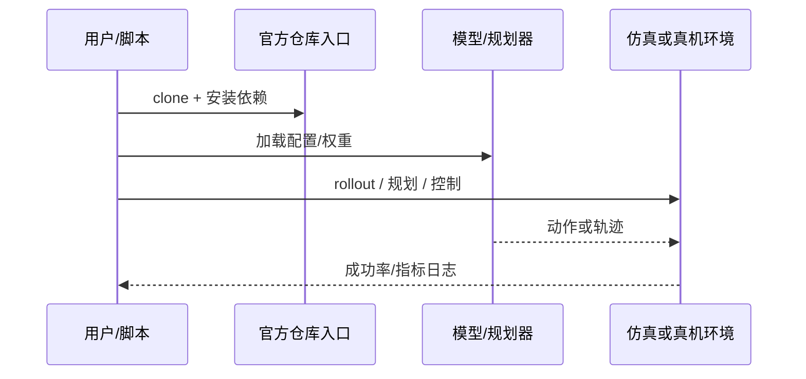

# EVPeriscope（arXiv:2609.11920）

**EVPeriscope**（[EVPeriscope: Extended Perception across Aerial and Ground Vehicles with Event-based Propeller Tracking](https://arxiv.org/abs/2609.11920)）来自 [具身智能小站 14 篇盘点](../../sources/blogs/wechat_embodied_station_14_papers_dexterous_wm_humanoid_2026-09-11.md)。地面机器人事件相机追踪旋翼实现空地无标记相对定位；田野测试含 15 mph 风与夜间。

## 一句话定义

**无人机作地面机器人「空中潜望镜」，用事件相机追踪旋翼高频信号扩展感知。**

## 英文缩写速查

| 缩写 | 英文全称 | 简要说明 |
|------|----------|----------|
| VLA | Vision-Language-Action | 视觉-语言-动作策略 |
| VLM | Vision-Language Model | 视觉-语言多模态模型 |
| WM | World Model | 预测未来观测或表征的动力学模型 |
| IL | Imitation Learning | 模仿学习 |
| RL | Reinforcement Learning | 强化学习 |
| DoF | Degrees of Freedom | 自由度 |

## 为什么重要

- 纳入本期 **灵巧手 / 世界模型 / 人形控制 / VLA** 主线之一。
- 开源状态：**已开源**（步骤 2.5 核查，2026-09-11）。
- 与 [14 篇技术地图](../overview/dexterous-wm-humanoid-14-papers-technology-map.md) 中同类工作可横向对照。

## 核心机制

| 项 | 内容 |
|----|------|
| **arXiv** | [2609.11920](https://arxiv.org/abs/2609.11920) |
| **项目页** | https://ongdexter.github.io/evperiscope |
| **代码/资源** | https://github.com/grasp-lyrl/evperiscope |
| **开源** | **已开源** |
| **文内指标** | 田野测试覆盖最高 15 mph 风速与夜间条件。 |

## 源码运行时序图

## 实验与评测

| 项 | 文内口径 |
|----|----------|
| 要点 | 田野测试覆盖最高 15 mph 风速与夜间条件。 |

- **读法：** 本页为索引级摘要，上表取自 [公众号盘点](../../sources/blogs/wechat_embodied_station_14_papers_dexterous_wm_humanoid_2026-09-11.md) 与项目页；具体对照方法、任务集与逐项指标以 **原文 PDF** 为准（[参考来源](#参考来源)）。

## 结论

**EVPeriscope 适合作为本期「已开源」边界下的快速索引页，部署前请核对仓库/README 可运行性。**

1. 核心贡献：无人机作地面机器人「空中潜望镜」，用事件相机追踪旋翼高频信号扩展感知。
2. 开源结论：**已开源** — 以项目页实际链接为准（入库日 2026-09-11）。
3. 横向对照见 [14 篇技术地图](../overview/dexterous-wm-humanoid-14-papers-technology-map.md)，避免与同 arXiv 重复造页。

## 关联页面

- [14 篇技术地图](../overview/dexterous-wm-humanoid-14-papers-technology-map.md)
- [VLA（Vision-Language-Action）](../methods/vla.md)
- [Generative World Models](../methods/generative-world-models.md)
- [Manipulation](../tasks/manipulation.md)

## 参考来源

- [evperiscope_arxiv_2609_11920.md](../../sources/papers/evperiscope_arxiv_2609_11920.md)
- [wechat 14篇盘点](../../sources/blogs/wechat_embodied_station_14_papers_dexterous_wm_humanoid_2026-09-11.md)
- [arXiv:2609.11920](https://arxiv.org/abs/2609.11920)

## 推荐继续阅读

- [arXiv PDF](https://arxiv.org/pdf/2609.11920)
- [项目页/资源](https://ongdexter.github.io/evperiscope)
- [代码/资源](https://github.com/grasp-lyrl/evperiscope)
