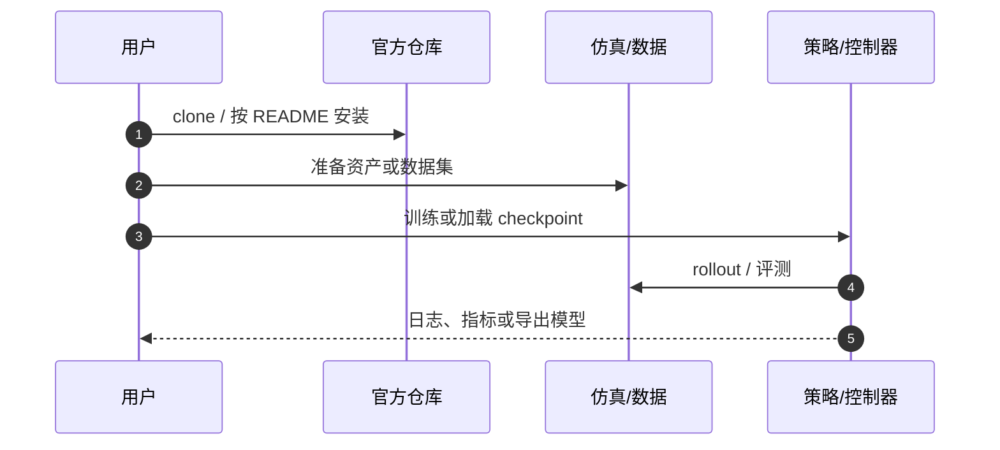

# ExBody（HMI P028）

**ExBody**（*Expressive Whole-Body Control for Humanoid Robots*，2024，[arXiv:2402.16796](https://arxiv.org/abs/2402.16796)）收录于具身智能研究室 [论文与项目总索引](https://github.com/RealXiaoze/humanoid-motion-intelligence/blob/main/%E8%AE%BA%E6%96%87%E4%B8%8E%E9%A1%B9%E7%9B%AE/README.md) **P028**，主分类为 **动作跟踪与全身控制**。本页为本库独立详情节点（编译自策展解读与公开元数据，非原文镜像）。

## 一句话定义

重点跟踪上身表达参考，同时用速度命令与鲁棒奖励约束下肢，使真实人形在保留表现力时仍可部署行走。

## 英文缩写速查

| 缩写 | 英文全称 | 简要说明 |
|------|----------|----------|
| WBC | Whole-Body Control | 全身控制/跟踪 |
| RL | Reinforcement Learning | 策略学习 |
| PD | Proportional–Derivative | 关节目标执行 |
| MoCap | Motion Capture | 上身表达动作来源 |

## 为什么重要

- ExBody先从CMU动作库中整理约780段人体动作，再把人体骨架映射到19自由度Unitree H1。人体肩、髋等球形关节不能直接复制给由多个转动关节组成的机器人，作者使用指数映射把球形旋转分解到机器人对应关节。这个重定向结果并不会作为全身逐帧参考直接交给策略，而是被拆成两类命令：上肢表达目标保留手臂和躯干的动作语义，根部移动目标只描述机器人整体应该怎样移动。
- 在 HMI 六条技术路线中属于 **动作跟踪与全身控制**，补齐「总索引有条目、本库无下钻页」的缺口。
- 与相邻方法对照时，优先看问题设定与接口，而不是只记算法名。

## 核心信息

| 字段 | 内容 |
|------|------|
| HMI ID | P028 |
| 年份 | 2024 |
| 分组 | 动作跟踪与全身控制 |
| 开源状态 | 已开源（expressive-humanoid） |
| 原文 | https://arxiv.org/abs/2402.16796 |

## 核心原理

把整段人体动作逐关节重定向给人形机器人，腿部往往最先出问题：人体腿长、质量分布和接触时序与机器人不同，精确追腿会牺牲平衡。ExBody做了一个很重要的任务拆分：上半身继续追踪表达动作，腿部不追人体腿轨迹，只要求机器人根部完成速度和朝向目标，让RL自行找到适合本体的落脚。

### 流程直觉

模块边界与符号定义以原文为准；上图只固定阅读骨架。

## 工程实践

上肢目标包含九个上半身关节目标和18维关键点位置，用来表达挥手、摆臂、舞蹈等身体动作。根部目标包含三维线速度、身体滚转与俯仰、偏航方向以及身体高度。这样，同一段上肢动作可以重新组合不同的站立、前进和转向命令；腿部不必复制人体参考中的每一次屈膝和落脚，而是根据机器人自身比例、质量和接触状态寻找可执行步态。

| 检查项 | 建议 |
|--------|------|
| 一手来源 | 回 arXiv / DOI / 项目页核对数值与声明 |
| 开源边界 | 已开源（expressive-humanoid） |
| 本库定位 | 详情编译页；深入公式与实验表读原文 |

## 源码运行时序图

关键复现路径以官方 README 为准；上图仅标出通用入口顺序。

## 实验与评测读法

- 把「仿真指标 / 真机证据 / 仅项目演示」分开记账。
- 对照同组相邻工作（见关联页面）时，对齐任务定义与观测接口，再比成功率。
- 综述类条目关注分类框架与缺口，不把引用列表当作选型排名。

## 结论

**ExBody 应作为 HMI「动作跟踪与全身控制」线上的独立知识节点阅读：先抓住其真正改变的问题接口，再决定是否进入复现或对比实验。**

- 核心贡献是问题表达或管线接口，而不只是单一网络结构名。
- 开源状态：已开源（expressive-humanoid）。
- 与本库已有相邻页交叉阅读，避免重复造页。
- 数值、消融与许可以一手来源为准；本页是编译索引。
- 若官方后续补齐代码/数据，应回写 `sources/` 与本节开源字段。

## 局限与风险

- 每个控制周期，Actor读取机身角速度、滚转与俯仰、当前偏航和目标偏航之间的差值、19个关节的位置与速度、上一时刻动作，以及两类目标命令。策略刻意不读取当前机身线速度、绝对身体高度和世界坐标偏航，这些量在真机上往往需要外部定位或状态估计才能准确获得。Actor输出19个目标关节位置，底层PD控制器根据目标与当前关节状态计算力矩，机器人运动后的IMU和编码器数据再进入下一周期。
- 勿把 HMI 解读中的工程判断直接写成论文作者承诺。
- 经典控制论文与现代 RL/VLA 论文的「可复现」标准不同，选型时分开评估。

## 关联页面

- [HMI 论文覆盖导读](../queries/hmi-papers-coverage.md)
- [Humanoid Motion Intelligence](./humanoid-motion-intelligence.md)
- [paper-loco-manip-161-007-exbody2](./paper-loco-manip-161-007-exbody2.md)
- [human2humanoid](./human2humanoid.md)
- [whole-body-coordination](../concepts/whole-body-coordination.md)
- [beyondmimic](../methods/beyondmimic.md)

## 参考来源

- [sources/papers/hmi_p028_exbody-expressive-humanoid.md](../../sources/papers/hmi_p028_exbody-expressive-humanoid.md)
- [sources/repos/humanoid-motion-intelligence.md](../../sources/repos/humanoid-motion-intelligence.md)
- [HMI 论文总索引](https://github.com/RealXiaoze/humanoid-motion-intelligence/blob/main/%E8%AE%BA%E6%96%87%E4%B8%8E%E9%A1%B9%E7%9B%AE/README.md)

## 推荐继续阅读

- [arXiv:2402.16796](https://arxiv.org/abs/2402.16796)
- [代码](https://github.com/chengxuxin/expressive-humanoid)
- [HMI 逐篇解读 P028](https://github.com/RealXiaoze/humanoid-motion-intelligence/blob/main/%E8%AE%BA%E6%96%87%E4%B8%8E%E9%A1%B9%E7%9B%AE/%E8%AE%BA%E6%96%87%E9%80%90%E7%AF%87%E8%A7%A3%E8%AF%BB/P028.md)
