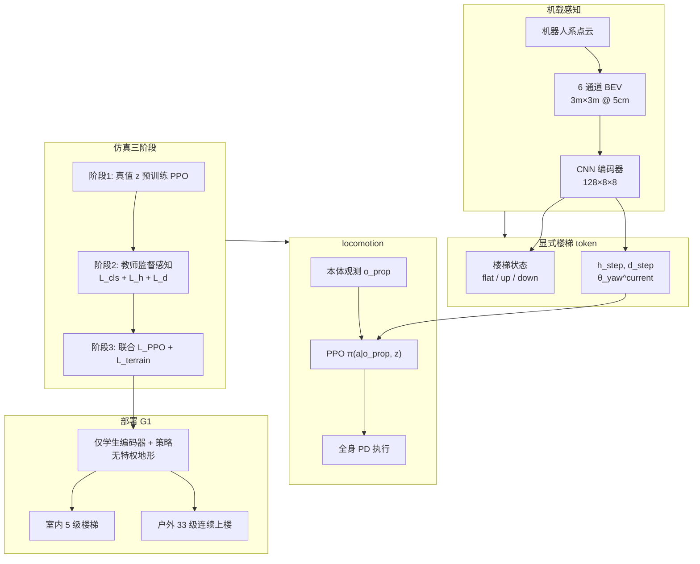

# 显式楼梯几何条件化人形运动（Explicit Stair Geometry Conditioning）

**显式楼梯几何条件化**（arXiv:2605.09944，AIRS / CUHK-Shenzhen / MBZUAI）针对 **人形楼梯爬升** 提出：不把地形压进 **高维隐式 embedding**，而从点云 BEV 估计 **少量可解释几何量**（踢面高度、踏面深度、相对航向、上/下/平地形类别），并 **直接拼入 PPO 策略观测**，使摆腿净空与步幅可 **按物理结构前瞻调制**；在 **Unitree G1** 上零样本实机验证，含 **户外 33 级连续上楼**。

## 一句话定义

**用四维楼梯几何 token 替代隐式地形 latent，让感知—控制接口对齐「踢面多高、踏面多深、朝向是否对齐」这类楼梯爬升真正需要的量。**

## 英文缩写速查

| 缩写 | 英文全称 | 简要说明 |
|------|----------|----------|
| Sim2Real | Simulation to Real | 把仿真中学到的策略迁移落地真机的工程主线 |
| PPO | Proximal Policy Optimization | 人形/足式 locomotion 中最常用的 on-policy 策略梯度算法 |
| Isaac Lab | NVIDIA Isaac Lab | 基于 Omniverse 的机器人学习训练框架 |
| G1 | Unitree G1 Humanoid | 宇树入门级教育科研人形平台 |
| OOD | Out-of-Distribution | 分布外样本/未见场景，泛化评测关注点 |
| CNN | Convolutional Neural Network | 卷积神经网络，处理图像/深度感知 |
| PD | Proportional–Derivative | 关节位置/阻抗底层控制，策略输出常为其 setpoint |
| DCM | Divergent Component of Motion | 质心发散分量，用于落脚点与平衡调节 |
| MuJoCo | Multi-Joint dynamics with Contact | 接触丰富的刚体物理仿真引擎 |
| Locomotion | Robot Locomotion | 足式/人形等无轮移动能力的总称 |
| RL | Reinforcement Learning | 通过与环境交互最大化长期回报来学习策略的范式 |
| LoRA | Low-Rank Adaptation | 低秩增量微调，低成本适配大模型 |
| VLM | Vision-Language Model | 视觉-语言多模态理解模型，VLA 的上游 |
| AMP | Adversarial Motion Prior | 用对抗判别约束状态转移接近专家运动分布的先验 |
| LiDAR | Light Detection and Ranging | 激光雷达，地形感知与建图主传感器 |

## 为什么重要

- **对准楼梯的控制相关抽象：** 爬梯失败常源于 **净空不足** 或 **踏面落点偏差**；显式 $h_{\text{step}}, d_{\text{step}}$ 把策略输入与 **物理需求** 对齐，比让策略从 11×17 高程图或视觉特征里 **自己猜** 更样本高效（论文 Table I：成功率 96% vs HeightMap 88% vs Blind 52%）。
- **训练分布外踢面高度：** 在 **0.18–0.22 m 未见踢面** 上相对 **MoRE** 视觉基线保持更高成功率（0.22 m：**82.7% vs 69.4%**），支持「物理参数条件化」而非「记视觉模式」的叙事。
- **可部署的 teacher–student 管线：** 仿真特权教师监督感知学生，部署 **仅机载传感 + 学生编码器 + 策略**；几何估计真机 MAE 约 **1 cm 级**、状态分类 **>97%**。

## 方法

| 模块 | 作用 |
|------|------|
| **点云 → BEV** | 机器人系 3D 点云 → **3 m×3 m、5 cm** 栅格，6 通道 z 统计与密度，刻画局部高差与不连续面。 |
| **BEV CNN 编码器** | 卷积 + BN + ReLU + 下采样 → **128×8×8** 空间特征。 |
| **显式 token $z_t$** | 预测 $s_t$（flat / stairs-up / stairs-down）与 $h_{\text{step}}, d_{\text{step}}, \theta_{\text{yaw}}^{\text{current}}$，组成 **4 维** 条件向量。 |
| **PPO actor–critic** | 观测 $o_t=\{o_t^{\text{prop}}, z_t\}$，输出关节目标 → **全身 PD**；奖励沿用 Isaac Lab rough-locomotion 默认项。 |
| **三阶段训练** | (1) 真值几何预训练 locomotion；(2) 教师监督训感知；(3) $\mathcal{L}_{\text{PPO}}+\mathcal{L}_{\text{terrain}}$ 联合微调。 |

### 流程总览

## 常见误区或局限

- **误区：「显式 = 不需要学习感知」。** 几何量仍由 **深度/点云 + CNN** 估计，真机有 **~1 cm 级误差**；鲁棒性来自 **低维、物理对齐的接口**，而非免感知。
- **误区：「与 FastStair 同一条路」。** [FastStair](./paper-faststair-humanoid-stair-ascent.md) 用 **DCM 落脚点规划** 在训练中提供 **离散落点监督** 并追求 **高速上楼梯**（LimX Oli）；本文用 **连续几何参数条件化**、平台为 **G1**，未强调规划器在环。
- **局限：** 任务聚焦 **楼梯类结构化地形**；公开渠道 **暂无官方代码仓**；跨平台需重训感知与动力学；与 **E-SDS** 的「自动奖励合成」正交，未覆盖非楼梯复杂地形全集。

## 实验要点（归纳）

| 对比 | 关键结果（论文，3 seed 除非注明） |
|------|----------------------------------|
| vs Blind-PPO | 成功率 **96% vs 52%**；速度/角速度跟踪误差更低 |
| vs HeightMap-PPO（11×17） | 成功率 **96% vs 88%**；学习曲线收敛更快 |
| vs MoRE（视觉，OOD 踢面） | 0.22 m 成功率 **82.7% vs 69.4%** |
| 不规则户外楼梯 | 成功率 **93%**（HeightMap 75%，MoRE 72%） |
| G1 实机 | 室内 **5 级** 连续上楼；户外 **33 级** 无失败；MuJoCo 变速跟踪 **无微调** |

## 关联页面

- [Locomotion（运动任务）](../tasks/locomotion.md) — 楼梯与地形适应任务总览
- [Terrain Adaptation](../concepts/terrain-adaptation.md) — 高程图、点云与显式几何路线对照
- [Privileged Training](../concepts/privileged-training.md) — 仿真教师监督感知学生
- [FastStair](./paper-faststair-humanoid-stair-ascent.md) — 另一路人形楼梯 RL（规划引导 + LoRA）
- [E-SDS](./paper-e-sds-environment-aware-humanoid-locomotion-rl.md) — G1 感知行走与楼梯下降（VLM 奖励）
- [Unitree G1](./unitree-g1.md) — 实机平台
- [MoRE（AMP 专题 #08）](./paper-amp-survey-08-more.md) — 本文视觉复杂地形基线；arXiv:2506.08840，latent residual MoE + 多判别器 AMP

## 与其他工作对比

| 维度 | 本文 | HeightMap-PPO | Blind-PPO | FastStair | E-SDS |
|------|------|---------------|-----------|-----------|-------|
| 感知接口 | **4D 几何 token** | 11×17 高程图 | 无 | 机载高程图 + 规划落点 | 高度图 + LiDAR + VLM 奖励 |
| 训练重点 | 几何估计 + PPO 联合 | 端到端 RL | 本体 RL | DCM 落点监督 + 专家 LoRA | 环境统计 → 奖励代码 |
| 实机平台 | **Unitree G1** | — | — | LimX Oli | Unitree G1 |
| 突出指标 | OOD 踢面 + 33 级户外 | 中等成功率 | 低成功率 | 高速上楼梯 | 楼梯下降（仿真） |

## 参考来源

- [显式楼梯几何条件化论文摘录（arXiv:2605.09944）](../../sources/papers/explicit_stair_geometry_arxiv_2605_09944.md)

## 推荐继续阅读

- 论文 HTML（公式与图表）：<https://arxiv.org/html/2605.09944v1>
- 论文 PDF：<https://arxiv.org/pdf/2605.09944.pdf>
- [FastStair 项目页](https://npcliu.github.io/FastStair) — 对比另一路人形楼梯学习工程叙事
