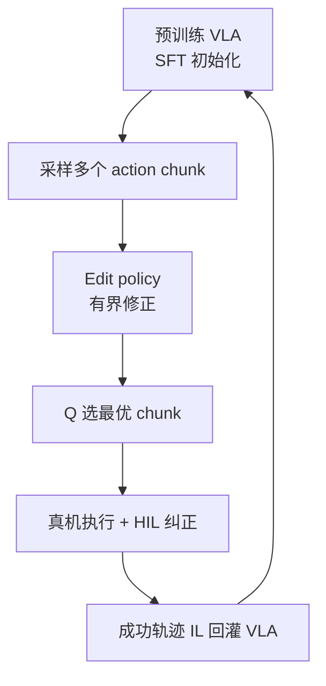
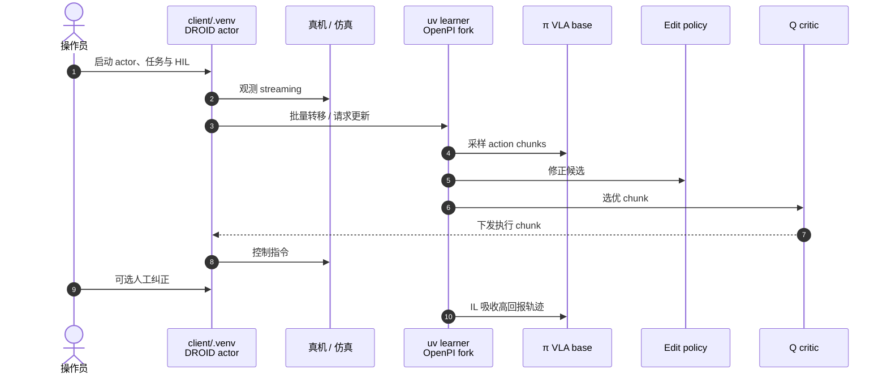

# EXPO-FT：样本高效 VLA 强化学习微调

**EXPO-FT**（*Sample-Efficient Reinforcement Learning Finetuning for Vision-Language-Action Models*，[arXiv:2605.25477](https://arxiv.org/abs/2605.25477)，[项目页](https://pd-perry.github.io/expo-ft/)，[代码](https://github.com/pd-perry/expo-ft)）由 **Perry Dong、Kuo-Han Hung、Tian Gao、Dorsa Sadigh、Chelsea Finn**（**斯坦福大学**；与 **Physical Intelligence** 叙事紧密）提出：在 **预训练 VLA（π0.5 等）** 上实现在线 **RL fine-tuning**，用 [EXPO](./paper-expo.md) 的 **大模型 chunk 提案 + 轻量 edit + Q 选优 + 成功轨迹回灌**，在 **高精度/动态/多初始状态** 操纵任务上达到 **部署级成功率**。

## 一句话定义

**用 EXPO 的「小编辑 + Q 选 chunk」包住大 VLA，在线几十分钟真机交互把 π 演示策略推到 30/30 全成功。**

## 英文缩写速查

| 缩写 | 英文全称 | 简要说明 |
|------|----------|----------|
| EXPO-FT | EXPLoration-augmented Policy Optimization Finetuning | 本文 VLA RL 微调系统 |
| VLA | Vision-Language-Action | 预训练视觉–语言–动作策略 |
| RL | Reinforcement Learning | 在线 fine-tune 超越 SFT 分布 |
| Q | Action-Value Function | 候选 chunk 在线选择 |
| HIL | Human-in-the-Loop | 人工干预与纠正写入训练 |
| SFT | Supervised Fine-Tuning | 任务演示微调基线 |
| HG-DAgger | — | 论文对比的干预式模仿基线之一 |
| DSRL | — | 论文对比的 RL-from-scratch 类基线 |

## 为什么重要

- **预训练 VLA 可靠性缺口：** 能演示复杂任务，但 **95% 不够部署**；纯 SFT 难覆盖 **打滑、偏差、动态**。
- **样本效率：** 六任务 **30/30**，平均 **19.1 min** **在线机器人交互**（论文；不含全部准备与梯度 wall-clock）。
- **开源栈：** [pd-perry/expo-ft](https://github.com/pd-perry/expo-ft) 统一 **EXPO-FT + Real-Time EXPO-FT**；server（OpenPI fork）+ client（DROID 真机）。

## 核心信息

| 项 | 内容 |
|----|------|
| **机构** | 斯坦福大学（Stanford University） |
| **基座** | 预训练 VLA（论文实验基于 **π0.5** 监督微调初始化） |
| **任务例** | 灯串路由+插电、台球入袋、插花入瓶、翻蛋等 |
| **开源** | **已开源** — [pd-perry/expo-ft](https://github.com/pd-perry/expo-ft)（2026-09-29 核查；需 clone OpenPI/DROID fork） |

## 流程总览

## 源码运行时序图

[pd-perry/expo-ft](https://github.com/pd-perry/expo-ft)（[expo-ft.md](../../sources/repos/expo-ft.md)）双环境架构：

- **静态任务：** OpenPI@`expo_ft` + DROID main（见 README **Running EXPO-FT**）。
- **高动态 / RTC：** 换 `real-time-expo-ft` 分支 → [Real-Time EXPO-FT](./paper-real-time-expo-ft.md)。

## 工程实践

| 项 | 建议 |
|----|------|
| 前置阅读 | [EXPO](./paper-expo.md) 理解 edit 有界与 Q 选优 |
| 环境 | Python 3.11+、`uv sync` + 先 clone **openpi** / **droid** fork |
| 与 SFT 对比 | 论文报告 SFT 在同任务 **远低于 30/30**（例：插花 **14/30** → EXPO-FT **30/30**） |
| 协议层 | Reward 检测、复位、HIL 频率仍 **无行业默认**（见 [Universal Post-Training](../concepts/universal-post-training-robotics.md)） |
| 计算 | **19 min 交互 ≠ 19 min 总训练**；大模型梯度占 wall-clock |

## 实验与评测

- **成功率：** 评估任务 **30/30**（论文主读点）；八项子任务平均在线 **19.1 min**。
- **对比：** SFT、HG-DAgger、DSRL、HIL-SERL 等（项目页/blog 曲线）；EXPO-FT **平均成功率最高**。
- **Real-Time 续作：** 动态任务与延迟感知见 [2609.18207](./paper-real-time-expo-ft.md)（同仓库另一分支）。

## 结论

**EXPO-FT 证明：在强 VLA 预训练之上，用 EXPO 式 value RL + 少量真机在线数据，可以把「会演示」推到「敢部署」量级的成功率。**

1. **必须在线 RL，不只 SFT** — 插花等任务 SFT **14/30**，EXPO-FT **30/30**。
2. **样本量极小** — 平均 **~19 min** 在线交互（任务相关；非全程训练时间）。
3. **机制继承 EXPO** — 大 VLA 提案、小 edit 优化 Q、再 IL 回灌。
4. **已开源 expo-ft 仓** — 与 Real-Time 版共用；fork OpenPI/DROID 是硬依赖。
5. **HIL 仍重要** — 人工成功定义、复位、纠正参与数据闭环。
6. **选型** — π 系 VLA、任务 forward 能塞进控制步 → EXPO-FT；否则 → Real-Time 分支。

## 与其他页面的关系

- 基座算法：[EXPO](./paper-expo.md)
- 实时续作：[Real-Time EXPO-FT](./paper-real-time-expo-ft.md)
- 概念：[Universal Post-Training](../concepts/universal-post-training-robotics.md)
- 方法：[VLA](../methods/vla.md)

## 参考来源

- [expo_ft_arxiv_2605_25477.md](../../sources/papers/expo_ft_arxiv_2605_25477.md)
- [expo-ft.md](../../sources/repos/expo-ft.md)
- [wechat_embodied_heart_expo_universal_post_training_2026-09-29.md](../../sources/blogs/wechat_embodied_heart_expo_universal_post_training_2026-09-29.md)
- [pd_perry_universal_post_training_robotics_2026-09.md](../../sources/blogs/pd_perry_universal_post_training_robotics_2026-09.md)

## 推荐继续阅读

- [后训练博客](https://pd-perry.github.io/posts/post-training.html)
- [EXPO-FT 项目页视频与 Q 可视化](https://pd-perry.github.io/expo-ft/)
