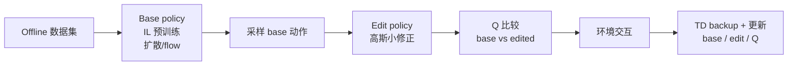
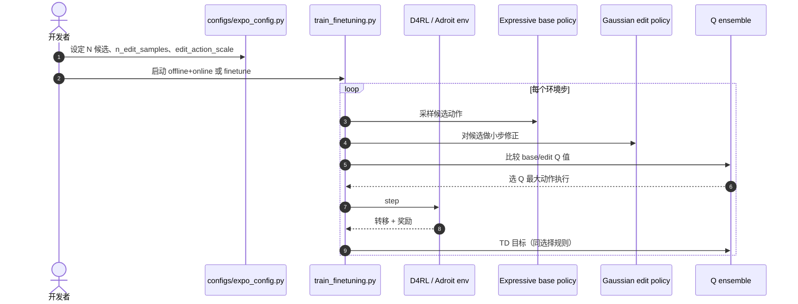

# EXPO：expressive 策略上的稳定 value RL

**EXPO**（*Expressive Policy Optimization*，[arXiv:2507.07986](https://arxiv.org/abs/2507.07986)，[代码](https://github.com/pd-perry/EXPO)）由 **Perry Dong、Qiyang Li、Dorsa Sadigh、Chelsea Finn**（**斯坦福大学**）提出：在 **offline 数据 + online RL** 设定下，用 **大 expressive base policy（模仿）** 与 **轻量 Gaussian edit policy** 组成 **即时 RL 策略**，通过 **Q 函数在 base/edit 动作间选优** 完成采样与 TD backup，避免 **Q 梯度穿过长去噪链** 的不稳定。

## 一句话定义

**别让 Q 梯度去拧整个扩散链——用大模型提案、小编辑器往高 Q 挪一步、再用 Q 挑最好的那个动作来学。**

## 英文缩写速查

| 缩写 | 英文全称 | 简要说明 |
|------|----------|----------|
| EXPO | Expressive Policy Optimization | 本文算法名 |
| RL | Reinforcement Learning | 在线微调与 critic 学习 |
| Q | Action-Value Function | 在 base/edit 候选间选优 |
| TD | Temporal-Difference | Critic 备份目标 |
| IL | Imitation Learning | Base policy 预训练目标 |
| D4RL | Datasets for Deep Data-Driven RL | 论文仿真 benchmark 之一 |
| EXPO-FT | EXPLoration-augmented Policy Optimization FT | VLA 真机续作（arXiv:2605.25477） |

## 为什么重要

- **扩散/flow 策略 RL 的稳定性锚点：** 直接 DDPG 式反传 Q 穿过 denoising 链 **贵且不稳**；「多采样 + Q 选最大」又 **不更新策略权重**。
- **EXPO 折中：** edit 承担 **小步 value 优化**，base 仍用 **稳定 IL**；on-the-fly 组合保证 **策略参数可渐进改善**。
- **系列起点：** [EXPO-FT](./paper-expo-ft.md) / [Real-Time EXPO-FT](./paper-real-time-expo-ft.md) 把同一 **base + edit + Q** 结构接到 **π 系 VLA 真机**；[QWM](./paper-qwm.md) 等将其作为 **Q-learning 基座**。

## 核心信息

| 项 | 内容 |
|----|------|
| **机构** | 斯坦福大学（Stanford University） |
| **开源** | **已开源** — [pd-perry/EXPO](https://github.com/pd-perry/EXPO)（jaxrl/RLPD 系；Conda 环境） |
| **典型实验** | D4RL Antmaze、Adroit 等（`train_finetuning.py`） |
| **样本效率** | 相对 prior 平均约 **2–3×**（摘要；offline→online 与 fine-tune 设定） |

## 流程总览

## 源码运行时序图

官方仓库 [pd-perry/EXPO](https://github.com/pd-perry/EXPO)（归档 [expo.md](../../sources/repos/expo.md)）仿真复现主路径：

- **入口示例：** README 中 `antmaze-large-play-v2` + `--expo=True`（见仓库 `scripts/`）。
- **真机 VLA：** 不在本仓；见 [expo-ft](../../sources/repos/expo-ft.md)。

## 工程实践

| 项 | 建议 |
|----|------|
| 与 EXPO-FT 关系 | 先理解 EXPO **edit 有界 + Q 选优** 再读 VLA 版 chunk 采样与回灌 |
| 环境 | Conda `expo` env；XLA 内存 flags 见 README |
| 对照四类 prior | 论文讨论 Q 反传链、纯 Q 选样本、引导去噪、噪声 steering — EXPO 走 **edit 更新权重** |
| 局限 | 仿真 benchmark 为主；**长视界 value 误差** 仍限制 edit 安全半径（博客对 EXPO-FT 的讨论） |

## 实验与评测

- **任务族：** D4RL Antmaze、Adroit 等（仓库脚本与 `configs/expo_config.py`）。
- **对比：** 相对既有 offline→online / fine-tuning 方法 **平均 2–3× 样本效率**（论文摘要级读点；细表见 PDF）。
- **下游：** EXPO-FT 真机 **30/30、~19 min 在线** 等数字见 [paper-expo-ft](./paper-expo-ft.md)（不同设定，不可直接数值对比 D4RL）。

## 结论

**EXPO 给「expressive 策略 + value RL」一条可开源复现的稳定主线：大模型负责表达，小 edit 负责 value 步进，Q 负责选动作与 backup。**

1. **别对扩散链端到端反传 Q** — edit + 选优把 volatility 隔离在小网络。
2. **比纯 Q 选样本更强** — base/edit 参数都会更新，不只挑已有候选。
3. **2–3× 样本效率** 是仿真 offline→online 读点；部署仍看 EXPO-FT 真机栈。
4. **开源 pd-perry/EXPO** — Conda + D4RL 脚本可跑通 Antmaze 类实验。
5. **选型** — 研究 **扩散策略 RL 稳定微调** → EXPO；要 **π VLA 真机 post-training** → [EXPO-FT](./paper-expo-ft.md)；要 **RTC 延迟** → [Real-Time EXPO-FT](./paper-real-time-expo-ft.md)。

## 与其他页面的关系

- 概念：[Universal Post-Training](../concepts/universal-post-training-robotics.md)
- 续作：[EXPO-FT](./paper-expo-ft.md)、[Real-Time EXPO-FT](./paper-real-time-expo-ft.md)
- 方法：[Reinforcement Learning](../methods/reinforcement-learning.md)

## 参考来源

- [expo_arxiv_2507_07986.md](../../sources/papers/expo_arxiv_2507_07986.md)
- [expo.md](../../sources/repos/expo.md)
- [Towards Universal Post-Training 博客归档](../../sources/blogs/pd_perry_universal_post_training_robotics_2026-09.md)

## 推荐继续阅读

- [Perry Dong 后训练博客](https://pd-perry.github.io/posts/post-training.html)
- [EXPO-FT 项目页](https://pd-perry.github.io/expo-ft/)
