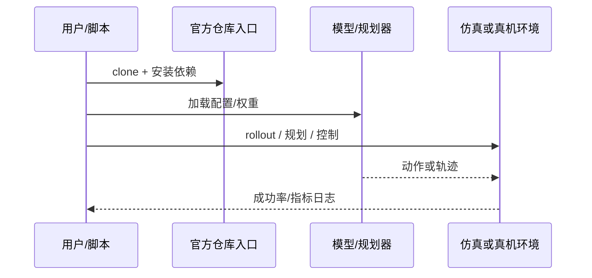

# Expressive Robotic Pianist（arXiv:2609.10844）

**Expressive Robotic Pianist**（[Expressive Robotic Pianist: Mastering Complex Piano Repertoire with Graph-Mimic and Musical Dynamics](https://arxiv.org/abs/2609.10844)）来自 [具身智能小站 14 篇盘点](../../sources/blogs/wechat_embodied_station_14_papers_dexterous_wm_humanoid_2026-09-11.md)。图结构模仿约束手指运动 + 声学模型对齐击键力度；UR5 + 灵巧手多曲风评测。

## 一句话定义

**钢琴机器人不只要弹对音符，还要弹出力度与连贯过渡。**

## 英文缩写速查

| 缩写 | 英文全称 | 简要说明 |
|------|----------|----------|
| VLA | Vision-Language-Action | 视觉-语言-动作策略 |
| VLM | Vision-Language Model | 视觉-语言多模态模型 |
| WM | World Model | 预测未来观测或表征的动力学模型 |
| IL | Imitation Learning | 模仿学习 |
| RL | Reinforcement Learning | 强化学习 |
| DoF | Degrees of Freedom | 自由度 |

## 为什么重要

- 纳入本期 **灵巧手 / 世界模型 / 人形控制 / VLA** 主线之一。
- 开源状态：**已开源**（步骤 2.5 核查，2026-09-11）。
- 与 [14 篇技术地图](../overview/dexterous-wm-humanoid-14-papers-technology-map.md) 中同类工作可横向对照。

## 核心机制

| 项 | 内容 |
|----|------|
| **arXiv** | [2609.10844](https://arxiv.org/abs/2609.10844) |
| **项目页** | https://arxiv.org/abs/2609.10844 |
| **代码/资源** | https://github.com/yanhuhuhahei/Preference-ranking-statistics |
| **开源** | **已开源** |
| **文内指标** | 多种曲风与听众偏好测试。 |

## 源码运行时序图

## 实验与评测

| 项 | 文内口径 |
|----|----------|
| 要点 | 多种曲风与听众偏好测试。 |

- **读法：** 本页为索引级摘要，上表取自 [公众号盘点](../../sources/blogs/wechat_embodied_station_14_papers_dexterous_wm_humanoid_2026-09-11.md) 与项目页；具体对照方法、任务集与逐项指标以 **原文 PDF** 为准（[参考来源](#参考来源)）。

## 与其他工作对比

- **只对音符正确率优化的钢琴机器人** — 目标函数止于「按对键」；本文额外用 **声学模型对齐击键力度**，把表现力（力度与连贯过渡）纳入优化目标。
- **纯 [模仿学习](../methods/imitation-learning.md) 复制人类指法** — 直接回归示范轨迹，跨手型迁移困难；本文用 **图结构模仿约束** 手指运动，在结构层而非轨迹层对齐。
- **[Rapid Dexterous Pen Writing](./paper-rapid-dexterous-pen-writing.md)** — 同属灵巧精细动作，但那条线 **不用任何示范**，靠在线 Jacobian 估计；本文以人类演奏示范与声学信号为监督来源。
- **[OnOff 可微笔刷书法](./paper-onoff-handwriting.md)** — 同为「表现力型」艺术类灵巧任务，OnOff 用可微渲染对齐笔迹，本文用声学模型对齐音色——两者都把 **领域物理模型** 塞进监督链。
- **[策略评测指标](../concepts/motion-control-policy-evaluation-metrics.md)** — 本文评测以多种曲风与 **听众偏好测试** 为口径，属主观偏好型评估，与成功率类指标不可直接换算。

- **读法：** 以上为知识库内 **路线级** 对照；与原文 baseline 的逐项定量比较与听测协议以 **原文 PDF** 为准（[参考来源](#参考来源)）。

## 结论

**Expressive Robotic Pianist 适合作为本期「已开源」边界下的快速索引页，部署前请核对仓库/README 可运行性。**

1. 核心贡献：钢琴机器人不只要弹对音符，还要弹出力度与连贯过渡。
2. 开源结论：**已开源** — 以项目页实际链接为准（入库日 2026-09-11）。
3. 横向对照见 [14 篇技术地图](../overview/dexterous-wm-humanoid-14-papers-technology-map.md)，避免与同 arXiv 重复造页。

## 关联页面

- [14 篇技术地图](../overview/dexterous-wm-humanoid-14-papers-technology-map.md)
- [VLA（Vision-Language-Action）](../methods/vla.md)
- [Generative World Models](../methods/generative-world-models.md)
- [Manipulation](../tasks/manipulation.md)

## 参考来源

- [expressive-robotic-pianist_arxiv_2609_10844.md](../../sources/papers/expressive-robotic-pianist_arxiv_2609_10844.md)
- [wechat 14篇盘点](../../sources/blogs/wechat_embodied_station_14_papers_dexterous_wm_humanoid_2026-09-11.md)
- [arXiv:2609.10844](https://arxiv.org/abs/2609.10844)

## 推荐继续阅读

- [arXiv PDF](https://arxiv.org/pdf/2609.10844)
- [项目页/资源](https://arxiv.org/abs/2609.10844)
- [代码/资源](https://github.com/yanhuhuhahei/Preference-ranking-statistics)
