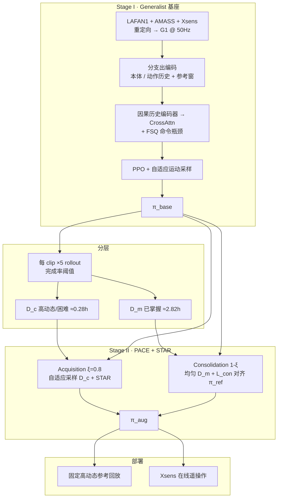

# Extreme-RGMT：高动态技能的持续学习与鲁棒通用全身跟踪

**Extreme-RGMT**（*Continual Learning of Highly Dynamic Skills for Robust Generalist Humanoid Control*，[arXiv:2607.20110](https://arxiv.org/abs/2607.20110)）由 **北京理工大学**、**人形机器人（上海）有限公司（青龙 / OpenLoong）** 与 **山东大学** 提出：在前作 [RGMT](./paper-hrl-stack-14-robust_and_generalized_humanoid_moti.md) 的动力学条件参考编码之上，用 **两阶段 continual learning** 先稳住 generalist 跟踪，再以 **PACE** 与 **STAR** 把空翻、侧手翻等高动态技能叠进同一策略，并在 Unitree G1 上验证固定回放与 Xsens 在线遥操作。

## 一句话定义

**先学好覆盖广的全身跟踪基座，再按完成率把动作分成「已掌握 / 仍困难」两套，用非对称 acquisition–consolidation 与优势优先片段重采样，在少冲掉日常能力的前提下把高动态段学扎实。**

## 英文缩写速查

| 缩写 | 英文全称 | 简要说明 |
|------|----------|----------|
| Extreme-RGMT | Extreme Robust and Generalized Motion Tracking | 本文两阶段持续学习框架；RGMT 的高动态扩展版 |
| RGMT | Robust and Generalized Humanoid Motion Tracking | 前作：动力学条件聚合参考命令的通用跟踪器 |
| PACE | Progressive Acquisition and Consolidation for Expansion | Stage II：acquisition / consolidation 非对称环境与损失 |
| STAR | Segment-Aware Trajectory Advantage Resampling | 按难度先验 + raw advantage 重采样关键轨迹片段 |
| FSQ | Finite Scalar Quantization | 对聚合命令特征做离散瓶颈，降低脏参考敏感度 |
| PPO | Proximal Policy Optimization | Stage I 与 acquisition 侧策略优化算法 |

## 为什么重要

- **打破 generalist–specialist 死结：** 直接在全库混训会稀释高动态信号；只微调高动态又会冲掉日常跟踪。PACE 用 \(\mathcal{D}_m\) 正则对齐基座、\(\mathcal{D}_c\) 强化难段，把两条目标写进同一 \(\pi_{\mathrm{aug}}\)。
- **面向「脏」在线参考：** 惯性 MoCap 的根漂、相位偏差、局部姿态不一致在空中段会被放大；STAR 对 Xsens 来源提升最大（论文 Table VII：**45.5% → 86.3%**）。
- **工程可读对照：** 与 [SONIC](../methods/sonic-motion-tracking.md)、[BeyondMimic](../methods/beyondmimic.md)、[OmniXtreme](./paper-hrl-stack-16-omnixtreme.md) 同台：通用库上不掉太多，高动态库（尤其低质量重定向）更敢跟。

## 核心信息

| 项 | 内容 |
|----|------|
| **机构** | 北京理工大学（BIT）；人形机器人（上海）有限公司 / 青龙（OpenLoong）；山东大学（SDU） |
| **平台** | Unitree G1，29 DoF；策略 50 Hz，底层 PD 500 Hz |
| **数据** | LAFAN1 + AMASS + 自采 Xsens，合计约 **3.1 h**；分层后 \(\mathcal{D}_m\)≈2.82 h / \(\mathcal{D}_c\)≈0.28 h |
| **开源** | **未开源**（项目页截至 2026-07-24 仍无 GitHub / 权重） |
| **项目页** | <https://zeonsunlightyu.github.io/Extreme-RGMT.github.io/> |

## 核心原理

### 方法栈

| 模块 | 角色 |
|------|------|
| **Stage I \(\pi_{\mathrm{base}}\)** | 多分支出编码（本体 / 动作 / 参考）+ 因果历史编码器 + 动力学引导 cross-attn + FSQ；全库自适应采样学 generalist |
| **完成率分层** | clip ≥80% 成功 → \(\mathcal{D}_m\)；其余 → \(\mathcal{D}_c\) |
| **PACE** | \(\xi=0.8\) 环境跑 acquisition（\(\mathcal{D}_c\) + PPO）；其余 consolidation（\(\mathcal{D}_m\) 对齐冻结 \(\pi_{\mathrm{ref}}=\pi_{\mathrm{base}}\)）；\(\lambda_{\mathrm{con}}\) 随有效 acquisition 样本比升高 |
| **STAR** | bin 难度 → transition 权重；\(H/E\) 分组归一化 advantage；按 raw advantage 保留 top 片段，\(\rho_{\mathrm{star}}=0.25\) 混入 mini-batch |
| **部署接口** | 残差关节指令 \(q^{\mathrm{tar}}=q^{\mathrm{ref}}+a\)；固定参考回放或在线 Xsens 参考窗 |

### 流程总览

## 实验与评测

仿真主结果来自论文 Table VI（MuJoCo，五随机种子）；真机为 Unitree G1 上固定回放与 Xsens 在线遥操作（Table VIII）。

| 方法 | In-source Succ. ↑ | Unseen Succ. ↑ | XtremeMotion Succ. ↑ | AMASS Challenging Succ. ↑ |
|------|-------------------|----------------|----------------------|---------------------------|
| SONIC | 99.33% | 93.67% | — | — |
| RGMT（同 Stage I 数据重训） | 99.12% | 94.58% | — | — |
| Extreme-RGMT Stage I | 99.54% | 95.13% | 21.42% | 18.18% |
| Fine-Tuning（直接高动态微调） | （generalist 下降，见图 5） | — | 71.43% | 54.55% |
| OmniXtreme | — | — | **100%** | 36.16% |
| **Extreme-RGMT Full** | **99.76%** | **96.68%** | **100%** | **90.91%** |

真机（各 4 动作×5 试验）：AMASS Replay **90%**；高动态 Xsens Teleop **85%**；日常 Xsens Teleop **100%**。STAR 对 Xsens 高动态 Succ. 增益最大（**45.5% → 86.3%**）。

## 与其他工作对比

- vs [RGMT](./paper-hrl-stack-14-robust_and_generalized_humanoid_moti.md)：保留动力学条件参考聚合，补分支出编码 / FSQ，并加 Stage II 持续扩展。
- vs [OmniXtreme](./paper-hrl-stack-16-omnixtreme.md)：高质量 XtremeMotion 上均可近满分；换直接重定向 AMASS 困难集时 Extreme-RGMT 更稳（90.91% vs 36.16%）。
- vs 直接 Fine-Tuning：specialist 上升但 generalist 明显掉；PACE 用 consolidation 对齐基座抑制漂移。
- vs [SONIC](../methods/sonic-motion-tracking.md) / [BeyondMimic](../methods/beyondmimic.md)：generalist 库上同量级；本工作重点是把高动态段叠进同一策略并吃脏在线 MoCap。

读法：OmniXtreme 在其高质量库上关节误差更低；Extreme-RGMT Full 更吃「参考质量变化 + 在线惯性输入」。

## 工程实践

| 项 | 内容 |
|----|------|
| **训练栈** | PPO + 大规模并行仿真（论文引用 Isaac Gym）；评测在 MuJoCo |
| **奖励** | 跟踪（锚点朝向 / 相对体位姿 / 线角速度）+ 正则（动作变化、关节限位、非期望接触、脚滑） |
| **域随机** | 摩擦、底座质量/CoM、电机强度与 PD 增益、推扰、观测噪声、参考命令扰动（见表 II） |
| **PACE 超参** | \(\xi=0.8\)，\(\lambda_{\mathrm{base}}=0.3\)，\(\kappa=5\)，\(\rho_{\mathrm{ref}}=0.6\)，\(\beta=0.99\) |
| **STAR 超参** | \(\rho_{\mathrm{topk}}=0.05\)，\(\rho_{\mathrm{star}}=0.25\) |
| **真机（Table VIII）** | AMASS Replay **90%**；高动态 Xsens Teleop **85%**；日常 Xsens Teleop **100%** |
| **源码运行时序图** | **不适用**（截至 2026-07-23 项目页未发布可运行训练/推理代码或权重） |

复现选型提示：若目标是「高质量离线高动态库上的极致跟踪」，OmniXtreme / specialist 路线仍可能更贴；若目标是「同一 generalist 策略 + 脏在线 MoCap 也能翻」，优先看 Extreme-RGMT 的 PACE/STAR 组织方式（代码待开放后再对齐入口）。

## 局限与风险

- **未开源：** 无法按官方脚本复现；数字与视频以 arXiv / 项目页为准。
- **根相对跟踪：** 长时部署会累积全局朝向/位置漂移；论文建议补全局定位或周期性对齐。
- **分布外高动态：** 未见过的协调模式、时序或接触配置仍可能失败——类似「专项练习不足」。
- **误区：** 把 Stage II 当成「再训一个 specialist」；正确读法是 **同一 \(\pi_{\mathrm{aug}}\)** 上做角色分裂的采样与损失，而不是两套部署策略。
- **命名：** 用户侧常称「上海人形机器人创新中心」；论文署名与邮箱域对应 **人形机器人（上海）有限公司 / OpenLoong（青龙）**，与北京人形机器人创新中心（X-Humanoid）不是同一机构。

## 关联页面

- [RGMT（前作）](./paper-hrl-stack-14-robust_and_generalized_humanoid_moti.md) — 动力学条件参考聚合与恢复课程
- [Any2Track & RGMT](../methods/any2track.md) — Transformer 历史编码 + 交叉注意力跟踪范式
- [SONIC](../methods/sonic-motion-tracking.md) — 规模化全身跟踪对照
- [BeyondMimic](../methods/beyondmimic.md) — 高动态跟踪 + 扩散蒸馏路线
- [OmniXtreme](./paper-hrl-stack-16-omnixtreme.md) — 高动态 specialist 对照
- [YAHMP](./paper-yahmp.md) — 开源 G1 GMT 消融试验台（mjlab + ONNX；非高动态持续学习）
- [人形 RL 身体系统栈](../overview/humanoid-rl-motion-control-body-system-stack.md) — 控制层总图
- [遥操作任务](../tasks/teleoperation.md) — 在线参考输入语境

## 参考来源

- [extreme_rgmt_arxiv_2607_20110.md](../../sources/papers/extreme_rgmt_arxiv_2607_20110.md) — 论文摘录与开源核查
- [extreme-rgmt-github-io.md](../../sources/sites/extreme-rgmt-github-io.md) — 项目页归档（步骤 2.5）
- [arXiv:2607.20110](https://arxiv.org/abs/2607.20110) — 原文

## 推荐继续阅读

- [Extreme-RGMT 项目页（视频与 BibTeX）](https://zeonsunlightyu.github.io/Extreme-RGMT.github.io/)
- [前作 RGMT 项目页](https://zeonsunlightyu.github.io/RGMT.github.io/)
- [OmniXtreme 项目页](https://extreme-humanoid.github.io/) — 高动态 specialist / XtremeMotion 对照