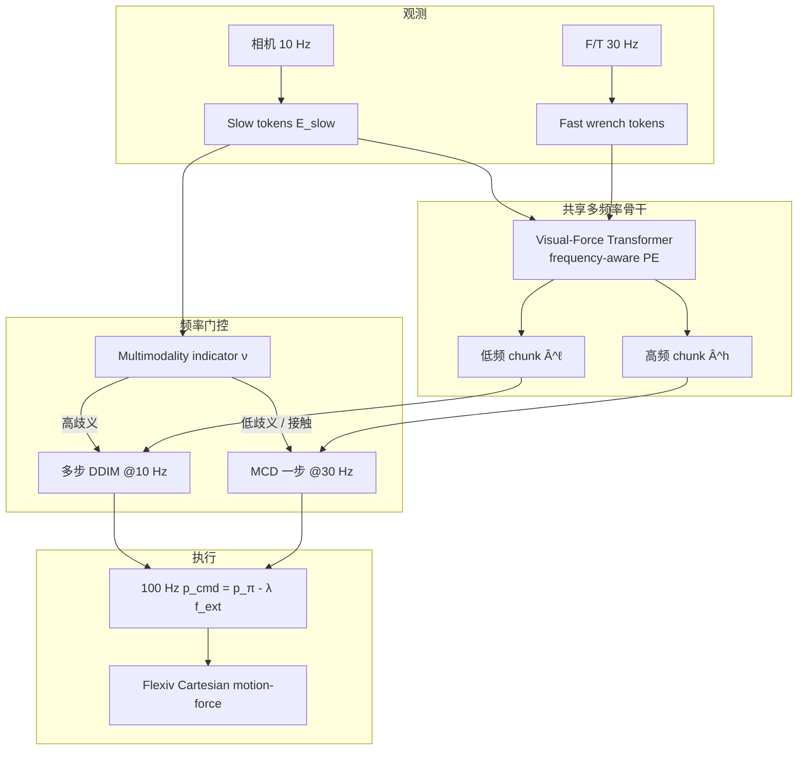

# FA-RDP

**FA-RDP**（*Frequency-Adaptive Reactive Diffusion Policy*，[arXiv:2607.28596](https://arxiv.org/abs/2607.28596)，[项目页](https://fa-rdp.github.io/)）由 **上海交通大学（SJTU）**、**上海创智学院（Shanghai Innovation Institute）** 与 **诺玛矩阵（Noematrix）** 提出：在接触丰富操作上用 **多模态指示器** 动态选择低频多步扩散与高频一步蒸馏采样，兼顾接触前模态多样性与接触后力反应。

## 一句话定义

**接触前用低频多步扩散保住「从哪边绕过去」的多种合法轨迹，接触后由指示器切到 30 Hz 一步采样，用流形一致性蒸馏跟上力反馈。**

## 英文缩写速查

| 缩写 | 英文全称 | 简要说明 |
|------|----------|----------|
| FA-RDP | Frequency-Adaptive Reactive Diffusion Policy | 本文：频率自适应反应式扩散策略 |
| RDP | Reactive Diffusion Policy | 层级慢–快视觉–力基线 |
| ImplicitRDP | Implicit Reactive Diffusion Policy | 固定频率端到端视觉–力扩散基线 |
| MCD | Manifold Consistency Distillation | 在动作流形上蒸馏一步高频采样器 |
| DDPM / DDIM | Denoising Diffusion Probabilistic / Implicit Models | 训练与低频多步推理 |
| SRL | Sample Regression Loss | 蒸馏时对齐示教动作块的回归项 |
| F/T | Force/Torque | 末端六维力力矩观测 |

## 为什么重要

- **说清接触阶段的频率矛盾：** 不是「越高频越好」，而是多模态与反应性分阶段主导。
- **共享骨干而非两套网：** frequency-aware 位置编码让同一 Transformer 出 10 Hz 与 30 Hz chunk。
- **蒸馏目标落在动作流形：** MCD 避免学生拟合噪声型 epsilon/score，一步高频更稳。
- **真机数字硬：** 三任务平均 **81.7%**，相对 ImplicitRDP **+30 pt**；并在分布上保住四向接近模态。

## 核心信息

| 项 | 内容 |
|----|------|
| **机构** | 上海交通大学；上海创智学院；诺玛矩阵（Noematrix） |
| **作者** | Lifeng Zhuo*、Wendi Chen*、Han Xue、Shirun Tang、Jun Lv、Cewu Lu†、Chuan Wen† |
| **平台** | Flexiv Rizon 4s（TDK 遥操作采数）；腕部 iPhone + 第三人称 USB |
| **频率** | 低：10 Hz / H=16；高：30 Hz / H=48；命令层 100 Hz 力补偿 |
| **数据** | 每任务 60 示教；评测 20 trials |
| **开源** | **未开源（coming soon）** — 项目页 Code 无仓库链；`zhuolifeng/FA-RDP` 仅为站点 |

## 流程总览

## 核心原理

### 三组件

| 组件 | 作用 |
|------|------|
| 多频率视觉–力 Transformer | 共享权重预测低/高频率动作块；慢环约 1 s 刷新视觉，快环逐步更新力 |
| Multimodality indicator | 由慢视觉 token 估计接触前动作歧义；阈值切换采样器 |
| MCD | 学生预测动作流形样本；MCD 对齐 EMA teacher + SRL 贴示教；高频网格 \(G=\{99,79,...,0\}\) |

### 与基线失败模式对照

| 方法 | 典型失败（论文 Figs.5–7） |
|------|---------------------------|
| DP | 开环视觉块，失接触 |
| RDP | 慢–快接口压缩，接触点偏 |
| ImplicitRDP | 端到端有力但仍偏慢，接触中滑脱 |
| Regression + Force | MSE 平均多模态，撞前方挡块 |
| **FA-RDP** | 接触前保模态，接触后高频维持接触 |

## 源码运行时序图

**不适用** — 截至 **2026-08-02** 项目页 Code 为 coming soon；GitHub 仓仅为 Pages 与对比视频 Releases，无可辨识训练 / 推理入口。复现需等待官方代码，或自备 ImplicitRDP 式视觉–力扩散栈 + Flexiv 阻抗接口按论文超参重搭。

## 工程实践

| 项 | 内容 |
|----|------|
| 推理延迟（论文） | 高频低于 30 ms；低频低于 50 ms（Ultra 9 + RTX 5090） |
| 力补偿 | 所有方法共享 \(\lambda=10^{-4}\) 平移补偿，再进 Flexiv 接口 |
| 指示器阈值 | 文中示例 threshold ≈ 3.5；接触后随力上升 |
| 开源状态 | **宣称将开源**；入库日无训练代码 URL |
| 视频资产 | [zhuolifeng/FA-RDP releases/v1.0](https://github.com/zhuolifeng/FA-RDP/releases) |

## 评测与结论要点

| 方法 | Box | Button | Switch | Avg |
|------|-----|--------|--------|-----|
| DP | 0/20 | 2/20 | 4/20 | 10.0% |
| RDP | 5/20 | 7/20 | 9/20 | 35.0% |
| ImplicitRDP | 8/20 | 11/20 | 12/20 | 51.7% |
| Regression w/ Force | 2/20 | 4/20 | 6/20 | 20.0% |
| **FA-RDP** | **14/20** | **18/20** | **17/20** | **81.7%** |

指示器消融（Table II）：高频蒸馏 alone **61.7%** → FA-RDP **81.7%**。多模态统计（Fig.8，每任务 80 trials）：FA-RDP 与 ImplicitRDP 覆盖四向接近，HF-distill alone 塌到单峰。

## 与其他工作对比

| 维度 | FA-RDP | ImplicitRDP | RDP | 触觉反应式（T-Rex / OmniTacTune） |
|------|--------|-------------|-----|-----------------------------------|
| 频率策略 | 指示器自适应 10↔30 Hz | 固定频率端到端 | 慢–快层级 | 常异步高频触觉专家 / 残差 |
| 多模态 | 接触前多步扩散保留 | 有，但接触段偏慢 | 慢接口易丢空间细节 | 取决于基策略与触觉通道 |
| 传感 | 视觉 + 腕部 F/T | 视觉 + 力 | 视觉 + 力 | 皮肤/指尖触觉为主 |
| 蒸馏 | MCD 动作流形一步 | 多步或固定加速 | 层级 latent | 通常不走扩散蒸馏主叙事 |

## 结论

**FA-RDP 把接触丰富操作的「多模态 vs 反应性」从固定超参折中，改成由指示器驱动的频率调度问题，并在真机三任务上给出清晰增益。**

- 主指标看 **接触保持成功率** 与 **接触前模态覆盖**，不要只报平均 SR。
- 高频 alone 会牺牲接近多样性；低频多步 alone 跟不上力——指示器切换是真贡献。
- MCD 的关键是 **预测动作而非噪声**；与 Consistency / MeanFlow 对照时看接触段平滑度。
- 100 Hz 力补偿是共享执行层，比较方法时应对齐，避免把控制器增益算进策略。
- 选型：若任务接触前后阶段分明且有 F/T，优先考虑频率自适应；纯视觉桌面可仍用标准 DP。
- 复现阻塞点是 **官方代码未发布**；现阶段以项目页视频与表为证据，勿假设可 pip 安装。

## 局限与风险

- **代码未开源**（2026-08-02），无法审计指示器标注与蒸馏稳定性。
- 三任务均在 **同工作台 / Flexiv**；跨机器人与更强扰动未充分验证。
- 指示器阈值与力曲线耦合，阈值敏感度需按任务重标定。
- 相对触觉皮肤方案（T-Rex / OmniTacTune），本方法依赖 **腕部 F/T**，接触几何分辨率不同。

## 关联页面

- [Diffusion Policy](../methods/diffusion-policy.md) — 视觉扩散 IL 基线与加速变体
- [Contact-Rich Manipulation](../concepts/contact-rich-manipulation.md) — 接触丰富任务概念
- [接触力旋量闭环](../queries/contact-wrench-closed-loop.md) — 力反馈执行层知识链
- [接触丰富操作实践指南](../queries/contact-rich-manipulation-guide.md)
- [Manipulation](../tasks/manipulation.md)
- [OmniTacTune](./paper-omnitactune-tactile-residual-adaptation.md) — 触觉残差真机适应对照
- [FM-VLA](./paper-fm-vla.md) — 力觉长程记忆 VLA 对照
- [T-Rex](./paper-trex-tactile-reactive-dexterous-manipulation.md) — 触觉反应式灵巧对照

## 参考来源

- [FA-RDP 论文策展](../../sources/papers/fa_rdp_arxiv_2607_28596.md)
- [项目页归档](../../sources/sites/fa-rdp-github-io.md)

## 推荐继续阅读

- 项目页：<https://fa-rdp.github.io/>
- 论文 PDF：<https://arxiv.org/pdf/2607.28596>
- Chi et al., [*Diffusion Policy*](https://arxiv.org/abs/2303.04137) — 视觉扩散策略原点
