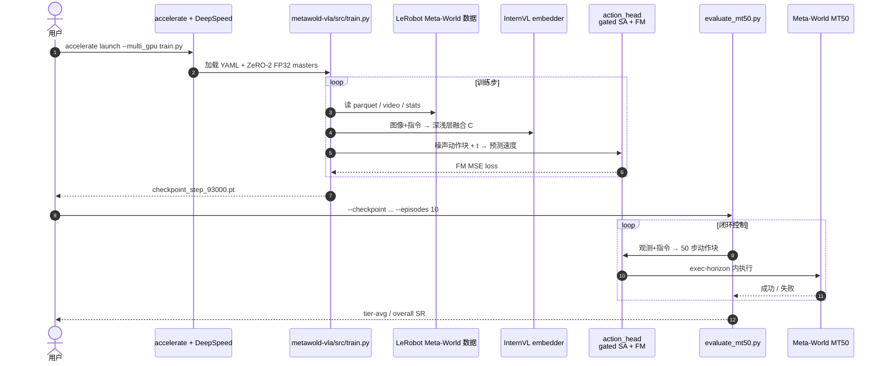

# FabriVLA：轻量 VLA 与精确多任务操作

**FabriVLA**（*A Lightweight Vision-Language-Action Model for Precise Multi-Task Manipulation*，[arXiv:2607.08575](https://arxiv.org/abs/2607.08575)）由 **澳门大学**、**Mese Technology** 与 **优艾智合（Youibot）FabriX** 团队提出：在 **InternVL3.5-1B** 骨干上叠 **gated self-attention** 的 flow-matching 动作头，并用 **浅层（layer 6）⊕ 深层（layer 14）VLM 融合** 补空间细节；于公开 **Evo-1 Meta-World** 演示集上 **单阶段联合微调**（无机器人预训练），在 MT50 达到 **tier-average 90.0%**、整体 episode **92.0%**。官方代码与 **93k** 步权重已开源。

## 一句话定义

**用约 0.89B 参数的 InternVL3.5 + 门控自注意力流匹配动作头，把浅层空间特征与深层语义一起交给动作专家，在 Meta-World MT50 上做到强多任务成功率且无需大规模机器人预训练。**

## 英文缩写速查

| 缩写 | 英文全称 | 简要说明 |
|------|----------|----------|
| FabriVLA | Fabri Vision-Language-Action | 本文轻量 VLA 简称 |
| VLA | Vision-Language-Action | 视觉–语言–动作统一策略 |
| VLM | Vision-Language Model | 预训练视觉–语言骨干；本文用 InternVL3.5-1B |
| FM | Flow Matching | 流匹配生成；学习噪声→动作速度场 |
| MT50 | Meta-World 50 Tasks | 五十任务多任务操作评测套件 |
| SA | Self-Attention | 动作 token 间自注意力；本文用可学习门控缓开 |

## 核心信息

| 项 | 内容 |
|----|------|
| **机构** | 澳门大学（University of Macau）；弥瑟科技（Mese Technology）；优艾智合（Youibot Robotics）/ FabriX |
| **参数量** | **0.89B**（表中）；骨干 InternVL3.5-1B，保留 14 层 |
| **训练数据** | 公开 Evo-1 Meta-World：50 traj/任务 × 50 任务 = **2500** traj |
| **训练配方** | **单阶段**全模型联合优化；DeepSpeed ZeRO-2 + **FP32 master weights**；选 **93k** / 100k 步 |
| **开源** | [Youi-FabriX/FabriVLA](https://github.com/Youi-FabriX/FabriVLA) + HF `Youi-FabriX/FabriVLA`（Apache-2.0） |

## 为什么重要

- **轻量榜成绩：** 相对 [Evo-1](./paper-evo1-lightweight-vla.md)（80.6%）、LA4VLA（87.5%）等，MT50 **tier-avg 90.0%**，且 **无 Robo-Pretrain**。
- **可复现：** 代码、配置、93k checkpoint 齐全；[VLA SOTA Leaderboard](./vla-sota-leaderboard.md) Meta-World 开源区已收录（入库日）。
- **设计对照：** 与 Evo-1「两阶段语义保持 + 纯 cross-attn DiT」不同，FabriVLA 强调 **单阶段 + gated SA + shallow fusion**，便于做轻量 VLA 消融对照。

## 核心原理

### 方法栈

| 模块 | 角色 |
|------|------|
| **InternVL3.5-1B** | 448×448 RGB（corner 视图）+ 语言指令 → 多模态 token；保留 14 层 |
| **Shallow fusion** | layer 6（空间）与 layer 14（语义）concat_proj → 动作头 context |
| **State MLP** | \(\mathbf{s}\in\mathbb{R}^{24}\) → 1024-d token 前置 |
| **Gated SA action head** | \(L=8\)：\(g\cdot\mathrm{SelfAttn}\)（\(g=0\) 初值）→ CrossAttn → FFN+TimeEmb |
| **Flow matching** | 预测 \(\mathbf{v}\in\mathbb{R}^{50\times 24}\)；推理 50 步积分 + receding horizon |

### 流程总览

```mermaid
flowchart TB
  subgraph inputs [输入]
    rgb["corner RGB 448×448"]
    lang["任务指令"]
    state["本体状态 s ∈ R^24"]
  end
  subgraph vlm ["InternVL3.5-1B（14 层）"]
    deep["layer 14 语义"]
    shallow["layer 6 空间"]
    fuse["concat_proj 融合 context C"]
    rgb --> vlm
    lang --> vlm
    deep --> fuse
    shallow --> fuse
  end
  subgraph head ["Flow-matching 动作头 L=8"]
    enc["Action encoder\n50×24 噪声块"]
    gsa["Gated self-attn"]
    xattn["Cross-attn → C + state"]
    vel["速度场 v → 欧拉积分"]
    enc --> gsa --> xattn --> vel
    fuse --> xattn
    state --> xattn
  end
  vel --> exec["反归一化 + receding horizon 执行"]
```

### 源码运行时序图

对齐 [`Youi-FabriX/FabriVLA`](https://github.com/Youi-FabriX/FabriVLA) README：`accelerate` 训练与 `evaluations/metaworld/evaluate_mt50.py` 评测。



复现路径：`pip install -r requirements.txt` → `hf download Youi-FabriX/FabriVLA` → 配置 `dataset/config.yaml` → 训练或直接 `evaluate_mt50.py`。

## 工程实践

| 项 | 要点 |
|----|------|
| **环境** | Python 3.10；Blackwell 建议 CUDA 12.8 + PyTorch ≥ 2.7 |
| **权重** | HF `Youi-FabriX/FabriVLA` / `checkpoint_step_93000.pt` |
| **关键配置** | `shallow_fusion: concat_proj`，`shallow_layer_index: 6`；100k 配方 YAML |
| **DeepSpeed** | 联合微调 **必须** FP32 master；否则 BF16 下 VLM 几乎不更新 |
| **评测** | 10 ep/任务、horizon 400、`num-inference-timesteps 50`、`exec-horizon 5` |

## 实验要点（摘要级）

> 数字以 [arXiv:2607.08575](https://arxiv.org/abs/2607.08575) 为准。

| 设定 | 要点 |
|------|------|
| **Tier-average** | **90.0%**（easy 95.0 / med 88.2 / hard 86.7 / v.hard 90.0） |
| **Overall episode** | **92.0%**（500 episodes） |
| **Shallow fusion 消融** | deep-only 82.9% → +fusion **90.0%** |
| **动作头消融**（冻 VLM、50k） | gated SA 相对 base 提升最大；+TR/+TC 无额外收益 |
| **弱项** | tool-mediated、coarse transport、grasp&place 桶较低 |

## 与其他工作对比

| 对照对象 | FabriVLA 的差异 |
|----------|-----------------|
| **[Evo-1](./paper-evo1-lightweight-vla.md)** | 同为亚十亿 InternVL + FM；Evo-1 用 **两阶段语义保持 + 纯 cross-attn DiT**；FabriVLA 用 **单阶段 + gated SA + shallow fusion**，MT50 更高但评测面更窄（主打 Meta-World） |
| **SmolVLA / TinyVLA** | 同轻量叙事；FabriVLA 在 MT50 四难度更均衡 |
| **π₀** | 参数与机器人预训练需求更大；FabriVLA 强调 **无 Robo-Pre. 的紧凑部署** |
| **LA4VLA** | MixPT；部分难度更高，但 tier-avg 低于 FabriVLA |

## 局限与风险

- **误区：** 把 MT50 **90%** 直接外推到 LIBERO / 真机——论文主实验未报 LIBERO/真机全栈。
- **误区：** 忽略 DeepSpeed FP32 master——按 README，缺此项时 VLM 几乎训不动。
- **局限：** 弱项集中在工具介导与粗运输类任务；可选 TR/TC 模块在消融设定下未进入发布配置。
- **开源边界：** **已开源** 代码+权重；无独立项目页；数据依赖外部 Evo-1 Meta-World 资源。

## 关联页面

- [VLA（Vision-Language-Action）](../methods/vla.md) — 轻量 flow-VLA 路线索引。
- [Evo-1](./paper-evo1-lightweight-vla.md) — 启发来源与数据/训练对照。
- [VLA SOTA Leaderboard](./vla-sota-leaderboard.md) — Meta-World 社区榜收录。
- [Action Chunking](../methods/action-chunking.md) — 50 步动作块与异步执行。
- [Diffusion Policy](../methods/diffusion-policy.md) — 连续动作扩散/流匹配族。
- [Manipulation](../tasks/manipulation.md) — Meta-World 操作任务背景。
- [LeRobot](./lerobot.md) — 数据布局与生态对照。

## 参考来源

- [FabriVLA 论文摘录（arXiv:2607.08575）](../../sources/papers/fabrivla_arxiv_2607_08575.md)
- [Youi-FabriX/FabriVLA 仓库归档](../../sources/repos/fabrivla.md)
- [VLA SOTA Leaderboard 站点归档](../../sources/sites/sota-evomind-tech.md)

## 推荐继续阅读

- 论文 PDF：<https://arxiv.org/pdf/2607.08575>
- 官方代码：<https://github.com/Youi-FabriX/FabriVLA>
- Hugging Face 权重：<https://huggingface.co/Youi-FabriX/FabriVLA>
- 启发工作 Evo-1：<https://arxiv.org/abs/2511.04555>
- Meta-World 榜：<https://sota.evomind-tech.com/>
