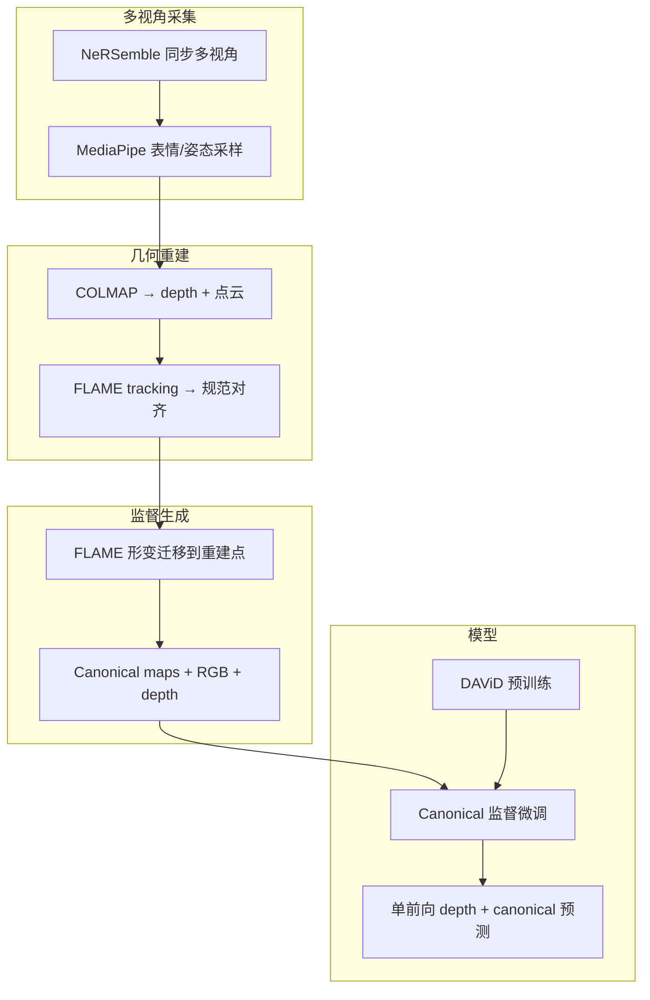

# Face Anything

**Face Anything**（*4D Face Reconstruction from Any Image Sequence*，arXiv:2604.19702，[项目页](https://kocasariumut.github.io/FaceAnything/)）是慕尼黑工业大学（TUM）与华为诺亚方舟实验室提出的 **统一前馈 4D 人脸重建与密集跟踪** 方法：为每个像素预测共享 **规范面部空间** 中的坐标，并与 **单目深度** 联合输出，从而把 **时序一致几何** 与 **跨帧对应** 放进 **同一个 Transformer 前向** 里，无需显式帧间运动估计。

## 一句话定义

用 **「深度 + canonical facial coordinates」联合前馈预测** 把动态人脸的 **4D 重建** 与 **密集点跟踪** 表述为同一规范空间重建问题，在 NeRSemble 派生监督上训练，实现比 V-DPM / Pixel3DMM 等动态重建路线 **更快推理、更低对应误差、更好深度精度** 的统一面部几何模型。

## 英文缩写速查

| 缩写 | 英文全称 | 简要说明 |
|------|----------|----------|
| 4D | 4-Dimensional Reconstruction | 随时间变化的三维人脸几何（3D + 时间） |
| CFP | Canonical Facial Point | 规范面部点；像素在共享规范空间的归一化坐标 |
| DPT | Dense Prediction Transformer | 密集预测 Transformer 解码头；多尺度特征融合 |
| FLAME | Faces Learned with an Articulated Model and Expressions | 参数化人脸模型；用于规范空间对齐与监督生成 |
| HMR | Human Mesh Recovery | 从图像恢复人体/人脸网格；与全身 [GVHMR](./gvhmr.md) 同属视频→3D 上游 |
| VO | Visual Odometry | 视觉里程计；通用场景几何管线常用，本文面部路线不依赖帧间 VO |

## 为什么重要

- **统一任务表述：** 传统动态人脸管线常把 **重建** 与 **跟踪** 拆成优化或两阶段模块；Face Anything 用 **规范坐标图** 把二者合并为 **单次前馈**，降低长序列误差累积与工程拼接成本。
- **前馈几何复兴（面部专用）：** 与 [Depth Anything 3](https://github.com/DepthAnything/Depth-Anything-V3)、VGGT、Pi3 等 **通用前馈 3D** 并列，但针对 **非刚性面部** 引入 **FLAME 规范空间** 监督，在面部深度/对应上专精。
- **机器人/遥操作相关上游：** 全身重定向默认走 [GVHMR](./gvhmr.md) 等 **SMPL 恢复**；**表情丰富的面部 telepresence / 数字人驱动** 需要独立的 **面部 4D 对应**（见 [遥操作](../tasks/teleoperation.md) 与 [humanoid-training-data-pipeline](../queries/humanoid-training-data-pipeline.md)）。Face Anything 提供 **任意图像序列 → 时序一致面部几何+跟踪** 的候选模块。
- **数据工程可复用：** 基于 **NeRSemble 多视角 + COLMAP + FLAME** 的 canonical map 合成流程，对构建 **面部稠密对应** 监督有参考价值；参数化头脸先验也可对照 [GNM Head](./gnm-head.md)（Google 开源 3DMM，Apache 2.0）。

## 核心机制

### 1. Canonical facial point prediction

| 要素 | 说明 |
|------|------|
| **表征** | 每像素一个 **归一化面部坐标**，落在跨帧、跨身份共享的 **规范空间** |
| **跟踪** | **不估计帧间光流/运动**；跨帧对应 = 同一规范坐标在图像间的 **一致性** |
| **重建** | 深度 + 规范图 → **时序稳定密集 3D**；规范空间 **最近邻** 提取密集对应点 |
| **优势** | 把歧义大的「同时解形变+视角+对应」转为 **规范空间重建** |

### 2. 网络与训练

| 项 | 内容 |
|----|------|
| **骨干** | Transformer，多图输入 |
| **头** | **DPT-style** 密集预测头 → depth、ray maps、canonical facial maps |
| **阶段 1** | 在 **DAViD** 上预训练，注入面部几何先验 |
| **阶段 2** | 用 NeRSemble 派生 **canonical 监督** 微调 |
| **推理** | **单前向**；项目页称相对 V-DPM 等 **更快** |

### 3. 数据管线（监督构造）

## 主要结果（项目页摘要）

| 维度 | 相对基线（项目页声明） | 对照代表 |
|------|------------------------|----------|
| **对应误差** | 约 **3× 更低** | V-DPM、Pixel3DMM |
| **深度精度** | 约 **16% 提升** | DAViD、Sapiens |
| **推理速度** | **更快** | 动态重建/跟踪优化式方法 |
| **评测集** | 图像/视频基准 SOTA 级 | NeRSemble、VFHQ 等 |

> 精确数值与表格以 arXiv 全文为准；截至 ingest 时 **代码/权重/数据集将公开**。

## 常见误区或局限

- **误区：「规范坐标 = FLAME 参数回归。」** 本文输出的是 **稠密 per-pixel canonical map**，FLAME 主要用于 **训练监督与空间对齐**，推理仍是 **前馈密集预测**。
- **误区：「可替代全身 HMR。」** 面部 4D 与 [GVHMR](./gvhmr.md) 的 **world-grounded SMPL** 互补；全身遥操作/重定向仍需要身体姿态链路，面部模块解决 **表情与面部几何**。
- **局限：** 训练数据来自 **棚拍多视角 NeRSemble 管线**；野外单目、强遮挡、极端光照的 sim2real 尚未在 ingest 资料中系统报告。
- **局限：** 与通用前馈几何（DA3/VGGT）相比 **任务域窄**（人脸），不宜直接当作机器人场景点云重建默认模块。

## 与其他页面的关系

- [GVHMR](./gvhmr.md) — **全身** 单目视频→SMPL；Face Anything 覆盖 **面部 4D** 分支
- [GNM Head](./gnm-head.md) — 参数化头脸统计模型（生成式先验，非单目 HMR）
- [Vision Banana](./vision-banana.md) — 另一路 **前馈 3D 感知**（分割/深度/法线）；面部动态对应未覆盖
- [视觉表征作为策略输入](../concepts/visual-representation-for-policy.md) — 机器人策略如何选择 **前馈几何/对应** 上游
- [生成式视觉预训练](../concepts/generative-vision-pretraining.md) — 前馈 3D 与生成式统一感知范式背景
- [humanoid-training-data-pipeline](../queries/humanoid-training-data-pipeline.md) — 视频→3D 在训练数据管线中的分层位置
- [遥操作](../tasks/teleoperation.md) — 面部跟踪与表情通道在 immersive teleop 中的需求

## 推荐继续阅读

- arXiv 全文：<https://arxiv.org/abs/2604.19702>
- 项目页对比视频：<https://kocasariumut.github.io/FaceAnything/>
- FLAME 参数化人脸模型 — 规范空间定义来源
- NeRSemble 数据集 — 多视角面部捕获基准
- Depth Anything 3 — 通用前馈 metric depth 对照

## 参考来源

- [Face Anything 论文摘录（arXiv:2604.19702）](../../sources/papers/face_anything_arxiv_2604_19702.md)
- [Face Anything 项目页](../../sources/sites/face-anything-project.md)
