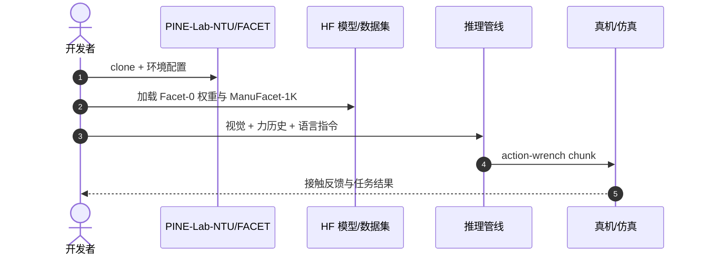

# Facet-0：接触丰富精密装配基础模型

**Facet-0**（*A Robotic Foundation Model for Contact-Rich Precise Manipulation*，[arXiv:2609.01596](https://arxiv.org/abs/2609.01596)，[项目页](https://pine-lab-ntu.github.io/facet-0/)，[代码](https://github.com/PINE-Lab-NTU/FACET)）由 **南洋理工大学（NTU）PINE Lab** 提出：以 **联合 action-wrench proposal** 为核心，将因果力历史与视觉语言语义、运动学状态对齐，用 **flow matching** 同时生成动作片段与预期腕部力曲线。

## 一句话定义

**精密装配的瓶颈不只是看懂场景，而是预测并评估每个动作带来的接触后果。**

## 英文缩写速查

| 缩写 | 英文全称 | 简要说明 |
|------|----------|----------|
| VLA | Vision-Language-Action | 视觉-语言-动作多模态策略族 |
| F/T | Force/Torque | 腕部六维力矩传感 |
| BA | Bundle Adjustment | 束调整（本文无关，避免与 ADM-BA 混淆） |
| HF | Hugging Face | 模型与数据集托管平台 |

## 为什么重要

- 纳入 [2026-09-02 七篇盘点](../../sources/blogs/wechat_embodied_station_7_papers_contact_manipulation_2026-09-02.md) 的「接触后果建模」支线。
- **ManuFacet-1K**：约 1000 h 力同步精密装配数据，填补公开制造装配数据缺口。
- 5 个亚毫米计算机装配任务 **82%** 平均成功率（最强 baseline **15%**）；**0.5 mm** 放置精度、**50 ms** 指令延迟。
- **已开源** 代码、HF 模型与数据集。

## 核心信息

| 项 | 内容 |
|----|------|
| **机构** | 南洋理工大学（NTU）PINE Lab |
| **数据** | ManuFacet-1K（~1000 h，力同步，多本体 UR7e/xArm/Franka） |
| **任务** | RAM/CPU/GPU/磁盘等亚毫米计算机装配 |
| **开源** | **已开源** [PINE-Lab-NTU/FACET](https://github.com/PINE-Lab-NTU/FACET)；[HF 模型](https://huggingface.co/Pinelab/Facet-0)；[数据集](https://huggingface.co/datasets/Pinelab/ManuFacet-1K) |

### 流程总览

## 评测

| 指标 | 读法 |
|------|------|
| 5 任务平均成功率 | 82% vs baseline 15% |
| 放置精度 | 0.5 mm |
| 指令延迟 | 50 ms |

## 结论

**通用 VLA 擅长语义与粗运动，精密装配需要把力后果写进动作学习目标。**

- action-wrench 联合建模区分「到位」与「卡死」
- flow matching 同时预测动作与预期腕部力
- Action-Wrench Critic 从 rollout 区分相近进展的不同接触结果
- ManuFacet-1K 提供制造级力同步数据规模
- 真机四连装（RAM/CPU/GPU/磁盘）展示工业可读性
- 代码 + HF 模型/数据集已发布，可复现推理与微调

## 源码运行时序图

## 局限与风险

- **数据域：** 以 Dell 工作站装配为主，跨行业零件需少量适配（论文报告 ~6.6% 权重 few-shot）。
- **硬件：** 依赖腕部 F/T 与合规控制栈，低成本臂需评估传感与控制器。
- **与 VLA 关系：** 语义骨干可复用，但力后果头与 critic 是精密场景增量成本。

## 关联页面

- [Manipulation](../tasks/manipulation.md)
- [Imitation Learning](../methods/imitation-learning.md)
- [接触丰富操作 7 篇地图](../overview/contact-rich-manipulation-7-papers-technology-map.md)
- [Peg-in-Bench](./paper-peg-in-bench.md)

## 推荐继续阅读

- [Facet-0 项目页](https://pine-lab-ntu.github.io/facet-0/)
- [arXiv:2609.01596](https://arxiv.org/abs/2609.01596)

## 参考来源

- [facet_0_arxiv_2609_01596](../../sources/papers/facet_0_arxiv_2609_01596.md)
- [具身智能小站 2026-09-02 七篇盘点](../../sources/blogs/wechat_embodied_station_7_papers_contact_manipulation_2026-09-02.md)
- [Facet-0 项目页](../../sources/sites/facet-0.md)
- [PINE-Lab-NTU/FACET](../../sources/repos/pine-lab-ntu-facet.md)
