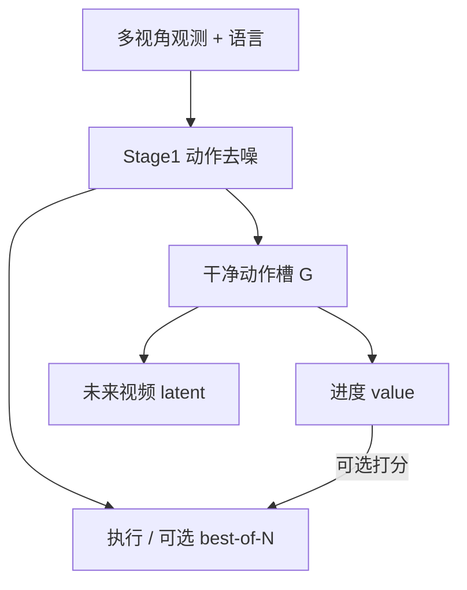
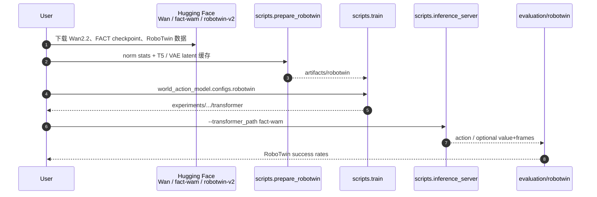

# FACT（Failure-Aware Causal Training · arXiv:2608.10232）

**FACT**（*FACT: Failure-Aware Causal Training for World-Action Models*，[arXiv:2608.10232](https://arxiv.org/abs/2608.10232)）由 **加州大学圣地亚哥分校（UCSD）** 提出（Peng\* / Liang\* / Yan / Hansen / Wang）：把 WAM 的未来预测改成 **动作条件后果建模**，使失败 rollout 监督「坏动作导致什么」，而不是污染策略模仿。[项目页](https://fact-wam.github.io/) · [代码](https://github.com/Bariona/FACT) · [权重](https://huggingface.co/Bariona/fact-wam)。

## 一句话定义

**失败不是坏演示，而是后果标签：先采样动作，再以干净动作为条件滚未来与任务进度；失败数据只教世界支路。**

## 英文缩写速查

| 缩写 | 英文全称 | 简要说明 |
|------|----------|----------|
| WAM | World Action Model | 联合未来预测与动作生成的策略族 |
| FACT | Failure-Aware Causal Training | 本工作的失败感知因果训练配方 |
| IDM | Inverse Dynamics Model | 视频优先 WAM 常见的二阶段动作解码 |
| PSNR | Peak Signal-to-Noise Ratio | 失败想象诊断用的未来帧保真度 |
| RoboTwin | — | 双臂仿真基准；本文 50 任务主评测 |

## 为什么重要

- **对准 WAM 的 success bias：** 只在成功演示上训未来，测试时坏动作仍被配上「成功未来」；FACT 用失败后果打破该幻觉。
- **失败数据用法清晰：** 掩码 \(\mathcal{L}_{\mathrm{act}}\)、保留 value / video——可操作，不靠「把失败当负样本 BC」。
- **可选部署接口：** 进度头可对 \(N\) 候选打分；无失败共训时 scoring 无效（真机消融 79%），说明价值头吃的是后果监督。
- **开源完整：** RoboTwin 管线 + HF checkpoint，可复现对照。

## 核心信息

| 项 | 内容 |
|----|------|
| **机构** | 加州大学圣地亚哥分校（UCSD） |
| **族谱** | **Joint WAM**（共享因果扩散 Transformer；act → imagine） |
| **基座** | Wan2.2-TI2V-5B + 轻量 action adapter |
| **开源** | **已开源** — [Bariona/FACT](https://github.com/Bariona/FACT)；HF Apache-2.0 |

## 核心原理

### 因果 token 序与注意力

token 序 \(z=[P\|A\|G\|V\|I]\)：观测前缀 \(P\)、noisy 预测动作 \(A\)、teacher-forced 干净动作 \(G\)、进度 \(V\)、未来视频 \(I\)。训练时 \(V/I\) 只看 \(G\)，\(A\) 不可见 \(G\)；推理 Stage1 去噪 \(A\)，再把 \(\hat a\) 填入 \(G\) 做 Stage2。

### 失败感知目标

| 数据 | 监督 |
|------|------|
| 成功演示 \(\mathcal{D}_s\) | \(\mathcal{L}_a+\mathcal{L}_v+\mathcal{L}_I\) |
| 失败 rollout \(\mathcal{D}_f\) | 仅 \(\mathcal{L}_v+\mathcal{L}_I\)；进度目标下调 \(\lambda_{\mathrm{fail}}\) |

统一用 flow matching；实现上 \(w_a=20\)，\(w_v=w_I=1\)，\(H=48\)。

### 流程总览

## 源码运行时序图

官方入口对齐 [`sources/repos/fact.md`](../../sources/repos/fact.md)：环境 → 数据 → 训练 → 推理服务 / RoboTwin 评测。

关键复现路径：`setup_env.sh` → `prepare_robotwin` → `train` 或直接挂 `Bariona/fact-wam` 做 `inference_server` + `evaluation/robotwin`。

## 工程实践

| 项 | 建议读法 |
|----|----------|
| 环境 | `bash setup_env.sh`；conda env `fact` |
| 动作-only 部署 | `--skip_future_state_value`；可开 `--enable_prefix_cache` |
| 失败数据 | 主要来自模型 rollout；真机每 cube 任务约 30 条失败 |
| 调试信号 | 坏动作未来 PSNR；失败比例 scaling 曲线；scoring 是否仅在失败共训后增益 |
| 对照 | 勿把失败动作重新加回 \(\mathcal{L}_a\)（真机消融跌到 63%） |

## 实验与评测

| 设定 | 关键数字 |
|------|----------|
| RoboTwin avg（无失败 / 含失败） | **85.6% → 87.5%**（Motus 87.8%；部署约 3× 更快） |
| 真机 seen（失败 / +scoring） | **89% / 92%**（无失败共训 82%） |
| 真机 unseen（失败 / +scoring） | **77% / 82%** |
| 失败想象 | 坏动作未来 PSNR **+6.4 dB** |

## 结论

**FACT 的真贡献是「失败→后果」接口：让世界支路学会坏动作的结果，进度头才变得可用来筛候选；不是再堆一条成功演示。**

1. **读失败共训与失败想象表，不要只看 RoboTwin 与 Motus 差 0.3 pt** — 工程读点在幻觉下降与真机 +scoring。
2. **因果掩码不可省** — 去掉因果掩码或把失败动作当模仿目标都会伤策略。
3. **部署默认可 action-only** — Stage2 视频/value 是可选可靠性税。
4. **选型坐标：** 要失败感知后果 → FACT；要 beyond-RGB 结构化未来 → [DreamWAM](./paper-dreamwam.md)；要推理算力柔性多流 → [Flex-π](./paper-flex-pi.md)；要部署候选筛选外挂 → [DreamSteer](./paper-dreamsteer-vla-deployment-steering.md)。

## 局限与风险

- 失败标注依赖 episode outcome / onset；进度奖励实现上偏均匀时间代理。
- 评测以双臂桌面为主，非全身 loco-manip。
- 可选 scoring 增加 Stage2 与 \(N\) 倍 value 开销。

## 与其他工作对比

| 工作 | 关系 |
|------|------|
| 视频优先 + IDM / 未来条件动作 | 成功演示驱动未来；FACT 强调动作条件失败后果 |
| [DreamWAM](./paper-dreamwam.md) | 改「未来长什么样」；FACT 改「失败怎么进损失」 |
| [DreamSteer](./paper-dreamsteer-vla-deployment-steering.md) | 外挂筛选；FACT 的 value 与世界支路共训 |
| Motus / \(\pi_{0.5}\) | 仿真或真机强基线；FACT 无大规模机器人预训练仍接近真机 \(\pi_{0.5}\) |

## 关联页面

- [World Action Models](../concepts/world-action-models.md)
- [VLA](../methods/vla.md)
- [DreamWAM](./paper-dreamwam.md)
- [Flex-π](./paper-flex-pi.md)
- [动作后果技术地图](../overview/robot-world-models-action-consequence-technology-map.md)

## 参考来源

- [FACT 论文归档](../../sources/papers/fact_arxiv_2608_10232.md)
- [Bariona/FACT 仓库归档](../../sources/repos/fact.md)
- [fact-wam.github.io 项目页归档](../../sources/sites/fact-wam-github-io.md)

## 推荐继续阅读

- 项目页真机与失败想象对照：<https://fact-wam.github.io/>
- 论文 HTML：<https://arxiv.org/html/2608.10232>
