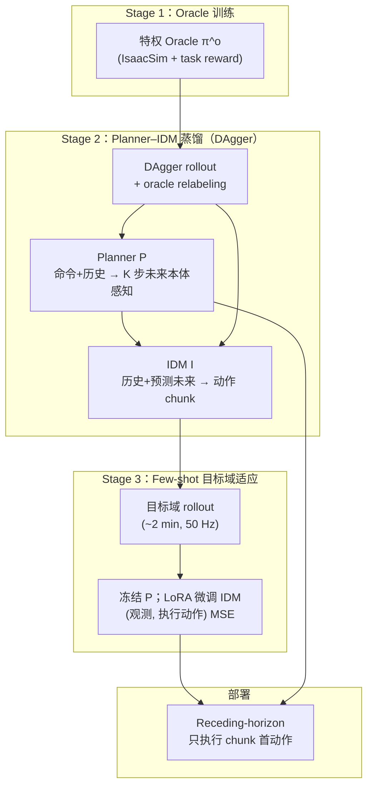

# FADA（Few-Shot Domain Adaptation via Dynamics Alignment）

**FADA** 是 CMU LeCAR-Lab 提出的 **人形控制少样本域适应** 框架（arXiv:2606.28476，[项目页](https://lecar-lab.github.io/FADA-humanoid/)）：把策略分解为 **Planner（命令→短视界本体感知意图）** 与 **IDM 逆动力学模型（意图+历史→动作）**，源域用特权 oracle + DAgger 训练；部署时 **冻结 planner**，仅用约 **2 分钟** 目标域 rollout 的 **(观测, 执行动作)** 对 **LoRA 微调 IDM**，使「如何把意图执行出来」对齐新动力学，而无需目标奖励、专家演示或仿真重标定。

## 英文缩写速查

| 缩写 | 英文全称 | 简要说明 |
|------|----------|----------|
| FADA | Few-Shot Domain Adaptation via Dynamics Alignment | 本文提出的动力学对齐少样本适应框架 |
| IDM | Inverse Dynamics Model | 由预测未来与历史映射到动作的逆动力学模块 |
| WBC | Whole-Body Control | 人形全身协调控制任务层 |
| LoRA | Low-Rank Adaptation | 目标域仅更新 IDM 低秩适配器 |
| DR | Domain Randomization | 源域 IsaacSim 训练中的物理参数随机化 |

## 为什么重要

- **切中 sim2real 的「执行层」失配**：地形、载荷、执行器响应变化时，**任务意图往往仍合理**，但 **实现同一意图所需动作** 会变——FADA 把适应集中在 **IDM（plan→action）** 而非重学整个策略或拟合仿真器。
- **极少数据、极轻监督**：约 **2 min @ 50 Hz** 的普通 rollout（不必最优）即可；监督仅为 rollout 上 **实际执行的首动作**，不要 reward、不要 oracle 标签、不要 SysID。
- **真机验证覆盖全身高精度任务**：G1 斜坡行走、非对称载荷 loco、软垫功夫、T1 拉 6 kg 篮等；成功率任务平均 **20%→90%**，跟踪误差平均 **降 27.4%**（相对零样本 FADA-zs）。
- **与 in-context 适应（RMA 等）正交**：RMA 类方法 **不改权重**，只改输入 latent；FADA **冻结 planner、更新 IDM 权重**，让目标 rollout 直接改动作生成映射——sim2sim 上 TF-CoPred-ft（只微调未来观测预测）反而变差，印证 **应适应执行模块**。

## 流程总览

## 核心机制（归纳）

### 1）Planner–IDM 接口

时刻 $t$：

$$
\hat{Y}_t^K = P(\mathcal{O}_t^H, c_t), \quad \hat{U}_t^K = I(\mathcal{O}_t^H, \mathcal{A}_t^H, \hat{Y}_t^K), \quad \hat{a}_t = \pi_1(\hat{U}_t^K)
$$

- $H=30$ 历史长度，$K=6$ 预测视界（默认）；双 **Transformer**。
- **Planner** 预测未来为 **相对最新观测的残差**；**IDM** 对未来 token 做全注意力 + 对历史 cross-attention，并行解码 $K$ 步动作。

### 2）源域训练目标

**IDM**（Eq. 4.2）：用 rollout **实际执行** 的 $(Y_{exec}^K, U_{exec}^K)$ 监督首动作——含学生次优执行，故同样适用于不完美目标 rollout。

**Planner**（Eq. 4.3）：经 **stop-gradient IDM** 优化，使 $P$ 预测的未来经 $I$ 后 **首动作匹配 oracle 动作**——学的是 **可被 IDM 执行的意图**，而非回归 oracle 观测轨迹。

**Oracle relabeling**：学生 rollout 存状态快照，事后恢复并 roll oracle $K$ 步得 shadow 对供 planner 训练。

### 3）Few-shot 目标适应

从目标 rollout 提取 $\mathcal{W}_{tgt}$，冻结 $P$ 与 $I$ 预训练权重，仅优化 IDM 上 [LoRA](../concepts/lora.md) $\Delta\psi$：

$$
\ell_{adapt}(\Delta\psi) = \mathbb{E}\left[\left\|\pi_1(I_{\psi+\Delta\psi}(\cdot)) - \pi_1(U_{exec}^K)\right\|_2^2\right]
$$

部署策略 $(P, I_{\psi+\Delta\psi})$，接口与命令层 **完全不变**。

### 4）设计验证（固定基座臂 + 腕载 0–5 kg）

载荷改变 **所需力矩** 但不改变 **到达目标的关节构型**；实验显示 **冻结 planner** 后各载荷 planner RMSE 仅差 **≈7%**，而 IDM 适应使跟踪误差 **≈24%↓**、planner–执行一致性 gap **≈54%↓**——支持 **planner=运动学意图、IDM=动力学执行** 的分解假设。

## 主要量化结果

### 真机（Table 1，5 trials/task）

| 任务 | 指标 | TF-DAgger | FADA-zs | FADA |
|------|------|-----------|---------|------|
| G1 斜坡行走 | Success | 0% | 20% | **80%** |
| G1 载荷 loco | $\bar{E}_v$ ↓ | 1.000 | 1.289 | **0.797** |
| G1 软垫功夫 | $\bar{E}_{mpjpe}$ ↓ | 1.00 | 1.18 | **0.86** |
| T1 臂载 loco | $\bar{E}_v$ ↓ | 1.000 | 1.043 | **0.866** |
| T1 拉篮 | Success | 0% | 20% | **100%** |

- 成功率任务：**20% → 90%** 平均；跟踪任务：相对 FADA-zs **−27.4%** 误差。
- IDM loss 在五任务上 **一致下降**，与硬件性能提升相关。

### Sim-to-sim（IsaacSim → MuJoCo，5 任务）

- FADA 平均归一化误差较 FADA-zs **−24.7%**、较 TF-DAgger **−26.8%**。
- T1 Falcon（外力牵引 loco）增益最大：MuJoCo 误差 **0.347**（FADA）vs **0.880**（FADA-zs）。
- TF-CoPred-ft 劣于零样本 → **只改未来预测不够，须改动作生成**。

### 关键消融

| 因素 | 结论 |
|------|------|
| 预测视界 $K$ | $K=6$ 优于 $K=1$（约 18%）；更长无额外收益 |
| LoRA vs 全参 IDM FT | LoRA 稳定；全参易过拟合小数据 |
| 目标数据量 | 6000 步达平台（≈2 min） |

## 与其他工作的关系

- **相对 [RMA](./paper-rma-rapid-motor-adaptation.md)**：RMA **推理时改 latent、权重固定**；FADA **改 IDM 权重、planner 固定**——适应 taxonomy 中「更新执行模块 vs 更新输入上下文」的分支。
- **相对 [BFM-Zero](./paper-bfm-zero.md)**：同 **LeCAR-Lab / CMU** 人形线；BFM-Zero 学 **可提示行为潜空间**；FADA 专注 **sim→target 动力学对齐** 的工程分解，可与之 **上下叠加**（高层 prompt / 参考 + FADA 式执行适应）。
- **相对残差/ASAP 类**：残差多在 **最终动作或模型层** 加修正；FADA 在 **因子化策略内部** 只动 IDM，保留命令接口。
- **相对 [SLowRL](./paper-slowrl-safe-lora-locomotion-sim2real.md)**：同为 **LoRA 真机适应**；SLowRL 用 **reward + Recovery 安全壳** 微调四足策略；FADA 用 **无 reward 监督 IDM** 做人形全身任务。

## 常见误区或局限

- **不是零样本万能**：FADA-zs 在多项真机任务仍仅 **20%** 成功率；适应前策略须 **能跑够长** 以收集 rollout。
- **不是 SysID / 仿真对齐**：不改仿真器参数；直接在 **部署控制器** 上对齐动力学。
- **未覆盖 HOI**：论文明确 **全身人–物交互** 与 **视觉/触觉条件** 为未来方向。
- **源训练仍有成本**：oracle RL + DAgger 蒸馏与域随机化仍是前置投入。

## 关联页面

- [Sim2Real](../concepts/sim2real.md)
- [Privileged Training](../concepts/privileged-training.md)
- [Whole-Body Control](../concepts/whole-body-control.md)
- [DAgger](../methods/dagger.md)
- [Sim2Real 方法横向对比](../comparisons/sim2real-approaches.md)
- [RMA（Rapid Motor Adaptation）](./paper-rma-rapid-motor-adaptation.md)
- [BFM-Zero](./paper-bfm-zero.md)
- [Unitree G1](./unitree-g1.md)

## 参考来源

- [sources/papers/fada_arxiv_2606_28476.md](../../sources/papers/fada_arxiv_2606_28476.md)
- Xie, Sobanbabu, Shikhare, Wang, Simchowitz, Shi. *FADA: Few-Shot Domain Adaptation via Dynamics Alignment for Humanoid Control*. arXiv:2606.28476, 2026. <https://arxiv.org/abs/2606.28476>
- [FADA 项目页](https://lecar-lab.github.io/FADA-humanoid/)

## 推荐继续阅读

- [FADA 项目页交互 demo](https://lecar-lab.github.io/FADA-humanoid/) — G1 臂腕载载荷 before/after 对比
- [Sim2Real 概念页](../concepts/sim2real.md) — 迁移工程总览
- [RMA 论文实体](./paper-rma-rapid-motor-adaptation.md) — in-context teacher–student 对照
- [BFM-Zero 项目页](https://lecar-lab.github.io/BFM-Zero/) — 同实验室行为基础模型线
