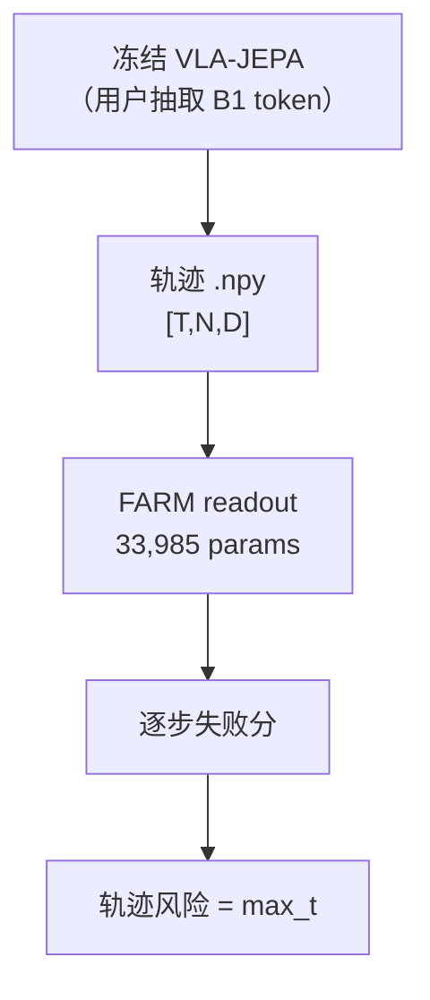
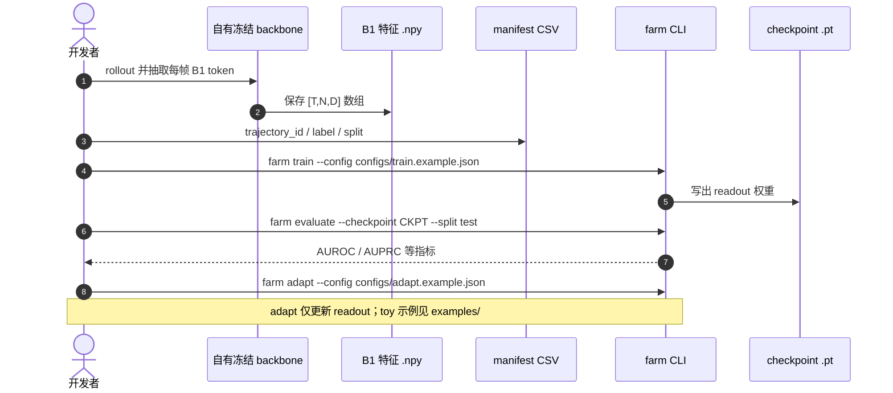

# FARM（arXiv:2609.11445）

**FARM**（*Reading Failure Signals from the Internal Predictive States of a Frozen Robotic World Model*，[arXiv:2609.11445](https://arxiv.org/abs/2609.11445)，[GitHub](https://github.com/HaoranPei-casia/FARM)）提出 **Failure-Aware Readout from World Models**：在 **冻结** 的机器人世界模型（论文用 **VLA-JEPA** 预测态）上，只训 **33,985 参数** 监督 readout，输出逐步失败分数与轨迹级风险。

## 一句话定义

**不另训监控器或大改策略——冻结 WM 的内部预测态已含可解码失败信号，极轻 readout 即可做因果、可迁移、低开销的运行时监测。**

## 英文缩写速查

| 缩写 | 英文全称 | 简要说明 |
|------|----------|----------|
| FARM | Failure-Aware Readout from World Models | 本文方法 |
| WM | World Model | 冻结的 VLA-JEPA 预测骨干 |
| AUROC | Area Under ROC Curve | 失败检测判别力 |
| AUPRC | Area Under Precision-Recall Curve | 不平衡标签下更敏感 |
| OOF | Out-of-Fold | 五折交叉验证池化评测 |

## 为什么重要

- **复用已有 WM 投资：** 许多系统已训/已部署世界模型做预测或规划；FARM 证明同一份 **B1 预测 token** 可直接当安全特征。
- **极轻、低延迟：** readout 仅 **~34k** 参数；冻结态可用后 **均值 CUDA 延迟 +0.2256 ms**。
- **可迁移：** 7 源任务训练后，在 **10 任务基准** 上 Seen 性能优于 15 个匹配基线；真机 **PIPER X / SO-101 / Franka** 四群体上 fixed-readout 或 readout-only 适配。

## 核心信息

| 项 | 内容 |
|----|------|
| **机构** | 中科院自动化所等（作者含 Haoran Pei 等） |
| **骨干** | 冻结 **VLA-JEPA** 预测态（用户自备特征抽取） |
| **arXiv** | [2609.11445](https://arxiv.org/abs/2609.11445)（截至 2026-09-12 仍为 **v1**） |
| **代码** | [HaoranPei-casia/FARM](https://github.com/HaoranPei-casia/FARM) |
| **开源** | **部分开源** — readout 训练/评测/适配 CLI 可跑；**不含** backbone 权重、私有轨迹与 `B1` 特征文件 |

## 核心原理

### Readout 结构（主配置 D=1024, hidden=32）

1. 输入轨迹张量 `[T, N, D]`：`T` 步、`N` 视觉 token/步、`D` token 宽。
2. **投影 + 归一化** → token 维 **标量注意力池化** → 两层 MLP → **逐步失败概率**。
3. 轨迹风险 = 各步概率 **最大值**（逐步评分 + 因果轨迹风险）。

### 训练协议

| 阶段 | 内容 |
|------|------|
| 1 | 在 `inner_train` / `validation` 上选 epoch |
| 2 | 同种子重初始化，在并集上训满选定 epoch |
| 损失 | **按任务平衡** — 各任务总权重相等 |
| 适配 | few-shot：冻结 checkpoint，**只更新 readout** 固定 epoch |

### 流程总览

## 源码运行时序图

官方仓库 [HaoranPei-casia/FARM](https://github.com/HaoranPei-casia/FARM)（归档见 [`sources/repos/farm.md`](../../sources/repos/farm.md)）：

- **最短 smoke：** `python examples/make_toy_data.py` → `farm train` → `farm evaluate` → `pytest`（**非论文主结果**）。
- **主实验复现：** 须按 [`DATA.md`](https://github.com/HaoranPei-casia/FARM/blob/main/DATA.md) 自行准备特征与划分。

## 工程实践

| 项 | 说明 |
|----|------|
| **依赖** | Python ≥3.10；`pip install -e ".[test]"` |
| **Manifest** | 五列：`trajectory_id, task_id, label, b1_path, split`（`label` 0=成功 1=失败） |
| **边界** | 仓库 **故意不含** 私有数据、WM 权重、实验图表与第三方模型源码 |
| **延迟** | 论文：冻结态已算好后 readout **+0.2256 ms** 均值 CUDA |

## 实验与评测

| 指标 | 文内口径 |
|------|----------|
| 源域 7 任务五折 OOF | pooled **AUROC 85.68** / **AUPRC 88.59** |
| 10 任务基准 | **Seen** 上优于 **15** 个匹配基线 |
| 真机迁移 | PIPER X、SO-101、Franka **四群体** |
| 部分因果历史 | 仍能从 **截断预测历史** 判别失败 |

## 与其他工作对比

| 对照 | 差异 |
|------|------|
| 专用失败检测器 | FARM **不训新骨干**，只训 readout |
| [Foresight](./paper-foresight-action-conditioned-failure-monitoring.md) | 同属预测表征安全；FARM 强调 **冻结 + 极轻 + 跨本体** |
| [MaP-WAM](./paper-map-wam.md) / [UniMPA](./paper-unimpa.md) | 那两条用 WM **生成计划/动作**；FARM 只 **读出风险** |
| [ReactHuman](./paper-reacthuman.md) | 离线评测集；FARM 是 **部署期在线监测** |

## 结论

**FARM 把「世界模型有没有用」延伸到「WM 预测态能不能当安全传感器」——工程上只需多一个 34k readout 头。**

1. **集成读点：** 已有 VLA-JEPA 或类似预测 WM 的团队，优先试 **固定 readout 迁移**，再 few-shot adapt。
2. **数据读点：** 开源的是 **算法与协议**，主结果特征须自建；`DATA.md` 给 ID/划分，不给内容。
3. **延迟友好：** 亚毫秒级 readout 适合嵌入现有控制环。
4. **自上次入库（2026-09-12 再核）：** 仓库已有完整 `farm` CLI 与测试；arXiv 仍 v1；**无新权重发布**。
5. **与规划 WM 正交：** 可与 [Generative World Models](../methods/generative-world-models.md) 规划栈并行部署。

## 关联页面

- [Generative World Models](../methods/generative-world-models.md)
- [14 篇技术地图](../overview/dexterous-wm-humanoid-14-papers-technology-map.md)
- [Manipulation](../tasks/manipulation.md)
- [Foresight](./paper-foresight-action-conditioned-failure-monitoring.md)

## 参考来源

- [farm-failure-readout_arxiv_2609_11445.md](../../sources/papers/farm-failure-readout_arxiv_2609_11445.md)
- [farm 仓库归档](../../sources/repos/farm.md)
- [wechat 14篇盘点](../../sources/blogs/wechat_embodied_station_14_papers_dexterous_wm_humanoid_2026-09-11.md)

## 推荐继续阅读

- [arXiv PDF](https://arxiv.org/pdf/2609.11445)
- [GitHub 仓库](https://github.com/HaoranPei-casia/FARM)
- [DATA.md（划分与轨迹 ID）](https://github.com/HaoranPei-casia/FARM/blob/main/DATA.md)
