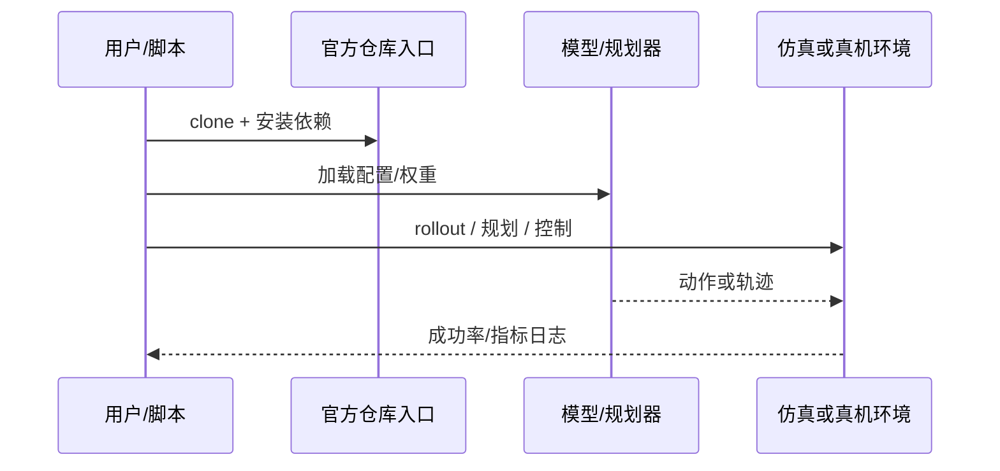

# FARM（arXiv:2609.11445）

**FARM**（[FARM: Reading Failure Signals from the Internal Predictive States of a Frozen Robotic World Model](https://arxiv.org/abs/2609.11445)）来自 [具身智能小站 14 篇盘点](../../sources/blogs/wechat_embodied_station_14_papers_dexterous_wm_humanoid_2026-09-11.md)。冻结世界模型预测状态 + 轻量 readout 做失败检测；7 任务五折 OOF pooled AUROC 85.68。

## 一句话定义

**不另训监控器，从冻结机器人世界模型的内部预测态读出失败信号。**

## 英文缩写速查

| 缩写 | 英文全称 | 简要说明 |
|------|----------|----------|
| VLA | Vision-Language-Action | 视觉-语言-动作策略 |
| VLM | Vision-Language Model | 视觉-语言多模态模型 |
| WM | World Model | 预测未来观测或表征的动力学模型 |
| IL | Imitation Learning | 模仿学习 |
| RL | Reinforcement Learning | 强化学习 |
| DoF | Degrees of Freedom | 自由度 |

## 为什么重要

- 纳入本期 **灵巧手 / 世界模型 / 人形控制 / VLA** 主线之一。
- 开源状态：**已开源**（步骤 2.5 核查，2026-09-11）。
- 与 [14 篇技术地图](../overview/dexterous-wm-humanoid-14-papers-technology-map.md) 中同类工作可横向对照。

## 核心机制

| 项 | 内容 |
|----|------|
| **arXiv** | [2609.11445](https://arxiv.org/abs/2609.11445) |
| **项目页** | https://github.com/HaoranPei-casia/FARM |
| **代码/资源** | https://github.com/HaoranPei-casia/FARM |
| **开源** | **已开源** |
| **文内指标** | 33,985 参数 readout；pooled AUROC/AUPRC 85.68/88.59；跨 PIPER X / SO-101 / Franka 测试迁移。 |

## 源码运行时序图

## 实验与评测

| 项 | 文内口径 |
|----|----------|
| 要点 | 33,985 参数 readout；pooled AUROC/AUPRC 85.68/88.59；跨 PIPER X / SO-101 / Franka 测试迁移。 |

- **读法：** 本页为索引级摘要，上表取自 [公众号盘点](../../sources/blogs/wechat_embodied_station_14_papers_dexterous_wm_humanoid_2026-09-11.md) 与项目页；具体对照方法、任务集与逐项指标以 **原文 PDF** 为准（[参考来源](#参考来源)）。

## 与其他工作对比

- **另训专用失败检测器 / 异常分类头** — 需要独立数据与训练预算；FARM **不另训监控器**，直接从冻结机器人世界模型的内部预测态读出信号（33,985 参数 readout）。
- **[Foresight（动作条件失败监测）](./paper-foresight-action-conditioned-failure-monitoring.md)** — 同属「用预测表征做安全闭环」一线，同样以动作条件表征判风险；FARM 的卖点在 **冻结骨干 + 极轻 readout** 与跨本体迁移（PIPER X / SO-101 / Franka）。
- **把世界模型用于 **规划** 的路线（[MaP-WAM](./paper-map-wam.md)、[UniMPA](./paper-unimpa.md)）** — 那两条线把预测用于生成计划/动作；FARM 只把同一份预测态当 **监控信号源**，不改变策略。
- **[Generative World Models](../methods/generative-world-models.md)** — 该页给出世界模型的通用训练与用途分类；FARM 属其中「表征复用于运行时安全」的下游用法。
- **阈值/规则式运行时监控** — 依赖人工设定的力/位姿阈值；FARM 以五折 OOF pooled AUROC 85.68 / AUPRC 88.59 给出学习型 readout 的口径。

- **读法：** 以上为知识库内 **路线级** 对照；与原文 baseline 的逐项定量比较与消融以 **原文 PDF** 为准（[参考来源](#参考来源)）。

## 结论

**FARM 适合作为本期「已开源」边界下的快速索引页，部署前请核对仓库/README 可运行性。**

1. 核心贡献：不另训监控器，从冻结机器人世界模型的内部预测态读出失败信号。
2. 开源结论：**已开源** — 以项目页实际链接为准（入库日 2026-09-11）。
3. 横向对照见 [14 篇技术地图](../overview/dexterous-wm-humanoid-14-papers-technology-map.md)，避免与同 arXiv 重复造页。

## 关联页面

- [14 篇技术地图](../overview/dexterous-wm-humanoid-14-papers-technology-map.md)
- [VLA（Vision-Language-Action）](../methods/vla.md)
- [Generative World Models](../methods/generative-world-models.md)
- [Manipulation](../tasks/manipulation.md)

## 参考来源

- [farm-failure-readout_arxiv_2609_11445.md](../../sources/papers/farm-failure-readout_arxiv_2609_11445.md)
- [wechat 14篇盘点](../../sources/blogs/wechat_embodied_station_14_papers_dexterous_wm_humanoid_2026-09-11.md)
- [arXiv:2609.11445](https://arxiv.org/abs/2609.11445)

## 推荐继续阅读

- [arXiv PDF](https://arxiv.org/pdf/2609.11445)
- [项目页/资源](https://github.com/HaoranPei-casia/FARM)
- [代码/资源](https://github.com/HaoranPei-casia/FARM)
