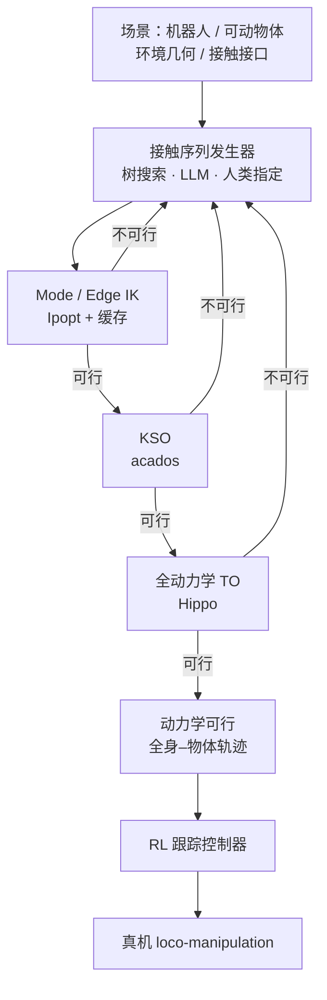

# FARO（可行性感知机器人运动优化）

**FARO**（*Feasibility-Aware Robot Motion Optimization*，[arXiv:2607.18362](https://arxiv.org/abs/2607.18362)）由 **慕尼黑工业大学（TUM）MIRMI / IAS** 与 **卡内基梅隆大学（CMU）** 提出：在给定候选 **接触模式序列** 时，用 **mode/edge IK → 运动学序列优化（KSO）→ 全动力学轨迹优化（TO）** 的嵌套可行性检验快速剪枝，再接到 **可行性引导树搜索、LLM 接触计划采样或人类指定计划**，生成动力学一致的全身–物体轨迹，并由预训练 **RL 跟踪控制器** 在真机 loco-manipulation 上执行。

## 一句话定义

**用越来越严、越来越贵的优化可行性层级，在接触模式组合爆炸里先砍掉几何不可行分支，再只对幸存者做全动力学 TO——少假阴性地加速新场景 loco-manip 探索。**

## 英文缩写速查

| 缩写 | 英文全称 | 简要说明 |
|------|----------|----------|
| FARO | Feasibility-Aware Robot Motion Optimization | 本文嵌套可行性剪枝 + 运动优化框架 |
| KSO | Kinematic Sequence Optimization | 每转移一构型的运动学序列可行性 NLP |
| TO | Trajectory Optimization | 全机器人–物体动力学的接触显式轨迹优化 |
| UCT | Upper Confidence bounds applied to Trees | 代价型树节点选择（探索–利用） |
| LLM | Large Language Model | 采样多样接触计划，由 KSO 过滤后再 TO |
| RL | Reinforcement Learning | 跟踪优化轨迹的部署控制器（引用 DynaRetarget 跟踪栈） |

## 为什么重要

- **探索瓶颈可操作化：** 人形 loco-manip 的接触序列搜索若每步都跑全 TO，Hard 任务上几乎扩不动树；FARO 证明 **廉价必要检验 + 缓存** 能把 Hard box-placement 从 TO-only **0 解** 拉到 **M,E,KSO 平均 26.4 解**。
- **与 LLM / 人类 / 搜索同一接口：** 同一可行性模块可插三种接触序列发生器，避免「只服务单一搜索器」的方法孤岛；相对同团队 [MotionDisco](./paper-motiondisco-extreme-humanoid-loco-manipulation.md) 的进化程序搜索，FARO 把重心放在 **剪枝层级本身**。
- **工程可读指标：** KSO 相对 TO 约 **两数量级** 加速、决策变量约 **74.8×** 缩减、约束类型覆盖约 **70%**，且作 TO 分类器时 **FNR≈0**——选型时知道假阳性可接受、假阴性几乎可忽略。

## 核心信息

| 项 | 内容 |
|----|------|
| **机构** | 慕尼黑工业大学机器人与机器智能研究所（MIRMI, TUM）；TUM 高等研究院（IAS）；卡内基梅隆大学（CMU）机械工程 |
| **问题设定** | 已知场景几何与接触接口；候选接触模式序列 → 动力学可行全身–物体运动 |
| **接触模型** | 矩形贴片面–面单边接触（摩擦锥、COP、扭转摩擦、粘附无滑移） |
| **实现栈** | Pinocchio + CasADi + coal；mode/edge：Ipopt；KSO：acados；TO：Hippo |
| **真机** | 优化轨迹 + RL 跟踪（论文引用 DynaRetarget 跟踪控制器）；视频见补充材料 |
| **开源** | **确认未开源**（截至 2026-07-24：无项目页 / GitHub） |

## 核心原理

### 方法栈（嵌套可行性）

| 层级 | 优化什么 | 检验什么 | 求解器 |
|------|----------|----------|--------|
| **Mode / Edge** | 单构型 \(q\)（edge 用 \(c_1\cup c_2\)） | 接触贴片几何、碰撞、关节限位 | Ipopt |
| **KSO** | 每转移一构型 + 初末条件 | 几何/接触/限位 + 粘附转移一致性；**无**全时域动力学 | acados SQP |
| **TO** | 状态/控制轨迹 + 每阶段时间缩放 \(\bar{T}_s\) | 机器人质心动量与物体刚体动力学、接触、碰撞、限位 | Hippo SQP |

左层可行是右层可行的 **必要条件而非充分条件**：先失败则早停，成功才升级；mode/edge 结果写入缓存供树扩展复用。

### 可行性引导树搜索

- 根为初始模式 \(c_0\)；节点前缀即接触序列。
- **选择：** 代价型 UCT + progressive widening（\(k=1,\alpha=0.5,C=3\)）。
- **过滤器变体：** 仅 KSO；M+E+KSO；M+E+KSO+TO；仅 TO（基线，贴近既有「搜索+直接 TO」做法）。
- 目标序列若搜索期未跑 TO，则在收录前再跑一次 TO 确认动态可行。

### 流程总览

## 源码运行时序图

**不适用** — 截至 2026-07-24 无官方可运行仓库或 README 入口；公开材料仅 arXiv 与 [补充视频](https://youtu.be/R6qCHoCormQ)。复现需自行按正文栈（Pinocchio / CasADi / coal / acados / Hippo / Ipopt）实现。

## 工程实践

| 项 | 建议 |
|----|------|
| **何时用嵌套剪枝** | 分支因子大、深度≥数个接触切换、全 TO 成为搜索墙时；优先 \(\mathcal{F}=(\mathrm{M},\mathrm{E},\mathrm{KSO})\)，目标处再 TO |
| **KSO 角色** | 作 TO 代理过滤器：期望 **近零 FNR**、可接受 FPR；LLM 采样前先 KSO 可获数倍–十余倍加速 |
| **缓存** | mode/edge 在树搜索中反复出现——无缓存则 Hard 任务收益大幅缩水 |
| **部署** | 优化轨迹质量需足以被 RL 跟踪；论文用预训练跟踪器上真机，非在线闭环 TO |
| **源码运行时序图** | **不适用**（确认未开源） |

## 实验与评测

| 设定 | 主读数（论文 Table I–III） |
|------|---------------------------|
| 人类 8 序列 | KSO **0.60 s** vs TO **64.7 s**；变量缩减 **74.8×**；约束类型覆盖 **70%** |
| 树搜索 Easy | M,E,KSO 解数 **83.8±6.5**；TO-only **20.0±5.0** |
| 树搜索 Hard | M,E,KSO 解数 **26.4±9.7**、节点 **814.6**；TO-only **0** 解、节点 **12.8** |
| LLM 四场景 | FNR **≈0**；speedup **2.4–15.5×**（更难变体加速更大） |

## 结论

**一句话总判：FARO 的真价值是「用近零假阴性的廉价必要检验 + mode/edge 缓存」把接触搜索从 TO 墙里解放出来；全动力学求解仍不可省，但应尽量只花在幸存者上。**

1. **Hard 搜索读法** — 仅 TO 扩树几乎失效；**M+E+KSO** 是论文里解发现与节点扩展的主力配置。
2. **KSO 不是 TO 替代品** — 约 30% 约束类型（动力学侧）缺失；作过滤器时看 **FNR**，不要把 KSO 可行当部署就绪。
3. **LLM 采样** — 先 KSO 再 TO：假阴性近零，假阳性随难度升——预算应留给后续 TO，而非指望 LLM 一次命中。
4. **与 MotionDisco 分工** — MotionDisco 主打 **LLM 进化程序搜索 + 文本反馈**；FARO 主打 **共享可行性层级** 本身，结论亦指向与更高层 TAMP/程序搜索结合。
5. **部署边界** — 真机成功依赖 **优化轨迹质量 + RL 跟踪**；当前平面贴片接触与已知场景几何假设仍在。

## 与其他工作对比

| 对照 | 差异读法 |
|------|----------|
| [MotionDisco](./paper-motiondisco-extreme-humanoid-loco-manipulation.md) | 同团队谱系；对方强调进化程序发现，本文强调嵌套可行性剪枝与树/LLM/人类统一接口 |
| 直接 TO 探索（Sleiman / Toussaint 等接触搜索基线） | 等价 \(\mathcal{F}=(\mathrm{TO})\)；FARO 显示 Hard 任务上该基线解发现崩塌 |
| [DynaRetarget / SBTO](../methods/dynaretarget-sbto-motion-retargeting.md) | 演示/重定向后的动力学精炼；FARO 上游是 **接触模式搜索**，下游跟踪引用同类 RL 跟踪栈 |
| [TAMP for Humanoid Loco-manip](./paper-notebook-task-and-motion-planning-for-humanoid-loco-manip.md) | 同问题域的接触显式规划前作；FARO 把可行性层级系统化并量化搜索增益 |
| 接触隐式 TO | FARO 保持 **接触显式**（离散模式给定），用剪枝管理组合爆炸，而非互补约束隐式发现模式 |

## 局限与风险

- **未开源：** 无法按官方脚本复现；数字与视频以 arXiv / YouTube 为准。
- **接触假设：** 平面矩形贴片、单边粘附为主；结论指出可向可微 SDF 等更富几何扩展。
- **嵌套性形式证明：** 作者期望可行集嵌套，但正式证明留待未来。
- **长时程：** 极长视野仍需更高层 TAMP / 程序搜索（文中指向 MotionDisco 方向）管理组合复杂度。
- **场景已知：** 无感知建图；接口与物体需预先建模。

## 关联页面

- [MotionDisco（极端人形 loco-manipulation 运动发现）](./paper-motiondisco-extreme-humanoid-loco-manipulation.md) — 同团队 LLM 进化接触计划搜索
- [Loco-Manipulation](../tasks/loco-manipulation.md) — 任务定义与技术路线
- [Trajectory Optimization](../methods/trajectory-optimization.md) — 接触显式 / 多重打靶 TO 基础
- [Contact-Rich Manipulation](../concepts/contact-rich-manipulation.md) — 接触丰富操作概念
- [Whole-Body Tracking Pipeline](../concepts/whole-body-tracking-pipeline.md) — 参考轨迹 → RL 跟踪 → 真机
- [DynaRetarget / SBTO](../methods/dynaretarget-sbto-motion-retargeting.md) — 下游跟踪引用谱系

## 参考来源

- [FARO 论文摘录（arXiv:2607.18362）](../../sources/papers/faro_arxiv_2607_18362.md)

## 推荐继续阅读

- [FARO 论文（arXiv:2607.18362）](https://arxiv.org/abs/2607.18362)
- [补充视频（YouTube）](https://youtu.be/R6qCHoCormQ)
- [MotionDisco 项目页](https://atarilab.github.io/motiondisco.io/) — 同团队更高层运动发现对照
