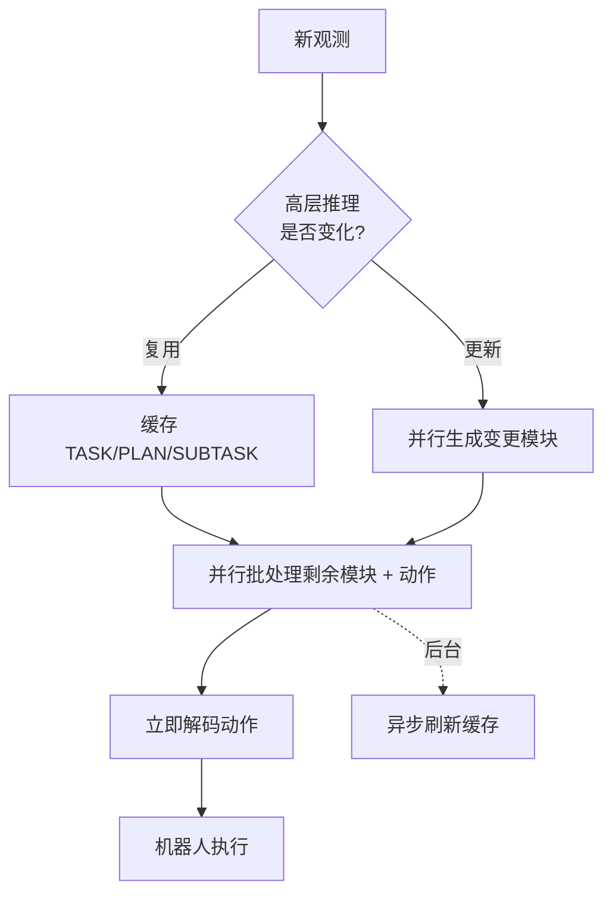
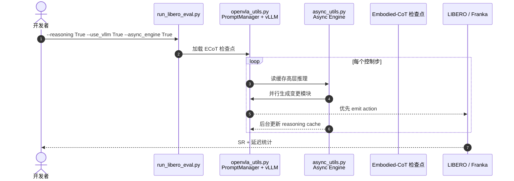

# Fast ECoT：思维复用的高效具身链式推理

**Fast ECoT**（*Efficient Embodied Chain-of-Thought via Thoughts Reuse*，[arXiv:2506.07639](https://arxiv.org/abs/2506.07639)）由 **伦敦大学学院（UCL）**、**弗莱堡大学（University of Freiburg）** 与 **思科研究（Cisco Research）** 等提出：针对 [ECoT](./paper-ecot.md) 自回归推理延迟，在 **不改模型、不重训** 的前提下做推理时加速。[代码](https://github.com/kevinDuan1/Fast-ECoT)（**无独立项目页**，GitHub README 为入口）

## 一句话定义

**ECoT 的推理链跨步高度重复——缓存高层思维、并行生成模块、异步刷新推理，就能把 7.5× 延迟砍掉而不牺牲成功率。**

## 英文缩写速查

| 缩写 | 英文全称 | 简要说明 |
|------|----------|----------|
| ECoT | Embodied Chain-of-Thought | 被加速的具身推理范式 |
| VLA | Vision-Language-Action | 承载 ECoT 的策略族 |
| vLLM | — | 可选的高吞吐推理后端 |
| LIBERO | Lifelong Robot Learning | 四套件仿真评测 |
| MIT | — | 仓库开源许可 |

## 为什么重要

- **补齐 ECoT 工程最后一公里**：奠基 [ECoT](./paper-ecot.md) 解决「要不要想」；Fast ECoT 解决「想得太慢不能上真机」。
- **零训练开销**：纯推理时策略，直接接入现有 `Embodied-CoT/ecot-openvla-*` 检查点。
- **三件套可组合**：thought reuse（时间局部性）+ parallel steps（结构局部性）+ async scheduler（控制环优先）。
- **实证不trade-off**：LIBERO 与 Franka 真机上延迟大降，成功率与推理忠实度 **持平或更好**。

## 核心信息

| 项 | 内容 |
|----|------|
| **机构** | 伦敦大学学院（UCL）；弗莱堡大学（University of Freiburg）；思科研究（Cisco Research） |
| **上游** | [ECoT](./paper-ecot.md) + [OpenVLA](./paper-openvla.md) 代码栈 |
| **方法类型** | **推理时加速**（无架构改动、无额外训练） |
| **检查点** | HF `Embodied-CoT/ecot-openvla-7b-bridge` / `oxe` |
| **开源** | **已开源** MIT：[kevinDuan1/Fast-ECoT](https://github.com/kevinDuan1/Fast-ECoT)；**无独立项目页** |

## 核心原理

### 1) Thought caching & reuse

高层模块（task / plan / subtask）在相邻控制步间 **缓慢变化**；Bridge V2 统计 plan 模块平均更新率 **8.4%**。缓存上一时刻片段，未变则直接复用，跳过冗余自回归。

### 2) Parallel modular generation

将各推理模块与最终动作 reframing 为 **共享前缀下的并行生成任务**（continuous batching），把顺序 ECoT 转为部分并行批处理。

### 3) Asynchronous scheduler

**动作解码优先**：先用缓存推理快速出动作；后台异步刷新推理缓存。解耦「想」与「动」的墙钟竞争。

### 流程总览

## 源码运行时序图

节点对齐 [`sources/repos/fast-ecot.md`](../../sources/repos/fast-ecot.md)。

- **LIBERO 入口**：`experiments/robot/libero/run_libero_eval.py` + `--async_engine True`。
- **真机**：`experiments/robot/bridge/run_bridgev2_eval.py` 或 `droid/run_droid_eval.py`。

## 工程实践

| 项 | 建议 |
|----|------|
| 前置 | 先有 [ECoT](./paper-ecot.md) 检查点；Fast ECoT 是推理包装层 |
| 加速栈 | 推荐 `--use_vllm True`；`flash-attn` 用于训练侧 |
| 标志位 | `--reasoning True` 开 ECoT；`--async_engine True` 开异步调度 |
| 套件 | `libero_spatial` / `object` / `goal` / `libero_10` |
| 对照 | 记录原生 ECoT 与 Fast ECoT 墙钟延迟 **与** SR，避免只看加速比 |

## 实验与评测

| 设定 | 数字（论文 / README） |
|------|----------------------|
| 仿真 | LIBERO 四套件 |
| 真机 | Franka Emika Panda 操作任务 |
| 延迟 | 相对原生 ECoT **最高 7.5×** 下降 |
| 质量 | 任务成功率与推理忠实度 **持平或提升** |
| Plan 更新率 | Bridge V2 上约 **8.4%**（支撑复用假设） |

## 结论

**Fast ECoT 把 ECoT 从「能想清楚」推进到「来得及想清楚」——关键不是改模型，而是识别推理链的时间与结构冗余。**

1. **高层思维跨步稳定** — plan/subtask 复用是最大收益来源；低层感知模块需更频繁刷新。
2. **并行 + 异步是组合拳** — 单独 batching 不够，控制环必须动作优先。
3. **零重训是落地优势** — 直接套 `Embodied-CoT` 检查点，降低 adoption 成本。
4. **评测要看忠实度** — 加速不能靠砍掉推理内容；论文报告 faithfulness 与 SR 并行。
5. **入口是 GitHub 而非项目页** — 以 README 评测脚本为准部署。

## 与其他工作对比

| 对照 | 差异读法 |
|------|----------|
| [ECoT](./paper-ecot.md) | 奠基训练范式；Fast ECoT 是其推理时加速器 |
| TensorRT-LLM OpenVLA | 另一路底层引擎加速；Fast ECoT 利用 ECoT 结构语义 |
| [FlashVLA](./paper-flashvla.md) | 流式动作解码；不依赖显式文本推理链 |
| [GlanceWAM](../entities/paper-glancewam.md) | WAM 异步想象；不同模态与任务族 |

## 局限与风险

- **依赖 ECoT 结构**：非模块化 CoT 或自由形式推理链收益不确定。
- **缓存失效场景**：高频子任务切换时复用率下降，加速比波动。
- **vLLM / 显存**：并行 batching 仍吃 GPU；16 GB+ 推荐。
- **无独立项目页**：文档以 GitHub 为准，需跟上游 ECoT 版本对齐。

## 关联页面

- [ECoT](./paper-ecot.md) — 被加速的奠基论文
- [VLA](../methods/vla.md) — 部署与延迟讨论轴
- [OpenVLA](./paper-openvla.md) — 代码与检查点上游
- [Action Chunking](../methods/action-chunking.md) — 另一路控制环延迟优化

## 参考来源

- [fast_ecot_arxiv_2506_07639](../../sources/papers/fast_ecot_arxiv_2506_07639.md)
- [fast-ecot 仓库](../../sources/repos/fast-ecot.md)

## 推荐继续阅读

- [arXiv:2506.07639](https://arxiv.org/abs/2506.07639)
- [GitHub](https://github.com/kevinDuan1/Fast-ECoT)
- [ECoT 项目页](https://embodied-cot.github.io/)
- [HF Embodied-CoT](https://huggingface.co/Embodied-CoT)
